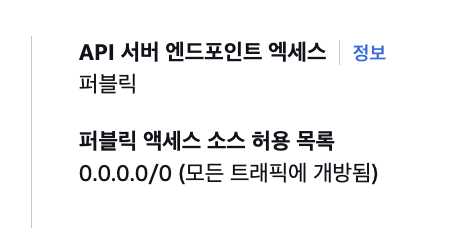

# 1주차 실습 내용

## 실습 코드 다운로드

실습 코드 repo를 받아 확인한다.
```bash
❯ git clone https://github.com/gasida/aews.git

❯ tree aews 
aews
├── 1w
│   ├── eks.tf
│   ├── var.tf
│   └── vpc.tf
└── eks-private
    ├── ec2.tf
    ├── main.tf
    ├── outputs.tf
    └── versions.tf

3 directories, 7 files

# 1주차 실습
❯ cd aews/1w
```

## VPC, EKS 배포 (12~15분 가량 소요)
```bash
# 변수 지정 -> tfvars 작성으로 대체함.
❯ vim terraform.tfvars

# 배포 : 12분 정도 소요
❯ terraform init
❯ terraform plan
❯ nohup sh -c "terraform apply -auto-approve" > create.log 2>&1 &
❯ tail -f create.log


# 자격증명 설정
❯ aws eks update-kubeconfig --region ap-northeast-2 --name myeks
Added new context arn:aws:eks:ap-northeast-2:xxxxxxxxx:cluster/myeks to /Users/xxxx/.kube/config

# k8s config 확인 및 rename context
❯ cat ~/.kube/config | grep current-context | awk '{print $2}'
arn:aws:eks:ap-northeast-2:xxxxxxx:cluster/myeks

❯ ❯ k config rename-context $(cat ~/.kube/config | grep current-context | awk '{print $2}') myeks
Context "arn:aws:eks:ap-northeast-2:xxxxxxxx:cluster/myeks" renamed to "myeks".

❯ cat ~/.kube/config | grep current-context
current-context: myeks

❯ ❯ k get po -n kube-system
NAME                      READY   STATUS    RESTARTS   AGE
aws-node-9zkxz            2/2     Running   0          6m48s
aws-node-n8gzl            2/2     Running   0          6m50s
coredns-d487b6fcb-62xd4   1/1     Running   0          6m15s
coredns-d487b6fcb-wq259   1/1     Running   0          6m15s
kube-proxy-nqr2k          1/1     Running   0          6m16s
kube-proxy-zbsc6          1/1     Running   0          6m15s
```

## eks 정보 확인
```bash
# eks 클러스터 정보 확인
❯ ❯ k cluster-info                                                                               
Kubernetes control plane is running at https://xxxabbcd.gr7.ap-northeast-2.eks.amazonaws.com
CoreDNS is running at https://xxxabbcd.gr7.ap-northeast-2.eks.amazonaws.com/api/v1/namespaces/kube-system/services/kube-dns:dns/proxy

To further debug and diagnose cluster problems, use '❯ k cluster-info dump'.

# endpoint 확인
❯ CLUSTER_NAME=myeks
❯ aws eks describe-cluster --name $CLUSTER_NAME --output json | jq
{
  "cluster": {
    "name": "myeks",
    "arn": "arn:aws:eks:ap-northeast-2:xxxxxxxx:cluster/myeks",
    "createdAt": "2026-03-18T20:59:44.264000+09:00",
    "version": "1.34",
    "endpoint": "https://xxxabbcd.gr7.ap-northeast-2.eks.amazonaws.com",
    "roleArn": "arn:aws:iam::xxxxxxxx:role/myeks-cluster-20260318115919905800000001",
    "resourcesVpcConfig": {
      "subnetIds": [
        "subnet-057c36ae1f66abaf2",
        "subnet-0a4001dd7455e0446",
        "subnet-0c9c92478d1b888e5"
      ],
      "securityGroupIds": [
        "sg-0af973672cd6e8ec3"
      ],
      "clusterSecurityGroupId": "sg-0311a84c671e02c36",
      "vpcId": "vpc-00c649927588405e9",
      "endpointPublicAccess": true,
      "endpointPrivateAccess": false,
      "publicAccessCidrs": [
        "0.0.0.0/0"
      ]
    },
    "kubernetesNetworkConfig": {
      "serviceIpv4Cidr": "10.100.0.0/16",
      "ipFamily": "ipv4",
      "elasticLoadBalancing": {
        "enabled": false
      }
    },
    "logging": {
      "clusterLogging": [
        {
          "types": [
            "api",
            "audit",
            "authenticator",
            "controllerManager",
            "scheduler"
          ],
          "enabled": false
        }
      ]
    },
    "identity": {
      "oidc": {
        "issuer": "https://oidc.eks.ap-northeast-2.amazonaws.com/id/xxxabbcd"
      }
    },
    "status": "ACTIVE",
    "certificateAuthority": {
      "data": 생략"
    },
    "platformVersion": "eks.18",
    "tags": {
      "Terraform": "true",
      "Environment": "cloudneta-lab"
    },
    "encryptionConfig": [
      {
        "resources": [
          "secrets"
        ],
        "provider": {
          "keyArn": "arn:aws:kms:ap-northeast-2:xxxxxxxx:key/생략"
        }
      }
    ],
    "accessConfig": {
      "authenticationMode": "API_AND_CONFIG_MAP"
    },
    "upgradePolicy": {
      "supportType": "EXTENDED"
    },
    "computeConfig": {
      "enabled": false,
      "nodePools": []
    },
    "storageConfig": {
      "blockStorage": {
        "enabled": false
      }
    }
  }
}

❯ aws eks describe-cluster --name $CLUSTER_NAME --output json | jq -r .cluster.endpoint
https://xxxabbcd.gr7.ap-northeast-2.eks.amazonaws.com
```

```bash
## dig 조회
❯ APIDNS=$(aws eks describe-cluster --name $CLUSTER_NAME --output json | jq -r .cluster.endpoint | cut -d '/' -f 3)
❯ dig +short $APIDNS
3.3x.6x.xxx
3.3x.4x.xx

❯ curl -s ipinfo.io/3.3x.6x.xxx
{
  "ip": "3.3x.6x.xxx",
  "hostname": "ec2-3-3x-6x-xxx.ap-northeast-2.compute.amazonaws.com",
  "city": "Incheon",
  "region": "Incheon",
  "country": "KR",
  "loc": "37.4565,126.7052",
  "org": "AS16509 Amazon.com, Inc.",
  "postal": "21505",
  "timezone": "Asia/Seoul",
  "readme": "https://ipinfo.io/missingauth"
}%

# eks 노드 그룹 정보 확인
❯ aws eks describe-nodegroup --cluster-name $CLUSTER_NAME --nodegroup-name $CLUSTER_NAME-node-group --output json | jq
{
  "nodegroup": {
    "nodegroupName": "myeks-node-group",
    "nodegroupArn": "arn:aws:eks:ap-northeast-2:xxxxxxxx:nodegroup/myeks/myeks-node-group/48ce806b-dd6f-1bfd-1d65-f945d8feea74",
    "clusterName": "myeks",
    "version": "1.34",
    "releaseVersion": "1.34.4-20260311",
    "createdAt": "2026-03-18T21:07:14.454000+09:00",
    "modifiedAt": "2026-03-18T21:18:48.422000+09:00",
    "status": "ACTIVE",
    "capacityType": "ON_DEMAND",
    "scalingConfig": {
      "minSize": 1,
      "maxSize": 4,
      "desiredSize": 2
    },
    "instanceTypes": [
      "t3.medium"
    ],
    "subnets": [
      "subnet-057c36ae1f66abaf2",
      "subnet-0a4001dd7455e0446",
      "subnet-0c9c92478d1b888e5"
    ],
    "amiType": "AL2023_x86_64_STANDARD",
    "nodeRole": "arn:aws:iam::xxxxxxxx:role/myeks-node-group-eks-node-group-20260318115936791500000005",
    "labels": {},
    "resources": {
      "autoScalingGroups": [
        {
          "name": "eks-myeks-node-group-48ce806b-dd6f-1bfd-1d65-f945d8feea74"
        }
      ]
    },
    "health": {
      "issues": []
    },
    "updateConfig": {
      "maxUnavailablePercentage": 33
    },
    "launchTemplate": {
      "name": "default-20260318120705279400000008",
      "version": "1",
      "id": "lt-0d714f73b52372de9"
    },
    "tags": {
      "Terraform": "true",
      "Environment": "cloudneta-lab",
      "Name": "myeks-node-group"
    }
  }
}

# 노드 정보 확인 : OS와 컨테이너런타임 확인
❯ k get node --label-columns=node.kubernetes.io/instance-type,eks.amazonaws.com/capacityType,topology.kubernetes.io/zone
NAME                                               STATUS   ROLES    AGE   VERSION               INSTANCE-TYPE   CAPACITYTYPE   ZONE
ip-192-168-1-118.ap-northeast-2.compute.internal   Ready    <none>   15m   v1.34.4-eks-f69f56f   t3.medium       ON_DEMAND      ap-northeast-2a
ip-192-168-3-6.ap-northeast-2.compute.internal     Ready    <none>   15m   v1.34.4-eks-f69f56f   t3.medium       ON_DEMAND      ap-northeast-2c

❯ k get node --label-columns=node.kubernetes.io/instance-type
NAME                                               STATUS   ROLES    AGE   VERSION               INSTANCE-TYPE
ip-192-168-1-118.ap-northeast-2.compute.internal   Ready    <none>   15m   v1.34.4-eks-f69f56f   t3.medium
ip-192-168-3-6.ap-northeast-2.compute.internal     Ready    <none>   15m   v1.34.4-eks-f69f56f   t3.medium

❯ k get node --label-columns=eks.amazonaws.com/capacityType # 노드의 capacityType 확인
NAME                                               STATUS   ROLES    AGE   VERSION               CAPACITYTYPE
ip-192-168-1-118.ap-northeast-2.compute.internal   Ready    <none>   15m   v1.34.4-eks-f69f56f   ON_DEMAND
ip-192-168-3-6.ap-northeast-2.compute.internal     Ready    <none>   15m   v1.34.4-eks-f69f56f   ON_DEMAND

❯ k get node
NAME                                               STATUS   ROLES    AGE   VERSION
ip-192-168-1-118.ap-northeast-2.compute.internal   Ready    <none>   15m   v1.34.4-eks-f69f56f
ip-192-168-3-6.ap-northeast-2.compute.internal     Ready    <none>   15m   v1.34.4-eks-f69f56f

❯ k get node -owide
NAME                                               STATUS   ROLES    AGE   VERSION               INTERNAL-IP     EXTERNAL-IP      OS-IMAGE                        KERNEL-VERSION                   CONTAINER-RUNTIME
ip-192-168-1-118.ap-northeast-2.compute.internal   Ready    <none>   15m   v1.34.4-eks-f69f56f   192.168.1.118   3.3x.xx.x        Amazon Linux 2023.10.20260302   6.12.73-95.123.amzn2023.x86_64   containerd://2.1.5
ip-192-168-3-6.ap-northeast-2.compute.internal     Ready    <none>   15m   v1.34.4-eks-f69f56f   192.168.3.6     5x.xxx.xxx.xxx   Amazon Linux 2023.10.20260302   6.12.73-95.123.amzn2023.x86_64   containerd://2.1.5

## Get a token for authentication with an Amazon EKS cluster
AWS_DEFAULT_REGION=ap-northeast-2
aws eks get-token help
❯ aws eks get-token --cluster-name $CLUSTER_NAME --region $AWS_DEFAULT_REGION --output json | jq
{
  "kind": "ExecCredential",
  "apiVersion": "client.authentication.k8s.io/v1beta1",
  "spec": {},
  "status": {
    "expirationTimestamp": "2026-03-18T12:39:01Z",
    "token": "k8s-aws-v1.생략"
  }
}
```

## 시스템 파드 정보 확인
```bash
❯ k get pod -n kube-system
NAME                      READY   STATUS    RESTARTS   AGE
aws-node-9zkxz            2/2     Running   0          19m
aws-node-n8gzl            2/2     Running   0          19m
coredns-d487b6fcb-62xd4   1/1     Running   0          18m
coredns-d487b6fcb-wq259   1/1     Running   0          18m
kube-proxy-nqr2k          1/1     Running   0          18m
kube-proxy-zbsc6          1/1     Running   0          18m

❯ k get pod -n kube-system -o wide
NAME                      READY   STATUS    RESTARTS   AGE   IP              NODE                                               NOMINATED NODE   READINESS GATES
aws-node-9zkxz            2/2     Running   0          19m   192.168.1.118   ip-192-168-1-118.ap-northeast-2.compute.internal   <none>           <none>
aws-node-n8gzl            2/2     Running   0          19m   192.168.3.6     ip-192-168-3-6.ap-northeast-2.compute.internal     <none>           <none>
coredns-d487b6fcb-62xd4   1/1     Running   0          19m   192.168.1.22    ip-192-168-1-118.ap-northeast-2.compute.internal   <none>           <none>
coredns-d487b6fcb-wq259   1/1     Running   0          19m   192.168.3.62    ip-192-168-3-6.ap-northeast-2.compute.internal     <none>           <none>
kube-proxy-nqr2k          1/1     Running   0          19m   192.168.3.6     ip-192-168-3-6.ap-northeast-2.compute.internal     <none>           <none>
kube-proxy-zbsc6          1/1     Running   0          19m   192.168.1.118   ip-192-168-1-118.ap-northeast-2.compute.internal   <none>           <none>

❯ k get pod -A
NAMESPACE     NAME                      READY   STATUS    RESTARTS   AGE
kube-system   aws-node-9zkxz            2/2     Running   0          19m
kube-system   aws-node-n8gzl            2/2     Running   0          19m
kube-system   coredns-d487b6fcb-62xd4   1/1     Running   0          19m
kube-system   coredns-d487b6fcb-wq259   1/1     Running   0          19m
kube-system   kube-proxy-nqr2k          1/1     Running   0          19m
kube-system   kube-proxy-zbsc6          1/1     Running   0          19m

# kube-system 네임스페이스에 모든 리소스 확인
❯ k get deploy,ds,pod,cm,secret,svc,ep,endpointslice,pdb,sa,role,rolebinding -n kube-system
Warning: v1 Endpoints is deprecated in v1.33+; use discovery.k8s.io/v1 EndpointSlice
NAME                      READY   UP-TO-DATE   AVAILABLE   AGE
deployment.apps/coredns   2/2     2            2           20m

NAME                        DESIRED   CURRENT   READY   UP-TO-DATE   AVAILABLE   NODE SELECTOR   AGE
daemonset.apps/aws-node     2         2         2       2            2           <none>          22m
daemonset.apps/kube-proxy   2         2         2       2            2           <none>          20m

NAME                          READY   STATUS    RESTARTS   AGE
pod/aws-node-9zkxz            2/2     Running   0          21m
pod/aws-node-n8gzl            2/2     Running   0          21m
pod/coredns-d487b6fcb-62xd4   1/1     Running   0          20m
pod/coredns-d487b6fcb-wq259   1/1     Running   0          20m
pod/kube-proxy-nqr2k          1/1     Running   0          20m
pod/kube-proxy-zbsc6          1/1     Running   0          20m

NAME                                                             DATA   AGE
configmap/amazon-vpc-cni                                         7      22m
configmap/aws-auth                                               1      22m
configmap/coredns                                                1      20m
configmap/extension-apiserver-authentication                     6      24m
configmap/kube-apiserver-legacy-service-account-token-tracking   1      24m
configmap/kube-proxy                                             1      20m
configmap/kube-proxy-config                                      1      20m
configmap/kube-root-ca.crt                                       1      24m

NAME                                TYPE        CLUSTER-IP       EXTERNAL-IP   PORT(S)                  AGE
service/eks-extension-metrics-api   ClusterIP   10.100.151.174   <none>        443/TCP                  24m
service/kube-dns                    ClusterIP   10.100.0.10      <none>        53/UDP,53/TCP,9153/TCP   20m

NAME                                  ENDPOINTS                                                     AGE
endpoints/eks-extension-metrics-api   172.0.32.0:10443                                              24m
endpoints/kube-dns                    192.168.1.22:53,192.168.3.62:53,192.168.1.22:53 + 3 more...   20m

NAME                                                             ADDRESSTYPE   PORTS        ENDPOINTS                   AGE
endpointslice.discovery.k8s.io/eks-extension-metrics-api-4khz7   IPv4          10443        172.0.32.0                  24m
endpointslice.discovery.k8s.io/kube-dns-zw74d                    IPv4          9153,53,53   192.168.3.62,192.168.1.22   20m

NAME                                 MIN AVAILABLE   MAX UNAVAILABLE   ALLOWED DISRUPTIONS   AGE
poddisruptionbudget.policy/coredns   N/A             1                 1                     20m

NAME                                                         SECRETS   AGE
serviceaccount/attachdetach-controller                       0         24m
serviceaccount/aws-cloud-provider                            0         24m
serviceaccount/aws-node                                      0         22m
serviceaccount/certificate-controller                        0         24m
serviceaccount/clusterrole-aggregation-controller            0         24m
serviceaccount/coredns                                       0         20m
serviceaccount/cronjob-controller                            0         24m
serviceaccount/daemon-set-controller                         0         24m
serviceaccount/default                                       0         24m
serviceaccount/deployment-controller                         0         24m
serviceaccount/disruption-controller                         0         24m
serviceaccount/endpoint-controller                           0         24m
serviceaccount/endpointslice-controller                      0         24m
serviceaccount/endpointslicemirroring-controller             0         24m
serviceaccount/ephemeral-volume-controller                   0         24m
serviceaccount/expand-controller                             0         24m
serviceaccount/generic-garbage-collector                     0         24m
serviceaccount/horizontal-pod-autoscaler                     0         24m
serviceaccount/job-controller                                0         24m
serviceaccount/kube-proxy                                    0         20m
serviceaccount/legacy-service-account-token-cleaner          0         24m
serviceaccount/namespace-controller                          0         24m
serviceaccount/node-controller                               0         24m
serviceaccount/persistent-volume-binder                      0         24m
serviceaccount/pod-garbage-collector                         0         24m
serviceaccount/pv-protection-controller                      0         24m
serviceaccount/pvc-protection-controller                     0         24m
serviceaccount/replicaset-controller                         0         24m
serviceaccount/replication-controller                        0         24m
serviceaccount/resource-claim-controller                     0         24m
serviceaccount/resourcequota-controller                      0         24m
serviceaccount/root-ca-cert-publisher                        0         24m
serviceaccount/service-account-controller                    0         24m
serviceaccount/service-cidrs-controller                      0         24m
serviceaccount/service-controller                            0         24m
serviceaccount/statefulset-controller                        0         24m
serviceaccount/tagging-controller                            0         24m
serviceaccount/ttl-after-finished-controller                 0         24m
serviceaccount/ttl-controller                                0         24m
serviceaccount/validatingadmissionpolicy-status-controller   0         24m
serviceaccount/volumeattributesclass-protection-controller   0         24m

NAME                                                                            CREATED AT
role.rbac.authorization.k8s.io/eks-vpc-resource-controller-role                 2026-03-18T12:05:20Z
role.rbac.authorization.k8s.io/eks:addon-manager                                2026-03-18T12:05:19Z
role.rbac.authorization.k8s.io/eks:authenticator                                2026-03-18T12:05:16Z
role.rbac.authorization.k8s.io/eks:az-poller                                    2026-03-18T12:05:16Z
role.rbac.authorization.k8s.io/eks:coredns-autoscaler                           2026-03-18T12:05:16Z
role.rbac.authorization.k8s.io/eks:fargate-manager                              2026-03-18T12:05:18Z
role.rbac.authorization.k8s.io/eks:network-policy-controller                    2026-03-18T12:05:20Z
role.rbac.authorization.k8s.io/eks:node-manager                                 2026-03-18T12:05:18Z
role.rbac.authorization.k8s.io/eks:service-operations-configmaps                2026-03-18T12:05:17Z
role.rbac.authorization.k8s.io/extension-apiserver-authentication-reader        2026-03-18T12:05:14Z
role.rbac.authorization.k8s.io/system::leader-locking-kube-controller-manager   2026-03-18T12:05:14Z
role.rbac.authorization.k8s.io/system::leader-locking-kube-scheduler            2026-03-18T12:05:14Z
role.rbac.authorization.k8s.io/system:controller:bootstrap-signer               2026-03-18T12:05:14Z
role.rbac.authorization.k8s.io/system:controller:cloud-provider                 2026-03-18T12:05:14Z
role.rbac.authorization.k8s.io/system:controller:token-cleaner                  2026-03-18T12:05:14Z

NAME                                                                                      ROLE                                                  AGE
rolebinding.rbac.authorization.k8s.io/eks-vpc-resource-controller-rolebinding             Role/eks-vpc-resource-controller-role                 24m
rolebinding.rbac.authorization.k8s.io/eks:addon-manager                                   Role/eks:addon-manager                                24m
rolebinding.rbac.authorization.k8s.io/eks:authenticator                                   Role/eks:authenticator                                24m
rolebinding.rbac.authorization.k8s.io/eks:az-poller                                       Role/eks:az-poller                                    24m
rolebinding.rbac.authorization.k8s.io/eks:coredns-autoscaler                              Role/eks:coredns-autoscaler                           24m
rolebinding.rbac.authorization.k8s.io/eks:fargate-manager                                 Role/eks:fargate-manager                              24m
rolebinding.rbac.authorization.k8s.io/eks:network-policy-controller                       Role/eks:network-policy-controller                    24m
rolebinding.rbac.authorization.k8s.io/eks:node-manager                                    Role/eks:node-manager                                 24m
rolebinding.rbac.authorization.k8s.io/eks:service-operations                              Role/eks:service-operations-configmaps                24m
rolebinding.rbac.authorization.k8s.io/system::extension-apiserver-authentication-reader   Role/extension-apiserver-authentication-reader        24m
rolebinding.rbac.authorization.k8s.io/system::leader-locking-kube-controller-manager      Role/system::leader-locking-kube-controller-manager   24m
rolebinding.rbac.authorization.k8s.io/system::leader-locking-kube-scheduler               Role/system::leader-locking-kube-scheduler            24m
rolebinding.rbac.authorization.k8s.io/system:controller:bootstrap-signer                  Role/system:controller:bootstrap-signer               24m
rolebinding.rbac.authorization.k8s.io/system:controller:cloud-provider                    Role/system:controller:cloud-provider                 24m
rolebinding.rbac.authorization.k8s.io/system:controller:token-cleaner                     Role/system:controller:token-cleaner                  24m

# 모든 파드의 컨테이너 이미지 정보 확인 : dkr.ecr 저장소 확인!
❯ k get pods --all-namespaces -o jsonpath="{.items[*].spec.containers[*].image}" | tr -s '[[:space:]]' '\n' | sort | uniq -c
   2 xxxx123.dkr.ecr.ap-northeast-2.amazonaws.com/amazon-k8s-cni:v1.21.1-eksbuild.5
   2 xxxx123.dkr.ecr.ap-northeast-2.amazonaws.com/amazon/aws-network-policy-agent:v1.3.1-eksbuild.1
   2 xxxx123.dkr.ecr.ap-northeast-2.amazonaws.com/eks/coredns:v1.13.2-eksbuild.3
   2 xxxx123.dkr.ecr.ap-northeast-2.amazonaws.com/eks/kube-proxy:v1.34.5-eksbuild.2
```

## 워커 노드 정보 확인
```bash
# 노드 IP 확인 및 공인IP 변수 지정
❯ aws ec2 describe-instances --query "Reservations[*].Instances[*].{PublicIPAdd:PublicIpAddress,PrivateIPAdd:PrivateIpAddress,InstanceName:Tags[?Key=='Name']|[0].Value,Status:State.Name}" --filters Name=instance-state-name,Values=running --output table

--------------------------------------------------------------------
|                         DescribeInstances                        |
+------------------+-----------------+------------------+----------+
|   InstanceName   |  PrivateIPAdd   |   PublicIPAdd    | Status   |
+------------------+-----------------+------------------+----------+
|  myeks-node-group|  192.168.1.118  |  3.xx.xx.x       |  running |
|  myeks-node-group|  192.168.3.6    |  5x.xxx.xxx.xxx  |  running |
+------------------+-----------------+------------------+----------+

❯ NODE1=3.xx.xx.x
❯ NODE2=5x.xxx.xxx.xxx

# NODE1에 접속 시도
❯ ssh ec2-user@$NODE1 -i ~/access-key.pem

[ec2-user@ip-192-168-1-118 ~]$ sudo su -
[root@ip-192-168-1-118 ~]# 

[root@ip-192-168-1-118 ~]# whoami
root

[root@ip-192-168-1-118 ~]# hostnamectl
 Static hostname: ip-192-168-1-118.ap-northeast-2.compute.internal
       Icon name: computer-vm
         Chassis: vm 🖴
      Machine ID: ec2ad36d6a093fcf70db1dcc0a3716d1
         Boot ID: 6cb01ca6e32f4c45ab9835c86935b540
  Virtualization: amazon
Operating System: Amazon Linux 2023.10.20260302
     CPE OS Name: cpe:2.3:o:amazon:amazon_linux:2023
          Kernel: Linux 6.12.73-95.123.amzn2023.x86_64
    Architecture: x86-64
 Hardware Vendor: Amazon EC2
  Hardware Model: t3.medium
Firmware Version: 1.0

# SELinux 설정 : Kubernetes는 Permissive 권장
[root@ip-192-168-1-118 ~]# getenforce
Permissive

[root@ip-192-168-1-118 ~]# sestatus   
SELinux status:                 enabled
SELinuxfs mount:                /sys/fs/selinux
SELinux root directory:         /etc/selinux
Loaded policy name:             targeted
Current mode:                   permissive
Mode from config file:          permissive
Policy MLS status:              enabled
Policy deny_unknown status:     allowed
Memory protection checking:     actual (secure)
Max kernel policy version:      33

# Swap 비활성화
[root@ip-192-168-1-118 ~]# free -h
               total        used        free      shared  buff/cache   available
Mem:           3.7Gi       336Mi       2.2Gi       1.0Mi       1.2Gi       3.2Gi
Swap:             0B          0B          0B

[root@ip-192-168-1-118 ~]# cat /etc/fstab
#
UUID=d306b125-f320-4f7c-8e41-c19d118b25e5     /           xfs    defaults,noatime  1   1
UUID=3D07-3F7F        /boot/efi       vfat    defaults,noatime,uid=0,gid=0,umask=0077,shortname=winnt,x-systemd.automount 0 2

# cgroup 확인 : 버전2
[root@ip-192-168-1-118 ~]# stat -fc %T /sys/fs/cgroup/
cgroup2fs

# overlay 커널 모듈 로드 확인 : https://interlude-3.tistory.com/47
[root@ip-192-168-1-118 ~]# lsmod | grep overlay
overlay               217088  7

# 커널 파라미터 확인
[root@ip-192-168-1-118 ~]# tree /etc/sysctl.d/
/etc/sysctl.d/
├── 00-defaults.conf
├── 99-amazon.conf
├── 99-kubernetes-cri.conf
└── 99-sysctl.conf -> ../sysctl.conf

0 directories, 4 files

[root@ip-192-168-1-118 ~]# cat /etc/sysctl.d/00-defaults.conf
# Maximize console logging level for kernel printk messages
kernel.printk = 8 4 1 7

# Wait 5 seconds and then reboot
kernel.panic = 5

# Allow neighbor cache entries to expire even when the cache is not full
net.ipv4.neigh.default.gc_thresh1 = 0
net.ipv6.neigh.default.gc_thresh1 = 0

# Avoid neighbor table contention in large subnets
net.ipv4.neigh.default.gc_thresh2 = 15360
net.ipv6.neigh.default.gc_thresh2 = 15360
net.ipv4.neigh.default.gc_thresh3 = 16384
net.ipv6.neigh.default.gc_thresh3 = 16384

# Increasing to account for skb structure growth since the 3.4.x kernel series
net.ipv4.tcp_wmem = 4096 20480 4194304

# Set default TTL to 127.
net.ipv4.ip_default_ttl = 127

# Disable unprivileged access to bpf
kernel.unprivileged_bpf_disabled = 1

[root@ip-192-168-1-118 ~]# cat /etc/sysctl.d/99-sysctl.conf
fs.inotify.max_user_watches=524288
fs.inotify.max_user_instances=8192
vm.max_map_count=524288
kernel.pid_max=4194304

[root@ip-192-168-1-118 ~]# cat /etc/sysctl.d/99-amazon.conf 
vm.overcommit_memory=1
kernel.panic=10
kernel.panic_on_oops=1

[root@ip-192-168-1-118 ~]# cat /etc/sysctl.d/99-kubernetes-cri.conf
net.bridge.bridge-nf-call-ip6tables = 1
net.bridge.bridge-nf-call-iptables = 1
net.ipv4.ip_forward = 1
```

### 컨테이너 정보 확인
```bash
# 기본 정보 확인
[root@ip-192-168-1-118 ~]# nerdctl info
Client:
 Namespace:     k8s.io
 Debug Mode:    false

Server:
 Server Version: 2.1.5
 Storage Driver: overlayfs
 Logging Driver: json-file
 Cgroup Driver: systemd
 Cgroup Version: 2
 Plugins:
  Log:     fluentd journald json-file none syslog
  Storage: native overlayfs
 Security Options:
  seccomp
   Profile: builtin
  cgroupns
 Kernel Version:   6.12.73-95.123.amzn2023.x86_64
 Operating System: Amazon Linux 2023.10.20260302
 OSType:           linux
 Architecture:     x86_64
 CPUs:             2
 Total Memory:     3.745GiB
 Name:             ip-192-168-1-118.ap-northeast-2.compute.internal
 ID:               00eabdb5-6e77-42b9-91c9-05c528908b82

 # 동작 중인 컨테이너 확인
[root@ip-192-168-1-118 ~]# nerdctl ps
CONTAINER ID    IMAGE                                                                                                  COMMAND                   CREATED           STATUS    PORTS    NAMES
1562270bbf94    602401143452.dkr.ecr.ap-northeast-2.amazonaws.com/eks/coredns:v1.13.2-eksbuild.3                       "/coredns -conf /etc…"    33 minutes ago    Up                 k8s://kube-system/coredns-d487b6fcb-62xd4/coredns
ffd162e9bb5b    602401143452.dkr.ecr.ap-northeast-2.amazonaws.com/eks/kube-proxy:v1.34.5-eksbuild.2                    "kube-proxy --v=2 --…"    33 minutes ago    Up                 k8s://kube-system/kube-proxy-zbsc6/kube-proxy
066a553bb359    602401143452.dkr.ecr.us-west-2.amazonaws.com/eks/pause:3.10                                            "/pause"                  33 minutes ago    Up                 k8s://kube-system/coredns-d487b6fcb-62xd4
bc0d67c043f8    602401143452.dkr.ecr.us-west-2.amazonaws.com/eks/pause:3.10                                            "/pause"                  33 minutes ago    Up                 k8s://kube-system/kube-proxy-zbsc6
bfefa2702015    602401143452.dkr.ecr.ap-northeast-2.amazonaws.com/amazon/aws-network-policy-agent:v1.3.1-eksbuild.1    "/controller --enabl…"    34 minutes ago    Up                 k8s://kube-system/aws-node-9zkxz/aws-eks-nodeagent
cd5d25402162    602401143452.dkr.ecr.ap-northeast-2.amazonaws.com/amazon-k8s-cni:v1.21.1-eksbuild.5                    "/app/aws-vpc-cni"        34 minutes ago    Up                 k8s://kube-system/aws-node-9zkxz/aws-node
66fb4f2b752d    602401143452.dkr.ecr.us-west-2.amazonaws.com/eks/pause:3.10                                            "/pause"                  34 minutes ago    Up                 k8s://kube-system/aws-node-9zkxz

[root@ip-192-168-1-118 ~]# nerdctl images
REPOSITORY                                                                           TAG                   IMAGE ID        CREATED           PLATFORM       SIZE       BLOB SIZE
602401143452.dkr.ecr.ap-northeast-2.amazonaws.com/eks/coredns                        <none>                1be6df71365c    33 minutes ago    linux/amd64    86.71MB    25.07MB
<none>                                                                               <none>                1be6df71365c    33 minutes ago    linux/amd64    86.71MB    25.07MB
602401143452.dkr.ecr.ap-northeast-2.amazonaws.com/eks/coredns                        v1.13.2-eksbuild.3    1be6df71365c    33 minutes ago    linux/amd64    86.71MB    25.07MB
602401143452.dkr.ecr.ap-northeast-2.amazonaws.com/eks/kube-proxy                     <none>                839e8625a1b2    33 minutes ago    linux/amd64    93.9MB     31.77MB
<none>                                                                               <none>                839e8625a1b2    33 minutes ago    linux/amd64    93.9MB     31.77MB
602401143452.dkr.ecr.ap-northeast-2.amazonaws.com/eks/kube-proxy                     v1.34.5-eksbuild.2    839e8625a1b2    33 minutes ago    linux/amd64    93.9MB     31.77MB
602401143452.dkr.ecr.ap-northeast-2.amazonaws.com/amazon/aws-network-policy-agent    <none>                f7bdccebe120    34 minutes ago    linux/amd64    110.4MB    35.64MB
<none>                                                                               <none>                f7bdccebe120    34 minutes ago    linux/amd64    110.4MB    35.64MB
602401143452.dkr.ecr.ap-northeast-2.amazonaws.com/amazon/aws-network-policy-agent    v1.3.1-eksbuild.1     f7bdccebe120    34 minutes ago    linux/amd64    110.4MB    35.64MB
602401143452.dkr.ecr.ap-northeast-2.amazonaws.com/amazon-k8s-cni                     <none>                1a4e6837f385    34 minutes ago    linux/amd64    185.7MB    53.91MB
<none>                                                                               <none>                1a4e6837f385    34 minutes ago    linux/amd64    185.7MB    53.91MB
602401143452.dkr.ecr.ap-northeast-2.amazonaws.com/amazon-k8s-cni                     v1.21.1-eksbuild.5    1a4e6837f385    34 minutes ago    linux/amd64    185.7MB    53.91MB
602401143452.dkr.ecr.ap-northeast-2.amazonaws.com/amazon-k8s-cni-init                <none>                541f4e7f6d67    34 minutes ago    linux/amd64    141.5MB    70.09MB
<none>                                                                               <none>                541f4e7f6d67    34 minutes ago    linux/amd64    141.5MB    70.09MB
602401143452.dkr.ecr.ap-northeast-2.amazonaws.com/amazon-k8s-cni-init                v1.21.1-eksbuild.5    541f4e7f6d67    34 minutes ago    linux/amd64    141.5MB    70.09MB
localhost/kubernetes/pause                                                           latest                76040a49ba6f    6 days ago        linux/amd64    737.3kB    318kB
localhost/kubernetes/pause                                                           latest                76040a49ba6f    6 days ago        linux/arm64    0B         265.6kB
<none>                                                                               <none>                76040a49ba6f    6 days ago        linux/amd64    737.3kB    318kB
<none>                                                                               <none>                76040a49ba6f    6 days ago        linux/arm64    0B         265.6kB
602401143452.dkr.ecr.us-west-2.amazonaws.com/eks/pause                               3.10                  76040a49ba6f    6 days ago        linux/amd64    737.3kB    318kB
602401143452.dkr.ecr.us-west-2.amazonaws.com/eks/pause                               3.10                  76040a49ba6f    6 days ago        linux/arm64    0B         265.6kB

[root@ip-192-168-1-118 ~]# nerdctl images | grep localhost
localhost/kubernetes/pause                                                           latest                76040a49ba6f    6 days ago        linux/amd64    737.3kB    318kB
localhost/kubernetes/pause                                                           latest                76040a49ba6f    6 days ago        linux/arm64    0B         265.6kB
```

### containerd 정보 확인
```bash
[root@ip-192-168-1-118 ~]# cat /usr/lib/systemd/system/containerd.service
# Copyright The containerd Authors.
#
# Licensed under the Apache License, Version 2.0 (the "License");
# you may not use this file except in compliance with the License.
# You may obtain a copy of the License at
#
#     http://www.apache.org/licenses/LICENSE-2.0
#
# Unless required by applicable law or agreed to in writing, software
# distributed under the License is distributed on an "AS IS" BASIS,
# WITHOUT WARRANTIES OR CONDITIONS OF ANY KIND, either express or implied.
# See the License for the specific language governing permissions and
# limitations under the License.

[Unit]
Description=containerd container runtime
Documentation=https://containerd.io
After=network.target dbus.service

[Service]
ExecStartPre=-/sbin/modprobe overlay
ExecStart=/usr/bin/containerd

Type=notify
Delegate=yes
KillMode=process
Restart=always
RestartSec=5

# Having non-zero Limit*s causes performance problems due to accounting overhead
# in the kernel. We recommend using cgroups to do container-local accounting.
LimitNPROC=infinity
LimitCORE=infinity
LimitNOFILE=infinity

# Comment TasksMax if your systemd version does not supports it.
# Only systemd 226 and above support this version.
TasksMax=infinity
OOMScoreAdjust=-999

[Install]
WantedBy=multi-user.target

# 관련 설정 파일확인
[root@ip-192-168-1-118 ~]# tree /etc/containerd/
/etc/containerd/
├── base-runtime-spec.json
└── config.toml

0 directories, 2 files

# 데몬 설정 확인
[root@ip-192-168-1-118 ~]# cat /etc/containerd/config.toml
version = 3
root = "/var/lib/containerd"
state = "/run/containerd"

[grpc]
address = "/run/containerd/containerd.sock"

[plugins.'io.containerd.cri.v1.images']
discard_unpacked_layers = true

[plugins.'io.containerd.cri.v1.images'.pinned_images]
sandbox = "localhost/kubernetes/pause"

[plugins."io.containerd.cri.v1.images".registry]
config_path = "/etc/containerd/certs.d:/etc/docker/certs.d"

[plugins.'io.containerd.cri.v1.runtime']
enable_cdi = true

[plugins.'io.containerd.cri.v1.runtime'.containerd]
default_runtime_name = "runc"

[plugins.'io.containerd.cri.v1.runtime'.containerd.runtimes.runc]
runtime_type = "io.containerd.runc.v2"
base_runtime_spec = "/etc/containerd/base-runtime-spec.json"

[plugins.'io.containerd.cri.v1.runtime'.containerd.runtimes.runc.options]
BinaryName = "/usr/sbin/runc"
SystemdCgroup = true

[plugins.'io.containerd.cri.v1.runtime'.cni]
bin_dir = "/opt/cni/bin"
conf_dir = "/etc/cni/net.d"

# 컨테이너를 생성할 때 사용하는 기본 OCI runtime spec 확인
[root@ip-192-168-1-118 ~]# cat /etc/containerd/base-runtime-spec.json  | jq
{
  "linux": {
    "maskedPaths": [
      "/proc/acpi",
      "/proc/asound",
      "/proc/kcore",
      "/proc/keys",
      "/proc/latency_stats",
      "/proc/sched_debug",
      "/proc/scsi",
      "/proc/timer_list",
      "/proc/timer_stats",
      "/sys/firmware"
    ],
    "namespaces": [
      {
        "type": "ipc"
      },
      {
        "type": "mount"
      },
      {
        "type": "network"
      },
      {
        "type": "pid"
      },
      {
        "type": "uts"
      }
    ],
    "readonlyPaths": [
      "/proc/bus",
      "/proc/fs",
      "/proc/irq",
      "/proc/sys",
      "/proc/sysrq-trigger"
    ],
    "resources": {
      "devices": [
        {
          "access": "rwm",
          "allow": false
        }
      ]
    }
  },
  "mounts": [
    {
      "destination": "/dev",
      "options": [
        "nosuid",
        "strictatime",
        "mode=755",
        "size=65536k"
      ],
      "source": "tmpfs",
      "type": "tmpfs"
    },
    {
      "destination": "/dev/mqueue",
      "options": [
        "nosuid",
        "noexec",
        "nodev"
      ],
      "source": "mqueue",
      "type": "mqueue"
    },
    {
      "destination": "/dev/pts",
      "options": [
        "nosuid",
        "noexec",
        "newinstance",
        "ptmxmode=0666",
        "mode=0620",
        "gid=5"
      ],
      "source": "devpts",
      "type": "devpts"
    },
    {
      "destination": "/proc",
      "options": [
        "nosuid",
        "noexec",
        "nodev"
      ],
      "source": "proc",
      "type": "proc"
    },
    {
      "destination": "/sys",
      "options": [
        "nosuid",
        "noexec",
        "nodev",
        "ro"
      ],
      "source": "sysfs",
      "type": "sysfs"
    }
  ],
  "ociVersion": "1.1.0",
  "process": {
    "capabilities": {
      "bounding": [
        "CAP_AUDIT_WRITE",
        "CAP_CHOWN",
        "CAP_DAC_OVERRIDE",
        "CAP_FOWNER",
        "CAP_FSETID",
        "CAP_KILL",
        "CAP_MKNOD",
        "CAP_NET_BIND_SERVICE",
        "CAP_NET_RAW",
        "CAP_SETFCAP",
        "CAP_SETGID",
        "CAP_SETPCAP",
        "CAP_SETUID",
        "CAP_SYS_CHROOT"
      ],
      "effective": [
        "CAP_AUDIT_WRITE",
        "CAP_CHOWN",
        "CAP_DAC_OVERRIDE",
        "CAP_FOWNER",
        "CAP_FSETID",
        "CAP_KILL",
        "CAP_MKNOD",
        "CAP_NET_BIND_SERVICE",
        "CAP_NET_RAW",
        "CAP_SETFCAP",
        "CAP_SETGID",
        "CAP_SETPCAP",
        "CAP_SETUID",
        "CAP_SYS_CHROOT"
      ],
      "permitted": [
        "CAP_AUDIT_WRITE",
        "CAP_CHOWN",
        "CAP_DAC_OVERRIDE",
        "CAP_FOWNER",
        "CAP_FSETID",
        "CAP_KILL",
        "CAP_MKNOD",
        "CAP_NET_BIND_SERVICE",
        "CAP_NET_RAW",
        "CAP_SETFCAP",
        "CAP_SETGID",
        "CAP_SETPCAP",
        "CAP_SETUID",
        "CAP_SYS_CHROOT"
      ]
    },
    "cwd": "/",
    "noNewPrivileges": true,
    "rlimits": [
      {
        "type": "RLIMIT_NOFILE",
        "soft": 65536,
        "hard": 1048576
      }
    ],
    "user": {
      "gid": 0,
      "uid": 0
    }
  },
  "root": {
    "path": "rootfs"
  }
}
# containerd의 유닉스 도메인 소켓 확인 : kubelet에서 사용 , containerd client 3종(ctr, nerdctr, crictl)도 사용
[root@ip-192-168-1-118 ~]# containerd config dump | grep -n containerd.sock
11:  address = '/run/containerd/containerd.sock'

[root@ip-192-168-1-118 ~]# ls -l /run/containerd/containerd.sock
srw-rw----. 1 root root 0 Mar 18 12:08 /run/containerd/containerd.sock

[root@ip-192-168-1-118 ~]# ss -xl | grep containerd
u_str LISTEN 0      4096   /run/containerd/s/b9c688cb585b6fcbd025280d90abdd055df11a09c1cf8a861886c5526215c5fd 7647             * 0   
u_str LISTEN 0      4096                                                /run/containerd/containerd.sock.ttrpc 5603             * 0   
u_str LISTEN 0      4096                                                      /run/containerd/containerd.sock 4885             * 0   
u_str LISTEN 0      4096   /run/containerd/s/6e89db8e2a78155a9640fa1164dd29105f0b8fa80e01be322c8e52cb365f5fb0 5744             * 0   
u_str LISTEN 0      4096   /run/containerd/s/ec159e0c376a90b398c65fd9d23ed1a9d30150d65273fb3038b12aac3aa21fbf 7052             * 0 

[root@ip-192-168-1-118 ~]# ss -xnp | grep containerd
u_str ESTAB 0      0                                                                                       * 7747             * 7748  users:(("containerd",pid=2198,fd=67))                                                                                                                                                                                                                                                          
u_str ESTAB 0      0                                                                                       * 4859             * 5557  users:(("containerd",pid=2198,fd=2),("containerd",pid=2198,fd=1))                                                                                                                                                                                                                              
u_str ESTAB 0      0                                                   /run/containerd/containerd.sock.ttrpc 6190             * 6189  users:(("containerd",pid=2198,fd=19))                                                                                                                                                                                                                                                          
u_str ESTAB 0      0      /run/containerd/s/ec159e0c376a90b398c65fd9d23ed1a9d30150d65273fb3038b12aac3aa21fbf 7748             * 7747  users:(("containerd-shim",pid=2700,fd=12))                                                                                                                                                                                                                                                     
u_str ESTAB 0      0                                                                                       * 6189             * 6190  users:(("containerd-shim",pid=2295,fd=11))                                                                                                                                                                                                                                                     
u_str ESTAB 0      0                                                         /run/containerd/containerd.sock 5624             * 5623  users:(("containerd",pid=2198,fd=13))                                                                                                                                                                                                                                                          
u_str ESTAB 0      0                                                                                       * 7651             * 8255  users:(("containerd",pid=2198,fd=57))                                                                                                                                                                                                                                                          
u_str ESTAB 0      0                                                   /run/containerd/containerd.sock.ttrpc 8295             * 8294  users:(("containerd",pid=2198,fd=39))                                                                                                                                                                                                                                                          
u_str ESTAB 0      0                                                                                       * 7301             * 7302  users:(("containerd",pid=2198,fd=48))                                                                                                                                                                                                                                                          
u_str ESTAB 0      0                                                                                       * 7488             * 7492  users:(("containerd",pid=2198,fd=24))                                                                                                                                                                                                                                                          
u_str ESTAB 0      0      /run/containerd/s/b9c688cb585b6fcbd025280d90abdd055df11a09c1cf8a861886c5526215c5fd 8106             * 8643  users:(("containerd-shim",pid=2797,fd=12))                                                                                                                                                                                                                                                     
u_str ESTAB 0      0                                                                                       * 6428             * 6429  users:(("containerd",pid=2198,fd=37))                                                                                                                                                                                                                                                          
u_str ESTAB 0      0                                                                                       * 5748             * 6160  users:(("containerd",pid=2198,fd=18))                                                                                                                                                                                                                                                          
u_str ESTAB 0      0                                                                                       * 8294             * 8295  users:(("containerd-shim",pid=2797,fd=11))                                                                                                                                                                                                                                                     
u_str ESTAB 0      0      /run/containerd/s/ec159e0c376a90b398c65fd9d23ed1a9d30150d65273fb3038b12aac3aa21fbf 7492             * 7488  users:(("containerd-shim",pid=2700,fd=10))                                                                                                                                                                                                                                                     
u_str ESTAB 0      0      /run/containerd/s/6e89db8e2a78155a9640fa1164dd29105f0b8fa80e01be322c8e52cb365f5fb0 6160             * 5748  users:(("containerd-shim",pid=2295,fd=10))                                                                                                                                                                                                                                                     
u_str ESTAB 0      0      /run/containerd/s/6e89db8e2a78155a9640fa1164dd29105f0b8fa80e01be322c8e52cb365f5fb0 7302             * 7301  users:(("containerd-shim",pid=2295,fd=20))                                                                                                                                                                                                                                                     
u_str ESTAB 0      0                                                                                       * 7110             * 7538  users:(("containerd-shim",pid=2700,fd=11))                                                                                                                                                                                                                                                     
u_str ESTAB 0      0      /run/containerd/s/b9c688cb585b6fcbd025280d90abdd055df11a09c1cf8a861886c5526215c5fd 8255             * 7651  users:(("containerd-shim",pid=2797,fd=10))                                                                                                                                                                                                                                                     
u_str ESTAB 0      0                                                   /run/containerd/containerd.sock.ttrpc 7538             * 7110  users:(("containerd",pid=2198,fd=26))                                                                                                                                                                                                                                                          
u_str ESTAB 0      0                                                                                       * 8643             * 8106  users:(("containerd",pid=2198,fd=72))                                                                                                                                                                                                                                                          
u_str ESTAB 0      0                                                         /run/containerd/containerd.sock 5627             * 5626  users:(("containerd",pid=2198,fd=14))                                                                                                                                                                                                                                                          
u_str ESTAB 0      0      /run/containerd/s/6e89db8e2a78155a9640fa1164dd29105f0b8fa80e01be322c8e52cb365f5fb0 6429             * 6428  users:(("containerd-shim",pid=2295,fd=12))              

# 플러그인 확인
[root@ip-192-168-1-118 ~]# ctr --address /run/containerd/containerd.sock version
Client:
  Version:  2.1.5
  Revision: fcd43222d6b07379a4be9786bda52438f0dd16a1
  Go version: go1.24.12

WARN[0000] DEPRECATION: The `bin_dir` property of `[plugins."io.containerd.cri.v1.runtime".cni`] is deprecated since containerd v2.1 and will be removed in containerd v2.3. Use `bin_dirs` in the same section instead. 
Server:
  Version:  2.1.5
  Revision: fcd43222d6b07379a4be9786bda52438f0dd16a1
  UUID: 00eabdb5-6e77-42b9-91c9-05c528908b82

[root@ip-192-168-1-118 ~]# ctr plugins ls
WARN[0000] DEPRECATION: The `bin_dir` property of `[plugins."io.containerd.cri.v1.runtime".cni`] is deprecated since containerd v2.1 and will be removed in containerd v2.3. Use `bin_dirs` in the same section instead. 
TYPE                                      ID                       PLATFORMS      STATUS    
io.containerd.content.v1                  content                  -              ok        
io.containerd.image-verifier.v1           bindir                   -              ok        
io.containerd.internal.v1                 opt                      -              ok        
io.containerd.warning.v1                  deprecations             -              ok        
io.containerd.snapshotter.v1              blockfile                linux/amd64    skip      
io.containerd.snapshotter.v1              devmapper                linux/amd64    skip      
io.containerd.snapshotter.v1              erofs                    linux/amd64    skip      
io.containerd.snapshotter.v1              native                   linux/amd64    ok        
io.containerd.snapshotter.v1              overlayfs                linux/amd64    ok        
io.containerd.snapshotter.v1              zfs                      linux/amd64    skip      
io.containerd.event.v1                    exchange                 -              ok        
io.containerd.monitor.task.v1             cgroups                  linux/amd64    ok        
io.containerd.metadata.v1                 bolt                     -              ok        
io.containerd.gc.v1                       scheduler                -              ok        
io.containerd.differ.v1                   erofs                    -              skip      
io.containerd.differ.v1                   walking                  linux/amd64    ok        
io.containerd.lease.v1                    manager                  -              ok        
io.containerd.streaming.v1                manager                  -              ok        
io.containerd.transfer.v1                 local                    -              ok        
io.containerd.service.v1                  containers-service       -              ok        
io.containerd.service.v1                  content-service          -              ok        
io.containerd.service.v1                  diff-service             -              ok        
io.containerd.service.v1                  images-service           -              ok        
io.containerd.service.v1                  introspection-service    -              ok        
io.containerd.service.v1                  namespaces-service       -              ok        
io.containerd.service.v1                  snapshots-service        -              ok        
io.containerd.shim.v1                     manager                  -              ok        
io.containerd.runtime.v2                  task                     linux/amd64    ok        
io.containerd.service.v1                  tasks-service            -              ok        
io.containerd.grpc.v1                     containers               -              ok        
io.containerd.grpc.v1                     content                  -              ok        
io.containerd.grpc.v1                     diff                     -              ok        
io.containerd.grpc.v1                     events                   -              ok        
io.containerd.grpc.v1                     images                   -              ok        
io.containerd.grpc.v1                     introspection            -              ok        
io.containerd.grpc.v1                     leases                   -              ok        
io.containerd.grpc.v1                     namespaces               -              ok        
io.containerd.sandbox.store.v1            local                    -              ok        
io.containerd.cri.v1                      images                   -              ok        
io.containerd.cri.v1                      runtime                  linux/amd64    ok        
io.containerd.podsandbox.controller.v1    podsandbox               -              ok        
io.containerd.sandbox.controller.v1       shim                     -              ok        
io.containerd.grpc.v1                     sandbox-controllers      -              ok        
io.containerd.grpc.v1                     sandboxes                -              ok        
io.containerd.grpc.v1                     snapshots                -              ok        
io.containerd.grpc.v1                     streaming                -              ok        
io.containerd.grpc.v1                     tasks                    -              ok        
io.containerd.grpc.v1                     transfer                 -              ok        
io.containerd.grpc.v1                     version                  -              ok        
io.containerd.monitor.container.v1        restart                  -              ok        
io.containerd.tracing.processor.v1        otlp                     -              skip      
io.containerd.internal.v1                 tracing                  -              skip      
io.containerd.ttrpc.v1                    otelttrpc                -              ok        
io.containerd.grpc.v1                     healthcheck              -              ok        
io.containerd.nri.v1                      nri                      -              ok        
io.containerd.grpc.v1                     cri                      -              ok 
```

### kubelet 정보 확인
```bash
[root@ip-192-168-1-118 ~]# cat /etc/systemd/system/kubelet.service
[Unit]
Description=Kubernetes Kubelet
Documentation=https://github.com/kubernetes/kubernetes
After=containerd.service
Wants=containerd.service

[Service]
Slice=runtime.slice
EnvironmentFile=/etc/eks/kubelet/environment
ExecStartPre=/sbin/iptables -P FORWARD ACCEPT -w 5
ExecStart=/usr/bin/kubelet $NODEADM_KUBELET_ARGS

Restart=on-failure
RestartForceExitStatus=SIGPIPE
RestartSec=5
KillMode=process
CPUAccounting=true
MemoryAccounting=true

[Install]
WantedBy=multi-user.target

# 관련 파일 확인
[root@ip-192-168-1-118 ~]# tree /etc/kubernetes/
/etc/kubernetes/
├── kubelet
│   ├── config.json
│   └── config.json.d
│       └── 40-nodeadm.conf
├── manifests  # 별도 static pod 없음. worker니까...
└── pki
    └── ca.crt

4 directories, 3 files

# k8s ca 인증서 확인 : 10년 유효 기간
[root@ip-192-168-1-118 pki]# cat /etc/kubernetes/pki/ca.crt | openssl x509 -text -noout
...
        Validity
            Not Before: Mar 18 11:59:21 2026 GMT
            Not After : Mar 15 12:04:21 2036 GMT
...

# kubelet 설정 파일 확인
[root@ip-192-168-1-118 pki]# cat /etc/kubernetes/kubelet/config.json | jq
{
  "address": "0.0.0.0",
  "authentication": {
    "x509": {
      "clientCAFile": "/etc/kubernetes/pki/ca.crt"
    },
    "webhook": {
      "enabled": true,
      "cacheTTL": "2m0s"
    },
    "anonymous": {
      "enabled": false
    }
  },
  "authorization": {
    "mode": "Webhook",
    "webhook": {
      "cacheAuthorizedTTL": "5m0s",
      "cacheUnauthorizedTTL": "30s"
    }
  },
  "cgroupDriver": "systemd",
  "cgroupRoot": "/",
  "clusterDNS": [
    "10.100.0.10"
  ],
  "clusterDomain": "cluster.local",
  "containerRuntimeEndpoint": "unix:///run/containerd/containerd.sock",
  "evictionHard": {
    "memory.available": "100Mi",
    "nodefs.available": "10%",
    "nodefs.inodesFree": "5%"
  },
  "featureGates": {
    "DynamicResourceAllocation": true,
    "MutableCSINodeAllocatableCount": true,
    "RotateKubeletServerCertificate": true
  },
  "hairpinMode": "hairpin-veth",
  "kubeReserved": {
    "cpu": "70m",
    "ephemeral-storage": "1Gi",
    "memory": "442Mi"
  },
  "kubeReservedCgroup": "/runtime",
  "logging": {
    "verbosity": 2
  },
  "maxPods": 17,
  "protectKernelDefaults": true,
  "providerID": "aws:///ap-northeast-2a/i-0022c634082d3833c",
  "readOnlyPort": 0,
  "serializeImagePulls": false,
  "serverTLSBootstrap": true,
  "shutdownGracePeriod": "2m30s",
  "shutdownGracePeriodCriticalPods": "30s",
  "systemReservedCgroup": "/system",
  "tlsCipherSuites": [
    "TLS_ECDHE_ECDSA_WITH_AES_128_GCM_SHA256",
    "TLS_ECDHE_ECDSA_WITH_AES_256_GCM_SHA384",
    "TLS_ECDHE_ECDSA_WITH_CHACHA20_POLY1305",
    "TLS_ECDHE_RSA_WITH_AES_128_GCM_SHA256",
    "TLS_ECDHE_RSA_WITH_AES_256_GCM_SHA384",
    "TLS_ECDHE_RSA_WITH_CHACHA20_POLY1305",
    "TLS_RSA_WITH_AES_128_GCM_SHA256",
    "TLS_RSA_WITH_AES_256_GCM_SHA384"
  ],
  "kind": "KubeletConfiguration",
  "apiVersion": "kubelet.config.k8s.io/v1beta1"
}

# 관련 디렉터리 확인
[root@ip-192-168-1-118 ~]# tree /var/lib/kubelet -L 2
/var/lib/kubelet
├── actuated_pods_state
├── allocated_pods_state
├── checkpoints
├── cpu_manager_state
├── device-plugins
│   └── kubelet.sock
├── dra_manager_state
├── kubeconfig
├── memory_manager_state
├── pki
│   ├── kubelet-server-2026-03-18-12-08-49.pem
│   └── kubelet-server-current.pem -> /var/lib/kubelet/pki/kubelet-server-2026-03-18-12-08-49.pem
├── plugins
├── plugins_registry
├── pod-resources
│   └── kubelet.sock
└── pods
    ├── 42f32abf-3ece-4a75-849f-707607fe1e19
    ├── 779a9e7f-7c60-40c1-a5e9-ed6853a178f6
    └── 79a15fc0-320c-4fd5-95d9-a1483eb4631a

10 directories, 10 files

# kubelet(client) -> eks api server(server) 호출 시
[root@ip-192-168-1-118 ~]# cat /var/lib/kubelet/kubeconfig 
---
apiVersion: v1
kind: Config
clusters:
  - name: kubernetes
    cluster:
      certificate-authority: /etc/kubernetes/pki/ca.crt
      server: https://xxxxxaabcd.gr7.ap-northeast-2.eks.amazonaws.com
current-context: kubelet
contexts:
  - name: kubelet
    context:
      cluster: kubernetes
      user: kubelet
users:
  - name: kubelet
    user:
      exec:
        apiVersion: client.authentication.k8s.io/v1beta1
        command: aws
        args:
          - "eks"
          - "get-token"
          - "--cluster-name"
          - "myeks"
          - "--region"
          - "ap-northeast-2"

# kubelet도 aws-cli로 토큰을 받아와 인증한다..
[root@ip-192-168-1-118 ~]# which aws
/usr/bin/aws
```

## EKS Access Endpoint 변경 by Terraform

적용 전의 EKS Endpoint Access는 아래처럼 구성됨.




terraform에서 `endpoint_private_access = true` 로 변경하고 `terraform apply` 수행.
```bash
  endpoint_public_access = true
  endpoint_private_access = true
  endpoint_public_access_cidrs = [
    var.ssh_access_cidr
  ]
```

`terraform plan` 변경 사항은 아래와 같음.
```bash
Terraform used the selected providers to generate the following execution plan. Resource actions are indicated with the following symbols:
  ~ update in-place
 <= read (data resources)

Terraform will perform the following actions:

  # module.eks.data.aws_eks_addon_version.this["coredns"] will be read during apply
  # (depends on a resource or a module with changes pending)
 <= data "aws_eks_addon_version" "this" {
      + addon_name         = "coredns"
      + id                 = (known after apply)
      + kubernetes_version = "1.34"
      + most_recent        = true
      + region             = (known after apply)
      + version            = (known after apply)
    }

  # module.eks.data.aws_eks_addon_version.this["kube-proxy"] will be read during apply
  # (depends on a resource or a module with changes pending)
 <= data "aws_eks_addon_version" "this" {
      + addon_name         = "kube-proxy"
      + id                 = (known after apply)
      + kubernetes_version = "1.34"
      + most_recent        = true
      + region             = (known after apply)
      + version            = (known after apply)
    }

  # module.eks.data.aws_eks_addon_version.this["vpc-cni"] will be read during apply
  # (depends on a resource or a module with changes pending)
 <= data "aws_eks_addon_version" "this" {
      + addon_name         = "vpc-cni"
      + id                 = (known after apply)
      + kubernetes_version = "1.34"
      + most_recent        = true
      + region             = (known after apply)
      + version            = (known after apply)
    }

  # module.eks.data.tls_certificate.this[0] will be read during apply
  # (depends on a resource or a module with changes pending)
 <= data "tls_certificate" "this" {
      + certificates = (known after apply)
      + id           = (known after apply)
      + url          = "https://oidc.eks.ap-northeast-2.amazonaws.com/id/xxxxaabcd"
    }

  # module.eks.aws_eks_addon.before_compute["vpc-cni"] will be updated in-place
  ~ resource "aws_eks_addon" "before_compute" {
      ~ addon_version               = "v1.21.1-eksbuild.5" -> (known after apply)
        id                          = "myeks:vpc-cni"
        tags                        = {
            "Environment" = "cloudneta-lab"
            "Terraform"   = "true"
        }
        # (10 unchanged attributes hidden)

        # (1 unchanged block hidden)
    }

  # module.eks.aws_eks_addon.this["coredns"] will be updated in-place
  ~ resource "aws_eks_addon" "this" {
      ~ addon_version               = "v1.13.2-eksbuild.3" -> (known after apply)
        id                          = "myeks:coredns"
        tags                        = {
            "Environment" = "cloudneta-lab"
            "Terraform"   = "true"
        }
        # (10 unchanged attributes hidden)

        # (1 unchanged block hidden)
    }

  # module.eks.aws_eks_addon.this["kube-proxy"] will be updated in-place
  ~ resource "aws_eks_addon" "this" {
      ~ addon_version               = "v1.34.5-eksbuild.2" -> (known after apply)
        id                          = "myeks:kube-proxy"
        tags                        = {
            "Environment" = "cloudneta-lab"
            "Terraform"   = "true"
        }
        # (10 unchanged attributes hidden)

        # (1 unchanged block hidden)
    }

  # module.eks.aws_eks_cluster.this[0] will be updated in-place
  ~ resource "aws_eks_cluster" "this" {
        id                            = "myeks"
        name                          = "myeks"
        tags                          = {
            "Environment" = "cloudneta-lab"
            "Terraform"   = "true"
        }
        # (14 unchanged attributes hidden)

      ~ vpc_config {
          ~ endpoint_private_access   = false -> true
            # (6 unchanged attributes hidden)
        }

        # (7 unchanged blocks hidden)
    }

  # module.eks.aws_iam_openid_connect_provider.oidc_provider[0] will be updated in-place
  ~ resource "aws_iam_openid_connect_provider" "oidc_provider" {
        id              = "arn:aws:iam::xxxxxxx:oidc-provider/oidc.eks.ap-northeast-2.amazonaws.com/id/xxxxaabcd"
        tags            = {
            "Environment" = "cloudneta-lab"
            "Name"        = "myeks-eks-irsa"
            "Terraform"   = "true"
        }
      ~ thumbprint_list = [
          - "06b25927c42a721631c1efd9431e648fa62e1e39",
        ] -> (known after apply)
        # (4 unchanged attributes hidden)
    }

Plan: 0 to add, 5 to change, 0 to destroy.
```

적용까지 7~8분정도 소요된다.

적용 후의 EKS Endpoint Access는 아래처럼 구성됨.


## 실습 리소스 삭제
```bash
terraform destroy
```