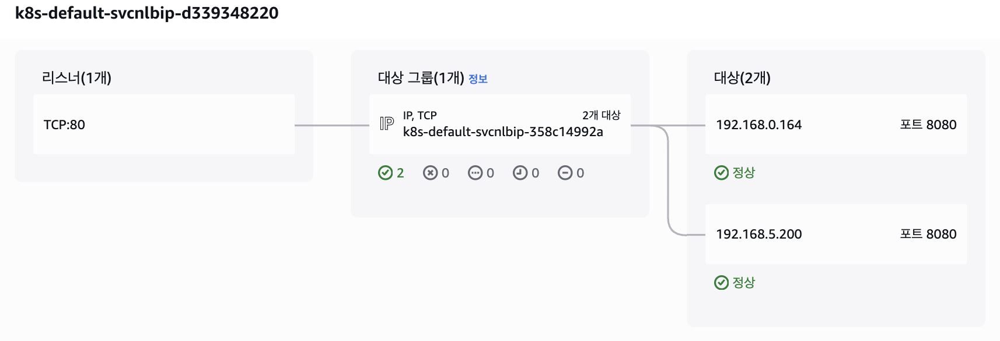
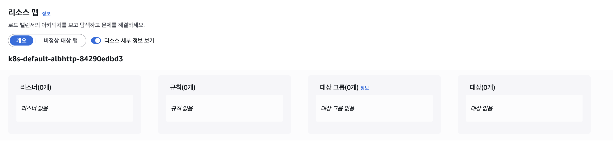
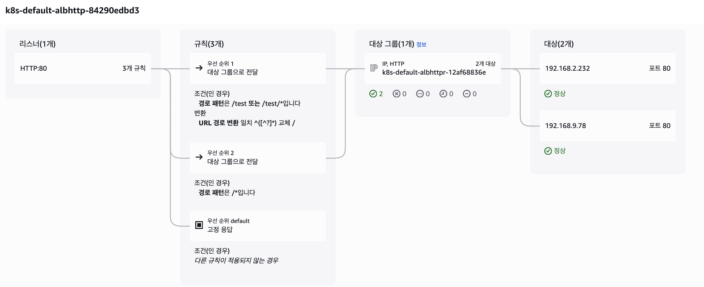

# 2주차 실습 내용

## 0. 실습 코드 다운로드 및 기본 배포

실습 코드 repo를 받아 확인한다.
```bash
❯ git clone https://github.com/gasida/aews.git

❯ tree aews 
aews
├── 1w
│   ├── eks.tf
│   ├── var.tf
│   └── vpc.tf
└── eks-private
    ├── ec2.tf
    ├── main.tf
    ├── outputs.tf
    └── versions.tf

3 directories, 7 files

# 1주차 실습
❯ cd aews/1w
```

### VPC, EKS 배포 (12~15분 가량 소요)
```bash
# 변수 지정 -> tfvars 작성으로 대체함.
❯ vim terraform.tfvars

# 배포 : 12분 정도 소요
❯ terraform init
❯ terraform plan
❯ terraform apply


# 자격증명 설정
❯ aws eks update-kubeconfig --region ap-northeast-2 --name myeks
Added new context arn:aws:eks:ap-northeast-2:xxxxxxxxx:cluster/myeks to /Users/xxxx/.kube/config

# k8s config 확인 및 rename context
❯ cat ~/.kube/config | grep current-context | awk '{print $2}'
arn:aws:eks:ap-northeast-2:xxxxxxx:cluster/myeks

❯ k config rename-context $(cat ~/.kube/config | grep current-context | awk '{print $2}') myeks
Context "arn:aws:eks:ap-northeast-2:xxxxxxxx:cluster/myeks" renamed to "myeks".

❯ cat ~/.kube/config | grep current-context
current-context: myeks
```

## 1. VPC CNI 관련 네트워크 구조 확인
```bash
# EC2 ENI IP 확인
aws ec2 describe-instances --query "Reservations[*].Instances[*].{PublicIPAdd:PublicIpAddress,PrivateIPAdd:PrivateIpAddress,InstanceName:Tags[?Key=='Name']|[0].Value,Status:State.Name}" --filters Name=instance-state-name,Values=running --output table

------------------------------------------------------------------------
|                           DescribeInstances                          |
+-----------------------+----------------+------------------+----------+
|     InstanceName      | PrivateIPAdd   |   PublicIPAdd    | Status   |
+-----------------------+----------------+------------------+----------+
|  myeks-1nd-node-group |  192.168.6.121 |  43.xxx.xxx.xxx  |  running |
|  myeks-1nd-node-group |  192.168.0.22  |  13.xxx.xxx.xxx  |  running |
|  myeks-1nd-node-group |  192.168.11.5  |  3.xx.xx.xx      |  running |
+-----------------------+----------------+------------------+----------+

# 아래 IP는 각자 실습 환경에 따라 사용
export N1=43.xxx.xxx.xxx
export N2=13.xxx.xxx.xxx
export N3=3.xx.xx.xx
```

### Pod 네트워크 기본 정보 확인
```bash
# 파드 상세 정보 확인
❯ k get daemonset aws-node --namespace kube-system -owide
NAME       DESIRED   CURRENT   READY   UP-TO-DATE   AVAILABLE   NODE SELECTOR   AGE    CONTAINERS                   IMAGES                                                                                                                                                                                    SELECTOR
aws-node   3         3         3       3            3           <none>          150m   aws-node,aws-eks-nodeagent   602401143452.dkr.ecr.ap-northeast-2.amazonaws.com/amazon-k8s-cni:v1.21.1-eksbuild.5,602401143452.dkr.ecr.ap-northeast-2.amazonaws.com/amazon/aws-network-policy-agent:v1.3.1-eksbuild.1   k8s-app=aws-node

❯ k describe daemonset aws-node --namespace kube-system
Name:           aws-node
Selector:       k8s-app=aws-node
Node-Selector:  <none>
Labels:         app.kubernetes.io/instance=aws-vpc-cni
                app.kubernetes.io/managed-by=Helm
                app.kubernetes.io/name=aws-node
                app.kubernetes.io/version=v1.21.1
                helm.sh/chart=aws-vpc-cni-1.21.1
                k8s-app=aws-node
Annotations:    deprecated.daemonset.template.generation: 1
Desired Number of Nodes Scheduled: 3
Current Number of Nodes Scheduled: 3
Number of Nodes Scheduled with Up-to-date Pods: 3
Number of Nodes Scheduled with Available Pods: 3
Number of Nodes Misscheduled: 0
Pods Status:  3 Running / 0 Waiting / 0 Succeeded / 0 Failed
Pod Template:
  Labels:           app.kubernetes.io/instance=aws-vpc-cni
                    app.kubernetes.io/name=aws-node
                    k8s-app=aws-node
  Service Account:  aws-node
  Init Containers:
   aws-vpc-cni-init:
    Image:      602401143452.dkr.ecr.ap-northeast-2.amazonaws.com/amazon-k8s-cni-init:v1.21.1-eksbuild.5
    Port:       <none>
    Host Port:  <none>
    Requests:
      cpu:  25m
    Environment:
      DISABLE_TCP_EARLY_DEMUX:  false
      ENABLE_IPv6:              false
    Mounts:
      /host/opt/cni/bin from cni-bin-dir (rw)
  Containers:
   aws-node:
    Image:      602401143452.dkr.ecr.ap-northeast-2.amazonaws.com/amazon-k8s-cni:v1.21.1-eksbuild.5
    Port:       61678/TCP
    Host Port:  0/TCP
    Requests:
      cpu:      25m
    Liveness:   exec [/app/grpc-health-probe -addr=:50051 -connect-timeout=5s -rpc-timeout=5s] delay=60s timeout=10s period=10s #success=1 #failure=3
    Readiness:  exec [/app/grpc-health-probe -addr=:50051 -connect-timeout=5s -rpc-timeout=5s] delay=1s timeout=10s period=10s #success=1 #failure=3
    Environment:
      ADDITIONAL_ENI_TAGS:                    {}
      ANNOTATE_POD_IP:                        false
      AWS_VPC_CNI_NODE_PORT_SUPPORT:          true
      AWS_VPC_ENI_MTU:                        9001
      AWS_VPC_K8S_CNI_CUSTOM_NETWORK_CFG:     false
      AWS_VPC_K8S_CNI_EXTERNALSNAT:           false
      AWS_VPC_K8S_CNI_LOGLEVEL:               DEBUG
      AWS_VPC_K8S_CNI_LOG_FILE:               /host/var/log/aws-routed-eni/ipamd.log
      AWS_VPC_K8S_CNI_RANDOMIZESNAT:          prng
      AWS_VPC_K8S_CNI_VETHPREFIX:             eni
      AWS_VPC_K8S_PLUGIN_LOG_FILE:            /var/log/aws-routed-eni/plugin.log
      AWS_VPC_K8S_PLUGIN_LOG_LEVEL:           DEBUG
      CLUSTER_ENDPOINT:                       https://CD8FBB5FC73D4F7C36EDD980E25FC54C.gr7.ap-northeast-2.eks.amazonaws.com
      CLUSTER_NAME:                           myeks
      DISABLE_INTROSPECTION:                  false
      DISABLE_METRICS:                        false
      DISABLE_NETWORK_RESOURCE_PROVISIONING:  false
      ENABLE_IMDS_ONLY_MODE:                  false
      ENABLE_IPv4:                            true
      ENABLE_IPv6:                            false
      ENABLE_MULTI_NIC:                       false
      ENABLE_POD_ENI:                         false
      ENABLE_PREFIX_DELEGATION:               false
      ENABLE_SUBNET_DISCOVERY:                true
      NETWORK_POLICY_ENFORCING_MODE:          standard
      VPC_CNI_VERSION:                        v1.21.1
      VPC_ID:                                 vpc-0c587c1dda2594bcd
      WARM_ENI_TARGET:                        1
      WARM_PREFIX_TARGET:                     1
      MY_NODE_NAME:                            (v1:spec.nodeName)
      MY_POD_NAME:                             (v1:metadata.name)
    Mounts:
      /host/etc/cni/net.d from cni-net-dir (rw)
      /host/opt/cni/bin from cni-bin-dir (rw)
      /host/var/log/aws-routed-eni from log-dir (rw)
      /run/xtables.lock from xtables-lock (rw)
      /var/run/aws-node from run-dir (rw)
   aws-eks-nodeagent:
    Image:      602401143452.dkr.ecr.ap-northeast-2.amazonaws.com/amazon/aws-network-policy-agent:v1.3.1-eksbuild.1
    Port:       8162/TCP
    Host Port:  0/TCP
    Args:
      --enable-ipv6=false
      --enable-network-policy=false
      --enable-cloudwatch-logs=false
      --enable-policy-event-logs=false
      --log-file=/var/log/aws-routed-eni/network-policy-agent.log
      --metrics-bind-addr=:8162
      --health-probe-bind-addr=:8163
      --conntrack-cache-cleanup-period=300
      --log-level=debug
    Requests:
      cpu:  25m
    Environment:
      MY_NODE_NAME:   (v1:spec.nodeName)
    Mounts:
      /host/opt/cni/bin from cni-bin-dir (rw)
      /sys/fs/bpf from bpf-pin-path (rw)
      /var/log/aws-routed-eni from log-dir (rw)
      /var/run/aws-node from run-dir (rw)
  Volumes:
   bpf-pin-path:
    Type:          HostPath (bare host directory volume)
    Path:          /sys/fs/bpf
    HostPathType:  
   cni-bin-dir:
    Type:          HostPath (bare host directory volume)
    Path:          /opt/cni/bin
    HostPathType:  
   cni-net-dir:
    Type:          HostPath (bare host directory volume)
    Path:          /etc/cni/net.d
    HostPathType:  
   log-dir:
    Type:          HostPath (bare host directory volume)
    Path:          /var/log/aws-routed-eni
    HostPathType:  DirectoryOrCreate
   run-dir:
    Type:          HostPath (bare host directory volume)
    Path:          /var/run/aws-node
    HostPathType:  DirectoryOrCreate
   xtables-lock:
    Type:               HostPath (bare host directory volume)
    Path:               /run/xtables.lock
    HostPathType:       FileOrCreate
  Priority Class Name:  system-node-critical
Events:                 <none>

# kube-proxy config 확인 : 모드 iptables 사용
❯ k describe cm -n kube-system kube-proxy-config | grep iptables
iptables:
mode: "iptables"

❯ k describe cm -n kube-system kube-proxy-config | grep iptables: -A5
iptables:
  masqueradeAll: false
  masqueradeBit: 14
  minSyncPeriod: 0s
  syncPeriod: 30s
ipvs:

# aws-node 데몬셋 env 확인
❯ k get ds aws-node -n kube-system -o json | jq '.spec.template.spec.containers[0].env'
[
  {
    "name": "ADDITIONAL_ENI_TAGS",
    "value": "{}"
  },
  {
    "name": "ANNOTATE_POD_IP",
    "value": "false"
  },
  {
    "name": "AWS_VPC_CNI_NODE_PORT_SUPPORT",
    "value": "true"
  },
  {
    "name": "AWS_VPC_ENI_MTU",
    "value": "9001"
  },
  {
    "name": "AWS_VPC_K8S_CNI_CUSTOM_NETWORK_CFG",
    "value": "false"
  },
  {
    "name": "AWS_VPC_K8S_CNI_EXTERNALSNAT",
    "value": "false"
  },
  {
    "name": "AWS_VPC_K8S_CNI_LOGLEVEL",
    "value": "DEBUG"
  },
  {
    "name": "AWS_VPC_K8S_CNI_LOG_FILE",
    "value": "/host/var/log/aws-routed-eni/ipamd.log"
  },
  {
    "name": "AWS_VPC_K8S_CNI_RANDOMIZESNAT",
    "value": "prng"
  },
  {
    "name": "AWS_VPC_K8S_CNI_VETHPREFIX",
    "value": "eni"
  },
  {
    "name": "AWS_VPC_K8S_PLUGIN_LOG_FILE",
    "value": "/var/log/aws-routed-eni/plugin.log"
  },
  {
    "name": "AWS_VPC_K8S_PLUGIN_LOG_LEVEL",
    "value": "DEBUG"
  },
  {
    "name": "CLUSTER_ENDPOINT",
    "value": "https://CD8FBB5FC73D4F7C36EDD980E25FC54C.gr7.ap-northeast-2.eks.amazonaws.com"
  },
  {
    "name": "CLUSTER_NAME",
    "value": "myeks"
  },
  {
    "name": "DISABLE_INTROSPECTION",
    "value": "false"
  },
  {
    "name": "DISABLE_METRICS",
    "value": "false"
  },
  {
    "name": "DISABLE_NETWORK_RESOURCE_PROVISIONING",
    "value": "false"
  },
  {
    "name": "ENABLE_IMDS_ONLY_MODE",
    "value": "false"
  },
  {
    "name": "ENABLE_IPv4",
    "value": "true"
  },
  {
    "name": "ENABLE_IPv6",
    "value": "false"
  },
  {
    "name": "ENABLE_MULTI_NIC",
    "value": "false"
  },
  {
    "name": "ENABLE_POD_ENI",
    "value": "false"
  },
  {
    "name": "ENABLE_PREFIX_DELEGATION",
    "value": "false"
  },
  {
    "name": "ENABLE_SUBNET_DISCOVERY",
    "value": "true"
  },
  {
    "name": "NETWORK_POLICY_ENFORCING_MODE",
    "value": "standard"
  },
  {
    "name": "VPC_CNI_VERSION",
    "value": "v1.21.1"
  },
  {
    "name": "VPC_ID",
    "value": "vpc-0c587c1dda2594bcd"
  },
  {
    "name": "WARM_ENI_TARGET",
    "value": "1"
  },
  {
    "name": "WARM_PREFIX_TARGET",
    "value": "1"
  },
  {
    "name": "MY_NODE_NAME",
    "valueFrom": {
      "fieldRef": {
        "apiVersion": "v1",
        "fieldPath": "spec.nodeName"
      }
    }
  },
  {
    "name": "MY_POD_NAME",
    "valueFrom": {
      "fieldRef": {
        "apiVersion": "v1",
        "fieldPath": "metadata.name"
      }
    }
  }
]

# 노드 IP 확인
aws ec2 describe-instances --query "Reservations[*].Instances[*].{PublicIPAdd:PublicIpAddress,PrivateIPAdd:PrivateIpAddress,InstanceName:Tags[?Key=='Name']|[0].Value,Status:State.Name}" --filters Name=instance-state-name,Values=running --output table
(생략)

# 파드 IP 확인
❯ k get pod -n kube-system -o=custom-columns=NAME:.metadata.name,IP:.status.podIP,STATUS:.status.phase
NAME                      IP              STATUS
aws-node-2z6z6            192.168.11.5    Running
aws-node-kznsq            192.168.0.22    Running
aws-node-nbx4v            192.168.6.121   Running
coredns-d487b6fcb-8d8v9   192.168.4.8     Running
coredns-d487b6fcb-lz8w6   192.168.3.202   Running
kube-proxy-czplf          192.168.0.22    Running
kube-proxy-dmhf4          192.168.6.121   Running
kube-proxy-vr4nm          192.168.11.5    Running

# 파드 이름 확인
❯ k get pod -A -o name
pod/aws-node-2z6z6
pod/aws-node-kznsq
pod/aws-node-nbx4v
pod/coredns-d487b6fcb-8d8v9
pod/coredns-d487b6fcb-lz8w6
pod/kube-proxy-czplf
pod/kube-proxy-dmhf4
pod/kube-proxy-vr4nm
```

### 노드에 네트워크 정보 확인
```bash
# cni log 확인
❯ for i in $N1 $N2 $N3; do echo ">> node $i <<"; ssh ec2-user@$i tree /var/log/aws-routed-eni ; echo; done
>> node 43.xxx.xxx.xxx <<
/var/log/aws-routed-eni
├── ebpf-sdk.log
├── egress-v6-plugin.log
├── ipamd.log
├── network-policy-agent.log
└── plugin.log

0 directories, 5 files

>> node 13.xxx.xxx.xxx <<
/var/log/aws-routed-eni
├── ebpf-sdk.log
├── egress-v6-plugin.log
├── ipamd.log
├── network-policy-agent.log
└── plugin.log

0 directories, 5 files

>> node 3.xx.xx.xx <<
/var/log/aws-routed-eni
├── ebpf-sdk.log
├── egress-v6-plugin.log
├── ipamd.log
├── network-policy-agent.log
└── plugin.log

0 directories, 5 files

for i in $N1 $N2 $N3; do echo ">> node $i <<"; ssh ec2-user@$i sudo cat /var/log/aws-routed-eni/plugin.log | jq ; echo; done
(많아서 생략)

for i in $N1 $N2 $N3; do echo ">> node $i <<"; ssh ec2-user@$i sudo cat /var/log/aws-routed-eni/ipamd.log | jq ; echo; done
(많아서 생략)

# 네트워크 정보 확인 : eniY는 pod network 네임스페이스와 veth pair
❯ for i in $N1 $N2 $N3; do echo ">> node $i <<"; ssh ec2-user@$i sudo ip -br -c addr; echo; done
>> node 43.xxx.xxx.xxx <<
lo               UNKNOWN        127.0.0.1/8 ::1/128 
ens5             UP             192.168.6.121/22 metric 512 fe80::444:8fff:fef8:bda7/64 
eni14227b50c6b@if3 UP             fe80::d8e2:7cff:fe4a:ae5/64 
ens6             UP             192.168.4.57/22 fe80::4b4:ddff:fea8:aa5f/64 

>> node 13.xxx.xxx.xxx <<
lo               UNKNOWN        127.0.0.1/8 ::1/128 
ens5             UP             192.168.0.22/22 metric 512 fe80::a6:a1ff:fec7:cc11/64 
eni92fed275402@if3 UP             fe80::fcf5:4bff:fef6:d0c1/64 
ens7             UP             192.168.3.59/22 fe80::5d:b4ff:fe96:6131/64 

>> node 3.xx.xx.xx <<
lo               UNKNOWN        127.0.0.1/8 ::1/128 
ens5             UP             192.168.11.5/22 metric 512 fe80::872:3dff:fe85:fc37/64 

❯ for i in $N1 $N2 $N3; do echo ">> node $i <<"; ssh ec2-user@$i sudo ip -c addr; echo; done
>> node 43.xxx.xxx.xxx <<
1: lo: <LOOPBACK,UP,LOWER_UP> mtu 65536 qdisc noqueue state UNKNOWN group default qlen 1000
    link/loopback 00:00:00:00:00:00 brd 00:00:00:00:00:00
    inet 127.0.0.1/8 scope host lo
       valid_lft forever preferred_lft forever
    inet6 ::1/128 scope host noprefixroute 
       valid_lft forever preferred_lft forever
2: ens5: <BROADCAST,MULTICAST,UP,LOWER_UP> mtu 9001 qdisc mq state UP group default qlen 1000
    link/ether 06:44:8f:f8:bd:a7 brd ff:ff:ff:ff:ff:ff
    altname enp0s5
    inet 192.168.6.121/22 metric 512 brd 192.168.7.255 scope global dynamic ens5
       valid_lft 2730sec preferred_lft 2730sec
    inet6 fe80::444:8fff:fef8:bda7/64 scope link proto kernel_ll 
       valid_lft forever preferred_lft forever
3: eni14227b50c6b@if3: <BROADCAST,MULTICAST,UP,LOWER_UP> mtu 9001 qdisc noqueue state UP group default 
    link/ether da:e2:7c:4a:0a:e5 brd ff:ff:ff:ff:ff:ff link-netns cni-151d5dc3-d27e-45d4-bb78-9d00a908a114
    inet6 fe80::d8e2:7cff:fe4a:ae5/64 scope link proto kernel_ll 
       valid_lft forever preferred_lft forever
4: ens6: <BROADCAST,MULTICAST,UP,LOWER_UP> mtu 9001 qdisc mq state UP group default qlen 1000
    link/ether 06:b4:dd:a8:aa:5f brd ff:ff:ff:ff:ff:ff
    altname enp0s6
    inet 192.168.4.57/22 brd 192.168.7.255 scope global ens6
       valid_lft forever preferred_lft forever
    inet6 fe80::4b4:ddff:fea8:aa5f/64 scope link proto kernel_ll 
       valid_lft forever preferred_lft forever

>> node 13.xxx.xxx.xxx <<
1: lo: <LOOPBACK,UP,LOWER_UP> mtu 65536 qdisc noqueue state UNKNOWN group default qlen 1000
    link/loopback 00:00:00:00:00:00 brd 00:00:00:00:00:00
    inet 127.0.0.1/8 scope host lo
       valid_lft forever preferred_lft forever
    inet6 ::1/128 scope host noprefixroute 
       valid_lft forever preferred_lft forever
2: ens5: <BROADCAST,MULTICAST,UP,LOWER_UP> mtu 9001 qdisc mq state UP group default qlen 1000
    link/ether 02:a6:a1:c7:cc:11 brd ff:ff:ff:ff:ff:ff
    altname enp0s5
    inet 192.168.0.22/22 metric 512 brd 192.168.3.255 scope global dynamic ens5
       valid_lft 2729sec preferred_lft 2729sec
    inet6 fe80::a6:a1ff:fec7:cc11/64 scope link proto kernel_ll 
       valid_lft forever preferred_lft forever
3: eni92fed275402@if3: <BROADCAST,MULTICAST,UP,LOWER_UP> mtu 9001 qdisc noqueue state UP group default 
    link/ether fe:f5:4b:f6:d0:c1 brd ff:ff:ff:ff:ff:ff link-netns cni-ec9d1341-0bfb-99da-a940-004620367286
    inet6 fe80::fcf5:4bff:fef6:d0c1/64 scope link proto kernel_ll 
       valid_lft forever preferred_lft forever
14: ens7: <BROADCAST,MULTICAST,UP,LOWER_UP> mtu 9001 qdisc mq state UP group default qlen 1000
    link/ether 02:5d:b4:96:61:31 brd ff:ff:ff:ff:ff:ff
    altname enp0s7
    inet 192.168.3.59/22 brd 192.168.3.255 scope global ens7
       valid_lft forever preferred_lft forever
    inet6 fe80::5d:b4ff:fe96:6131/64 scope link proto kernel_ll 
       valid_lft forever preferred_lft forever

>> node 3.xx.xx.xx <<
1: lo: <LOOPBACK,UP,LOWER_UP> mtu 65536 qdisc noqueue state UNKNOWN group default qlen 1000
    link/loopback 00:00:00:00:00:00 brd 00:00:00:00:00:00
    inet 127.0.0.1/8 scope host lo
       valid_lft forever preferred_lft forever
    inet6 ::1/128 scope host noprefixroute 
       valid_lft forever preferred_lft forever
2: ens5: <BROADCAST,MULTICAST,UP,LOWER_UP> mtu 9001 qdisc mq state UP group default qlen 1000
    link/ether 0a:72:3d:85:fc:37 brd ff:ff:ff:ff:ff:ff
    altname enp0s5
    inet 192.168.11.5/22 metric 512 brd 192.168.11.255 scope global dynamic ens5
       valid_lft 2728sec preferred_lft 2728sec
    inet6 fe80::872:3dff:fe85:fc37/64 scope link proto kernel_ll 
       valid_lft forever preferred_lft forever

❯ for i in $N1 $N2 $N3; do echo ">> node $i <<"; ssh ec2-user@$i sudo ip -c route; echo; done
>> node 43.xxx.xxx.xxx <<
default via 192.168.4.1 dev ens5 proto dhcp src 192.168.6.121 metric 512 
192.168.0.2 via 192.168.4.1 dev ens5 proto dhcp src 192.168.6.121 metric 512 
192.168.4.0/22 dev ens5 proto kernel scope link src 192.168.6.121 metric 512 
192.168.4.1 dev ens5 proto dhcp scope link src 192.168.6.121 metric 512 
192.168.4.8 dev eni14227b50c6b scope link 

>> node 13.xxx.xxx.xxx <<
default via 192.168.0.1 dev ens5 proto dhcp src 192.168.0.22 metric 512 
192.168.0.0/22 dev ens5 proto kernel scope link src 192.168.0.22 metric 512 
192.168.0.1 dev ens5 proto dhcp scope link src 192.168.0.22 metric 512 
192.168.0.2 dev ens5 proto dhcp scope link src 192.168.0.22 metric 512 
192.168.3.202 dev eni92fed275402 scope link 

>> node 3.xx.xx.xx <<
default via 192.168.8.1 dev ens5 proto dhcp src 192.168.11.5 metric 512 
192.168.0.2 via 192.168.8.1 dev ens5 proto dhcp src 192.168.11.5 metric 512 
192.168.8.0/22 dev ens5 proto kernel scope link src 192.168.11.5 metric 512 
192.168.8.1 dev ens5 proto dhcp scope link src 192.168.11.5 metric 512 

❯ ssh ec2-user@$N1 sudo iptables -t nat -S
-P PREROUTING ACCEPT
-P INPUT ACCEPT
-P OUTPUT ACCEPT
-P POSTROUTING ACCEPT
-N AWS-CONNMARK-CHAIN-0
-N AWS-SNAT-CHAIN-0
-N KUBE-KUBELET-CANARY
-N KUBE-MARK-MASQ
-N KUBE-NODEPORTS
-N KUBE-POSTROUTING
-N KUBE-PROXY-CANARY
-N KUBE-SEP-2U7OSQXJZOB7WZ3Q
-N KUBE-SEP-5F3K6STVZ2RIMBVD
-N KUBE-SEP-7HMGISIDEKXTX3RL
-N KUBE-SEP-LKMWUDPNNHYGGRZY
-N KUBE-SEP-M2QJFXJS57EX5J5P
-N KUBE-SEP-P2RFBZXL77JSMBKZ
-N KUBE-SEP-V6N5HQQSW43PC5DW
-N KUBE-SEP-XYDDOFWXZXQGZRSQ
-N KUBE-SEP-YIAJBU22ST67ZZPR
-N KUBE-SERVICES
-N KUBE-SVC-ERIFXISQEP7F7OF4
-N KUBE-SVC-I7SKRZYQ7PWYV5X7
-N KUBE-SVC-JD5MR3NA4I4DYORP
-N KUBE-SVC-NPX46M4PTMTKRN6Y
-N KUBE-SVC-TCOU7JCQXEZGVUNU
-A PREROUTING -m comment --comment "kubernetes service portals" -j KUBE-SERVICES
-A PREROUTING -i eni+ -m comment --comment "AWS, outbound connections" -j AWS-CONNMARK-CHAIN-0
-A PREROUTING -m comment --comment "AWS, CONNMARK" -j CONNMARK --restore-mark --nfmask 0x80 --ctmask 0x80
-A OUTPUT -m comment --comment "kubernetes service portals" -j KUBE-SERVICES
-A POSTROUTING -m comment --comment "kubernetes postrouting rules" -j KUBE-POSTROUTING
-A POSTROUTING -m comment --comment "AWS SNAT CHAIN" -j AWS-SNAT-CHAIN-0
-A AWS-CONNMARK-CHAIN-0 -d 192.168.0.0/16 -m comment --comment "AWS CONNMARK CHAIN, VPC CIDR" -j RETURN
-A AWS-CONNMARK-CHAIN-0 -m comment --comment "AWS, CONNMARK" -j CONNMARK --set-xmark 0x80/0x80
-A AWS-SNAT-CHAIN-0 -d 192.168.0.0/16 -m comment --comment "AWS SNAT CHAIN" -j RETURN
-A AWS-SNAT-CHAIN-0 ! -o vlan+ -m comment --comment "AWS, SNAT" -m addrtype ! --dst-type LOCAL -j SNAT --to-source 192.168.6.121 --random-fully
-A KUBE-MARK-MASQ -j MARK --set-xmark 0x4000/0x4000
-A KUBE-POSTROUTING -m mark ! --mark 0x4000/0x4000 -j RETURN
-A KUBE-POSTROUTING -j MARK --set-xmark 0x4000/0x0
-A KUBE-POSTROUTING -m comment --comment "kubernetes service traffic requiring SNAT" -j MASQUERADE --random-fully
-A KUBE-SEP-2U7OSQXJZOB7WZ3Q -s 192.168.3.202/32 -m comment --comment "kube-system/kube-dns:dns-tcp" -j KUBE-MARK-MASQ
-A KUBE-SEP-2U7OSQXJZOB7WZ3Q -p tcp -m comment --comment "kube-system/kube-dns:dns-tcp" -m tcp -j DNAT --to-destination 192.168.3.202:53
-A KUBE-SEP-5F3K6STVZ2RIMBVD -s 192.168.4.8/32 -m comment --comment "kube-system/kube-dns:metrics" -j KUBE-MARK-MASQ
-A KUBE-SEP-5F3K6STVZ2RIMBVD -p tcp -m comment --comment "kube-system/kube-dns:metrics" -m tcp -j DNAT --to-destination 192.168.4.8:9153
-A KUBE-SEP-7HMGISIDEKXTX3RL -s 192.168.7.65/32 -m comment --comment "default/kubernetes:https" -j KUBE-MARK-MASQ
-A KUBE-SEP-7HMGISIDEKXTX3RL -p tcp -m comment --comment "default/kubernetes:https" -m tcp -j DNAT --to-destination 192.168.7.65:443
-A KUBE-SEP-LKMWUDPNNHYGGRZY -s 192.168.4.8/32 -m comment --comment "kube-system/kube-dns:dns" -j KUBE-MARK-MASQ
-A KUBE-SEP-LKMWUDPNNHYGGRZY -p udp -m comment --comment "kube-system/kube-dns:dns" -m udp -j DNAT --to-destination 192.168.4.8:53
-A KUBE-SEP-M2QJFXJS57EX5J5P -s 192.168.11.108/32 -m comment --comment "default/kubernetes:https" -j KUBE-MARK-MASQ
-A KUBE-SEP-M2QJFXJS57EX5J5P -p tcp -m comment --comment "default/kubernetes:https" -m tcp -j DNAT --to-destination 192.168.11.108:443
-A KUBE-SEP-P2RFBZXL77JSMBKZ -s 192.168.3.202/32 -m comment --comment "kube-system/kube-dns:metrics" -j KUBE-MARK-MASQ
-A KUBE-SEP-P2RFBZXL77JSMBKZ -p tcp -m comment --comment "kube-system/kube-dns:metrics" -m tcp -j DNAT --to-destination 192.168.3.202:9153
-A KUBE-SEP-V6N5HQQSW43PC5DW -s 192.168.3.202/32 -m comment --comment "kube-system/kube-dns:dns" -j KUBE-MARK-MASQ
-A KUBE-SEP-V6N5HQQSW43PC5DW -p udp -m comment --comment "kube-system/kube-dns:dns" -m udp -j DNAT --to-destination 192.168.3.202:53
-A KUBE-SEP-XYDDOFWXZXQGZRSQ -s 172.0.32.0/32 -m comment --comment "kube-system/eks-extension-metrics-api:metrics-api" -j KUBE-MARK-MASQ
-A KUBE-SEP-XYDDOFWXZXQGZRSQ -p tcp -m comment --comment "kube-system/eks-extension-metrics-api:metrics-api" -m tcp -j DNAT --to-destination 172.0.32.0:10443
-A KUBE-SEP-YIAJBU22ST67ZZPR -s 192.168.4.8/32 -m comment --comment "kube-system/kube-dns:dns-tcp" -j KUBE-MARK-MASQ
-A KUBE-SEP-YIAJBU22ST67ZZPR -p tcp -m comment --comment "kube-system/kube-dns:dns-tcp" -m tcp -j DNAT --to-destination 192.168.4.8:53
-A KUBE-SERVICES -d 10.100.0.1/32 -p tcp -m comment --comment "default/kubernetes:https cluster IP" -m tcp --dport 443 -j KUBE-SVC-NPX46M4PTMTKRN6Y
-A KUBE-SERVICES -d 10.100.135.59/32 -p tcp -m comment --comment "kube-system/eks-extension-metrics-api:metrics-api cluster IP" -m tcp --dport 443 -j KUBE-SVC-I7SKRZYQ7PWYV5X7
-A KUBE-SERVICES -d 10.100.0.10/32 -p tcp -m comment --comment "kube-system/kube-dns:dns-tcp cluster IP" -m tcp --dport 53 -j KUBE-SVC-ERIFXISQEP7F7OF4
-A KUBE-SERVICES -d 10.100.0.10/32 -p tcp -m comment --comment "kube-system/kube-dns:metrics cluster IP" -m tcp --dport 9153 -j KUBE-SVC-JD5MR3NA4I4DYORP
-A KUBE-SERVICES -d 10.100.0.10/32 -p udp -m comment --comment "kube-system/kube-dns:dns cluster IP" -m udp --dport 53 -j KUBE-SVC-TCOU7JCQXEZGVUNU
-A KUBE-SERVICES -m comment --comment "kubernetes service nodeports; NOTE: this must be the last rule in this chain" -m addrtype --dst-type LOCAL -j KUBE-NODEPORTS
-A KUBE-SVC-ERIFXISQEP7F7OF4 -m comment --comment "kube-system/kube-dns:dns-tcp -> 192.168.3.202:53" -m statistic --mode random --probability 0.50000000000 -j KUBE-SEP-2U7OSQXJZOB7WZ3Q
-A KUBE-SVC-ERIFXISQEP7F7OF4 -m comment --comment "kube-system/kube-dns:dns-tcp -> 192.168.4.8:53" -j KUBE-SEP-YIAJBU22ST67ZZPR
-A KUBE-SVC-I7SKRZYQ7PWYV5X7 -m comment --comment "kube-system/eks-extension-metrics-api:metrics-api -> 172.0.32.0:10443" -j KUBE-SEP-XYDDOFWXZXQGZRSQ
-A KUBE-SVC-JD5MR3NA4I4DYORP -m comment --comment "kube-system/kube-dns:metrics -> 192.168.3.202:9153" -m statistic --mode random --probability 0.50000000000 -j KUBE-SEP-P2RFBZXL77JSMBKZ
-A KUBE-SVC-JD5MR3NA4I4DYORP -m comment --comment "kube-system/kube-dns:metrics -> 192.168.4.8:9153" -j KUBE-SEP-5F3K6STVZ2RIMBVD
-A KUBE-SVC-NPX46M4PTMTKRN6Y -m comment --comment "default/kubernetes:https -> 192.168.11.108:443" -m statistic --mode random --probability 0.50000000000 -j KUBE-SEP-M2QJFXJS57EX5J5P
-A KUBE-SVC-NPX46M4PTMTKRN6Y -m comment --comment "default/kubernetes:https -> 192.168.7.65:443" -j KUBE-SEP-7HMGISIDEKXTX3RL
-A KUBE-SVC-TCOU7JCQXEZGVUNU -m comment --comment "kube-system/kube-dns:dns -> 192.168.3.202:53" -m statistic --mode random --probability 0.50000000000 -j KUBE-SEP-V6N5HQQSW43PC5DW
-A KUBE-SVC-TCOU7JCQXEZGVUNU -m comment --comment "kube-system/kube-dns:dns -> 192.168.4.8:53" -j KUBE-SEP-LKMWUDPNNHYGGRZY

❯ ssh ec2-user@$N1 sudo iptables -t nat -L -n -v
Chain PREROUTING (policy ACCEPT 0 packets, 0 bytes)
 pkts bytes target     prot opt in     out     source               destination         
   15   969 KUBE-SERVICES  all  --  *      *       0.0.0.0/0            0.0.0.0/0            /* kubernetes service portals */
    1    85 AWS-CONNMARK-CHAIN-0  all  --  eni+   *       0.0.0.0/0            0.0.0.0/0            /* AWS, outbound connections */
   12   789 CONNMARK   all  --  *      *       0.0.0.0/0            0.0.0.0/0            /* AWS, CONNMARK */ CONNMARK restore mask 0x80

Chain INPUT (policy ACCEPT 0 packets, 0 bytes)
 pkts bytes target     prot opt in     out     source               destination         

Chain OUTPUT (policy ACCEPT 0 packets, 0 bytes)
 pkts bytes target     prot opt in     out     source               destination         
15167  926K KUBE-SERVICES  all  --  *      *       0.0.0.0/0            0.0.0.0/0            /* kubernetes service portals */

Chain POSTROUTING (policy ACCEPT 0 packets, 0 bytes)
 pkts bytes target     prot opt in     out     source               destination         
15171  926K KUBE-POSTROUTING  all  --  *      *       0.0.0.0/0            0.0.0.0/0            /* kubernetes postrouting rules */
15258  933K AWS-SNAT-CHAIN-0  all  --  *      *       0.0.0.0/0            0.0.0.0/0            /* AWS SNAT CHAIN */

Chain AWS-CONNMARK-CHAIN-0 (1 references)
 pkts bytes target     prot opt in     out     source               destination         
    1    85 RETURN     all  --  *      *       0.0.0.0/0            192.168.0.0/16       /* AWS CONNMARK CHAIN, VPC CIDR */
    0     0 CONNMARK   all  --  *      *       0.0.0.0/0            0.0.0.0/0            /* AWS, CONNMARK */ CONNMARK or 0x80

Chain AWS-SNAT-CHAIN-0 (1 references)
 pkts bytes target     prot opt in     out     source               destination         
 8524  517K RETURN     all  --  *      *       0.0.0.0/0            192.168.0.0/16       /* AWS SNAT CHAIN */
 4627  290K SNAT       all  --  *      !vlan+  0.0.0.0/0            0.0.0.0/0            /* AWS, SNAT */ ADDRTYPE match dst-type !LOCAL to:192.168.6.121 random-fully

Chain KUBE-KUBELET-CANARY (0 references)
 pkts bytes target     prot opt in     out     source               destination         

Chain KUBE-MARK-MASQ (9 references)
 pkts bytes target     prot opt in     out     source               destination         
    0     0 MARK       all  --  *      *       0.0.0.0/0            0.0.0.0/0            MARK or 0x4000

Chain KUBE-NODEPORTS (1 references)
 pkts bytes target     prot opt in     out     source               destination         

Chain KUBE-POSTROUTING (1 references)
 pkts bytes target     prot opt in     out     source               destination         
 1526 93861 RETURN     all  --  *      *       0.0.0.0/0            0.0.0.0/0            mark match ! 0x4000/0x4000
    0     0 MARK       all  --  *      *       0.0.0.0/0            0.0.0.0/0            MARK xor 0x4000
    0     0 MASQUERADE  all  --  *      *       0.0.0.0/0            0.0.0.0/0            /* kubernetes service traffic requiring SNAT */ random-fully

Chain KUBE-PROXY-CANARY (0 references)
 pkts bytes target     prot opt in     out     source               destination         

Chain KUBE-SEP-2U7OSQXJZOB7WZ3Q (1 references)
 pkts bytes target     prot opt in     out     source               destination         
    0     0 KUBE-MARK-MASQ  all  --  *      *       192.168.3.202        0.0.0.0/0            /* kube-system/kube-dns:dns-tcp */
    0     0 DNAT       tcp  --  *      *       0.0.0.0/0            0.0.0.0/0            /* kube-system/kube-dns:dns-tcp */ tcp to:192.168.3.202:53

Chain KUBE-SEP-5F3K6STVZ2RIMBVD (1 references)
 pkts bytes target     prot opt in     out     source               destination         
    0     0 KUBE-MARK-MASQ  all  --  *      *       192.168.4.8          0.0.0.0/0            /* kube-system/kube-dns:metrics */
    0     0 DNAT       tcp  --  *      *       0.0.0.0/0            0.0.0.0/0            /* kube-system/kube-dns:metrics */ tcp to:192.168.4.8:9153

Chain KUBE-SEP-7HMGISIDEKXTX3RL (1 references)
 pkts bytes target     prot opt in     out     source               destination         
    0     0 KUBE-MARK-MASQ  all  --  *      *       192.168.7.65         0.0.0.0/0            /* default/kubernetes:https */
    0     0 DNAT       tcp  --  *      *       0.0.0.0/0            0.0.0.0/0            /* default/kubernetes:https */ tcp to:192.168.7.65:443

Chain KUBE-SEP-LKMWUDPNNHYGGRZY (1 references)
 pkts bytes target     prot opt in     out     source               destination         
    0     0 KUBE-MARK-MASQ  all  --  *      *       192.168.4.8          0.0.0.0/0            /* kube-system/kube-dns:dns */
    0     0 DNAT       udp  --  *      *       0.0.0.0/0            0.0.0.0/0            /* kube-system/kube-dns:dns */ udp to:192.168.4.8:53

Chain KUBE-SEP-M2QJFXJS57EX5J5P (1 references)
 pkts bytes target     prot opt in     out     source               destination         
    0     0 KUBE-MARK-MASQ  all  --  *      *       192.168.11.108       0.0.0.0/0            /* default/kubernetes:https */
    0     0 DNAT       tcp  --  *      *       0.0.0.0/0            0.0.0.0/0            /* default/kubernetes:https */ tcp to:192.168.11.108:443

Chain KUBE-SEP-P2RFBZXL77JSMBKZ (1 references)
 pkts bytes target     prot opt in     out     source               destination         
    0     0 KUBE-MARK-MASQ  all  --  *      *       192.168.3.202        0.0.0.0/0            /* kube-system/kube-dns:metrics */
    0     0 DNAT       tcp  --  *      *       0.0.0.0/0            0.0.0.0/0            /* kube-system/kube-dns:metrics */ tcp to:192.168.3.202:9153

Chain KUBE-SEP-V6N5HQQSW43PC5DW (1 references)
 pkts bytes target     prot opt in     out     source               destination         
    0     0 KUBE-MARK-MASQ  all  --  *      *       192.168.3.202        0.0.0.0/0            /* kube-system/kube-dns:dns */
    0     0 DNAT       udp  --  *      *       0.0.0.0/0            0.0.0.0/0            /* kube-system/kube-dns:dns */ udp to:192.168.3.202:53

Chain KUBE-SEP-XYDDOFWXZXQGZRSQ (1 references)
 pkts bytes target     prot opt in     out     source               destination         
    0     0 KUBE-MARK-MASQ  all  --  *      *       172.0.32.0           0.0.0.0/0            /* kube-system/eks-extension-metrics-api:metrics-api */
    0     0 DNAT       tcp  --  *      *       0.0.0.0/0            0.0.0.0/0            /* kube-system/eks-extension-metrics-api:metrics-api */ tcp to:172.0.32.0:10443

Chain KUBE-SEP-YIAJBU22ST67ZZPR (1 references)
 pkts bytes target     prot opt in     out     source               destination         
    0     0 KUBE-MARK-MASQ  all  --  *      *       192.168.4.8          0.0.0.0/0            /* kube-system/kube-dns:dns-tcp */
    0     0 DNAT       tcp  --  *      *       0.0.0.0/0            0.0.0.0/0            /* kube-system/kube-dns:dns-tcp */ tcp to:192.168.4.8:53

Chain KUBE-SERVICES (2 references)
 pkts bytes target     prot opt in     out     source               destination         
    0     0 KUBE-SVC-NPX46M4PTMTKRN6Y  tcp  --  *      *       0.0.0.0/0            10.100.0.1           /* default/kubernetes:https cluster IP */ tcp dpt:443
    0     0 KUBE-SVC-I7SKRZYQ7PWYV5X7  tcp  --  *      *       0.0.0.0/0            10.100.135.59        /* kube-system/eks-extension-metrics-api:metrics-api cluster IP */ tcp dpt:443
    0     0 KUBE-SVC-ERIFXISQEP7F7OF4  tcp  --  *      *       0.0.0.0/0            10.100.0.10          /* kube-system/kube-dns:dns-tcp cluster IP */ tcp dpt:53
    0     0 KUBE-SVC-JD5MR3NA4I4DYORP  tcp  --  *      *       0.0.0.0/0            10.100.0.10          /* kube-system/kube-dns:metrics cluster IP */ tcp dpt:9153
    0     0 KUBE-SVC-TCOU7JCQXEZGVUNU  udp  --  *      *       0.0.0.0/0            10.100.0.10          /* kube-system/kube-dns:dns cluster IP */ udp dpt:53
  379 22784 KUBE-NODEPORTS  all  --  *      *       0.0.0.0/0            0.0.0.0/0            /* kubernetes service nodeports; NOTE: this must be the last rule in this chain */ ADDRTYPE match dst-type LOCAL

Chain KUBE-SVC-ERIFXISQEP7F7OF4 (1 references)
 pkts bytes target     prot opt in     out     source               destination         
    0     0 KUBE-SEP-2U7OSQXJZOB7WZ3Q  all  --  *      *       0.0.0.0/0            0.0.0.0/0            /* kube-system/kube-dns:dns-tcp -> 192.168.3.202:53 */ statistic mode random probability 0.50000000000
    0     0 KUBE-SEP-YIAJBU22ST67ZZPR  all  --  *      *       0.0.0.0/0            0.0.0.0/0            /* kube-system/kube-dns:dns-tcp -> 192.168.4.8:53 */

Chain KUBE-SVC-I7SKRZYQ7PWYV5X7 (1 references)
 pkts bytes target     prot opt in     out     source               destination         
    0     0 KUBE-SEP-XYDDOFWXZXQGZRSQ  all  --  *      *       0.0.0.0/0            0.0.0.0/0            /* kube-system/eks-extension-metrics-api:metrics-api -> 172.0.32.0:10443 */

Chain KUBE-SVC-JD5MR3NA4I4DYORP (1 references)
 pkts bytes target     prot opt in     out     source               destination         
    0     0 KUBE-SEP-P2RFBZXL77JSMBKZ  all  --  *      *       0.0.0.0/0            0.0.0.0/0            /* kube-system/kube-dns:metrics -> 192.168.3.202:9153 */ statistic mode random probability 0.50000000000
    0     0 KUBE-SEP-5F3K6STVZ2RIMBVD  all  --  *      *       0.0.0.0/0            0.0.0.0/0            /* kube-system/kube-dns:metrics -> 192.168.4.8:9153 */

Chain KUBE-SVC-NPX46M4PTMTKRN6Y (1 references)
 pkts bytes target     prot opt in     out     source               destination         
    0     0 KUBE-SEP-M2QJFXJS57EX5J5P  all  --  *      *       0.0.0.0/0            0.0.0.0/0            /* default/kubernetes:https -> 192.168.11.108:443 */ statistic mode random probability 0.50000000000
    0     0 KUBE-SEP-7HMGISIDEKXTX3RL  all  --  *      *       0.0.0.0/0            0.0.0.0/0            /* default/kubernetes:https -> 192.168.7.65:443 */

Chain KUBE-SVC-TCOU7JCQXEZGVUNU (1 references)
 pkts bytes target     prot opt in     out     source               destination         
    0     0 KUBE-SEP-V6N5HQQSW43PC5DW  all  --  *      *       0.0.0.0/0            0.0.0.0/0            /* kube-system/kube-dns:dns -> 192.168.3.202:53 */ statistic mode random probability 0.50000000000
    0     0 KUBE-SEP-LKMWUDPNNHYGGRZY  all  --  *      *       0.0.0.0/0            0.0.0.0/0            /* kube-system/kube-dns:dns -> 192.168.4.8:53 */
```
### 보조 IPv4 주소를 coredns 파드가 사용하는지 확인
```bash
# coredns 파드 IP 정보 확인
❯ k get pod -n kube-system -l k8s-app=kube-dns -owide
NAME                      READY   STATUS    RESTARTS   AGE    IP              NODE                                               NOMINATED NODE   READINESS GATES
coredns-d487b6fcb-8d8v9   1/1     Running   0          165m   192.168.4.8     ip-192-168-6-121.ap-northeast-2.compute.internal   <none>           <none>
coredns-d487b6fcb-lz8w6   1/1     Running   0          165m   192.168.3.202   ip-192-168-0-22.ap-northeast-2.compute.internal    <none>           <none>

# 노드의 라우팅 정보 확인 >> EC2 네트워크 정보의 '보조 프라이빗 IPv4 주소'와 비교하기.
❯ for i in $N1 $N2 $N3; do echo ">> node $i <<"; ssh ec2-user@$i sudo ip -c route; echo; done
>> node 43.xxx.xxx.xxx <<
default via 192.168.4.1 dev ens5 proto dhcp src 192.168.6.121 metric 512 
192.168.0.2 via 192.168.4.1 dev ens5 proto dhcp src 192.168.6.121 metric 512 
192.168.4.0/22 dev ens5 proto kernel scope link src 192.168.6.121 metric 512 
192.168.4.1 dev ens5 proto dhcp scope link src 192.168.6.121 metric 512 
192.168.4.8 dev eni14227b50c6b scope link 

>> node 13.xxx.xxx.xxx <<
default via 192.168.0.1 dev ens5 proto dhcp src 192.168.0.22 metric 512 
192.168.0.0/22 dev ens5 proto kernel scope link src 192.168.0.22 metric 512 
192.168.0.1 dev ens5 proto dhcp scope link src 192.168.0.22 metric 512 
192.168.0.2 dev ens5 proto dhcp scope link src 192.168.0.22 metric 512 
192.168.3.202 dev eni92fed275402 scope link 

>> node 3.xx.xx.xx <<
default via 192.168.8.1 dev ens5 proto dhcp src 192.168.11.5 metric 512 
192.168.0.2 via 192.168.8.1 dev ens5 proto dhcp src 192.168.11.5 metric 512 
192.168.8.0/22 dev ens5 proto kernel scope link src 192.168.11.5 metric 512 
192.168.8.1 dev ens5 proto dhcp scope link src 192.168.11.5 metric 512 

# IpamD debugging commands
# https://github.com/aws/amazon-vpc-cni-k8s/blob/master/docs/troubleshooting.md
❯ for i in $N1 $N2 $N3; do echo ">> node $i <<"; ssh ec2-user@$i curl -s http://localhost:61679/v1/enis | jq; echo; done
>> node 43.xxx.xxx.xxx <<
{
  "0": {
    "TotalIPs": 10,
    "AssignedIPs": 1,
    "ENIs": {
      "eni-05084d1f2e789e47c": {
        "ID": "eni-05084d1f2e789e47c",
        "IsPrimary": true,
        "IsTrunk": false,
        "IsEFA": false,
        "DeviceNumber": 0,
        "AvailableIPv4Cidrs": {
          "192.168.4.138/32": {
            "Cidr": {
              "IP": "192.168.4.138",
              "Mask": "/////w=="
            },
            "IPAddresses": {
              "192.168.4.138": {
                "Address": "192.168.4.138",
                "IPAMKey": {
                  "networkName": "",
                  "containerID": "",
                  "ifName": ""
                },
                "IPAMMetadata": {},
                "AssignedTime": "2026-03-24T13:42:29.892593033Z",
                "UnassignedTime": "2026-03-24T13:58:24.056812242Z"
              }
            },
            "IsPrefix": false,
            "AddressFamily": ""
          },
          "192.168.4.8/32": {
            "Cidr": {
              "IP": "192.168.4.8",
              "Mask": "/////w=="
            },
            "IPAddresses": {
              "192.168.4.8": {
                "Address": "192.168.4.8",
                "IPAMKey": {
                  "networkName": "aws-cni",
                  "containerID": "6400f25e7fd8133daef1f8e49b240dc4e0683013578bbdcde98e5d252c999c40",
                  "ifName": "eth0"
                },
                "IPAMMetadata": {
                  "k8sPodNamespace": "kube-system",
                  "k8sPodName": "coredns-d487b6fcb-8d8v9",
                  "interfacesCount": 1
                },
                "AssignedTime": "2026-03-24T12:56:48.117942313Z",
                "UnassignedTime": "0001-01-01T00:00:00Z"
              }
            },
            "IsPrefix": false,
            "AddressFamily": ""
          },
          "192.168.5.217/32": {
            "Cidr": {
              "IP": "192.168.5.217",
              "Mask": "/////w=="
            },
            "IPAddresses": {
              "192.168.5.217": {
                "Address": "192.168.5.217",
                "IPAMKey": {
                  "networkName": "",
                  "containerID": "",
                  "ifName": ""
                },
                "IPAMMetadata": {},
                "AssignedTime": "2026-03-24T13:41:48.067912612Z",
                "UnassignedTime": "2026-03-24T13:58:24.158186441Z"
              }
            },
            "IsPrefix": false,
            "AddressFamily": ""
          },
          "192.168.5.7/32": {
            "Cidr": {
              "IP": "192.168.5.7",
              "Mask": "/////w=="
            },
            "IPAddresses": {
              "192.168.5.7": {
                "Address": "192.168.5.7",
                "IPAMKey": {
                  "networkName": "",
                  "containerID": "",
                  "ifName": ""
                },
                "IPAMMetadata": {},
                "AssignedTime": "2026-03-24T13:41:47.968715799Z",
                "UnassignedTime": "2026-03-24T13:58:24.168168516Z"
              }
            },
            "IsPrefix": false,
            "AddressFamily": ""
          },
          "192.168.7.162/32": {
            "Cidr": {
              "IP": "192.168.7.162",
              "Mask": "/////w=="
            },
            "IPAddresses": {
              "192.168.7.162": {
                "Address": "192.168.7.162",
                "IPAMKey": {
                  "networkName": "",
                  "containerID": "",
                  "ifName": ""
                },
                "IPAMMetadata": {},
                "AssignedTime": "2026-03-24T13:42:35.893652918Z",
                "UnassignedTime": "2026-03-24T13:59:09.783784292Z"
              }
            },
            "IsPrefix": false,
            "AddressFamily": ""
          }
        },
        "IPv6Cidrs": {},
        "RouteTableID": 254
      },
      "eni-0ea9144f1eb771424": {
        "ID": "eni-0ea9144f1eb771424",
        "IsPrimary": false,
        "IsTrunk": false,
        "IsEFA": false,
        "DeviceNumber": 1,
        "AvailableIPv4Cidrs": {
          "192.168.5.146/32": {
            "Cidr": {
              "IP": "192.168.5.146",
              "Mask": "/////w=="
            },
            "IPAddresses": {
              "192.168.5.146": {
                "Address": "192.168.5.146",
                "IPAMKey": {
                  "networkName": "",
                  "containerID": "",
                  "ifName": ""
                },
                "IPAMMetadata": {},
                "AssignedTime": "2026-03-24T13:41:48.424190322Z",
                "UnassignedTime": "2026-03-24T13:58:24.117642322Z"
              }
            },
            "IsPrefix": false,
            "AddressFamily": ""
          },
          "192.168.5.252/32": {
            "Cidr": {
              "IP": "192.168.5.252",
              "Mask": "/////w=="
            },
            "IPAddresses": {
              "192.168.5.252": {
                "Address": "192.168.5.252",
                "IPAMKey": {
                  "networkName": "",
                  "containerID": "",
                  "ifName": ""
                },
                "IPAMMetadata": {},
                "AssignedTime": "2026-03-24T13:41:48.158358297Z",
                "UnassignedTime": "2026-03-24T13:58:24.028539116Z"
              }
            },
            "IsPrefix": false,
            "AddressFamily": ""
          },
          "192.168.6.159/32": {
            "Cidr": {
              "IP": "192.168.6.159",
              "Mask": "/////w=="
            },
            "IPAddresses": {
              "192.168.6.159": {
                "Address": "192.168.6.159",
                "IPAMKey": {
                  "networkName": "",
                  "containerID": "",
                  "ifName": ""
                },
                "IPAMMetadata": {},
                "AssignedTime": "2026-03-24T13:41:48.269912639Z",
                "UnassignedTime": "2026-03-24T13:58:24.077109524Z"
              }
            },
            "IsPrefix": false,
            "AddressFamily": ""
          },
          "192.168.6.177/32": {
            "Cidr": {
              "IP": "192.168.6.177",
              "Mask": "/////w=="
            },
            "IPAddresses": {
              "192.168.6.177": {
                "Address": "192.168.6.177",
                "IPAMKey": {
                  "networkName": "",
                  "containerID": "",
                  "ifName": ""
                },
                "IPAMMetadata": {},
                "AssignedTime": "2026-03-24T13:41:48.313117509Z",
                "UnassignedTime": "2026-03-24T13:58:24.031161028Z"
              }
            },
            "IsPrefix": false,
            "AddressFamily": ""
          },
          "192.168.6.217/32": {
            "Cidr": {
              "IP": "192.168.6.217",
              "Mask": "/////w=="
            },
            "IPAddresses": {
              "192.168.6.217": {
                "Address": "192.168.6.217",
                "IPAMKey": {
                  "networkName": "",
                  "containerID": "",
                  "ifName": ""
                },
                "IPAMMetadata": {},
                "AssignedTime": "2026-03-24T13:40:41.911354946Z",
                "UnassignedTime": "2026-03-24T13:41:55.212919674Z"
              }
            },
            "IsPrefix": false,
            "AddressFamily": ""
          }
        },
        "IPv6Cidrs": {},
        "RouteTableID": 2
      }
    }
  }
}

>> node 13.xxx.xxx.xxx <<
{
  "0": {
    "TotalIPs": 10,
    "AssignedIPs": 1,
    "ENIs": {
      "eni-00c5445c5f1db45d4": {
        "ID": "eni-00c5445c5f1db45d4",
        "IsPrimary": true,
        "IsTrunk": false,
        "IsEFA": false,
        "DeviceNumber": 0,
        "AvailableIPv4Cidrs": {
          "192.168.1.196/32": {
            "Cidr": {
              "IP": "192.168.1.196",
              "Mask": "/////w=="
            },
            "IPAddresses": {
              "192.168.1.196": {
                "Address": "192.168.1.196",
                "IPAMKey": {
                  "networkName": "",
                  "containerID": "",
                  "ifName": ""
                },
                "IPAMMetadata": {},
                "AssignedTime": "2026-03-24T13:41:48.077689585Z",
                "UnassignedTime": "2026-03-24T13:58:24.162466308Z"
              }
            },
            "IsPrefix": false,
            "AddressFamily": ""
          },
          "192.168.1.244/32": {
            "Cidr": {
              "IP": "192.168.1.244",
              "Mask": "/////w=="
            },
            "IPAddresses": {
              "192.168.1.244": {
                "Address": "192.168.1.244",
                "IPAMKey": {
                  "networkName": "",
                  "containerID": "",
                  "ifName": ""
                },
                "IPAMMetadata": {},
                "AssignedTime": "2026-03-24T13:41:48.182309449Z",
                "UnassignedTime": "2026-03-24T13:58:24.342194023Z"
              }
            },
            "IsPrefix": false,
            "AddressFamily": ""
          },
          "192.168.2.113/32": {
            "Cidr": {
              "IP": "192.168.2.113",
              "Mask": "/////w=="
            },
            "IPAddresses": {
              "192.168.2.113": {
                "Address": "192.168.2.113",
                "IPAMKey": {
                  "networkName": "",
                  "containerID": "",
                  "ifName": ""
                },
                "IPAMMetadata": {},
                "AssignedTime": "2026-03-24T13:42:34.887080551Z",
                "UnassignedTime": "2026-03-24T13:58:24.311196683Z"
              }
            },
            "IsPrefix": false,
            "AddressFamily": ""
          },
          "192.168.3.202/32": {
            "Cidr": {
              "IP": "192.168.3.202",
              "Mask": "/////w=="
            },
            "IPAddresses": {
              "192.168.3.202": {
                "Address": "192.168.3.202",
                "IPAMKey": {
                  "networkName": "aws-cni",
                  "containerID": "3bf0f4ea1779e94291b4fcbb48caca790e1d17ced78c12ec9773023bc443dd92",
                  "ifName": "eth0"
                },
                "IPAMMetadata": {
                  "k8sPodNamespace": "kube-system",
                  "k8sPodName": "coredns-d487b6fcb-lz8w6",
                  "interfacesCount": 1
                },
                "AssignedTime": "2026-03-24T12:56:48.068477383Z",
                "UnassignedTime": "0001-01-01T00:00:00Z"
              }
            },
            "IsPrefix": false,
            "AddressFamily": ""
          },
          "192.168.3.93/32": {
            "Cidr": {
              "IP": "192.168.3.93",
              "Mask": "/////w=="
            },
            "IPAddresses": {
              "192.168.3.93": {
                "Address": "192.168.3.93",
                "IPAMKey": {
                  "networkName": "",
                  "containerID": "",
                  "ifName": ""
                },
                "IPAMMetadata": {},
                "AssignedTime": "2026-03-24T13:41:47.887109429Z",
                "UnassignedTime": "2026-03-24T13:58:24.276159793Z"
              }
            },
            "IsPrefix": false,
            "AddressFamily": ""
          }
        },
        "IPv6Cidrs": {},
        "RouteTableID": 254
      },
      "eni-0eefccb53ab57354e": {
        "ID": "eni-0eefccb53ab57354e",
        "IsPrimary": false,
        "IsTrunk": false,
        "IsEFA": false,
        "DeviceNumber": 2,
        "AvailableIPv4Cidrs": {
          "192.168.1.117/32": {
            "Cidr": {
              "IP": "192.168.1.117",
              "Mask": "/////w=="
            },
            "IPAddresses": {
              "192.168.1.117": {
                "Address": "192.168.1.117",
                "IPAMKey": {
                  "networkName": "",
                  "containerID": "",
                  "ifName": ""
                },
                "IPAMMetadata": {},
                "AssignedTime": "2026-03-24T13:42:36.887418807Z",
                "UnassignedTime": "2026-03-24T13:58:24.373474658Z"
              }
            },
            "IsPrefix": false,
            "AddressFamily": ""
          },
          "192.168.1.225/32": {
            "Cidr": {
              "IP": "192.168.1.225",
              "Mask": "/////w=="
            },
            "IPAddresses": {
              "192.168.1.225": {
                "Address": "192.168.1.225",
                "IPAMKey": {
                  "networkName": "",
                  "containerID": "",
                  "ifName": ""
                },
                "IPAMMetadata": {},
                "AssignedTime": "2026-03-24T13:39:54.106507083Z",
                "UnassignedTime": "2026-03-24T13:41:53.906414848Z"
              }
            },
            "IsPrefix": false,
            "AddressFamily": ""
          },
          "192.168.2.227/32": {
            "Cidr": {
              "IP": "192.168.2.227",
              "Mask": "/////w=="
            },
            "IPAddresses": {
              "192.168.2.227": {
                "Address": "192.168.2.227",
                "IPAMKey": {
                  "networkName": "",
                  "containerID": "",
                  "ifName": ""
                },
                "IPAMMetadata": {},
                "AssignedTime": "2026-03-24T13:39:53.900753611Z",
                "UnassignedTime": "2026-03-24T13:41:56.197890165Z"
              }
            },
            "IsPrefix": false,
            "AddressFamily": ""
          },
          "192.168.2.62/32": {
            "Cidr": {
              "IP": "192.168.2.62",
              "Mask": "/////w=="
            },
            "IPAddresses": {
              "192.168.2.62": {
                "Address": "192.168.2.62",
                "IPAMKey": {
                  "networkName": "",
                  "containerID": "",
                  "ifName": ""
                },
                "IPAMMetadata": {},
                "AssignedTime": "2026-03-24T13:39:53.422363656Z",
                "UnassignedTime": "2026-03-24T13:41:57.807384537Z"
              }
            },
            "IsPrefix": false,
            "AddressFamily": ""
          },
          "192.168.3.131/32": {
            "Cidr": {
              "IP": "192.168.3.131",
              "Mask": "/////w=="
            },
            "IPAddresses": {
              "192.168.3.131": {
                "Address": "192.168.3.131",
                "IPAMKey": {
                  "networkName": "",
                  "containerID": "",
                  "ifName": ""
                },
                "IPAMMetadata": {},
                "AssignedTime": "2026-03-24T13:39:53.806283092Z",
                "UnassignedTime": "2026-03-24T13:42:35.9851485Z"
              }
            },
            "IsPrefix": false,
            "AddressFamily": ""
          }
        },
        "IPv6Cidrs": {},
        "RouteTableID": 3
      }
    }
  }
}

>> node 3.xx.xx.xx <<
{
  "0": {
    "TotalIPs": 5,
    "AssignedIPs": 0,
    "ENIs": {
      "eni-0aa20caba88eee9bd": {
        "ID": "eni-0aa20caba88eee9bd",
        "IsPrimary": true,
        "IsTrunk": false,
        "IsEFA": false,
        "DeviceNumber": 0,
        "AvailableIPv4Cidrs": {
          "192.168.11.208/32": {
            "Cidr": {
              "IP": "192.168.11.208",
              "Mask": "/////w=="
            },
            "IPAddresses": {
              "192.168.11.208": {
                "Address": "192.168.11.208",
                "IPAMKey": {
                  "networkName": "",
                  "containerID": "",
                  "ifName": ""
                },
                "IPAMMetadata": {},
                "AssignedTime": "2026-03-24T15:06:00.202476854Z",
                "UnassignedTime": "2026-03-24T15:07:49.339988055Z"
              }
            },
            "IsPrefix": false,
            "AddressFamily": ""
          },
          "192.168.11.63/32": {
            "Cidr": {
              "IP": "192.168.11.63",
              "Mask": "/////w=="
            },
            "IPAddresses": {
              "192.168.11.63": {
                "Address": "192.168.11.63",
                "IPAMKey": {
                  "networkName": "",
                  "containerID": "",
                  "ifName": ""
                },
                "IPAMMetadata": {},
                "AssignedTime": "2026-03-24T15:07:42.599808332Z",
                "UnassignedTime": "2026-03-24T15:10:45.251269857Z"
              }
            },
            "IsPrefix": false,
            "AddressFamily": ""
          },
          "192.168.9.217/32": {
            "Cidr": {
              "IP": "192.168.9.217",
              "Mask": "/////w=="
            },
            "IPAddresses": {
              "192.168.9.217": {
                "Address": "192.168.9.217",
                "IPAMKey": {
                  "networkName": "",
                  "containerID": "",
                  "ifName": ""
                },
                "IPAMMetadata": {},
                "AssignedTime": "2026-03-24T15:07:42.462719034Z",
                "UnassignedTime": "2026-03-24T15:10:45.16345917Z"
              }
            },
            "IsPrefix": false,
            "AddressFamily": ""
          },
          "192.168.9.237/32": {
            "Cidr": {
              "IP": "192.168.9.237",
              "Mask": "/////w=="
            },
            "IPAddresses": {
              "192.168.9.237": {
                "Address": "192.168.9.237",
                "IPAMKey": {
                  "networkName": "",
                  "containerID": "",
                  "ifName": ""
                },
                "IPAMMetadata": {},
                "AssignedTime": "2026-03-24T15:05:59.980496898Z",
                "UnassignedTime": "2026-03-24T15:07:45.425374626Z"
              }
            },
            "IsPrefix": false,
            "AddressFamily": ""
          },
          "192.168.9.75/32": {
            "Cidr": {
              "IP": "192.168.9.75",
              "Mask": "/////w=="
            },
            "IPAddresses": {
              "192.168.9.75": {
                "Address": "192.168.9.75",
                "IPAMKey": {
                  "networkName": "",
                  "containerID": "",
                  "ifName": ""
                },
                "IPAMMetadata": {},
                "AssignedTime": "2026-03-24T15:07:42.658784056Z",
                "UnassignedTime": "2026-03-24T15:10:44.947047027Z"
              }
            },
            "IsPrefix": false,
            "AddressFamily": ""
          }
        },
        "IPv6Cidrs": {},
        "RouteTableID": 254
      }
    }
  }
}

```

### Network-Multitool Deployment 배포

```bash
# Network-Multitool 디플로이먼트 생성
cat <<EOF | k apply -f -
apiVersion: apps/v1
kind: Deployment
metadata:
  name: netshoot-pod
spec:
  replicas: 3
  selector:
    matchLabels:
      app: netshoot-pod
  template:
    metadata:
      labels:
        app: netshoot-pod
    spec:
      containers:
      - name: netshoot-pod
        image: praqma/network-multitool
        ports:
        - containerPort: 80
        - containerPort: 443
        env:
        - name: HTTP_PORT
          value: "80"
        - name: HTTPS_PORT
          value: "443"
      terminationGracePeriodSeconds: 0
EOF

# 파드 이름 변수 지정
export PODNAME1=$(k get pod -l app=netshoot-pod -o jsonpath='{.items[0].metadata.name}')
export PODNAME2=$(k get pod -l app=netshoot-pod -o jsonpath='{.items[1].metadata.name}')
export PODNAME3=$(k get pod -l app=netshoot-pod -o jsonpath='{.items[2].metadata.name}')

❯ echo $PODNAME1 $PODNAME2 $PODNAME3
netshoot-pod-64fbf7fb5-f29pg netshoot-pod-64fbf7fb5-ptjz5 netshoot-pod-64fbf7fb5-rbsx8

# 파드 확인
❯ k get pod -o wide
NAME                           READY   STATUS    RESTARTS   AGE   IP              NODE                                               NOMINATED NODE   READINESS GATES
netshoot-pod-64fbf7fb5-f29pg   1/1     Running   0          55s   192.168.7.162   ip-192-168-6-121.ap-northeast-2.compute.internal   <none>           <none>
netshoot-pod-64fbf7fb5-ptjz5   1/1     Running   0          55s   192.168.3.93    ip-192-168-0-22.ap-northeast-2.compute.internal    <none>           <none>
netshoot-pod-64fbf7fb5-rbsx8   1/1     Running   0          55s   192.168.9.75    ip-192-168-11-5.ap-northeast-2.compute.internal    <none>           <none>

❯ k get pod -o=custom-columns=NAME:.metadata.name,IP:.status.podIP
NAME                           IP
netshoot-pod-64fbf7fb5-f29pg   192.168.7.162
netshoot-pod-64fbf7fb5-ptjz5   192.168.3.93
netshoot-pod-64fbf7fb5-rbsx8   192.168.9.75

# 노드에 라우팅 정보 확인
## 파드가 생성되면, 워커 노드에 eniY@ifN 추가되고 라우팅 테이블에도 정보가 추가된다.
❯ for i in $N1 $N2 $N3; do echo ">> node $i <<"; ssh ec2-user@$i sudo ip -c route; echo; done
>> node 43.xxx.xxx.xxx <<
default via 192.168.4.1 dev ens5 proto dhcp src 192.168.6.121 metric 512 
192.168.0.2 via 192.168.4.1 dev ens5 proto dhcp src 192.168.6.121 metric 512 
192.168.4.0/22 dev ens5 proto kernel scope link src 192.168.6.121 metric 512 
192.168.4.1 dev ens5 proto dhcp scope link src 192.168.6.121 metric 512 
192.168.4.8 dev eni14227b50c6b scope link 
192.168.7.162 dev eni00faf3cc888 scope link 

>> node 13.xxx.xxx.xxx <<
default via 192.168.0.1 dev ens5 proto dhcp src 192.168.0.22 metric 512 
192.168.0.0/22 dev ens5 proto kernel scope link src 192.168.0.22 metric 512 
192.168.0.1 dev ens5 proto dhcp scope link src 192.168.0.22 metric 512 
192.168.0.2 dev ens5 proto dhcp scope link src 192.168.0.22 metric 512 
192.168.3.93 dev enic424b97b256 scope link 
192.168.3.202 dev eni92fed275402 scope link 

>> node 3.xx.xx.xx <<
default via 192.168.8.1 dev ens5 proto dhcp src 192.168.11.5 metric 512 
192.168.0.2 via 192.168.8.1 dev ens5 proto dhcp src 192.168.11.5 metric 512 
192.168.8.0/22 dev ens5 proto kernel scope link src 192.168.11.5 metric 512 
192.168.8.1 dev ens5 proto dhcp scope link src 192.168.11.5 metric 512 
192.168.9.75 dev enic50d0c641cc scope link 
```

## 2. VPC CNI 기반 노드 간 파드 통신 확인
```bash
# 파드 IP 변수 지정
export PODIP1=$(k get pod -l app=netshoot-pod -o jsonpath='{.items[0].status.podIP}')
export PODIP2=$(k get pod -l app=netshoot-pod -o jsonpath='{.items[1].status.podIP}')
export PODIP3=$(k get pod -l app=netshoot-pod -o jsonpath='{.items[2].status.podIP}')
❯ echo $PODIP1 $PODIP2 $PODIP3
192.168.7.162 192.168.3.93 192.168.9.75

# 파드1 Shell 에서 파드2로 ping 테스트
❯ k exec -it $PODNAME1 -- ping -c 2 $PODIP2
PING 192.168.3.93 (192.168.3.93) 56(84) bytes of data.
64 bytes from 192.168.3.93: icmp_seq=1 ttl=125 time=1.37 ms
64 bytes from 192.168.3.93: icmp_seq=2 ttl=125 time=0.826 ms

--- 192.168.3.93 ping statistics ---
2 packets transmitted, 2 received, 0% packet loss, time 1002ms
rtt min/avg/max/mdev = 0.826/1.099/1.373/0.273 ms

❯ k exec -it $PODNAME1 -- curl -s http://$PODIP2
Praqma Network MultiTool (with NGINX) - netshoot-pod-64fbf7fb5-ptjz5 - 192.168.3.93 - HTTP: 80 , HTTPS: 443
<br>
<hr>
<br>

<h1>05 Jan 2022 - Press-release: `Praqma/Network-Multitool` is now `wbitt/Network-Multitool`</h1>
...
<hr>

❯ k exec -it $PODNAME1 -- curl -sk https://$PODIP2
Praqma Network MultiTool (with NGINX) - netshoot-pod-64fbf7fb5-ptjz5 - 192.168.3.93 - HTTP: 80 , HTTPS: 443
<br>
<hr>
<br>

<h1>05 Jan 2022 - Press-release: `Praqma/Network-Multitool` is now `wbitt/Network-Multitool`</h1>
...
<hr>

# 파드2 Shell 에서 파드3로 ping 테스트
❯ k exec -it $PODNAME2 -- ping -c 2 $PODIP3
PING 192.168.9.75 (192.168.9.75) 56(84) bytes of data.
64 bytes from 192.168.9.75: icmp_seq=1 ttl=125 time=1.38 ms
64 bytes from 192.168.9.75: icmp_seq=2 ttl=125 time=1.09 ms

--- 192.168.9.75 ping statistics ---
2 packets transmitted, 2 received, 0% packet loss, time 1001ms
rtt min/avg/max/mdev = 1.087/1.232/1.377/0.145 ms

# 파드3 Shell 에서 파드1로 ping 테스트
❯ k exec -it $PODNAME3 -- ping -c 2 $PODIP1
PING 192.168.7.162 (192.168.7.162) 56(84) bytes of data.
64 bytes from 192.168.7.162: icmp_seq=1 ttl=125 time=1.73 ms
64 bytes from 192.168.7.162: icmp_seq=2 ttl=125 time=1.32 ms

--- 192.168.7.162 ping statistics ---
2 packets transmitted, 2 received, 0% packet loss, time 1002ms
rtt min/avg/max/mdev = 1.322/1.527/1.732/0.205 m


# 워커 노드 EC2 : TCPDUMP 확인 (N1에서 확인해봄.)

## 외부 호출 커맨드
❯ k exec -it $PODNAME3 -- ping -c 2 $PODIP1
PING 192.168.7.162 (192.168.7.162) 56(84) bytes of data.
64 bytes from 192.168.7.162: icmp_seq=1 ttl=125 time=1.30 ms
64 bytes from 192.168.7.162: icmp_seq=2 ttl=125 time=1.31 ms

--- 192.168.7.162 ping statistics ---
2 packets transmitted, 2 received, 0% packet loss, time 1001ms
rtt min/avg/max/mdev = 1.296/1.305/1.314/0.009 ms

## For Pod to external (outside VPC) traffic, we will program iptables to SNAT using Primary IP address on the Primary ENI.
[root@ip-192-168-6-121 ~]# tcpdump -i any -nn icmp
tcpdump: data link type LINUX_SLL2
dropped privs to tcpdump
tcpdump: verbose output suppressed, use -v[v]... for full protocol decode
listening on any, link-type LINUX_SLL2 (Linux cooked v2), snapshot length 262144 bytes
16:01:58.257546 ens5  In  IP 192.168.9.75 > 192.168.7.162: ICMP echo request, id 12, seq 1, length 64
16:01:58.257590 eni00faf3cc888 Out IP 192.168.9.75 > 192.168.7.162: ICMP echo request, id 12, seq 1, length 64
16:01:58.257612 eni00faf3cc888 In  IP 192.168.7.162 > 192.168.9.75: ICMP echo reply, id 12, seq 1, length 64
16:01:58.257620 ens5  Out IP 192.168.7.162 > 192.168.9.75: ICMP echo reply, id 12, seq 1, length 64
16:01:59.259006 ens5  In  IP 192.168.9.75 > 192.168.7.162: ICMP echo request, id 12, seq 2, length 64
16:01:59.259041 eni00faf3cc888 Out IP 192.168.9.75 > 192.168.7.162: ICMP echo request, id 12, seq 2, length 64
16:01:59.259062 eni00faf3cc888 In  IP 192.168.7.162 > 192.168.9.75: ICMP echo reply, id 12, seq 2, length 64
16:01:59.259072 ens5  Out IP 192.168.7.162 > 192.168.9.75: ICMP echo reply, id 12, seq 2, length 64

[root@ip-192-168-6-121 ~]# tcpdump -i ens5 -nn icmp
dropped privs to tcpdump
tcpdump: verbose output suppressed, use -v[v]... for full protocol decode
listening on ens5, link-type EN10MB (Ethernet), snapshot length 262144 bytes
16:02:36.068352 IP 192.168.9.75 > 192.168.7.162: ICMP echo request, id 13, seq 1, length 64
16:02:36.068424 IP 192.168.7.162 > 192.168.9.75: ICMP echo reply, id 13, seq 1, length 64
16:02:37.070016 IP 192.168.9.75 > 192.168.7.162: ICMP echo request, id 13, seq 2, length 64
16:02:37.070077 IP 192.168.7.162 > 192.168.9.75: ICMP echo reply, id 13, seq 2, length 64

[root@ip-192-168-6-121 ~]# tcpdump -i ens6 -nn icmp
dropped privs to tcpdump
tcpdump: verbose output suppressed, use -v[v]... for full protocol decode
listening on ens6, link-type EN10MB (Ethernet), snapshot length 262144 bytes

[root@ip-192-168-6-121 ~]# tcpdump -i eni00faf3cc888 -nn icmp
dropped privs to tcpdump
tcpdump: verbose output suppressed, use -v[v]... for full protocol decode
listening on eni00faf3cc888, link-type EN10MB (Ethernet), snapshot length 262144 bytes
16:03:04.357584 IP 192.168.9.75 > 192.168.7.162: ICMP echo request, id 15, seq 1, length 64
16:03:04.357606 IP 192.168.7.162 > 192.168.9.75: ICMP echo reply, id 15, seq 1, length 64
16:03:05.359042 IP 192.168.9.75 > 192.168.7.162: ICMP echo request, id 15, seq 2, length 64
16:03:05.359066 IP 192.168.7.162 > 192.168.9.75: ICMP echo reply, id 15, seq 2, length 64
```

## 3. VPC CNI 기반 파드에서 외부 통신 확인
```bash
# pod-1 Shell 에서 외부로 ping
❯ k exec -it $PODNAME1 -- ping -c 1 www.google.com
PING www.google.com (142.251.151.119) 56(84) bytes of data.
64 bytes from 142.251.151.119 (142.251.151.119): icmp_seq=1 ttl=107 time=17.3 ms

--- www.google.com ping statistics ---
1 packets transmitted, 1 received, 0% packet loss, time 0ms
rtt min/avg/max/mdev = 17.299/17.299/17.299/0.000 ms

❯ k exec -it $PODNAME1 -- ping -i 0.1 www.google.com
PING www.google.com (142.251.156.119) 56(84) bytes of data.
64 bytes from 142.251.156.119 (142.251.156.119): icmp_seq=1 ttl=106 time=22.2 ms
64 bytes from 142.251.156.119 (142.251.156.119): icmp_seq=2 ttl=106 time=22.2 ms
64 bytes from 142.251.156.119 (142.251.156.119): icmp_seq=3 ttl=106 time=22.2 ms
64 bytes from 142.251.156.119 (142.251.156.119): icmp_seq=4 ttl=106 time=22.2 ms
64 bytes from 142.251.156.119 (142.251.156.119): icmp_seq=5 ttl=106 time=22.2 ms
64 bytes from 142.251.156.119 (142.251.156.119): icmp_seq=6 ttl=106 time=22.2 ms
64 bytes from 142.251.156.119 (142.251.156.119): icmp_seq=7 ttl=106 time=22.3 ms
64 bytes from 142.251.156.119 (142.251.156.119): icmp_seq=8 ttl=106 time=22.2 ms
64 bytes from 142.251.156.119 (142.251.156.119): icmp_seq=9 ttl=106 time=22.3 ms
^C
--- www.google.com ping statistics ---
9 packets transmitted, 9 received, 0% packet loss, time 804ms
rtt min/avg/max/mdev = 22.218/22.243/22.307/0.028 ms

❯ k exec -it $PODNAME1 -- ping -i 0.1 8.8.8.8
PING 8.8.8.8 (8.8.8.8) 56(84) bytes of data.
64 bytes from 8.8.8.8: icmp_seq=1 ttl=107 time=22.4 ms
64 bytes from 8.8.8.8: icmp_seq=2 ttl=107 time=22.4 ms
64 bytes from 8.8.8.8: icmp_seq=3 ttl=107 time=22.4 ms
64 bytes from 8.8.8.8: icmp_seq=4 ttl=107 time=22.4 ms
64 bytes from 8.8.8.8: icmp_seq=5 ttl=107 time=22.4 ms
64 bytes from 8.8.8.8: icmp_seq=6 ttl=107 time=22.4 ms
64 bytes from 8.8.8.8: icmp_seq=7 ttl=107 time=22.4 ms
64 bytes from 8.8.8.8: icmp_seq=8 ttl=107 time=22.4 ms
64 bytes from 8.8.8.8: icmp_seq=9 ttl=107 time=22.5 ms
64 bytes from 8.8.8.8: icmp_seq=10 ttl=107 time=22.5 ms
^C
--- 8.8.8.8 ping statistics ---
10 packets transmitted, 10 received, 0% packet loss, time 906ms
rtt min/avg/max/mdev = 22.396/22.420/22.476/0.026 ms


# 워커 노드 EC2 : TCPDUMP 확인
[root@ip-192-168-6-121 ~]# tcpdump -i any -nn icmp
tcpdump: data link type LINUX_SLL2
dropped privs to tcpdump
tcpdump: verbose output suppressed, use -v[v]... for full protocol decode
listening on any, link-type LINUX_SLL2 (Linux cooked v2), snapshot length 262144 bytes
16:04:27.077009 eni00faf3cc888 In  IP 192.168.7.162 > 142.251.118.104: ICMP echo request, id 13, seq 1, length 64
16:04:27.077035 ens5  Out IP 192.168.6.121 > 142.251.118.104: ICMP echo request, id 61619, seq 1, length 64
16:04:27.100131 ens5  In  IP 142.251.118.104 > 192.168.6.121: ICMP echo reply, id 61619, seq 1, length 64
16:04:27.100163 eni00faf3cc888 Out IP 142.251.118.104 > 192.168.7.162: ICMP echo reply, id 13, seq 1, length 64
^C
4 packets captured
5 packets received by filter
0 packets dropped by kernel

[root@ip-192-168-6-121 ~]# tcpdump -i ens5 -nn icmp
dropped privs to tcpdump
tcpdump: verbose output suppressed, use -v[v]... for full protocol decode
listening on ens5, link-type EN10MB (Ethernet), snapshot length 262144 bytes
16:04:51.730330 IP 192.168.6.121 > 142.251.156.119: ICMP echo request, id 2509, seq 1, length 64
16:04:51.752476 IP 142.251.156.119 > 192.168.6.121: ICMP echo reply, id 2509, seq 1, length 64
^C
2 packets captured
2 packets received by filter
0 packets dropped by kernel
```

### 4. VPC CNI 설정 변경

#### 현재 상태 확인
```bash
# aws-node DaemonSet의 env 확인
❯ k get ds aws-node -n kube-system -o json | jq '.spec.template.spec.containers[0].env'
[
  {
    "name": "ADDITIONAL_ENI_TAGS",
    "value": "{}"
  },
  {
    "name": "ANNOTATE_POD_IP",
    "value": "false"
  },
  {
    "name": "AWS_VPC_CNI_NODE_PORT_SUPPORT",
    "value": "true"
  },
  {
    "name": "AWS_VPC_ENI_MTU",
    "value": "9001"
  },
  {
    "name": "AWS_VPC_K8S_CNI_CUSTOM_NETWORK_CFG",
    "value": "false"
  },
  {
    "name": "AWS_VPC_K8S_CNI_EXTERNALSNAT",
    "value": "false"
  },
  {
    "name": "AWS_VPC_K8S_CNI_LOGLEVEL",
    "value": "DEBUG"
  },
  {
    "name": "AWS_VPC_K8S_CNI_LOG_FILE",
    "value": "/host/var/log/aws-routed-eni/ipamd.log"
  },
  {
    "name": "AWS_VPC_K8S_CNI_RANDOMIZESNAT",
    "value": "prng"
  },
  {
    "name": "AWS_VPC_K8S_CNI_VETHPREFIX",
    "value": "eni"
  },
  {
    "name": "AWS_VPC_K8S_PLUGIN_LOG_FILE",
    "value": "/var/log/aws-routed-eni/plugin.log"
  },
  {
    "name": "AWS_VPC_K8S_PLUGIN_LOG_LEVEL",
    "value": "DEBUG"
  },
  {
    "name": "CLUSTER_ENDPOINT",
    "value": "https://CD8FBB5FC73D4F7C36EDD980E25FC54C.gr7.ap-northeast-2.eks.amazonaws.com"
  },
  {
    "name": "CLUSTER_NAME",
    "value": "myeks"
  },
  {
    "name": "DISABLE_INTROSPECTION",
    "value": "false"
  },
  {
    "name": "DISABLE_METRICS",
    "value": "false"
  },
  {
    "name": "DISABLE_NETWORK_RESOURCE_PROVISIONING",
    "value": "false"
  },
  {
    "name": "ENABLE_IMDS_ONLY_MODE",
    "value": "false"
  },
  {
    "name": "ENABLE_IPv4",
    "value": "true"
  },
  {
    "name": "ENABLE_IPv6",
    "value": "false"
  },
  {
    "name": "ENABLE_MULTI_NIC",
    "value": "false"
  },
  {
    "name": "ENABLE_POD_ENI",
    "value": "false"
  },
  {
    "name": "ENABLE_PREFIX_DELEGATION",
    "value": "false"
  },
  {
    "name": "ENABLE_SUBNET_DISCOVERY",
    "value": "true"
  },
  {
    "name": "NETWORK_POLICY_ENFORCING_MODE",
    "value": "standard"
  },
  {
    "name": "VPC_CNI_VERSION",
    "value": "v1.21.1"
  },
  {
    "name": "VPC_ID",
    "value": "vpc-0c587c1dda2594bcd"
  },
  {
    "name": "WARM_ENI_TARGET",
    "value": "1"
  },
  {
    "name": "WARM_PREFIX_TARGET",
    "value": "1"
  },
  {
    "name": "MY_NODE_NAME",
    "valueFrom": {
      "fieldRef": {
        "apiVersion": "v1",
        "fieldPath": "spec.nodeName"
      }
    }
  },
  {
    "name": "MY_POD_NAME",
    "valueFrom": {
      "fieldRef": {
        "apiVersion": "v1",
        "fieldPath": "metadata.name"
      }
    }
  }
]

# 노드 정보 확인 : 노드 중 1대는 eni 가 1개만 배치됨!
❯ for i in $N1 $N2 $N3; do echo ">> node $i <<"; ssh ec2-user@$i sudo ip -c addr; echo; done
>> node 43.xxx.xxx.xxx <<
1: lo: <LOOPBACK,UP,LOWER_UP> mtu 65536 qdisc noqueue state UNKNOWN group default qlen 1000
    link/loopback 00:00:00:00:00:00 brd 00:00:00:00:00:00
    inet 127.0.0.1/8 scope host lo
       valid_lft forever preferred_lft forever
    inet6 ::1/128 scope host noprefixroute 
       valid_lft forever preferred_lft forever
2: ens5: <BROADCAST,MULTICAST,UP,LOWER_UP> mtu 9001 qdisc mq state UP group default qlen 1000
    link/ether 06:44:8f:f8:bd:a7 brd ff:ff:ff:ff:ff:ff
    altname enp0s5
    inet 192.168.6.121/22 metric 512 brd 192.168.7.255 scope global dynamic ens5
       valid_lft 2901sec preferred_lft 2901sec
    inet6 fe80::444:8fff:fef8:bda7/64 scope link proto kernel_ll 
       valid_lft forever preferred_lft forever
3: eni14227b50c6b@if3: <BROADCAST,MULTICAST,UP,LOWER_UP> mtu 9001 qdisc noqueue state UP group default 
    link/ether da:e2:7c:4a:0a:e5 brd ff:ff:ff:ff:ff:ff link-netns cni-151d5dc3-d27e-45d4-bb78-9d00a908a114
    inet6 fe80::d8e2:7cff:fe4a:ae5/64 scope link proto kernel_ll 
       valid_lft forever preferred_lft forever
4: ens6: <BROADCAST,MULTICAST,UP,LOWER_UP> mtu 9001 qdisc mq state UP group default qlen 1000
    link/ether 06:b4:dd:a8:aa:5f brd ff:ff:ff:ff:ff:ff
    altname enp0s6
    inet 192.168.4.57/22 brd 192.168.7.255 scope global ens6
       valid_lft forever preferred_lft forever
    inet6 fe80::4b4:ddff:fea8:aa5f/64 scope link proto kernel_ll 
       valid_lft forever preferred_lft forever

>> node 13.xxx.xxx.xxx <<
1: lo: <LOOPBACK,UP,LOWER_UP> mtu 65536 qdisc noqueue state UNKNOWN group default qlen 1000
    link/loopback 00:00:00:00:00:00 brd 00:00:00:00:00:00
    inet 127.0.0.1/8 scope host lo
       valid_lft forever preferred_lft forever
    inet6 ::1/128 scope host noprefixroute 
       valid_lft forever preferred_lft forever
2: ens5: <BROADCAST,MULTICAST,UP,LOWER_UP> mtu 9001 qdisc mq state UP group default qlen 1000
    link/ether 02:a6:a1:c7:cc:11 brd ff:ff:ff:ff:ff:ff
    altname enp0s5
    inet 192.168.0.22/22 metric 512 brd 192.168.3.255 scope global dynamic ens5
       valid_lft 2900sec preferred_lft 2900sec
    inet6 fe80::a6:a1ff:fec7:cc11/64 scope link proto kernel_ll 
       valid_lft forever preferred_lft forever
3: eni92fed275402@if3: <BROADCAST,MULTICAST,UP,LOWER_UP> mtu 9001 qdisc noqueue state UP group default 
    link/ether fe:f5:4b:f6:d0:c1 brd ff:ff:ff:ff:ff:ff link-netns cni-ec9d1341-0bfb-99da-a940-004620367286
    inet6 fe80::fcf5:4bff:fef6:d0c1/64 scope link proto kernel_ll 
       valid_lft forever preferred_lft forever
14: ens7: <BROADCAST,MULTICAST,UP,LOWER_UP> mtu 9001 qdisc mq state UP group default qlen 1000
    link/ether 02:5d:b4:96:61:31 brd ff:ff:ff:ff:ff:ff
    altname enp0s7
    inet 192.168.3.59/22 brd 192.168.3.255 scope global ens7
       valid_lft forever preferred_lft forever
    inet6 fe80::5d:b4ff:fe96:6131/64 scope link proto kernel_ll 
       valid_lft forever preferred_lft forever

>> node 3.xx.xx.xx <<
1: lo: <LOOPBACK,UP,LOWER_UP> mtu 65536 qdisc noqueue state UNKNOWN group default qlen 1000
    link/loopback 00:00:00:00:00:00 brd 00:00:00:00:00:00
    inet 127.0.0.1/8 scope host lo
       valid_lft forever preferred_lft forever
    inet6 ::1/128 scope host noprefixroute 
       valid_lft forever preferred_lft forever
2: ens5: <BROADCAST,MULTICAST,UP,LOWER_UP> mtu 9001 qdisc mq state UP group default qlen 1000
    link/ether 0a:72:3d:85:fc:37 brd ff:ff:ff:ff:ff:ff
    altname enp0s5
    inet 192.168.11.5/22 metric 512 brd 192.168.11.255 scope global dynamic ens5
       valid_lft 2899sec preferred_lft 2899sec
    inet6 fe80::872:3dff:fe85:fc37/64 scope link proto kernel_ll 
       valid_lft forever preferred_lft forever

❯ for i in $N1 $N2 $N3; do echo ">> node $i <<"; ssh ec2-user@$i sudo ip -c route; echo; done
>> node 43.xxx.xxx.xxx <<
default via 192.168.4.1 dev ens5 proto dhcp src 192.168.6.121 metric 512 
192.168.0.2 via 192.168.4.1 dev ens5 proto dhcp src 192.168.6.121 metric 512 
192.168.4.0/22 dev ens5 proto kernel scope link src 192.168.6.121 metric 512 
192.168.4.1 dev ens5 proto dhcp scope link src 192.168.6.121 metric 512 
192.168.4.8 dev eni14227b50c6b scope link 

>> node 13.xxx.xxx.xxx <<
default via 192.168.0.1 dev ens5 proto dhcp src 192.168.0.22 metric 512 
192.168.0.0/22 dev ens5 proto kernel scope link src 192.168.0.22 metric 512 
192.168.0.1 dev ens5 proto dhcp scope link src 192.168.0.22 metric 512 
192.168.0.2 dev ens5 proto dhcp scope link src 192.168.0.22 metric 512 
192.168.3.202 dev eni92fed275402 scope link 

>> node 3.xx.xx.xx <<
default via 192.168.8.1 dev ens5 proto dhcp src 192.168.11.5 metric 512 
192.168.0.2 via 192.168.8.1 dev ens5 proto dhcp src 192.168.11.5 metric 512 
192.168.8.0/22 dev ens5 proto kernel scope link src 192.168.11.5 metric 512 
192.168.8.1 dev ens5 proto dhcp scope link src 192.168.11.5 metric 512 


# IpamD debugging commands  https://github.com/aws/amazon-vpc-cni-k8s/blob/master/docs/troubleshooting.md
❯ for i in $N1 $N2 $N3; do echo ">> node $i <<"; ssh ec2-user@$i curl -s http://localhost:61679/v1/enis | jq; echo; done
>> node 43.xxx.xxx.xxx <<
{
  "0": {
    "TotalIPs": 10,
    "AssignedIPs": 1,
    "ENIs": {
      "eni-05084d1f2e789e47c": {
        "ID": "eni-05084d1f2e789e47c",
        "IsPrimary": true,
        "IsTrunk": false,
        "IsEFA": false,
        "DeviceNumber": 0,
        "AvailableIPv4Cidrs": {
          "192.168.4.138/32": {
            "Cidr": {
              "IP": "192.168.4.138",
              "Mask": "/////w=="
            },
            "IPAddresses": {
              "192.168.4.138": {
                "Address": "192.168.4.138",
                "IPAMKey": {
                  "networkName": "",
                  "containerID": "",
                  "ifName": ""
                },
                "IPAMMetadata": {},
                "AssignedTime": "2026-03-24T13:42:29.892593033Z",
                "UnassignedTime": "2026-03-24T13:58:24.056812242Z"
              }
            },
            "IsPrefix": false,
            "AddressFamily": ""
          },
          "192.168.4.8/32": {
            "Cidr": {
              "IP": "192.168.4.8",
              "Mask": "/////w=="
            },
            "IPAddresses": {
              "192.168.4.8": {
                "Address": "192.168.4.8",
                "IPAMKey": {
                  "networkName": "aws-cni",
                  "containerID": "6400f25e7fd8133daef1f8e49b240dc4e0683013578bbdcde98e5d252c999c40",
                  "ifName": "eth0"
                },
                "IPAMMetadata": {
                  "k8sPodNamespace": "kube-system",
                  "k8sPodName": "coredns-d487b6fcb-8d8v9",
                  "interfacesCount": 1
                },
                "AssignedTime": "2026-03-24T12:56:48.117942313Z",
                "UnassignedTime": "0001-01-01T00:00:00Z"
              }
            },
            "IsPrefix": false,
            "AddressFamily": ""
          },
          "192.168.5.217/32": {
            "Cidr": {
              "IP": "192.168.5.217",
              "Mask": "/////w=="
            },
            "IPAddresses": {
              "192.168.5.217": {
                "Address": "192.168.5.217",
                "IPAMKey": {
                  "networkName": "",
                  "containerID": "",
                  "ifName": ""
                },
                "IPAMMetadata": {},
                "AssignedTime": "2026-03-24T13:41:48.067912612Z",
                "UnassignedTime": "2026-03-24T13:58:24.158186441Z"
              }
            },
            "IsPrefix": false,
            "AddressFamily": ""
          },
          "192.168.5.7/32": {
            "Cidr": {
              "IP": "192.168.5.7",
              "Mask": "/////w=="
            },
            "IPAddresses": {
              "192.168.5.7": {
                "Address": "192.168.5.7",
                "IPAMKey": {
                  "networkName": "",
                  "containerID": "",
                  "ifName": ""
                },
                "IPAMMetadata": {},
                "AssignedTime": "2026-03-24T13:41:47.968715799Z",
                "UnassignedTime": "2026-03-24T13:58:24.168168516Z"
              }
            },
            "IsPrefix": false,
            "AddressFamily": ""
          },
          "192.168.7.162/32": {
            "Cidr": {
              "IP": "192.168.7.162",
              "Mask": "/////w=="
            },
            "IPAddresses": {
              "192.168.7.162": {
                "Address": "192.168.7.162",
                "IPAMKey": {
                  "networkName": "",
                  "containerID": "",
                  "ifName": ""
                },
                "IPAMMetadata": {},
                "AssignedTime": "2026-03-24T15:44:43.129996633Z",
                "UnassignedTime": "2026-03-24T16:06:26.957083162Z"
              }
            },
            "IsPrefix": false,
            "AddressFamily": ""
          }
        },
        "IPv6Cidrs": {},
        "RouteTableID": 254
      },
      "eni-0ea9144f1eb771424": {
        "ID": "eni-0ea9144f1eb771424",
        "IsPrimary": false,
        "IsTrunk": false,
        "IsEFA": false,
        "DeviceNumber": 1,
        "AvailableIPv4Cidrs": {
          "192.168.5.146/32": {
            "Cidr": {
              "IP": "192.168.5.146",
              "Mask": "/////w=="
            },
            "IPAddresses": {
              "192.168.5.146": {
                "Address": "192.168.5.146",
                "IPAMKey": {
                  "networkName": "",
                  "containerID": "",
                  "ifName": ""
                },
                "IPAMMetadata": {},
                "AssignedTime": "2026-03-24T13:41:48.424190322Z",
                "UnassignedTime": "2026-03-24T13:58:24.117642322Z"
              }
            },
            "IsPrefix": false,
            "AddressFamily": ""
          },
          "192.168.5.252/32": {
            "Cidr": {
              "IP": "192.168.5.252",
              "Mask": "/////w=="
            },
            "IPAddresses": {
              "192.168.5.252": {
                "Address": "192.168.5.252",
                "IPAMKey": {
                  "networkName": "",
                  "containerID": "",
                  "ifName": ""
                },
                "IPAMMetadata": {},
                "AssignedTime": "2026-03-24T13:41:48.158358297Z",
                "UnassignedTime": "2026-03-24T13:58:24.028539116Z"
              }
            },
            "IsPrefix": false,
            "AddressFamily": ""
          },
          "192.168.6.159/32": {
            "Cidr": {
              "IP": "192.168.6.159",
              "Mask": "/////w=="
            },
            "IPAddresses": {
              "192.168.6.159": {
                "Address": "192.168.6.159",
                "IPAMKey": {
                  "networkName": "",
                  "containerID": "",
                  "ifName": ""
                },
                "IPAMMetadata": {},
                "AssignedTime": "2026-03-24T13:41:48.269912639Z",
                "UnassignedTime": "2026-03-24T13:58:24.077109524Z"
              }
            },
            "IsPrefix": false,
            "AddressFamily": ""
          },
          "192.168.6.177/32": {
            "Cidr": {
              "IP": "192.168.6.177",
              "Mask": "/////w=="
            },
            "IPAddresses": {
              "192.168.6.177": {
                "Address": "192.168.6.177",
                "IPAMKey": {
                  "networkName": "",
                  "containerID": "",
                  "ifName": ""
                },
                "IPAMMetadata": {},
                "AssignedTime": "2026-03-24T13:41:48.313117509Z",
                "UnassignedTime": "2026-03-24T13:58:24.031161028Z"
              }
            },
            "IsPrefix": false,
            "AddressFamily": ""
          },
          "192.168.6.217/32": {
            "Cidr": {
              "IP": "192.168.6.217",
              "Mask": "/////w=="
            },
            "IPAddresses": {
              "192.168.6.217": {
                "Address": "192.168.6.217",
                "IPAMKey": {
                  "networkName": "",
                  "containerID": "",
                  "ifName": ""
                },
                "IPAMMetadata": {},
                "AssignedTime": "2026-03-24T13:40:41.911354946Z",
                "UnassignedTime": "2026-03-24T13:41:55.212919674Z"
              }
            },
            "IsPrefix": false,
            "AddressFamily": ""
          }
        },
        "IPv6Cidrs": {},
        "RouteTableID": 2
      }
    }
  }
}

>> node 13.xxx.xxx.xxx <<
{
  "0": {
    "TotalIPs": 10,
    "AssignedIPs": 1,
    "ENIs": {
      "eni-00c5445c5f1db45d4": {
        "ID": "eni-00c5445c5f1db45d4",
        "IsPrimary": true,
        "IsTrunk": false,
        "IsEFA": false,
        "DeviceNumber": 0,
        "AvailableIPv4Cidrs": {
          "192.168.1.196/32": {
            "Cidr": {
              "IP": "192.168.1.196",
              "Mask": "/////w=="
            },
            "IPAddresses": {
              "192.168.1.196": {
                "Address": "192.168.1.196",
                "IPAMKey": {
                  "networkName": "",
                  "containerID": "",
                  "ifName": ""
                },
                "IPAMMetadata": {},
                "AssignedTime": "2026-03-24T13:41:48.077689585Z",
                "UnassignedTime": "2026-03-24T13:58:24.162466308Z"
              }
            },
            "IsPrefix": false,
            "AddressFamily": ""
          },
          "192.168.1.244/32": {
            "Cidr": {
              "IP": "192.168.1.244",
              "Mask": "/////w=="
            },
            "IPAddresses": {
              "192.168.1.244": {
                "Address": "192.168.1.244",
                "IPAMKey": {
                  "networkName": "",
                  "containerID": "",
                  "ifName": ""
                },
                "IPAMMetadata": {},
                "AssignedTime": "2026-03-24T13:41:48.182309449Z",
                "UnassignedTime": "2026-03-24T13:58:24.342194023Z"
              }
            },
            "IsPrefix": false,
            "AddressFamily": ""
          },
          "192.168.2.113/32": {
            "Cidr": {
              "IP": "192.168.2.113",
              "Mask": "/////w=="
            },
            "IPAddresses": {
              "192.168.2.113": {
                "Address": "192.168.2.113",
                "IPAMKey": {
                  "networkName": "",
                  "containerID": "",
                  "ifName": ""
                },
                "IPAMMetadata": {},
                "AssignedTime": "2026-03-24T13:42:34.887080551Z",
                "UnassignedTime": "2026-03-24T13:58:24.311196683Z"
              }
            },
            "IsPrefix": false,
            "AddressFamily": ""
          },
          "192.168.3.202/32": {
            "Cidr": {
              "IP": "192.168.3.202",
              "Mask": "/////w=="
            },
            "IPAddresses": {
              "192.168.3.202": {
                "Address": "192.168.3.202",
                "IPAMKey": {
                  "networkName": "aws-cni",
                  "containerID": "3bf0f4ea1779e94291b4fcbb48caca790e1d17ced78c12ec9773023bc443dd92",
                  "ifName": "eth0"
                },
                "IPAMMetadata": {
                  "k8sPodNamespace": "kube-system",
                  "k8sPodName": "coredns-d487b6fcb-lz8w6",
                  "interfacesCount": 1
                },
                "AssignedTime": "2026-03-24T12:56:48.068477383Z",
                "UnassignedTime": "0001-01-01T00:00:00Z"
              }
            },
            "IsPrefix": false,
            "AddressFamily": ""
          },
          "192.168.3.93/32": {
            "Cidr": {
              "IP": "192.168.3.93",
              "Mask": "/////w=="
            },
            "IPAddresses": {
              "192.168.3.93": {
                "Address": "192.168.3.93",
                "IPAMKey": {
                  "networkName": "",
                  "containerID": "",
                  "ifName": ""
                },
                "IPAMMetadata": {},
                "AssignedTime": "2026-03-24T15:44:43.150274964Z",
                "UnassignedTime": "2026-03-24T16:06:26.992935597Z"
              }
            },
            "IsPrefix": false,
            "AddressFamily": ""
          }
        },
        "IPv6Cidrs": {},
        "RouteTableID": 254
      },
      "eni-0eefccb53ab57354e": {
        "ID": "eni-0eefccb53ab57354e",
        "IsPrimary": false,
        "IsTrunk": false,
        "IsEFA": false,
        "DeviceNumber": 2,
        "AvailableIPv4Cidrs": {
          "192.168.1.117/32": {
            "Cidr": {
              "IP": "192.168.1.117",
              "Mask": "/////w=="
            },
            "IPAddresses": {
              "192.168.1.117": {
                "Address": "192.168.1.117",
                "IPAMKey": {
                  "networkName": "",
                  "containerID": "",
                  "ifName": ""
                },
                "IPAMMetadata": {},
                "AssignedTime": "2026-03-24T13:42:36.887418807Z",
                "UnassignedTime": "2026-03-24T13:58:24.373474658Z"
              }
            },
            "IsPrefix": false,
            "AddressFamily": ""
          },
          "192.168.1.225/32": {
            "Cidr": {
              "IP": "192.168.1.225",
              "Mask": "/////w=="
            },
            "IPAddresses": {
              "192.168.1.225": {
                "Address": "192.168.1.225",
                "IPAMKey": {
                  "networkName": "",
                  "containerID": "",
                  "ifName": ""
                },
                "IPAMMetadata": {},
                "AssignedTime": "2026-03-24T13:39:54.106507083Z",
                "UnassignedTime": "2026-03-24T13:41:53.906414848Z"
              }
            },
            "IsPrefix": false,
            "AddressFamily": ""
          },
          "192.168.2.227/32": {
            "Cidr": {
              "IP": "192.168.2.227",
              "Mask": "/////w=="
            },
            "IPAddresses": {
              "192.168.2.227": {
                "Address": "192.168.2.227",
                "IPAMKey": {
                  "networkName": "",
                  "containerID": "",
                  "ifName": ""
                },
                "IPAMMetadata": {},
                "AssignedTime": "2026-03-24T13:39:53.900753611Z",
                "UnassignedTime": "2026-03-24T13:41:56.197890165Z"
              }
            },
            "IsPrefix": false,
            "AddressFamily": ""
          },
          "192.168.2.62/32": {
            "Cidr": {
              "IP": "192.168.2.62",
              "Mask": "/////w=="
            },
            "IPAddresses": {
              "192.168.2.62": {
                "Address": "192.168.2.62",
                "IPAMKey": {
                  "networkName": "",
                  "containerID": "",
                  "ifName": ""
                },
                "IPAMMetadata": {},
                "AssignedTime": "2026-03-24T13:39:53.422363656Z",
                "UnassignedTime": "2026-03-24T13:41:57.807384537Z"
              }
            },
            "IsPrefix": false,
            "AddressFamily": ""
          },
          "192.168.3.131/32": {
            "Cidr": {
              "IP": "192.168.3.131",
              "Mask": "/////w=="
            },
            "IPAddresses": {
              "192.168.3.131": {
                "Address": "192.168.3.131",
                "IPAMKey": {
                  "networkName": "",
                  "containerID": "",
                  "ifName": ""
                },
                "IPAMMetadata": {},
                "AssignedTime": "2026-03-24T13:39:53.806283092Z",
                "UnassignedTime": "2026-03-24T13:42:35.9851485Z"
              }
            },
            "IsPrefix": false,
            "AddressFamily": ""
          }
        },
        "IPv6Cidrs": {},
        "RouteTableID": 3
      }
    }
  }
}

>> node 3.xx.xx.xx <<
{
  "0": {
    "TotalIPs": 5,
    "AssignedIPs": 0,
    "ENIs": {
      "eni-0aa20caba88eee9bd": {
        "ID": "eni-0aa20caba88eee9bd",
        "IsPrimary": true,
        "IsTrunk": false,
        "IsEFA": false,
        "DeviceNumber": 0,
        "AvailableIPv4Cidrs": {
          "192.168.11.208/32": {
            "Cidr": {
              "IP": "192.168.11.208",
              "Mask": "/////w=="
            },
            "IPAddresses": {
              "192.168.11.208": {
                "Address": "192.168.11.208",
                "IPAMKey": {
                  "networkName": "",
                  "containerID": "",
                  "ifName": ""
                },
                "IPAMMetadata": {},
                "AssignedTime": "2026-03-24T15:06:00.202476854Z",
                "UnassignedTime": "2026-03-24T15:07:49.339988055Z"
              }
            },
            "IsPrefix": false,
            "AddressFamily": ""
          },
          "192.168.11.63/32": {
            "Cidr": {
              "IP": "192.168.11.63",
              "Mask": "/////w=="
            },
            "IPAddresses": {
              "192.168.11.63": {
                "Address": "192.168.11.63",
                "IPAMKey": {
                  "networkName": "",
                  "containerID": "",
                  "ifName": ""
                },
                "IPAMMetadata": {},
                "AssignedTime": "2026-03-24T15:07:42.599808332Z",
                "UnassignedTime": "2026-03-24T15:10:45.251269857Z"
              }
            },
            "IsPrefix": false,
            "AddressFamily": ""
          },
          "192.168.9.217/32": {
            "Cidr": {
              "IP": "192.168.9.217",
              "Mask": "/////w=="
            },
            "IPAddresses": {
              "192.168.9.217": {
                "Address": "192.168.9.217",
                "IPAMKey": {
                  "networkName": "",
                  "containerID": "",
                  "ifName": ""
                },
                "IPAMMetadata": {},
                "AssignedTime": "2026-03-24T15:07:42.462719034Z",
                "UnassignedTime": "2026-03-24T15:10:45.16345917Z"
              }
            },
            "IsPrefix": false,
            "AddressFamily": ""
          },
          "192.168.9.237/32": {
            "Cidr": {
              "IP": "192.168.9.237",
              "Mask": "/////w=="
            },
            "IPAddresses": {
              "192.168.9.237": {
                "Address": "192.168.9.237",
                "IPAMKey": {
                  "networkName": "",
                  "containerID": "",
                  "ifName": ""
                },
                "IPAMMetadata": {},
                "AssignedTime": "2026-03-24T15:05:59.980496898Z",
                "UnassignedTime": "2026-03-24T15:07:45.425374626Z"
              }
            },
            "IsPrefix": false,
            "AddressFamily": ""
          },
          "192.168.9.75/32": {
            "Cidr": {
              "IP": "192.168.9.75",
              "Mask": "/////w=="
            },
            "IPAddresses": {
              "192.168.9.75": {
                "Address": "192.168.9.75",
                "IPAMKey": {
                  "networkName": "",
                  "containerID": "",
                  "ifName": ""
                },
                "IPAMMetadata": {},
                "AssignedTime": "2026-03-24T15:44:43.125451879Z",
                "UnassignedTime": "2026-03-24T16:06:26.987261376Z"
              }
            },
            "IsPrefix": false,
            "AddressFamily": ""
          }
        },
        "IPv6Cidrs": {},
        "RouteTableID": 254
      }
    }
  }
}
```

### VPC CNI 설정 변경 적용

eks.tf 수정
- 이후, `terraform apply`로 반영하기.
- 
```bash
  # add-on
  addons = {
    coredns = {
      most_recent = true
    }
    kube-proxy = {
      most_recent = true
    }
    vpc-cni = {
      most_recent = true
      before_compute = true
      configuration_values = jsonencode({
        env = {
          #WARM_ENI_TARGET = "1" # 현재 ENI 외에 여유 ENI 1개를 항상 확보
          WARM_IP_TARGET  = "5" # 현재 사용 중인 IP 외에 여유 IP 5개를 항상 유지, 설정 시 WARM_ENI_TARGET 무시됨
          MINIMUM_IP_TARGET   = "10" # 노드 시작 시 최소 확보해야 할 IP 총량 10개
          #ENABLE_PREFIX_DELEGATION = "true" 
          #WARM_PREFIX_TARGET = "1" # PREFIX_DELEGATION 사용 시, 1개의 여유 대역(/28) 유지
        }
      })
    }
  }
```

이어서 확인한다.
```bash
# 파드 재생성 확인
❯ k get pod -n kube-system -l k8s-app=aws-node
NAME             READY   STATUS    RESTARTS   AGE
aws-node-7nr28   2/2     Running   0          4m3s
aws-node-f57s7   2/2     Running   0          4m10s
aws-node-jpfz9   2/2     Running   0          3m59s

# addon 확인
❯ eksctl get addon --cluster myeks
2026-03-25 01:14:52 [ℹ]  Kubernetes version "1.34" in use by cluster "myeks"
2026-03-25 01:14:52 [ℹ]  getting all addons
2026-03-25 01:14:53 [ℹ]  to see issues for an addon run `eksctl get addon --name <addon-name> --cluster <cluster-name>`
NAME            VERSION                 STATUS  ISSUES  IAMROLE UPDATE AVAILABLECONFIGURATION VALUES                                     POD IDENTITY ASSOCIATION ROLES
coredns         v1.13.2-eksbuild.3      ACTIVE  0
kube-proxy      v1.34.5-eksbuild.2      ACTIVE  0
vpc-cni         v1.21.1-eksbuild.5      ACTIVE  0                               {"env":{"MINIMUM_IP_TARGET":"10","WARM_IP_TARGET":"5"}}


# aws-node DaemonSet의 env 확인
❯ k get ds aws-node -n kube-system -o json | jq '.spec.template.spec.containers[0].env'
[
  {
    "name": "ADDITIONAL_ENI_TAGS",
    "value": "{}"
  },
  {
    "name": "ANNOTATE_POD_IP",
    "value": "false"
  },
  {
    "name": "AWS_VPC_CNI_NODE_PORT_SUPPORT",
    "value": "true"
  },
  {
    "name": "AWS_VPC_ENI_MTU",
    "value": "9001"
  },
  {
    "name": "AWS_VPC_K8S_CNI_CUSTOM_NETWORK_CFG",
    "value": "false"
  },
  {
    "name": "AWS_VPC_K8S_CNI_EXTERNALSNAT",
    "value": "false"
  },
  {
    "name": "AWS_VPC_K8S_CNI_LOGLEVEL",
    "value": "DEBUG"
  },
  {
    "name": "AWS_VPC_K8S_CNI_LOG_FILE",
    "value": "/host/var/log/aws-routed-eni/ipamd.log"
  },
  {
    "name": "AWS_VPC_K8S_CNI_RANDOMIZESNAT",
    "value": "prng"
  },
  {
    "name": "AWS_VPC_K8S_CNI_VETHPREFIX",
    "value": "eni"
  },
  {
    "name": "AWS_VPC_K8S_PLUGIN_LOG_FILE",
    "value": "/var/log/aws-routed-eni/plugin.log"
  },
  {
    "name": "AWS_VPC_K8S_PLUGIN_LOG_LEVEL",
    "value": "DEBUG"
  },
  {
    "name": "CLUSTER_ENDPOINT",
    "value": "https://CD8FBB5FC73D4F7C36EDD980E25FC54C.gr7.ap-northeast-2.eks.amazonaws.com"
  },
  {
    "name": "CLUSTER_NAME",
    "value": "myeks"
  },
  {
    "name": "DISABLE_INTROSPECTION",
    "value": "false"
  },
  {
    "name": "DISABLE_METRICS",
    "value": "false"
  },
  {
    "name": "DISABLE_NETWORK_RESOURCE_PROVISIONING",
    "value": "false"
  },
  {
    "name": "ENABLE_IMDS_ONLY_MODE",
    "value": "false"
  },
  {
    "name": "ENABLE_IPv4",
    "value": "true"
  },
  {
    "name": "ENABLE_IPv6",
    "value": "false"
  },
  {
    "name": "ENABLE_MULTI_NIC",
    "value": "false"
  },
  {
    "name": "ENABLE_POD_ENI",
    "value": "false"
  },
  {
    "name": "ENABLE_PREFIX_DELEGATION",
    "value": "false"
  },
  {
    "name": "ENABLE_SUBNET_DISCOVERY",
    "value": "true"
  },
  {
    "name": "MINIMUM_IP_TARGET",
    "value": "10"
  },
  {
    "name": "NETWORK_POLICY_ENFORCING_MODE",
    "value": "standard"
  },
  {
    "name": "VPC_CNI_VERSION",
    "value": "v1.21.1"
  },
  {
    "name": "VPC_ID",
    "value": "vpc-0c587c1dda2594bcd"
  },
  {
    "name": "WARM_ENI_TARGET",
    "value": "1"
  },
  {
    "name": "WARM_IP_TARGET",
    "value": "5"
  },
  {
    "name": "WARM_PREFIX_TARGET",
    "value": "1"
  },
  {
    "name": "MY_NODE_NAME",
    "valueFrom": {
      "fieldRef": {
        "apiVersion": "v1",
        "fieldPath": "spec.nodeName"
      }
    }
  },
  {
    "name": "MY_POD_NAME",
    "valueFrom": {
      "fieldRef": {
        "apiVersion": "v1",
        "fieldPath": "metadata.name"
      }
    }
  }
]

❯ k describe ds aws-node -n kube-system | grep -E "WARM_IP_TARGET|MINIMUM_IP_TARGET"
      MINIMUM_IP_TARGET:                      10
      WARM_IP_TARGET:                         5

# 노드 정보 확인 : (hostNetwork 제외) 파드가 없는 노드에도 ENI 추가 확인
❯ for i in $N1 $N2 $N3; do echo ">> node $i <<"; ssh ec2-user@$i sudo ip -c addr; echo; done
>> node 43.xxx.xxx.xxx <<
1: lo: <LOOPBACK,UP,LOWER_UP> mtu 65536 qdisc noqueue state UNKNOWN group default qlen 1000
    link/loopback 00:00:00:00:00:00 brd 00:00:00:00:00:00
    inet 127.0.0.1/8 scope host lo
       valid_lft forever preferred_lft forever
    inet6 ::1/128 scope host noprefixroute 
       valid_lft forever preferred_lft forever
2: ens5: <BROADCAST,MULTICAST,UP,LOWER_UP> mtu 9001 qdisc mq state UP group default qlen 1000
    link/ether 06:44:8f:f8:bd:a7 brd ff:ff:ff:ff:ff:ff
    altname enp0s5
    inet 192.168.6.121/22 metric 512 brd 192.168.7.255 scope global dynamic ens5
       valid_lft 2392sec preferred_lft 2392sec
    inet6 fe80::444:8fff:fef8:bda7/64 scope link proto kernel_ll 
       valid_lft forever preferred_lft forever
3: eni14227b50c6b@if3: <BROADCAST,MULTICAST,UP,LOWER_UP> mtu 9001 qdisc noqueue state UP group default 
    link/ether da:e2:7c:4a:0a:e5 brd ff:ff:ff:ff:ff:ff link-netns cni-151d5dc3-d27e-45d4-bb78-9d00a908a114
    inet6 fe80::d8e2:7cff:fe4a:ae5/64 scope link proto kernel_ll 
       valid_lft forever preferred_lft forever
4: ens6: <BROADCAST,MULTICAST,UP,LOWER_UP> mtu 9001 qdisc mq state UP group default qlen 1000
    link/ether 06:b4:dd:a8:aa:5f brd ff:ff:ff:ff:ff:ff
    altname enp0s6
    inet 192.168.4.57/22 brd 192.168.7.255 scope global ens6
       valid_lft forever preferred_lft forever
    inet6 fe80::4b4:ddff:fea8:aa5f/64 scope link proto kernel_ll 
       valid_lft forever preferred_lft forever

>> node 13.xxx.xxx.xxx <<
1: lo: <LOOPBACK,UP,LOWER_UP> mtu 65536 qdisc noqueue state UNKNOWN group default qlen 1000
    link/loopback 00:00:00:00:00:00 brd 00:00:00:00:00:00
    inet 127.0.0.1/8 scope host lo
       valid_lft forever preferred_lft forever
    inet6 ::1/128 scope host noprefixroute 
       valid_lft forever preferred_lft forever
2: ens5: <BROADCAST,MULTICAST,UP,LOWER_UP> mtu 9001 qdisc mq state UP group default qlen 1000
    link/ether 02:a6:a1:c7:cc:11 brd ff:ff:ff:ff:ff:ff
    altname enp0s5
    inet 192.168.0.22/22 metric 512 brd 192.168.3.255 scope global dynamic ens5
       valid_lft 2392sec preferred_lft 2392sec
    inet6 fe80::a6:a1ff:fec7:cc11/64 scope link proto kernel_ll 
       valid_lft forever preferred_lft forever
3: eni92fed275402@if3: <BROADCAST,MULTICAST,UP,LOWER_UP> mtu 9001 qdisc noqueue state UP group default 
    link/ether fe:f5:4b:f6:d0:c1 brd ff:ff:ff:ff:ff:ff link-netns cni-ec9d1341-0bfb-99da-a940-004620367286
    inet6 fe80::fcf5:4bff:fef6:d0c1/64 scope link proto kernel_ll 
       valid_lft forever preferred_lft forever
14: ens7: <BROADCAST,MULTICAST,UP,LOWER_UP> mtu 9001 qdisc mq state UP group default qlen 1000
    link/ether 02:5d:b4:96:61:31 brd ff:ff:ff:ff:ff:ff
    altname enp0s7
    inet 192.168.3.59/22 brd 192.168.3.255 scope global ens7
       valid_lft forever preferred_lft forever
    inet6 fe80::5d:b4ff:fe96:6131/64 scope link proto kernel_ll 
       valid_lft forever preferred_lft forever

>> node 3.xx.xx.xx <<
1: lo: <LOOPBACK,UP,LOWER_UP> mtu 65536 qdisc noqueue state UNKNOWN group default qlen 1000
    link/loopback 00:00:00:00:00:00 brd 00:00:00:00:00:00
    inet 127.0.0.1/8 scope host lo
       valid_lft forever preferred_lft forever
    inet6 ::1/128 scope host noprefixroute 
       valid_lft forever preferred_lft forever
2: ens5: <BROADCAST,MULTICAST,UP,LOWER_UP> mtu 9001 qdisc mq state UP group default qlen 1000
    link/ether 0a:72:3d:85:fc:37 brd ff:ff:ff:ff:ff:ff
    altname enp0s5
    inet 192.168.11.5/22 metric 512 brd 192.168.11.255 scope global dynamic ens5
       valid_lft 2391sec preferred_lft 2391sec
    inet6 fe80::872:3dff:fe85:fc37/64 scope link proto kernel_ll 
       valid_lft forever preferred_lft forever
342: ens6: <BROADCAST,MULTICAST,UP,LOWER_UP> mtu 9001 qdisc mq state UP group default qlen 1000
    link/ether 0a:11:c0:58:d5:51 brd ff:ff:ff:ff:ff:ff
    altname enp0s6
    inet 192.168.11.25/22 brd 192.168.11.255 scope global ens6
       valid_lft forever preferred_lft forever
    inet6 fe80::811:c0ff:fe58:d551/64 scope link proto kernel_ll 
       valid_lft forever preferred_lft forever

❯ for i in $N1 $N2 $N3; do echo ">> node $i <<"; ssh ec2-user@$i sudo ip -c route; echo; done
>> node 43.xxx.xxx.xxx <<
default via 192.168.4.1 dev ens5 proto dhcp src 192.168.6.121 metric 512 
192.168.0.2 via 192.168.4.1 dev ens5 proto dhcp src 192.168.6.121 metric 512 
192.168.4.0/22 dev ens5 proto kernel scope link src 192.168.6.121 metric 512 
192.168.4.1 dev ens5 proto dhcp scope link src 192.168.6.121 metric 512 
192.168.4.8 dev eni14227b50c6b scope link 

>> node 13.xxx.xxx.xxx <<
default via 192.168.0.1 dev ens5 proto dhcp src 192.168.0.22 metric 512 
192.168.0.0/22 dev ens5 proto kernel scope link src 192.168.0.22 metric 512 
192.168.0.1 dev ens5 proto dhcp scope link src 192.168.0.22 metric 512 
192.168.0.2 dev ens5 proto dhcp scope link src 192.168.0.22 metric 512 
192.168.3.202 dev eni92fed275402 scope link 

>> node 3.xx.xx.xx <<
default via 192.168.8.1 dev ens5 proto dhcp src 192.168.11.5 metric 512 
192.168.0.2 via 192.168.8.1 dev ens5 proto dhcp src 192.168.11.5 metric 512 
192.168.8.0/22 dev ens5 proto kernel scope link src 192.168.11.5 metric 512 
192.168.8.1 dev ens5 proto dhcp scope link src 192.168.11.5 metric 512 
```

## 4. AWS LoadBalancer Controller

AWS EKS와 연동되는 NLB는 총 2가지 방식으로 구성할 수 있다.
- 1. `instance`: NLB의 타겟이 EKS의 EC2 노드 IP로 등록된다. (포트는 NodePort의 포트로)
  - Service 객체의`externalTrafficPolicy` 관련
    - `Cluster` 모드로 사용하면 전체 노드에서 통신이 가능함. (즉 NLB 타겟으로 EKS 노드 전체가 붙는데, 노드 대수가 많아질수록 Hop이 많아질 우려가 있음.)
    - `Local` 모드로 사용하면, 실제 워크로드 Pod가 있는 워커노드만이 트래픽을 받아줄 수 있다.
- 2. `ip`: NLB의 타겟이 워크로드 Pod의 IP로 등록된다. (VPC CNI로 인하여 EKS의 노드 대역과 pod 대역이 동일하기에 가능한 구성)

### AWS LoadBalancer Controller 설치 (feat. IRSA)

사전 확인 

```bash
# OIDC Provider
❯ aws iam list-open-id-connect-providers
- OpenIDConnectProviderList:
  - Arn: arn:aws:iam::xxx:oidc-provider/oidc.eks.ap-northeast-2.amazonaws.com/id/2xxx5

❯ aws eks describe-cluster --name myeks \
  --query "cluster.identity.oidc.issuer" \
  --output text
https://oidc.eks.ap-northeast-2.amazonaws.com/id/2xxx5

# public subnet 찾기
❯ aws ec2 describe-subnets --filters "Name=tag:kubernetes.io/role/elb,Values=1" --output table

# private subnet 찾기
❯ aws ec2 describe-subnets --filters "Name=tag:kubernetes.io/role/internal-elb,Values=1" --output table
```

IAM Policy 생성

```bash
# IAM Policy json 파일 다운로드 : Download an IAM policy for the AWS Load Balancer Controller that allows it to make calls to AWS APIs on your behalf.
curl -o aws_lb_controller_policy.json https://raw.githubusercontent.com/kubernetes-sigs/aws-load-balancer-controller/refs/heads/main/docs/install/iam_policy.json
cat aws_lb_controller_policy.json | jq

# AWSLoadBalancerControllerIAMPolicy 생성 : aws_lb_controller_policy.json 내용을 기반으로 Terraform으로 생성
terraform apply

# 확인
❯ ACCOUNT_ID=$(aws sts get-caller-identity --query "Account" --output text)
❯ aws iam get-policy --policy-arn arn:aws:iam::$ACCOUNT_ID:policy/AWSLoadBalancerControllerIAMPolicy --output json | jq
{
  "Policy": {
    "PolicyName": "AWSLoadBalancerControllerIAMPolicy",
    "PolicyId": "ANPAXYKJWPJJP4V44OWLC",
    "Arn": "arn:aws:iam::xxxxxx:policy/AWSLoadBalancerControllerIAMPolicy",
    "Path": "/",
    "DefaultVersionId": "v1",
    "AttachmentCount": 1,
    "PermissionsBoundaryUsageCount": 0,
    "IsAttachable": true,
    "Description": "IAM policy for the AWS Load Balancer Controller",
    "CreateDate": "2026-03-28T08:51:32+00:00",
    "UpdateDate": "2026-03-28T08:51:32+00:00",
    "Tags": []
  }
}

# IRSA 용도 ServiceAccount 생성
❯ CLUSTER_NAME=myeks
❯ ACCOUNT_ID=$(aws sts get-caller-identity --query "Account" --output text)

❯ k create serviceaccount aws-load-balancer-controller -n kube-system --dry-run=client -o yaml \
| k annotate --local -f - eks.amazonaws.com/role-arn="arn:aws:iam::${ACCOUNT_ID}:role/myeks-aws-load-balancer-controller" -o yaml
apiVersion: v1
kind: ServiceAccount
metadata:
  annotations:
    eks.amazonaws.com/role-arn: arn:aws:iam::xxxx:role/myeks-aws-load-balancer-controller
  creationTimestamp: null
  name: aws-load-balancer-controller
  namespace: kube-system

❯ k create serviceaccount aws-load-balancer-controller -n kube-system --dry-run=client -o yaml \
| k annotate --local -f - eks.amazonaws.com/role-arn="arn:aws:iam::${ACCOUNT_ID}:role/myeks-aws-load-balancer-controller" -o yaml \
| k apply -f -
serviceaccount/aws-load-balancer-controller created
```

AWS LoadBalancer Controller를 이어서 설치한다.
- https://github.com/aws/eks-charts
```bash
❯ k get po -n kube-system | grep load
aws-load-balancer-controller-7875649799-8lvkp   0/1     CrashLoopBackOff   2 (15s ago)   55s
aws-load-balancer-controller-7875649799-pgdnp   0/1     CrashLoopBackOff   2 (16s ago)   55s

# 실패 로그 확인
❯ k logs -n kube-system aws-load-balancer-controller-7875649799-8lvkp           
{"level":"info","ts":"2026-03-29T09:16:04Z","msg":"version","GitVersion":"v3.1.0","GitCommit":"250024dbcc7a428cfd401c949e04de23c167d46e","BuildDate":"2026-02-24T18:21:40+0000"}
{"level":"error","ts":"2026-03-29T09:16:09Z","logger":"setup","msg":"unable to initialize AWS cloud","error":"failed to get VPC ID: failed to fetch VPC ID from instance metadata: error in fetching vpc id through ec2 metadata: get mac metadata: operation error ec2imds: GetMetadata, canceled, context deadline exceeded"}
```

AWS LB Controller에서 VPC ID와 region 정보가 필요하다.
- helm에 필요한 내용: `region`, `vpcId`

```bash
❯ helm install aws-load-balancer-controller eks/aws-load-balancer-controller -n kube-system --version 3.1.0 \
  --set clusterName=myeks \
  --set serviceAccount.name=aws-load-balancer-controller \
  --set serviceAccount.create=false \
  --set region=ap-northeast-2 \
  --set vpcId=vpc-xxxxx

❯ k get po -n kube-system | grep load
aws-load-balancer-controller-5d5fcf8db4-h9bmx   1/1     Running   0          53s
aws-load-balancer-controller-5d5fcf8db4-sv9vx   1/1     Running   0          53s


# crd 확인
❯ k get crd | grep -E 'elb|gateway'
albtargetcontrolconfigs.elbv2.k8s.aws           2026-03-28T09:22:40Z
ingressclassparams.elbv2.k8s.aws                2026-03-28T09:22:40Z
listenerruleconfigurations.gateway.k8s.aws      2026-03-28T09:22:40Z
loadbalancerconfigurations.gateway.k8s.aws      2026-03-28T09:22:40Z
targetgroupbindings.elbv2.k8s.aws               2026-03-28T09:22:40Z
targetgroupconfigurations.gateway.k8s.aws       2026-03-28T09:22:40Z

# AWS Load Balancer Controller 확인
❯ k get deployment -n kube-system aws-load-balancer-controller
NAME                           READY   UP-TO-DATE   AVAILABLE   AGE
aws-load-balancer-controller   2/2     2            2           2m17s

❯ k describe deploy -n kube-system aws-load-balancer-controller
Name:                   aws-load-balancer-controller
Namespace:              kube-system
CreationTimestamp:      Sat, 28 Mar 2026 18:22:42 +0900
Labels:                 app.kubernetes.io/instance=aws-load-balancer-controller
                        app.kubernetes.io/managed-by=Helm
                        app.kubernetes.io/name=aws-load-balancer-controller
                        app.kubernetes.io/version=v3.1.0
                        helm.sh/chart=aws-load-balancer-controller-3.1.0
Annotations:            deployment.kubernetes.io/revision: 1
                        meta.helm.sh/release-name: aws-load-balancer-controller
                        meta.helm.sh/release-namespace: kube-system
Selector:               app.kubernetes.io/instance=aws-load-balancer-controller,app.kubernetes.io/name=aws-load-balancer-controller
Replicas:               2 desired | 2 updated | 2 total | 2 available | 0 unavailable
StrategyType:           RollingUpdate
MinReadySeconds:        0
RollingUpdateStrategy:  25% max unavailable, 25% max surge
Pod Template:
  Labels:           app.kubernetes.io/instance=aws-load-balancer-controller
                    app.kubernetes.io/name=aws-load-balancer-controller
  Annotations:      prometheus.io/port: 8080
                    prometheus.io/scrape: true
  Service Account:  aws-load-balancer-controller
  Containers:
   aws-load-balancer-controller:
    Image:       public.ecr.aws/eks/aws-load-balancer-controller:v3.1.0
    Ports:       9443/TCP, 8080/TCP
    Host Ports:  0/TCP, 0/TCP
    Args:
      --cluster-name=myeks
      --ingress-class=alb
      --aws-region=ap-northeast-2
      --aws-vpc-id=vpc-xxx
    Liveness:     http-get http://:61779/healthz delay=30s timeout=10s period=10s #success=1 #failure=2
    Readiness:    http-get http://:61779/readyz delay=10s timeout=10s period=10s #success=1 #failure=2
    Environment:  <none>
    Mounts:
      /tmp/k8s-webhook-server/serving-certs from cert (ro)
  Volumes:
   cert:
    Type:               Secret (a volume populated by a Secret)
    SecretName:         aws-load-balancer-tls
    Optional:           false
  Priority Class Name:  system-cluster-critical
Conditions:
  Type           Status  Reason
  ----           ------  ------
  Available      True    MinimumReplicasAvailable
  Progressing    True    NewReplicaSetAvailable
OldReplicaSets:  <none>
NewReplicaSet:   aws-load-balancer-controller-5d5fcf8db4 (2/2 replicas created)
Events:
  Type    Reason             Age    From                   Message
  ----    ------             ----   ----                   -------
  Normal  ScalingReplicaSet  2m24s  deployment-controller  Scaled up replica set aws-load-balancer-controller-5d5fcf8db4 from 0 to 2

❯ k describe deploy -n kube-system aws-load-balancer-controller | grep 'Service Account'
  Service Account:  aws-load-balancer-controller
```

### NLB와 연동되는 Service & Pod 배포하기.
```bash
# 디플로이먼트 & 서비스 생성
cat << EOF > echo-service-nlb.yaml
apiVersion: apps/v1
kind: Deployment
metadata:
  name: deploy-echo
spec:
  replicas: 2
  selector:
    matchLabels:
      app: deploy-websrv
  template:
    metadata:
      labels:
        app: deploy-websrv
    spec:
      terminationGracePeriodSeconds: 0
      containers:
      - name: aews-websrv
        image: k8s.gcr.io/echoserver:1.10  # open https://registry.k8s.io/v2/echoserver/tags/list
        ports:
        - containerPort: 8080
---
apiVersion: v1
kind: Service
metadata:
  name: svc-nlb-ip-type
  annotations:
    service.beta.kubernetes.io/aws-load-balancer-nlb-target-type: ip
    service.beta.kubernetes.io/aws-load-balancer-scheme: internet-facing
    service.beta.kubernetes.io/aws-load-balancer-healthcheck-port: "8080"
    service.beta.kubernetes.io/aws-load-balancer-cross-zone-load-balancing-enabled: "true"
spec:
  allocateLoadBalancerNodePorts: false  # K8s 1.24+ 무의미한 NodePort 할당 차단
  ports:
    - port: 80
      targetPort: 8080
      protocol: TCP
  type: LoadBalancer
  selector:
    app: deploy-websrv
EOF
```

```bash
❯ k apply -f echo-service-nlb.yaml
deployment.apps/deploy-echo created
service/svc-nlb-ip-type created

# 확인
❯ k get deploy,pod
NAME                          READY   UP-TO-DATE   AVAILABLE   AGE
deployment.apps/deploy-echo   2/2     2            2           52s

NAME                               READY   STATUS    RESTARTS   AGE
pod/deploy-echo-7549f6d6d8-kw44m   1/1     Running   0          52s
pod/deploy-echo-7549f6d6d8-slr9v   1/1     Running   0          52s

❯ k get svc,ep,ingressclassparams,targetgroupbindings
Warning: v1 Endpoints is deprecated in v1.33+; use discovery.k8s.io/v1 EndpointSlice
NAME                      TYPE           CLUSTER-IP     EXTERNAL-IP                                                                         PORT(S)   AGE
service/kubernetes        ClusterIP      10.100.0.1     <none>                                                                              443/TCP   54m
service/svc-nlb-ip-type   LoadBalancer   10.100.189.6   k8s-default-svcnlbip-xxxxx.elb.ap-northeast-2.amazonaws.com   80/TCP    64s

NAME                        ENDPOINTS                               AGE
endpoints/kubernetes        192.168.4.126:443,192.168.8.21:443      54m
endpoints/svc-nlb-ip-type   192.168.0.164:8080,192.168.5.200:8080   64s

NAME                                   GROUP-NAME   SCHEME   IP-ADDRESS-TYPE   AGE
ingressclassparams.elbv2.k8s.aws/alb                                           5m45s

NAME                                                               SERVICE-NAME      SERVICE-PORT   TARGET-TYPE   AGE
targetgroupbinding.elbv2.k8s.aws/k8s-default-svcnlbip-358c14992a   svc-nlb-ip-type   80             ip            60s

❯ k get targetgroupbindings -o json
{
    "apiVersion": "v1",
    "items": [
        {
            "apiVersion": "elbv2.k8s.aws/v1beta1",
            "kind": "TargetGroupBinding",
            "metadata": {
                "annotations": {
                    "elbv2.k8s.aws/checkpoint": "xxx",
                    "elbv2.k8s.aws/checkpoint-timestamp": "1774776451"
                },
                "creationTimestamp": "2026-03-28T09:27:27Z",
                "finalizers": [
                    "elbv2.k8s.aws/resources"
                ],
                "generation": 1,
                "labels": {
                    "service.k8s.aws/stack-name": "svc-nlb-ip-type",
                    "service.k8s.aws/stack-namespace": "default"
                },
                "name": "k8s-default-svcnlbip-358c14992a",
                "namespace": "default",
                "resourceVersion": "10164",
                "uid": "cde05143-309b-4203-bd44-37a423f2bbc1"
            },
            "spec": {
                "ipAddressType": "ipv4",
                "networking": {
                    "ingress": [
                        {
                            "from": [
                                {
                                    "securityGroup": {
                                        "groupID": "sg-xxxxx"
                                    }
                                }
                            ],
                            "ports": [
                                {
                                    "port": 8080,
                                    "protocol": "TCP"
                                }
                            ]
                        }
                    ]
                },
                "serviceRef": {
                    "name": "svc-nlb-ip-type",
                    "port": 80
                },
                "targetGroupARN": "arn:aws:elasticloadbalancing:ap-northeast-2:xxxxx:targetgroup/k8s-default-svcnlbip-xxx/xxxxx",
                "targetGroupProtocol": "TCP",
                "targetType": "ip",
                "vpcID": "vpc-xxxxx"
            },
            "status": {
                "observedGeneration": 1
            }
        }
    ],
    "kind": "List",
    "metadata": {
        "resourceVersion": ""
    }
}
```

조금 기다리면 활성화된 것을 확인 가능하다.



```bash
❯ curl k8s-default-svcnlbip-d339348220-xxx.elb.ap-northeast-2.amazonaws.com


Hostname: deploy-echo-7549f6d6d8-slr9v

Pod Information:
        -no pod information available-

Server values:
        server_version=nginx: 1.13.3 - lua: 10008

Request Information:
        client_address=192.168.8.8
        method=GET
        real path=/
        query=
        request_version=1.1
        request_scheme=http
        request_uri=http://k8s-default-svcnlbip-d339348220-xxx.elb.ap-northeast-2.amazonaws.com:8080/

Request Headers:
        accept=*/*
        host=k8s-default-svcnlbip-d339348220-xxx.elb.ap-northeast-2.amazonaws.com
        user-agent=curl/8.7.1

Request Body:
        -no body in request-
```

### AWS LB Controller를 통한 NLB 설정 변경 테스트

```bash
# AWS 관리콘솔에서 NLB 정보 확인
# 빠른 실습을 위해서 등록 취소 지연(드레이닝 간격) 수정 : 기본값 300초
❯ cat echo-service-nlb.yaml | grep "kind: Service" -A 10
kind: Service
metadata:
  name: svc-nlb-ip-type
  annotations:
    service.beta.kubernetes.io/aws-load-balancer-nlb-target-type: ip
    service.beta.kubernetes.io/aws-load-balancer-scheme: internet-facing
    service.beta.kubernetes.io/aws-load-balancer-healthcheck-port: "8080"
    service.beta.kubernetes.io/aws-load-balancer-cross-zone-load-balancing-enabled: "true"
    service.beta.kubernetes.io/aws-load-balancer-target-group-attributes: deregistration_delay.timeout_seconds=60
spec:
  allocateLoadBalancerNodePorts: false  # K8s 1.24+ 무의미한 NodePort 할당 차단

❯ k apply -f echo-service-nlb.yaml
deployment.apps/deploy-echo unchanged
service/svc-nlb-ip-type configured

# AWS ELB(NLB) 정보 확인
❯ aws elbv2 describe-load-balancers --output json | jq
{
  "LoadBalancers": [
    {
      "LoadBalancerArn": "arn:aws:elasticloadbalancing:ap-northeast-2:xxx:loadbalancer/net/k8s-default-svcnlbip-d339348220/xxx",
      "DNSName": "k8s-default-svcnlbip-xxx.elb.ap-northeast-2.amazonaws.com",
      "CanonicalHostedZoneId": "ZIBE1TIR4HY56",
      "CreatedTime": "2026-03-28T09:27:27.131000+00:00",
      "LoadBalancerName": "k8s-default-svcnlbip-d339348220",
      "Scheme": "internet-facing",
      "VpcId": "vpc-xxx",
      "State": {
        "Code": "active"
      },
      "Type": "network",
      "AvailabilityZones": [
        {
          "ZoneName": "ap-northeast-2c",
          "SubnetId": "subnet-ccc",
          "LoadBalancerAddresses": []
        },
        {
          "ZoneName": "ap-northeast-2a",
          "SubnetId": "subnet-aaa",
          "LoadBalancerAddresses": []
        },
        {
          "ZoneName": "ap-northeast-2b",
          "SubnetId": "subnet-bbb",
          "LoadBalancerAddresses": []
        }
      ],
      "SecurityGroups": [
        "sg-0xxxx",
        "sg-1xxxx"
      ],
      "IpAddressType": "ipv4",
      "EnablePrefixForIpv6SourceNat": "off"
    }
  ]
}

❯ aws elbv2 describe-load-balancers --query 'LoadBalancers[*].State.Code' --output text
active

❯ ALB_ARN=$(aws elbv2 describe-load-balancers --query 'LoadBalancers[?contains(LoadBalancerName, `k8s-default-svcnlbip`) == `true`].LoadBalancerArn' --output json | jq -r '.[0]')

❯ aws elbv2 describe-target-groups --load-balancer-arn $ALB_ARN --output json | jq
{
  "TargetGroups": [
    {
      "TargetGroupArn": "arn:aws:elasticloadbalancing:ap-northeast-2:xxxx:targetgroup/k8s-default-svcnlbip-358c14992a/xxxx",
      "TargetGroupName": "k8s-default-svcnlbip-358c14992a",
      "Protocol": "TCP",
      "Port": 8080,
      "VpcId": "vpc-xxxx",
      "HealthCheckProtocol": "TCP",
      "HealthCheckPort": "8080",
      "HealthCheckEnabled": true,
      "HealthCheckIntervalSeconds": 10,
      "HealthCheckTimeoutSeconds": 10,
      "HealthyThresholdCount": 3,
      "UnhealthyThresholdCount": 3,
      "LoadBalancerArns": [
        "arn:aws:elasticloadbalancing:ap-northeast-2:xxxx:loadbalancer/net/k8s-default-svcnlbip-d339348220/xxxx"
      ],
      "TargetType": "ip",
      "IpAddressType": "ipv4"
    }
  ]
}

❯ TARGET_GROUP_ARN=$(aws elbv2 describe-target-groups --load-balancer-arn $ALB_ARN --output json | jq -r '.TargetGroups[0].TargetGroupArn')

❯ aws elbv2 describe-target-health --target-group-arn $TARGET_GROUP_ARN --output json | jq

{
  "TargetHealthDescriptions": [
    {
      "Target": {
        "Id": "192.168.5.200",
        "Port": 8080,
        "AvailabilityZone": "ap-northeast-2b"
      },
      "HealthCheckPort": "8080",
      "TargetHealth": {
        "State": "healthy"
      },
      "AdministrativeOverride": {
        "State": "no_override",
        "Reason": "AdministrativeOverride.NoOverride",
        "Description": "No override is currently active on target"
      }
    },
    {
      "Target": {
        "Id": "192.168.0.164",
        "Port": 8080,
        "AvailabilityZone": "ap-northeast-2a"
      },
      "HealthCheckPort": "8080",
      "TargetHealth": {
        "State": "healthy"
      },
      "AdministrativeOverride": {
        "State": "no_override",
        "Reason": "AdministrativeOverride.NoOverride",
        "Description": "No override is currently active on target"
      }
    }
  ]
}

# 웹 접속 주소 확인
❯ k get svc svc-nlb-ip-type -o jsonpath='{.status.loadBalancer.ingress[0].hostname}' | awk '{ print "Pod Web URL = http://"$1 }'
Pod Web URL = http://k8s-default-svcnlbip-xxx.elb.ap-northeast-2.amazonaws.com

# 분산 접속 확인
NLB=$(k get svc svc-nlb-ip-type -o jsonpath='{.status.loadBalancer.ingress[0].hostname}')

❯ while true; do curl -s --connect-timeout 1 $NLB | egrep 'Hostname|client_address'; echo "----------" ; date "+%Y-%m-%d %H:%M:%S" ; sleep 1; done
Hostname: deploy-echo-7549f6d6d8-slr9v
        client_address=192.168.8.8
----------
2026-03-29 18:40:29
Hostname: deploy-echo-7549f6d6d8-slr9v
        client_address=192.168.8.8
----------
2026-03-29 18:40:30
Hostname: deploy-echo-7549f6d6d8-slr9v
        client_address=192.168.8.8
----------
2026-03-29 18:40:31
Hostname: deploy-echo-7549f6d6d8-kw44m
        client_address=192.168.8.8
----------
2026-03-29 18:40:32
Hostname: deploy-echo-7549f6d6d8-slr9v
        client_address=192.168.8.8
----------
2026-03-29 18:40:33
Hostname: deploy-echo-7549f6d6d8-slr9v
        client_address=192.168.8.8
----------
2026-03-29 18:40:34
Hostname: deploy-echo-7549f6d6d8-slr9v
        client_address=192.168.8.8
----------
2026-03-29 18:40:35
Hostname: deploy-echo-7549f6d6d8-slr9v
        client_address=192.168.8.8
----------
2026-03-29 18:40:36
^C%        
```
## 5. ExternalDNS
- https://github.com/kubernetes-sigs/external-dns
- https://kubernetes-sigs.github.io/external-dns/latest/

K8s 레벨에서 생성된 Ingress/Service 영역의 리소스에, annotation 형식으로 Domain 정보를 추가하면 ExternalDNS Controller가 해당 레코드를 연동된 클라우드 DNS에 등록/관리한다.
- Controller를 배포할 때, `source`를 통해 어떤 리소스에 도메인 관리를 가능하게 할지 명시 가능. (https://kubernetes-sigs.github.io/external-dns/latest/docs/sources/about/)
- 해당하는 Source 리소스에 Annotation을 통해 원하는 레코드 정보를 정의할 수 있다. (https://kubernetes-sigs.github.io/external-dns/latest/docs/annotations/annotations/)

#### Controller(source) 레벨에서 지원하는 policy 종류

`--policy` 플래그로 ExternalDNS가 k8s source와 DNS provider 사이의 레코드를 어떤 수준까지 맞출지 정할 수 있다.

`sync` (기본값)
- source(Service, Ingress 등)에 맞춰 DNS 레코드를 전체 동기화하는 모드.
- `Service`를 지웠을 때 관련 레코드도 같이 정리되길 원하면 `sync` 사용.

`upsert-only`
- 레코드 생성과 갱신은 하지만, 삭제는 하지 않는 모드.
- source가 사라져도 기존 레코드까지 ExternalDNS를 통해 삭제하고 싶지 않을 때 사용하면 좋다.

`create-only`
- 이름 그대로 이미 없는 레코드는 새로 만들 수 있지만, 기존 레코드의 변경이나 삭제는 지원하지 않는다.
- 운영 중 수동 관리 비중을 높이고 싶을 때 고려할 수 있겠음.

#### Service에서 사용할 수 있는 ExternalDNS annotation

`external-dns.alpha.kubernetes.io/access`

- `Service`가 `NodePort`일 때, 어떤 Node IP 집합을 DNS 대상으로 쓸지 지정한다.
- `public`: Node의 `ExternalIP` 사용 (IPv6는 `InternalIP`도 포함)
- `private`: Node의 `InternalIP` 사용
- 미지정 시 `ExternalIP`가 하나라도 있으면 `public`, 없으면 `private`로 동작.

`external-dns.alpha.kubernetes.io/controller`
- 값이 존재하고 `dns-controller`가 아니면 ExternalDNS가 그 리소스를 무시한다.
- 특정 Service를 ExternalDNS 처리 대상에서 제외할 때 쓸 수 있다.

`external-dns.alpha.kubernetes.io/endpoints-type`
- headless Service에서 어떤 주소를 DNS 대상으로 사용할지 지정한다.
  - `NodeExternalIP`
  - `HostIP`
- `NodeExternalIP`의 경우 각 Pod가 올라간 Node의 `ExternalIP`를 사용하고, `HostIP` 또는 `--publish-host-ip` 사용한다면 Pod의 `status.hostIP`를 사용한다.
- 아무 설정도 없으면 Service Endpoints의 `addresses.ip`를 사용.

`external-dns.alpha.kubernetes.io/hostname`
- Service에 대해 생성할 DNS 이름을 직접 지정한다.
- 쉼표로 여러 hostname 지정 가능:
  - `app.example.com`
  - `api.example.com,api.internal.example.com`
- 문서 예시상 `LoadBalancer`나 `ClusterIP` Service에 대해 커스텀 DNS 이름을 붙일 때 사용한다.
- 단, hostname은 ExternalDNS의 domain filter와 일치해야 한다.

`external-dns.alpha.kubernetes.io/internal-hostname`
- `LoadBalancer` 타입 Service에서, 대상 값으로 해당 Service의 `ClusterIP`를 사용한다.

`external-dns.alpha.kubernetes.io/target`
- DNS 레코드의 실제 target(RDATA)을 강제로 덮어쓴다. (쉼표 구분 다중 값 가능)
- IPv4면 `A`, IPv6면 `AAAA`, 그 외는 `CNAME`으로 게시된다.

`external-dns.alpha.kubernetes.io/ttl`
- 생성할 DNS 레코드의 TTL 지정
- duration 형식 또는 초 단위 정수 가능
- 범위: `1` ~ `2,147,483,647`초
- `0`은 TTL 미설정으로 간주되어 provider 기본값을 사용한다.

## 6. Gateway API
- https://github.com/kubernetes-sigs/gateway-api
- https://gateway-api.sigs.k8s.io/

AWS LB Controller와 연동하기 위한 사전 조건 확인

```bash
# AWS LB Controller > v2.13.0 버전 이상
❯ k describe pod -n kube-system -l app.kubernetes.io/name=aws-load-balancer-controller | grep Image: | uniq
    Image:         public.ecr.aws/eks/aws-load-balancer-controller:v3.1.0

# Installation of Gateway API CRDs # --server-side=true

# # [REQUIRED] # Standard Gateway API CRDs
❯ k apply -f https://github.com/kubernetes-sigs/gateway-api/releases/download/v1.3.0/standard-install.yaml
customresourcedefinition.apiextensions.k8s.io/gatewayclasses.gateway.networking.k8s.io created
customresourcedefinition.apiextensions.k8s.io/gateways.gateway.networking.k8s.io created
customresourcedefinition.apiextensions.k8s.io/grpcroutes.gateway.networking.k8s.io created
customresourcedefinition.apiextensions.k8s.io/httproutes.gateway.networking.k8s.io created
customresourcedefinition.apiextensions.k8s.io/referencegrants.gateway.networking.k8s.io created

## [OPTIONAL: Used for L4 Routes] # Experimental Gateway API CRDs
❯ k apply -f https://github.com/kubernetes-sigs/gateway-api/releases/download/v1.3.0/experimental-install.yaml
customresourcedefinition.apiextensions.k8s.io/backendtlspolicies.gateway.networking.k8s.io created
customresourcedefinition.apiextensions.k8s.io/gatewayclasses.gateway.networking.k8s.io configured
customresourcedefinition.apiextensions.k8s.io/gateways.gateway.networking.k8s.io configured
customresourcedefinition.apiextensions.k8s.io/grpcroutes.gateway.networking.k8s.io configured
customresourcedefinition.apiextensions.k8s.io/httproutes.gateway.networking.k8s.io configured
customresourcedefinition.apiextensions.k8s.io/referencegrants.gateway.networking.k8s.io configured
customresourcedefinition.apiextensions.k8s.io/tcproutes.gateway.networking.k8s.io created
customresourcedefinition.apiextensions.k8s.io/tlsroutes.gateway.networking.k8s.io created
customresourcedefinition.apiextensions.k8s.io/udproutes.gateway.networking.k8s.io created
customresourcedefinition.apiextensions.k8s.io/xbackendtrafficpolicies.gateway.networking.x-k8s.io created
customresourcedefinition.apiextensions.k8s.io/xlistenersets.gateway.networking.x-k8s.io created

❯ k get crd  | grep gateway.networking
backendtlspolicies.gateway.networking.k8s.io          2026-03-28T11:09:53Z
gatewayclasses.gateway.networking.k8s.io              2026-03-28T11:09:34Z
gateways.gateway.networking.k8s.io                    2026-03-28T11:09:34Z
grpcroutes.gateway.networking.k8s.io                  2026-03-28T11:09:35Z
httproutes.gateway.networking.k8s.io                  2026-03-28T11:09:35Z
referencegrants.gateway.networking.k8s.io             2026-03-28T11:09:36Z
tcproutes.gateway.networking.k8s.io                   2026-03-28T11:09:54Z
tlsroutes.gateway.networking.k8s.io                   2026-03-28T11:09:55Z
udproutes.gateway.networking.k8s.io                   2026-03-28T11:09:55Z
xbackendtrafficpolicies.gateway.networking.x-k8s.io   2026-03-28T11:09:55Z
xlistenersets.gateway.networking.x-k8s.io             2026-03-28T11:09:55Z

❯ k api-resources | grep gateway.networking
backendtlspolicies                  btlspolicy        gateway.networking.k8s.io/v1alpha3     true         BackendTLSPolicy
gatewayclasses                      gc                gateway.networking.k8s.io/v1           false        GatewayClass
gateways                            gtw               gateway.networking.k8s.io/v1           true         Gateway
grpcroutes                                            gateway.networking.k8s.io/v1           true         GRPCRoute
httproutes                                            gateway.networking.k8s.io/v1           true         HTTPRoute
referencegrants                     refgrant          gateway.networking.k8s.io/v1beta1      true         ReferenceGrant
tcproutes                                             gateway.networking.k8s.io/v1alpha2     true         TCPRoute
tlsroutes                                             gateway.networking.k8s.io/v1alpha2     true         TLSRoute
udproutes                                             gateway.networking.k8s.io/v1alpha2     true         UDPRoute
xbackendtrafficpolicies             xbtrafficpolicy   gateway.networking.x-k8s.io/v1alpha1   true         XBackendTrafficPolicy
xlistenersets                       lset              gateway.networking.x-k8s.io/v1alpha1   true         XListenerSet

❯ k explain gatewayclasses.gateway.networking.k8s.io.spec
GROUP:      gateway.networking.k8s.io
KIND:       GatewayClass
VERSION:    v1

FIELD: spec <Object>

DESCRIPTION:
    Spec defines the desired state of GatewayClass.
    
FIELDS:
  controllerName        <string> -required-
    ControllerName is the name of the controller that is managing Gateways of
    this class. The value of this field MUST be a domain prefixed path.
    
    Example: "example.net/gateway-controller".
    
    This field is not mutable and cannot be empty.
    
    Support: Core

  description   <string>
    Description helps describe a GatewayClass with more details.

  parametersRef <Object>
    ParametersRef is a reference to a resource that contains the configuration
    parameters corresponding to the GatewayClass. This is optional if the
    controller does not require any additional configuration.
    
    ParametersRef can reference a standard Kubernetes resource, i.e. ConfigMap,
    or an implementation-specific custom resource. The resource can be
    cluster-scoped or namespace-scoped.
    
    If the referent cannot be found, refers to an unsupported kind, or when
    the data within that resource is malformed, the GatewayClass SHOULD be
    rejected with the "Accepted" status condition set to "False" and an
    "InvalidParameters" reason.
    
    A Gateway for this GatewayClass may provide its own `parametersRef`. When
    both are specified,
    the merging behavior is implementation specific.
    It is generally recommended that GatewayClass provides defaults that can be
    overridden by a Gateway.
    
    Support: Implementation-specific

❯ k explain gateways.gateway.networking.k8s.io.spec
GROUP:      gateway.networking.k8s.io
KIND:       Gateway
VERSION:    v1

FIELD: spec <Object>

DESCRIPTION:
    Spec defines the desired state of Gateway.
    
FIELDS:
  addresses     <[]Object>
    Addresses requested for this Gateway. This is optional and behavior can
    depend on the implementation. If a value is set in the spec and the
    requested address is invalid or unavailable, the implementation MUST
    indicate this in the associated entry in GatewayStatus.Addresses.
    
    The Addresses field represents a request for the address(es) on the
    "outside of the Gateway", that traffic bound for this Gateway will use.
    This could be the IP address or hostname of an external load balancer or
    other networking infrastructure, or some other address that traffic will
    be sent to.
    
    If no Addresses are specified, the implementation MAY schedule the
    Gateway in an implementation-specific manner, assigning an appropriate
    set of Addresses.
    
    The implementation MUST bind all Listeners to every GatewayAddress that
    it assigns to the Gateway and add a corresponding entry in
    GatewayStatus.Addresses.
    
    Support: Extended

  allowedListeners      <Object>
    AllowedListeners defines which ListenerSets can be attached to this Gateway.
    While this feature is experimental, the default value is to allow no
    ListenerSets.

  backendTLS    <Object>
    BackendTLS configures TLS settings for when this Gateway is connecting to
    backends with TLS.
    
    Support: Core

  gatewayClassName      <string> -required-
    GatewayClassName used for this Gateway. This is the name of a
    GatewayClass resource.

  infrastructure        <Object>
    Infrastructure defines infrastructure level attributes about this Gateway
    instance.
    
    Support: Extended

  listeners     <[]Object> -required-
    Listeners associated with this Gateway. Listeners define
    logical endpoints that are bound on this Gateway's addresses.
    At least one Listener MUST be specified.
    
    ## Distinct Listeners
    
    Each Listener in a set of Listeners (for example, in a single Gateway)
    MUST be _distinct_, in that a traffic flow MUST be able to be assigned to
    exactly one listener. (This section uses "set of Listeners" rather than
    "Listeners in a single Gateway" because implementations MAY merge
    configuration
    from multiple Gateways onto a single data plane, and these rules _also_
    apply in that case).
    
    Practically, this means that each listener in a set MUST have a unique
    combination of Port, Protocol, and, if supported by the protocol, Hostname.
    
    Some combinations of port, protocol, and TLS settings are considered
    Core support and MUST be supported by implementations based on the objects
    they support:
    
    HTTPRoute
    
    1. HTTPRoute, Port: 80, Protocol: HTTP
    2. HTTPRoute, Port: 443, Protocol: HTTPS, TLS Mode: Terminate, TLS keypair
    provided
    
    TLSRoute
    
    1. TLSRoute, Port: 443, Protocol: TLS, TLS Mode: Passthrough
    
    "Distinct" Listeners have the following property:
    
    **The implementation can match inbound requests to a single distinct
    Listener**.
    
    When multiple Listeners share values for fields (for
    example, two Listeners with the same Port value), the implementation
    can match requests to only one of the Listeners using other
    Listener fields.
    
    When multiple listeners have the same value for the Protocol field, then
    each of the Listeners with matching Protocol values MUST have different
    values for other fields.
    
    The set of fields that MUST be different for a Listener differs per
    protocol.
    The following rules define the rules for what fields MUST be considered for
    Listeners to be distinct with each protocol currently defined in the
    Gateway API spec.
    
    The set of listeners that all share a protocol value MUST have _different_
    values for _at least one_ of these fields to be distinct:
    
    * **HTTP, HTTPS, TLS**: Port, Hostname
    * **TCP, UDP**: Port
    
    One **very** important rule to call out involves what happens when an
    implementation:
    
    * Supports TCP protocol Listeners, as well as HTTP, HTTPS, or TLS protocol
      Listeners, and
    * sees HTTP, HTTPS, or TLS protocols with the same `port` as one with TCP
      Protocol.
    
    In this case all the Listeners that share a port with the
    TCP Listener are not distinct and so MUST NOT be accepted.
    
    If an implementation does not support TCP Protocol Listeners, then the
    previous rule does not apply, and the TCP Listeners SHOULD NOT be
    accepted.
    
    Note that the `tls` field is not used for determining if a listener is
    distinct, because
    Listeners that _only_ differ on TLS config will still conflict in all cases.
    
    ### Listeners that are distinct only by Hostname
    
    When the Listeners are distinct based only on Hostname, inbound request
    hostnames MUST match from the most specific to least specific Hostname
    values to choose the correct Listener and its associated set of Routes.
    
    Exact matches MUST be processed before wildcard matches, and wildcard
    matches MUST be processed before fallback (empty Hostname value)
    matches. For example, `"foo.example.com"` takes precedence over
    `"*.example.com"`, and `"*.example.com"` takes precedence over `""`.
    
    Additionally, if there are multiple wildcard entries, more specific
    wildcard entries must be processed before less specific wildcard entries.
    For example, `"*.foo.example.com"` takes precedence over `"*.example.com"`.
    
    The precise definition here is that the higher the number of dots in the
    hostname to the right of the wildcard character, the higher the precedence.
    
    The wildcard character will match any number of characters _and dots_ to
    the left, however, so `"*.example.com"` will match both
    `"foo.bar.example.com"` _and_ `"bar.example.com"`.
    
    ## Handling indistinct Listeners
    
    If a set of Listeners contains Listeners that are not distinct, then those
    Listeners are _Conflicted_, and the implementation MUST set the "Conflicted"
    condition in the Listener Status to "True".
    
    The words "indistinct" and "conflicted" are considered equivalent for the
    purpose of this documentation.
    
    Implementations MAY choose to accept a Gateway with some Conflicted
    Listeners only if they only accept the partial Listener set that contains
    no Conflicted Listeners.
    
    Specifically, an implementation MAY accept a partial Listener set subject to
    the following rules:
    
    * The implementation MUST NOT pick one conflicting Listener as the winner.
      ALL indistinct Listeners must not be accepted for processing.
    * At least one distinct Listener MUST be present, or else the Gateway
    effectively
      contains _no_ Listeners, and must be rejected from processing as a whole.
    
    The implementation MUST set a "ListenersNotValid" condition on the
    Gateway Status when the Gateway contains Conflicted Listeners whether or
    not they accept the Gateway. That Condition SHOULD clearly
    indicate in the Message which Listeners are conflicted, and which are
    Accepted. Additionally, the Listener status for those listeners SHOULD
    indicate which Listeners are conflicted and not Accepted.
    
    ## General Listener behavior
    
    Note that, for all distinct Listeners, requests SHOULD match at most one
    Listener.
    For example, if Listeners are defined for "foo.example.com" and
    "*.example.com", a
    request to "foo.example.com" SHOULD only be routed using routes attached
    to the "foo.example.com" Listener (and not the "*.example.com" Listener).
    
    This concept is known as "Listener Isolation", and it is an Extended feature
    of Gateway API. Implementations that do not support Listener Isolation MUST
    clearly document this, and MUST NOT claim support for the
    `GatewayHTTPListenerIsolation` feature.
    
    Implementations that _do_ support Listener Isolation SHOULD claim support
    for the Extended `GatewayHTTPListenerIsolation` feature and pass the
    associated
    conformance tests.
    
    ## Compatible Listeners
    
    A Gateway's Listeners are considered _compatible_ if:
    
    1. They are distinct.
    2. The implementation can serve them in compliance with the Addresses
       requirement that all Listeners are available on all assigned
       addresses.
    
    Compatible combinations in Extended support are expected to vary across
    implementations. A combination that is compatible for one implementation
    may not be compatible for another.
    
    For example, an implementation that cannot serve both TCP and UDP listeners
    on the same address, or cannot mix HTTPS and generic TLS listens on the same
    port
    would not consider those cases compatible, even though they are distinct.
    
    Implementations MAY merge separate Gateways onto a single set of
    Addresses if all Listeners across all Gateways are compatible.
    
    In a future release the MinItems=1 requirement MAY be dropped.
    
    Support: Core

❯ k explain httproutes.gateway.networking.k8s.io.spec
GROUP:      gateway.networking.k8s.io
KIND:       HTTPRoute
VERSION:    v1

FIELD: spec <Object>

DESCRIPTION:
    Spec defines the desired state of HTTPRoute.
    
FIELDS:
  hostnames     <[]string>
    Hostnames defines a set of hostnames that should match against the HTTP Host
    header to select a HTTPRoute used to process the request. Implementations
    MUST ignore any port value specified in the HTTP Host header while
    performing a match and (absent of any applicable header modification
    configuration) MUST forward this header unmodified to the backend.
    
    Valid values for Hostnames are determined by RFC 1123 definition of a
    hostname with 2 notable exceptions:
    
    1. IPs are not allowed.
    2. A hostname may be prefixed with a wildcard label (`*.`). The wildcard
       label must appear by itself as the first label.
    
    If a hostname is specified by both the Listener and HTTPRoute, there
    must be at least one intersecting hostname for the HTTPRoute to be
    attached to the Listener. For example:
    
    * A Listener with `test.example.com` as the hostname matches HTTPRoutes
      that have either not specified any hostnames, or have specified at
      least one of `test.example.com` or `*.example.com`.
    * A Listener with `*.example.com` as the hostname matches HTTPRoutes
      that have either not specified any hostnames or have specified at least
      one hostname that matches the Listener hostname. For example,
      `*.example.com`, `test.example.com`, and `foo.test.example.com` would
      all match. On the other hand, `example.com` and `test.example.net` would
      not match.
    
    Hostnames that are prefixed with a wildcard label (`*.`) are interpreted
    as a suffix match. That means that a match for `*.example.com` would match
    both `test.example.com`, and `foo.test.example.com`, but not `example.com`.
    
    If both the Listener and HTTPRoute have specified hostnames, any
    HTTPRoute hostnames that do not match the Listener hostname MUST be
    ignored. For example, if a Listener specified `*.example.com`, and the
    HTTPRoute specified `test.example.com` and `test.example.net`,
    `test.example.net` must not be considered for a match.
    
    If both the Listener and HTTPRoute have specified hostnames, and none
    match with the criteria above, then the HTTPRoute is not accepted. The
    implementation must raise an 'Accepted' Condition with a status of
    `False` in the corresponding RouteParentStatus.
    
    In the event that multiple HTTPRoutes specify intersecting hostnames (e.g.
    overlapping wildcard matching and exact matching hostnames), precedence must
    be given to rules from the HTTPRoute with the largest number of:
    
    * Characters in a matching non-wildcard hostname.
    * Characters in a matching hostname.
    
    If ties exist across multiple Routes, the matching precedence rules for
    HTTPRouteMatches takes over.
    
    Support: Core

  parentRefs    <[]Object>
    ParentRefs references the resources (usually Gateways) that a Route wants
    to be attached to. Note that the referenced parent resource needs to
    allow this for the attachment to be complete. For Gateways, that means
    the Gateway needs to allow attachment from Routes of this kind and
    namespace. For Services, that means the Service must either be in the same
    namespace for a "producer" route, or the mesh implementation must support
    and allow "consumer" routes for the referenced Service. ReferenceGrant is
    not applicable for governing ParentRefs to Services - it is not possible to
    create a "producer" route for a Service in a different namespace from the
    Route.
    
    There are two kinds of parent resources with "Core" support:
    
    * Gateway (Gateway conformance profile)
    * Service (Mesh conformance profile, ClusterIP Services only)
    
    This API may be extended in the future to support additional kinds of parent
    resources.
    
    ParentRefs must be _distinct_. This means either that:
    
    * They select different objects.  If this is the case, then parentRef
      entries are distinct. In terms of fields, this means that the
      multi-part key defined by `group`, `kind`, `namespace`, and `name` must
      be unique across all parentRef entries in the Route.
    * They do not select different objects, but for each optional field used,
      each ParentRef that selects the same object must set the same set of
      optional fields to different values. If one ParentRef sets a
      combination of optional fields, all must set the same combination.
    
    Some examples:
    
    * If one ParentRef sets `sectionName`, all ParentRefs referencing the
      same object must also set `sectionName`.
    * If one ParentRef sets `port`, all ParentRefs referencing the same
      object must also set `port`.
    * If one ParentRef sets `sectionName` and `port`, all ParentRefs
      referencing the same object must also set `sectionName` and `port`.
    
    It is possible to separately reference multiple distinct objects that may
    be collapsed by an implementation. For example, some implementations may
    choose to merge compatible Gateway Listeners together. If that is the
    case, the list of routes attached to those resources should also be
    merged.
    
    Note that for ParentRefs that cross namespace boundaries, there are specific
    rules. Cross-namespace references are only valid if they are explicitly
    allowed by something in the namespace they are referring to. For example,
    Gateway has the AllowedRoutes field, and ReferenceGrant provides a
    generic way to enable other kinds of cross-namespace reference.
    
    
    ParentRefs from a Route to a Service in the same namespace are "producer"
    routes, which apply default routing rules to inbound connections from
    any namespace to the Service.
    
    ParentRefs from a Route to a Service in a different namespace are
    "consumer" routes, and these routing rules are only applied to outbound
    connections originating from the same namespace as the Route, for which
    the intended destination of the connections are a Service targeted as a
    ParentRef of the Route.

  rules <[]Object>
    Rules are a list of HTTP matchers, filters and actions.


# Installation of LBC Gateway API specific CRDs
❯ k apply -f https://raw.githubusercontent.com/kubernetes-sigs/aws-load-balancer-controller/refs/heads/main/config/crd/gateway/gateway-crds.yaml

❯ k get crd | grep gateway.k8s.aws
listenerruleconfigurations.gateway.k8s.aws            2026-03-28T09:22:40Z
loadbalancerconfigurations.gateway.k8s.aws            2026-03-28T09:22:40Z
targetgroupconfigurations.gateway.k8s.aws             2026-03-28T09:22:40Z


❯ k explain loadbalancerconfigurations.gateway.k8s.aws.spec
GROUP:      gateway.k8s.aws
KIND:       LoadBalancerConfiguration
VERSION:    v1beta1

FIELD: spec <Object>

DESCRIPTION:
    LoadBalancerConfigurationSpec defines the desired state of
    LoadBalancerConfiguration
    
FIELDS:
  customerOwnedIpv4Pool <string>
    customerOwnedIpv4Pool [Application LoadBalancer]
    is the ID of the customer-owned address for Application Load Balancers on
    Outposts pool.

  defaultTargetGroupConfiguration       <Object>
    defaultTargetGroupConfiguration references a TargetGroupConfiguration by
    name in the same namespace as this LoadBalancerConfiguration.
    The referenced TGC provides default target group properties for all Service
    backends attached to the Gateway.
    Service-level TGCs override these defaults on a per-field basis.

  disableSecurityGroup  <boolean>
    disableSecurityGroup provisions a load balancer with no security groups.
    Allows an NLB to be provisioned with no security groups.
    [Network Load Balancer]

  enableICMP    <boolean>
    EnableICMP [Network LoadBalancer]
    enables the creation of security group rules to the managed security group
    to allow explicit ICMP traffic for Path MTU discovery for IPv4 and
    dual-stack VPCs

  enforceSecurityGroupInboundRulesOnPrivateLinkTraffic  <string>
    enforceSecurityGroupInboundRulesOnPrivateLinkTraffic Indicates whether to
    evaluate inbound security group rules for traffic sent to a Network Load
    Balancer through Amazon Web Services PrivateLink.

  ipAddressType <string>
    loadBalancerIPType defines what kind of load balancer to provision (ipv4,
    dual stack)

  ipv4IPAMPoolId        <string>
    IPv4IPAMPoolId [Application LoadBalancer]
    defines the IPAM pool ID used for IPv4 Addresses on the ALB.

  listenerConfigurations        <[]Object>
    listenerConfigurations is an optional list of configurations for each
    listener on LB

  loadBalancerAttributes        <[]Object>
    LoadBalancerAttributes defines the attribute of LB

  loadBalancerName      <string>
    loadBalancerName defines the name of the LB to provision. If unspecified, it
    will be automatically generated.

  loadBalancerSubnets   <[]Object>
    loadBalancerSubnets is an optional list of subnet configurations to be used
    in the LB
    This value takes precedence over loadBalancerSubnetsSelector if both are
    selected.

  loadBalancerSubnetsSelector   <map[string][]string>
    LoadBalancerSubnetsSelector specifies subnets in the load balancer's VPC
    where each
    tag specified in the map key contains one of the values in the corresponding
    value list.

  manageBackendSecurityGroupRules       <boolean>
    ManageBackendSecurityGroupRules [Application / Network LoadBalancer]
    specifies whether you want the controller to configure security group rules
    on Node/Pod for traffic access
    when you specify securityGroups

  mergingMode   <string>
    mergingMode defines the merge behavior when both the Gateway and
    GatewayClass have a defined LoadBalancerConfiguration.
    This field is only honored for the configuration attached to the
    GatewayClass.

  minimumLoadBalancerCapacity   <Object>
    MinimumLoadBalancerCapacity define the capacity reservation for
    LoadBalancers

  scheme        <string>
    scheme defines the type of LB to provision. If unspecified, it will be
    automatically inferred.

  securityGroupPrefixes <[]string>
    securityGroupPrefixes an optional list of prefixes that are allowed to
    access the LB.

  securityGroups        <[]string>
    securityGroups an optional list of security group ids or names to apply to
    the LB

  shieldConfiguration   <Object>
    ShieldAdvanced define the AWS Shield settings for a Gateway [Application
    Load Balancer]

  sourceRanges  <[]string>
    sourceRanges an optional list of CIDRs that are allowed to access the LB.

  tags  <map[string]string>
    Tags the AWS Tags on all related resources to the gateway.

  wafV2 <Object>
    WAFv2 define the AWS WAFv2 settings for a Gateway [Application Load
    Balancer]

❯ k explain listenerruleconfigurations.gateway.k8s.aws.spec
GROUP:      gateway.k8s.aws
KIND:       ListenerRuleConfiguration
VERSION:    v1beta1

FIELD: spec <Object>

DESCRIPTION:
    ListenerRuleConfigurationSpec defines the desired state of
    ListenerRuleConfiguration
    
FIELDS:
  actions       <[]Object>
    Actions defines the set of actions to be performed when conditions match.
    This CRD implementation currently supports only  authenticate-oidc,
    authenticate-cognito, and fixed-response action types fully and forward and
    redirect actions partially
    
    For other fields in forward and redirect actions, please use the standard
    Gateway API HTTPRoute or other route resources, which provide
    native support for those conditions through the Gateway API specification.
    
    At most one authentication action can be specified (either authenticate-oidc
    or authenticate-cognito).

  conditions    <[]Object>
    Conditions defines the circumstances under which the rule actions will be
    performed.
    This CRD implementation currently supports only the source-ip condition type
    
    For other condition types (such as path-pattern, host-header, http-header,
    etc.),
    please use the standard Gateway API HTTPRoute or other route resources,
    which provide
    native support for those conditions through the Gateway API specification.

  tags  <map[string]string>
    Tags are the AWS resource tags to be applied to all AWS resources created
    for this rule.

❯ k explain targetgroupconfigurations.gateway.k8s.aws.spec
GROUP:      gateway.k8s.aws
KIND:       TargetGroupConfiguration
VERSION:    v1beta1

FIELD: spec <Object>

DESCRIPTION:
    TargetGroupConfigurationSpec defines the TargetGroup properties for a route.
    
FIELDS:
  defaultConfiguration  <Object>
    defaultRouteConfiguration fallback configuration applied to all routes,
    unless overridden by route-specific configurations.

  routeConfigurations   <[]Object>
    routeConfigurations the route configuration for specific routes. the longest
    prefix match (kind:namespace:name) is taken to combine with the default
    properties.

  targetReference       <Object>
    targetReference the kubernetes object to attach the Target Group settings
    to.
    When omitted, this TGC can only be used as a default via
    LoadBalancerConfiguration's
    defaultTargetGroupConfiguration reference.
```

AWS Loadbalancer Controller에 Gateway API 활성화
```bash
# 필요한 Args 및 활성화 값이 현재는 없음
❯ k describe deploy -n kube-system aws-load-balancer-controller | grep Args: -A2
    Args:
      --cluster-name=myeks
      --ingress-class=alb

# deployment 에 feature flag를 활성화 : By default, the LBC will not listen to Gateway API CRDs.
KUBE_EDITOR="nano" kubectl edit deploy -n kube-system aws-load-balancer-controller
...
      - args:
        - --cluster-name=myeks
        - --ingress-class=alb
        - --feature-gates=NLBGatewayAPI=true,ALBGatewayAPI=true
...

# 확인
❯ k describe deploy -n kube-system aws-load-balancer-controller | grep Args: -A3
    Args:
      --cluster-name=myeks
      --ingress-class=alb
      --feature-gates=NLBGatewayAPI=true,ALBGatewayAPI=true
```

GatewayAPI를 통해 샘플 app을 확인해보자.

`LoadBalancerConfiguration` 생성
```bash
# LoadBalancerConfiguration
cat << EOF | kubectl apply -f -
apiVersion: gateway.k8s.aws/v1beta1
kind: LoadBalancerConfiguration
metadata:
  name: lbc-config
  namespace: default
spec:
  scheme: internet-facing
EOF
---
# 확인
❯ k get loadbalancerconfiguration -owide
NAME         AGE
lbc-config   13s
```

`GatewayClass` 생성
```bash
# GatewayClass
cat << EOF | kubectl apply -f -
apiVersion: gateway.networking.k8s.io/v1
kind: GatewayClass
metadata:
  name: aws-alb
spec:
  controllerName: gateway.k8s.aws/alb
  parametersRef:
    group: gateway.k8s.aws
    kind: LoadBalancerConfiguration
    name: lbc-config
    namespace: default
EOF
---
# gatewayclasses 확인 : 약어 gc
❯ k get gatewayclasses -o wide
NAME      CONTROLLER            ACCEPTED   AGE   DESCRIPTION
aws-alb   gateway.k8s.aws/alb   True       9s 
```

`Gateway` 생성
```bash
cat << EOF | kubectl apply -f -
apiVersion: gateway.networking.k8s.io/v1
kind: Gateway
metadata:
  name: alb-http
spec:
  gatewayClassName: aws-alb
  listeners:
  - name: http
    protocol: HTTP
    port: 80
EOF
---
# gateways 확인 : 약어 gtw
❯ k get gateways            
NAME       CLASS     ADDRESS                                                                      PROGRAMMED   AGE
alb-http   aws-alb   k8s-default-albhttp-8xxxxxxxxxxxxxxxxxxxx.ap-northeast-2.elb.amazonaws.com   Unknown      15s
```

샘플 app 배포
```bash
# 게임 파드와 Service 배포
cat <<EOF | kubectl apply -f -
apiVersion: apps/v1
kind: Deployment
metadata:
  name: deployment-2048
spec:
  selector:
    matchLabels:
      app.kubernetes.io/name: app-2048
  replicas: 2
  template:
    metadata:
      labels:
        app.kubernetes.io/name: app-2048
    spec:
      containers:
      - image: public.ecr.aws/l6m2t8p7/docker-2048:latest
        imagePullPolicy: Always
        name: app-2048
        ports:
        - containerPort: 80
---
apiVersion: v1
kind: Service
metadata:
  name: service-2048
spec:
  ports:
    - port: 80
      targetPort: 80
      protocol: TCP
  type: ClusterIP
  selector:
    app.kubernetes.io/name: app-2048
EOF
---
# 생성 확인
❯ k get svc,ep,pod
NAME                      TYPE           CLUSTER-IP      EXTERNAL-IP                                                                         PORT(S)   AGE
service/kubernetes        ClusterIP      10.100.0.1      <none>                                                                              443/TCP   172m
service/service-2048      ClusterIP      10.100.61.226   <none>                                                                              80/TCP    14s
service/svc-nlb-ip-type   LoadBalancer   10.100.189.6    k8s-default-svcnlbip-xxxxxxxxxxxxxxxxxxxxxxxxxxx.elb.ap-northeast-2.amazonaws.com   80/TCP    118m

NAME                        ENDPOINTS                               AGE
endpoints/kubernetes        192.168.4.126:443,192.168.8.21:443      172m
endpoints/service-2048      192.168.2.232:80,192.168.9.78:80        14s
endpoints/svc-nlb-ip-type   192.168.0.164:8080,192.168.5.200:8080   118m

NAME                                   READY   STATUS    RESTARTS   AGE
pod/deploy-echo-7549f6d6d8-kw44m       1/1     Running   0          118m
pod/deploy-echo-7549f6d6d8-slr9v       1/1     Running   0          118m
pod/deployment-2048-7bf64bccb7-2jtnz   1/1     Running   0          14s
pod/deployment-2048-7bf64bccb7-cl4pr   1/1     Running   0          14s
```

여기까지 ALB의 리소스맵을 확인해보면, 아직 아무것도 매핑되지 않은 상태이다.




`TargetGroupConfiguration` 생성
```bash
cat << EOF | kubectl apply -f -
apiVersion: gateway.k8s.aws/v1beta1
kind: TargetGroupConfiguration
metadata:
  name: backend-tg-config
spec:
  targetReference:
    name: service-2048
  defaultConfiguration:
    targetType: ip
    protocol: HTTP
EOF
---
# 확인
❯ k get targetgroupconfigurations -owide
NAME                SERVICE-NAME   AGE
backend-tg-config   service-2048   3s
```

`HTTPRoute` 생성
```bash
cat << EOF | kubectl apply -f -
apiVersion: gateway.networking.k8s.io/v1
kind: HTTPRoute
metadata:
  name: alb-http-route
spec:
  parentRefs:
  - group: gateway.networking.k8s.io
    kind: Gateway
    name: alb-http
    sectionName: http
  rules:
  - matches:
    - path:
        value: "/"
    backendRefs:
    - name: service-2048
      port: 80  
  - matches:
    - path:
        value: "/test"
    filters:
      - type: URLRewrite
        urlRewrite:
          path:
            type: ReplaceFullPath
            replaceFullPath: "/"
    backendRefs:
    - name: service-2048
      port: 80
EOF
---
# 확인
❯ k get httproute
NAME             HOSTNAMES   AGE
alb-http-route               24s
```

이후, 리소스 맵을 확인하면 타겟 정보까지 연동된걸 볼 수 있다.



브라우저에서 정의한 path 내용대로 확인 가능.

