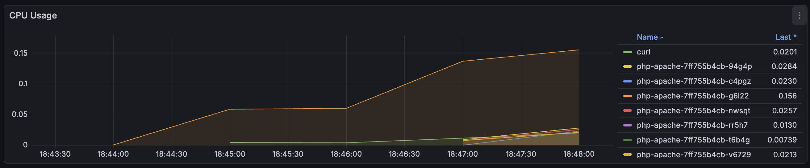

# 3주차 실습 내용
EKS Scaling

- [3주차 실습 내용](#3주차-실습-내용)
  - [0. init](#0-init)
    - [1. EKS 자격증명 설정](#1-eks-자격증명-설정)
    - [2. AWS LoadBalancer Controller 설치](#2-aws-loadbalancer-controller-설치)
    - [3. kube-prometheus-stack 설치](#3-kube-prometheus-stack-설치)
  - [1. EKS 관리형 노드 그룹](#1-eks-관리형-노드-그룹)
  - [2. HPA (Horizontal Pod Autoscaler)](#2-hpa-horizontal-pod-autoscaler)
  - [3. VPA (Vertical Pod Autoscaler)](#3-vpa-vertical-pod-autoscaler)
  - [4. KEDA (Kubernetes Event-driven Autoscaling)](#4-keda-kubernetes-event-driven-autoscaling)
  - [5. CPA - Cluster Proportional Autoscaler](#5-cpa---cluster-proportional-autoscaler)


## 0. init

terraform을 통해 eks를 먼저 배포하고, 이후 eks에 대해 아래 내용 세팅.

### 1. EKS 자격증명 설정
```bash
❯ aws eks --region ap-northeast-2 update-kubeconfig --name myeks
Added new context arn:aws:eks:ap-northeast-2:xxxxxx:cluster/myeks to /Users/jhmoon/.kube/config

❯ k config rename-context $(cat ~/.kube/config | grep current-context | awk '{print $2}') myeks
Context "arn:aws:eks:ap-northeast-2:xxxxxx:cluster/myeks" renamed to "myeks".

# k8s 1.35 버전 확인
❯ k get node -owide
NAME                                                STATUS   ROLES    AGE     VERSION               INTERNAL-IP      EXTERNAL-IP   OS-IMAGE                        KERNEL-VERSION                   CONTAINER-RUNTIME
ip-192-168-17-190.ap-northeast-2.compute.internal   Ready    <none>   3m13s   v1.35.2-eks-f69f56f   192.168.17.190   <none>        Amazon Linux 2023.10.20260302   6.12.73-95.123.amzn2023.x86_64   containerd://2.2.1+unknown
ip-192-168-22-117.ap-northeast-2.compute.internal   Ready    <none>   3m13s   v1.35.2-eks-f69f56f   192.168.22.117   <none>        Amazon Linux 2023.10.20260302   6.12.73-95.123.amzn2023.x86_64   containerd://2.2.1+unknown
```

### 2. AWS LoadBalancer Controller 설치
```bash
# Helm Chart Repository 추가
helm repo add eks https://aws.github.io/eks-charts
helm repo update

# Helm Chart - AWS Load Balancer Controller 설치 : EC2 Instance Profile(IAM Role)을 파드가 IMDS 통해 획득 가능.
helm install aws-load-balancer-controller eks/aws-load-balancer-controller -n kube-system --version 3.1.0 \
  --set clusterName=myeks

# 확인
❯ helm list -n kube-system
NAME                          NAMESPACE       REVISION        UPDATED                                 STATUS          CHART                                   APP VERSION
aws-load-balancer-controller    kube-system     1               2026-04-05 18:09:05.142546 +0900 KST    deployed        aws-load-balancer-controller-3.1.0      v3.1.0     

❯ k get pod -n kube-system -l app.kubernetes.io/name=aws-load-balancer-controller
NAME                                            READY   STATUS    RESTARTS   AGE
aws-load-balancer-controller-7c5488d4c6-j8lgz   0/1     Running   0          15s
aws-load-balancer-controller-7c5488d4c6-v9tvh   0/1     Running   0          15s
```

### 3. kube-prometheus-stack 설치
```bash
# repo 추가
helm repo add prometheus-community https://prometheus-community.github.io/helm-charts

# 배포
❯ helm install kube-prometheus-stack prometheus-community/kube-prometheus-stack --version 80.13.3 \
-f monitor-values.yaml --create-namespace --namespace monitoring

NAME: kube-prometheus-stack
LAST DEPLOYED: Sun Apr  5 18:10:01 2026
NAMESPACE: monitoring
STATUS: deployed
REVISION: 1
NOTES:
kube-prometheus-stack has been installed. Check its status by running:
  kubectl --namespace monitoring get pods -l "release=kube-prometheus-stack"
...
(이하 생략)
```

EKS 컨트롤 플레인 메트릭을 Prometheus 형식으로 가져오기.
```bash
# Metrics.eks.amazonaws.com의 컨트롤 플레인 지표 가져오기 : kube-scheduler , kube-controller-manager 지표
❯ k get --raw "/apis/metrics.eks.amazonaws.com/v1/ksh/container/metrics"
# HELP scheduler_pending_pods [STABLE] Number of pending pods, by the queue type. 'active' means number of pods in activeQ; 'backoff' means number of pods in backoffQ; 'unschedulable' means number of pods in unschedulablePods that the scheduler attempted to schedule and failed; 'gated' is the number of unschedulable pods that the scheduler never attempted to schedule because they are gated.
# TYPE scheduler_pending_pods gauge
scheduler_pending_pods{queue="active"} 0
scheduler_pending_pods{queue="backoff"} 0
scheduler_pending_pods{queue="gated"} 0
scheduler_pending_pods{queue="unschedulable"} 0
...

❯ k get --raw "/apis/metrics.eks.amazonaws.com/v1/kcm/container/metrics"
...
workqueue_work_duration_seconds_bucket{name="volumes",le="6"} 0
workqueue_work_duration_seconds_bucket{name="volumes",le="8"} 0
workqueue_work_duration_seconds_bucket{name="volumes",le="10"} 0
workqueue_work_duration_seconds_bucket{name="volumes",le="15"} 0
workqueue_work_duration_seconds_bucket{name="volumes",le="+Inf"} 0
workqueue_work_duration_seconds_sum{name="volumes"} 0
workqueue_work_duration_seconds_count{name="volumes"} 0

❯ k get svc,ep -n kube-system eks-extension-metrics-api
NAME                                TYPE        CLUSTER-IP      EXTERNAL-IP   PORT(S)   AGE
service/eks-extension-metrics-api   ClusterIP   10.100.103.46   <none>        443/TCP   12m

NAME                                  ENDPOINTS          AGE
endpoints/eks-extension-metrics-api   172.0.32.0:10443   12m

❯ k get apiservices |egrep '(AVAILABLE|metrics)'
NAME                              SERVICE                                 AVAILABLE   AGE
v1.metrics.eks.amazonaws.com      kube-system/eks-extension-metrics-api   True        12m
v1beta1.metrics.k8s.io            kube-system/metrics-server              True        7m20s


# 프로메테우스 파드 정보 확인
❯ k describe pod -n monitoring prometheus-kube-prometheus-stack-prometheus-0  | grep 'Service Account'
Service Account:  kube-prometheus-stack-prometheus

# 클러스터롤에 권한 추가
❯ k get clusterrole kube-prometheus-stack-prometheus
NAME                               CREATED AT
kube-prometheus-stack-prometheus   2026-04-05T09:10:28Z

    ~/De/g/aews-hands-on-2026/3-eks-scaling    main ?1 
❯ k patch clusterrole kube-prometheus-stack-prometheus --type=json -p='[
  {
    "op": "add",
    "path": "/rules/-",
    "value": {
      "verbs": ["get"],
      "apiGroups": ["metrics.eks.amazonaws.com"],
      "resources": ["kcm/metrics", "ksh/metrics"]
    }
  }
]'
clusterrole.rbac.authorization.k8s.io/kube-prometheus-stack-prometheus patched
```

이어서 그라파나 대시보드를 추가한다.
```bash
# 대시보드 다운로드
curl -O https://raw.githubusercontent.com/dotdc/grafana-dashboards-kubernetes/refs/heads/master/dashboards/k8s-system-api-server.json

# my-dashboard 컨피그맵 생성 : Grafana 포드 내의 사이드카 컨테이너가 grafana_dashboard="1" 라벨 탐지.
❯ k create configmap my-dashboard --from-file=k8s-system-api-server.json -n monitoring
configmap/my-dashboard created

❯ k label configmap my-dashboard grafana_dashboard="1" -n monitoring
configmap/my-dashboard labeled
```

## 1. EKS 관리형 노드 그룹

관리형 노드 그룹 `myeks-ng-1` 확인.

```bash
❯ k get nodes --label-columns eks.amazonaws.com/nodegroup,kubernetes.io/arch,eks.amazonaws.com/capacityType
NAME                                                STATUS   ROLES    AGE   VERSION               NODEGROUP    ARCH    CAPACITYTYPE
ip-192-168-17-190.ap-northeast-2.compute.internal   Ready    <none>   17m   v1.35.2-eks-f69f56f   myeks-ng-1   amd64   ON_DEMAND
ip-192-168-22-117.ap-northeast-2.compute.internal   Ready    <none>   17m   v1.35.2-eks-f69f56f   myeks-ng-1   amd64   ON_DEMAND

# 관리형 노드 그룹 확인
❯ eksctl get nodegroup --cluster myeks
CLUSTER        NODEGROUP       STATUS  CREATED                 MIN SIZE        MAX SIZE        DESIRED CAPACITY        INSTANCE TYPE   IMAGE ID                ASG NAME                                                TYPE
myeks   myeks-ng-1      ACTIVE  2026-04-05T09:03:59Z    1               4               2                       t3.medium       AL2023_x86_64_STANDARD  eks-myeks-ng-1-38ceae71-375d-cf94-861d-be781a04a95c     managed
```

AWS Graviton (ARM)으로 `myeks-ng-2` 노드그룹을 생성한다.

```bash
# terraform eks.tf에 관련된 주석 내용을 해제하고 추가 배포.
terraform apply

# 신규 노드 그룹 생성 확인
❯ k get nodes --label-columns eks.amazonaws.com/nodegroup,kubernetes.io/arch,eks.amazonaws.com/capacityType
NAME                                                STATUS   ROLES    AGE   VERSION               NODEGROUP    ARCH    CAPACITYTYPE
ip-192-168-17-190.ap-northeast-2.compute.internal   Ready    <none>   22m   v1.35.2-eks-f69f56f   myeks-ng-1   amd64   ON_DEMAND
ip-192-168-22-117.ap-northeast-2.compute.internal   Ready    <none>   22m   v1.35.2-eks-f69f56f   myeks-ng-1   amd64   ON_DEMAND
ip-192-168-23-91.ap-northeast-2.compute.internal    Ready    <none>   42s   v1.35.2-eks-f69f56f   myeks-ng-2   arm64   ON_DEMAND

❯ eksctl get nodegroup --cluster myeks
CLUSTER        NODEGROUP       STATUS  CREATED                 MIN SIZE        MAX SIZE        DESIRED CAPACITY        INSTANCE TYPE   IMAGE ID                ASG NAME                                                TYPE
myeks   myeks-ng-1      ACTIVE  2026-04-05T09:03:59Z    1               4               2                       t3.medium       AL2023_x86_64_STANDARD  eks-myeks-ng-1-38ceae71-375d-cf94-861d-be781a04a95c     managed
myeks   myeks-ng-2      ACTIVE  2026-04-05T09:25:57Z    1               1               1                       t4g.medium      AL2023_ARM_64_STANDARD  eks-myeks-ng-2-8aceae7b-436b-dc3d-ccd9-6d689ed36105     managed

❯ aws eks describe-nodegroup --cluster-name myeks --nodegroup-name myeks-ng-2 --output json | jq .nodegroup.taints

[
  {
    "key": "cpuarch",
    "value": "arm64",
    "effect": "NO_EXECUTE"
  }
]

# k8s 노드 정보 확인
❯ k get node -l kubernetes.io/arch=arm64
NAME                                               STATUS   ROLES    AGE    VERSION
ip-192-168-23-91.ap-northeast-2.compute.internal   Ready    <none>   119s   v1.35.2-eks-f69f56f

❯ k get node -l tier=secondary -owide
NAME                                               STATUS   ROLES    AGE    VERSION               INTERNAL-IP     EXTERNAL-IP   OS-IMAGE                        KERNEL-VERSION                    CONTAINER-RUNTIME
ip-192-168-23-91.ap-northeast-2.compute.internal   Ready    <none>   2m7s   v1.35.2-eks-f69f56f   192.168.23.91   <none>        Amazon Linux 2023.10.20260302   6.12.73-95.123.amzn2023.aarch64   containerd://2.2.1+unknown

❯ k describe node -l tier=secondary | grep -i taint
Taints:             cpuarch=arm64:NoExecute

# arm 인스턴스 접속 후 arch 확인
❯ aws ssm start-session --target i-023583466d5daaf30

Starting session with SessionId: root-ekp6rf9qs5arzcjxsndyvboavi
sh-5.2$ arch
aarch64
```

arm 노드에 샘플 파드를 배포하고 확인한다.
```bash
❯ k describe pod -l app=sample-app
...
Events:
  Type     Reason            Age   From               Message
  ----     ------            ----  ----               -------
  Warning  FailedScheduling  34s   default-scheduler  0/3 nodes are available: 1 node(s) had untolerated taint(s), 2 node(s) didn't match Pod's node affinity/selector. no new claims to deallocate, preemption: 0/3 nodes are available: 3 Preemption is not helpful for scheduling.

# manifest에 nodeSelector, tolerations 추가한 디에 다시 배포 후 확인.
❯ k get pod -l app=sample-app
NAME                          READY   STATUS    RESTARTS   AGE
sample-app-74559985fd-tv4w8   1/1     Running   0          41s

❯ k describe pod -l app=sample-app
Events:
  Type    Reason     Age   From               Message
  ----    ------     ----  ----               -------
  Normal  Scheduled  49s   default-scheduler  Successfully assigned default/sample-app-74559985fd-tv4w8 to ip-192-168-23-91.ap-northeast-2.compute.internal
  Normal  Pulling    48s   kubelet            Pulling image "nginx:alpine"
  Normal  Pulled     43s   kubelet            Successfully pulled image "nginx:alpine" in 5.257s (5.257s including waiting). Image size: 25839126 bytes.
  Normal  Created    43s   kubelet            Container created
  Normal  Started    43s   kubelet            Container started

# 삭제
❯ k delete -f arm-sample.yaml 
deployment.apps "sample-app" deleted
```

이어서, Spot Instance로 `myeks-ng-3` 노드그룹을 배포하자.
```bash
# terraform eks.tf에 관련된 주석 내용을 해제하고 추가 배포.
terraform apply

# 신규 노드 그룹 생성 확인
❯ k get nodes --label-columns eks.amazonaws.com/nodegroup,kubernetes.io/arch,eks.amazonaws.com/capacityType
NAME                                                STATUS   ROLES    AGE   VERSION               NODEGROUP    ARCH    CAPACITYTYPE
ip-192-168-17-190.ap-northeast-2.compute.internal   Ready    <none>   32m   v1.35.2-eks-f69f56f   myeks-ng-1   amd64   ON_DEMAND
ip-192-168-18-255.ap-northeast-2.compute.internal   Ready    <none>   41s   v1.35.2-eks-f69f56f   myeks-ng-3   amd64   SPOT
ip-192-168-22-117.ap-northeast-2.compute.internal   Ready    <none>   32m   v1.35.2-eks-f69f56f   myeks-ng-1   amd64   ON_DEMAND
ip-192-168-23-91.ap-northeast-2.compute.internal    Ready    <none>   10m   v1.35.2-eks-f69f56f   myeks-ng-2   arm64   ON_DEMAND

❯ k get nodes -L eks.amazonaws.com/capacityType
NAME                                                STATUS   ROLES    AGE   VERSION               CAPACITYTYPE
ip-192-168-17-190.ap-northeast-2.compute.internal   Ready    <none>   32m   v1.35.2-eks-f69f56f   ON_DEMAND
ip-192-168-18-255.ap-northeast-2.compute.internal   Ready    <none>   57s   v1.35.2-eks-f69f56f   SPOT
ip-192-168-22-117.ap-northeast-2.compute.internal   Ready    <none>   32m   v1.35.2-eks-f69f56f   ON_DEMAND
ip-192-168-23-91.ap-northeast-2.compute.internal    Ready    <none>   11m   v1.35.2-eks-f69f56f   ON_DEMAND

❯ eksctl get nodegroup --cluster myeks
CLUSTER        NODEGROUP       STATUS  CREATED                 MIN SIZE        MAX SIZE        DESIRED CAPACITY        INSTANCE TYPE                                   IMAGE ID                ASG NAME                                                TYPE
myeks   myeks-ng-1      ACTIVE  2026-04-05T09:03:59Z    1               4               2                       t3.medium                                       AL2023_x86_64_STANDARD  eks-myeks-ng-1-38ceae71-375d-cf94-861d-be781a04a95c     managed
myeks   myeks-ng-2      ACTIVE  2026-04-05T09:25:57Z    1               1               1                       t4g.medium                                      AL2023_ARM_64_STANDARD  eks-myeks-ng-2-8aceae7b-436b-dc3d-ccd9-6d689ed36105     managed
myeks   myeks-ng-3      ACTIVE  2026-04-05T09:36:05Z    1               1               1                       c5a.large,c6a.large,t3a.large,t3a.medium        AL2023_x86_64_STANDARD  eks-myeks-ng-3-32ceae7f-e9ce-adbe-cfc2-1c5474f0f7f2     managed

❯ aws eks describe-nodegroup --cluster-name myeks --nodegroup-name myeks-ng-3 --output json | jq .nodegroup.instanceTypes
[
  "c5a.large",
  "c6a.large",
  "t3a.large",
  "t3a.medium"
]

❯ k get node -l tier=third
NAME                                                STATUS   ROLES    AGE   VERSION
ip-192-168-18-255.ap-northeast-2.compute.internal   Ready    <none>   79s   v1.35.2-eks-f69f56f

❯ k get node -l eks.amazonaws.com/capacityType=SPOT
NAME                                                STATUS   ROLES    AGE   VERSION
ip-192-168-18-255.ap-northeast-2.compute.internal   Ready    <none>   86s   v1.35.2-eks-f69f56f

❯ k describe node -l eks.amazonaws.com/capacityType=SPOT
...
Events:
  Type    Reason          Age   From                   Message
  ----    ------          ----  ----                   -------
  Normal  Synced          96s   cloud-node-controller  Node synced successfully
  Normal  RegisteredNode  93s   node-controller        Node ip-192-168-18-255.ap-northeast-2.compute.internal event: Registered Node ip-192-168-18-255.ap-northeast-2.compute.internal in Controller

# 스팟 EC2 인스턴스 확인
❯ aws ec2 describe-instances \
  --filters "Name=instance-lifecycle,Values=spot" \
  --query "Reservations[].Instances[].{ID:InstanceId,Type:InstanceType,AZ:Placement.AvailabilityZone,State:State.Name}" \
  --output table
--------------------------------------------------------------------
|                         DescribeInstances                        |
+------------------+-----------------------+----------+------------+
|        AZ        |          ID           |  State   |   Type     |
+------------------+-----------------------+----------+------------+
|  ap-northeast-2b |  i-01efab76e749703ac  |  running |  c5a.large |
+------------------+-----------------------+----------+------------+

# 스팟 요청 확인 : Spot Instance Request
❯ aws ec2 describe-spot-instance-requests \
  --query "SpotInstanceRequests[].{ID:SpotInstanceRequestId,State:State,Type:Type,InstanceId:InstanceId}" \
  --output table
---------------------------------------------------------------
|                DescribeSpotInstanceRequests                 |
+---------------+-----------------------+---------+-----------+
|      ID       |      InstanceId       |  State  |   Type    |
+---------------+-----------------------+---------+-----------+
|  sir-ijc7c6dp |  i-01efab76e749703ac  |  active |  one-time |
+---------------+-----------------------+---------+-----------+

# Spot 가격 조회
aws ec2 describe-spot-price-history \
  --instance-types c6a.large c5a.large \
  --product-descriptions "Linux/UNIX" \
  --max-items 100 \
  --query "SpotPriceHistory[].{Type:InstanceType,Price:SpotPrice,AZ:AvailabilityZone,Time:Timestamp}" \
  --output table
```

Spot Instance 노드그룹에 샘플 워크로드를 배포해보자.
```bash
❯ k apply -f spot-sample.yaml
pod/busybox created

# 파드가 배포된 노드 정보 확인
❯ k get pod -owide
NAME      READY   STATUS    RESTARTS   AGE   IP              NODE                                                NOMINATED NODE   READINESS GATES
busybox   1/1     Running   0          41s    192.168.17.96   ip-192-168-18-255.ap-northeast-2.compute.internal   <none>           <none>

# 삭제
❯ k delete pod busybox
pod "busybox" deleted
```

## 2. HPA (Horizontal Pod Autoscaler)

샘플 워크로드를 배포해서 확인한다.
```bash
kubectl apply -f hpa-sample.yaml

# 확인
kubectl exec -it deploy/php-apache -- cat /var/www/html/index.php

# HPA Manifest는 아래와 같음.
apiVersion: autoscaling/v2
kind: HorizontalPodAutoscaler
metadata:
  name: php-apache
spec:
  scaleTargetRef:
    apiVersion: apps/v1
    kind: Deployment
    name: php-apache
  minReplicas: 1
  maxReplicas: 10
  metrics:
  - type: Resource
    resource:
      name: cpu
      target:
        averageUtilization: 50
        type: Utilization
---

# curl Pod에서 반복 호출해서 HPA를 트리거 시키자.
❯ k exec curl -- sh -c 'while true; do curl -s php-apache; sleep 0.01; done'
OK!OK!OK!OK!OK!OK!OK!OK!OK!OK!OK!OK!OK!...

# 확인
❯ k describe hpa
Name:                                                  php-apache
Namespace:                                             default
Labels:                                                <none>
Annotations:                                           <none>
CreationTimestamp:                                     Sun, 05 Apr 2026 18:44:40 +0900
Reference:                                             Deployment/php-apache
Metrics:                                               ( current / target )
  resource cpu on pods  (as a percentage of request):  0% (1m) / 50%
Min replicas:                                          1
Max replicas:                                          10
Deployment pods:                                       1 current / 1 desired
Conditions:
  Type            Status  Reason               Message
  ----            ------  ------               -------
  AbleToScale     True    ScaleDownStabilized  recent recommendations were higher than current one, applying the highest recent recommendation
  ScalingActive   True    ValidMetricFound     the HPA was able to successfully calculate a replica count from cpu resource utilization (percentage of request)
  ScalingLimited  False   DesiredWithinRange   the desired count is within the acceptable range
Events:           <none>

❯ k get po                                         
NAME                          READY   STATUS    RESTARTS   AGE
curl                          1/1     Running   0          2m44s
php-apache-7ff755b4cb-94g4p   1/1     Running   0          20s
php-apache-7ff755b4cb-c4pgz   1/1     Running   0          5s
php-apache-7ff755b4cb-g6l22   1/1     Running   0          3m52s
php-apache-7ff755b4cb-nwsqt   1/1     Running   0          20s
php-apache-7ff755b4cb-v6729   1/1     Running   0          5s

❯ k get po
NAME                          READY   STATUS    RESTARTS   AGE
curl                          1/1     Running   0          5m7s
php-apache-7ff755b4cb-94g4p   1/1     Running   0          2m43s
php-apache-7ff755b4cb-c4pgz   1/1     Running   0          2m28s
php-apache-7ff755b4cb-g6l22   1/1     Running   0          6m15s
php-apache-7ff755b4cb-nwsqt   1/1     Running   0          2m43s
php-apache-7ff755b4cb-rr5h7   1/1     Running   0          118s
php-apache-7ff755b4cb-t6b4g   1/1     Running   0          118s
php-apache-7ff755b4cb-v6729   1/1     Running   0          2m28s
php-apache-7ff755b4cb-xttc9   1/1     Running   0          118s
```

CPU 사용량에 따라 `php-apache` Pod 대수가 증가하고 있다.



## 3. VPA (Vertical Pod Autoscaler)

VPA를 설치한다.

```bash
# CRD 설치 - feat: CPU startup boost in master (#9141)
❯ k apply -f https://raw.githubusercontent.com/kubernetes/autoscaler/refs/heads/master/vertical-pod-autoscaler/deploy/vpa-v1-crd-gen.yaml
customresourcedefinition.apiextensions.k8s.io/verticalpodautoscalercheckpoints.autoscaling.k8s.io created
customresourcedefinition.apiextensions.k8s.io/verticalpodautoscalers.autoscaling.k8s.io created

# RBAC 설치 - VPA: Update vpa-rbac.yaml for allowing in place resize requests
❯ k apply -f https://raw.githubusercontent.com/kubernetes/autoscaler/refs/heads/master/vertical-pod-autoscaler/deploy/vpa-rbac.yaml
clusterrole.rbac.authorization.k8s.io/system:metrics-reader created
clusterrole.rbac.authorization.k8s.io/system:vpa-actor created
clusterrole.rbac.authorization.k8s.io/system:vpa-status-actor created
clusterrole.rbac.authorization.k8s.io/system:vpa-checkpoint-actor created
clusterrole.rbac.authorization.k8s.io/system:evictioner created
clusterrole.rbac.authorization.k8s.io/system:vpa-updater-in-place created
clusterrolebinding.rbac.authorization.k8s.io/system:vpa-updater-in-place-binding created
clusterrolebinding.rbac.authorization.k8s.io/system:metrics-reader created
clusterrolebinding.rbac.authorization.k8s.io/system:vpa-actor created
clusterrolebinding.rbac.authorization.k8s.io/system:vpa-status-actor created
clusterrolebinding.rbac.authorization.k8s.io/system:vpa-checkpoint-actor created
clusterrole.rbac.authorization.k8s.io/system:vpa-target-reader created
clusterrolebinding.rbac.authorization.k8s.io/system:vpa-target-reader-binding created
clusterrolebinding.rbac.authorization.k8s.io/system:vpa-evictioner-binding created
serviceaccount/vpa-admission-controller created
serviceaccount/vpa-recommender created
serviceaccount/vpa-updater created
clusterrole.rbac.authorization.k8s.io/system:vpa-admission-controller created
clusterrolebinding.rbac.authorization.k8s.io/system:vpa-admission-controller created
clusterrole.rbac.authorization.k8s.io/system:vpa-status-reader created
clusterrolebinding.rbac.authorization.k8s.io/system:vpa-status-reader-binding created
role.rbac.authorization.k8s.io/system:leader-locking-vpa-updater created
rolebinding.rbac.authorization.k8s.io/system:leader-locking-vpa-updater created
role.rbac.authorization.k8s.io/system:leader-locking-vpa-recommender created
rolebinding.rbac.authorization.k8s.io/system:leader-locking-vpa-recommender created

# 코드 다운로드 & 예제 실행
git clone https://github.com/kubernetes/autoscaler.git
cd ~/autoscaler/vertical-pod-autoscaler/

❯ tree hack 
hack
├── api-docs
│   └── config.yaml
├── boilerplate.go.txt
├── convert-alpha-objects.sh
├── deploy-for-e2e-locally.sh
├── deploy-for-e2e.sh
├── dev-deploy-locally.sh
├── e2e
│   ├── Dockerfile.externalmetrics-writer
│   ├── metrics-pump.yaml
│   ├── prometheus-adapter.yaml
│   ├── prometheus.yaml
│   ├── recommender-externalmetrics-deployment.yaml
│   ├── values-e2e-local.yaml
│   └── values-external-metrics.yaml
├── emit-metrics.py
├── generate-api-docs.sh
├── generate-crd-yaml.sh
├── generate-flags.sh
├── lib
│   └── util.sh
├── local-cluster.md
├── run-e2e-locally.sh
├── run-e2e-tests.sh
├── run-e2e.sh
├── run-integration-locally.sh
├── tag-release.sh
├── tools
│   └── kube-api-linter
├── tools.go
├── update-codegen.sh
├── update-kubernetes-deps-in-e2e.sh
├── update-kubernetes-deps.sh
├── update-toc.sh
├── verify-all.sh
├── verify-api-docs.sh
├── verify-codegen.sh
├── verify-crd.sh
├── verify-deadcode-elimination.sh
├── verify-kube-api-linter.sh
├── verify-toc.sh
├── verify-vpa-flags.sh
├── vpa-apply-upgrade.sh
├── vpa-down.sh
├── vpa-process-yaml.sh
├── vpa-process-yamls.sh
├── vpa-up.sh
└── warn-obsolete-vpa-objects.sh

6 directories, 43 files

# Deploy the Vertical Pod Autoscaler to your cluster with the following command.
watch -d kubectl get pod -n kube-system
cat hack/vpa-up.sh
❯ ./hack/vpa-up.sh
HEAD is now at 9196162ba Update VPA default version to 1.6.0
customresourcedefinition.apiextensions.k8s.io/verticalpodautoscalercheckpoints.autoscaling.k8s.io unchanged
customresourcedefinition.apiextensions.k8s.io/verticalpodautoscalers.autoscaling.k8s.io configured
clusterrole.rbac.authorization.k8s.io/system:metrics-reader unchanged
clusterrole.rbac.authorization.k8s.io/system:vpa-actor unchanged
clusterrole.rbac.authorization.k8s.io/system:vpa-status-actor unchanged
clusterrole.rbac.authorization.k8s.io/system:vpa-checkpoint-actor unchanged
clusterrole.rbac.authorization.k8s.io/system:evictioner unchanged
clusterrole.rbac.authorization.k8s.io/system:vpa-updater-in-place unchanged
clusterrolebinding.rbac.authorization.k8s.io/system:vpa-updater-in-place-binding unchanged
clusterrolebinding.rbac.authorization.k8s.io/system:metrics-reader unchanged
clusterrolebinding.rbac.authorization.k8s.io/system:vpa-actor unchanged
clusterrolebinding.rbac.authorization.k8s.io/system:vpa-status-actor unchanged
clusterrolebinding.rbac.authorization.k8s.io/system:vpa-checkpoint-actor unchanged
clusterrole.rbac.authorization.k8s.io/system:vpa-target-reader unchanged
clusterrolebinding.rbac.authorization.k8s.io/system:vpa-target-reader-binding unchanged
clusterrolebinding.rbac.authorization.k8s.io/system:vpa-evictioner-binding unchanged
serviceaccount/vpa-admission-controller unchanged
serviceaccount/vpa-recommender unchanged
serviceaccount/vpa-updater unchanged
clusterrole.rbac.authorization.k8s.io/system:vpa-admission-controller unchanged
clusterrolebinding.rbac.authorization.k8s.io/system:vpa-admission-controller unchanged
clusterrole.rbac.authorization.k8s.io/system:vpa-status-reader unchanged
clusterrolebinding.rbac.authorization.k8s.io/system:vpa-status-reader-binding unchanged
role.rbac.authorization.k8s.io/system:leader-locking-vpa-updater unchanged
rolebinding.rbac.authorization.k8s.io/system:leader-locking-vpa-updater unchanged
role.rbac.authorization.k8s.io/system:leader-locking-vpa-recommender unchanged
rolebinding.rbac.authorization.k8s.io/system:leader-locking-vpa-recommender unchanged
deployment.apps/vpa-updater created
deployment.apps/vpa-recommender created
Generating certs for the VPA Admission Controller in /tmp/vpa-certs.
Certificate request self-signature ok
subject=CN=vpa-webhook.kube-system.svc
Uploading certs to the cluster.
secret/vpa-tls-certs created
Deleting /tmp/vpa-certs.
service/vpa-webhook created
deployment.apps/vpa-admission-controller created
service/vpa-webhook unchanged

❯ k get crd | grep autoscaling
verticalpodautoscalercheckpoints.autoscaling.k8s.io   2026-04-05T09:50:40Z
verticalpodautoscalers.autoscaling.k8s.io             2026-04-05T09:50:40Z

❯ k get mutatingwebhookconfigurations vpa-webhook-config -o json | jq
{
  "apiVersion": "admissionregistration.k8s.io/v1",
  "kind": "MutatingWebhookConfiguration",
  "metadata": {
    "creationTimestamp": "2026-04-05T09:54:53Z",
    "generation": 1,
    "name": "vpa-webhook-config",
    "resourceVersion": "12321",
    "uid": "66b633ae-76dc-424e-935b-ecba81096207"
  },
  "webhooks": [
    {
      "admissionReviewVersions": [
        "v1"
      ],
      "clientConfig": {
        "caBundle": "...",
        "service": {
          "name": "vpa-webhook",
          "namespace": "kube-system",
          "port": 443
        }
      },
      "failurePolicy": "Ignore",
      "matchPolicy": "Equivalent",
      "name": "vpa.k8s.io",
      "namespaceSelector": {
        "matchExpressions": [
          {
            "key": "kubernetes.io/metadata.name",
            "operator": "NotIn",
            "values": [
              ""
            ]
          }
        ]
      },
      "objectSelector": {},
      "reinvocationPolicy": "Never",
      "rules": [
        {
          "apiGroups": [
            ""
          ],
          "apiVersions": [
            "v1"
          ],
          "operations": [
            "CREATE"
          ],
          "resources": [
            "pods"
          ],
          "scope": "*"
        },
        {
          "apiGroups": [
            "autoscaling.k8s.io"
          ],
          "apiVersions": [
            "*"
          ],
          "operations": [
            "CREATE",
            "UPDATE"
          ],
          "resources": [
            "verticalpodautoscalers"
          ],
          "scope": "*"
        }
      ],
      "sideEffects": "None",
      "timeoutSeconds": 30
    }
  ]
}
```

공식 예제를 실행해보자.
```bash
# 공식 예제 배포
cd ~/autoscaler/vertical-pod-autoscaler/
cat examples/hamster.yaml
kubectl apply -f examples/hamster.yaml && kubectl get vpa -w

# 파드 리소스 Requestes 확인
❯ k describe pod | grep Requests: -A2
    Requests:
      cpu:        100m
      memory:     50Mi
--
    Requests:
      cpu:        587m
      memory:     250Mi
--
    Requests:
      cpu:        587m
      memory:     250Mi
--
    Requests:
      cpu:        200m
    Environment:  <none>

# VPA에 의해 기존 파드 삭제되고 신규 파드가 생성됨
❯ k get events --sort-by=".metadata.creationTimestamp" | grep VPA
2m10s       Normal    EvictedByVPA              pod/hamster-7996dbb57-x2jsx                              Pod was evicted by VPA Updater to apply resource recommendation.
2m10s       Normal    EvictedPod                verticalpodautoscaler/hamster-vpa                        VPA Updater evicted Pod hamster-7996dbb57-x2jsx to apply resource recommendation.
70s         Normal    EvictedByVPA              pod/hamster-7996dbb57-5xmcq                              Pod was evicted by VPA Updater to apply resource recommendation.
70s         Normal    EvictedPod                verticalpodautoscaler/hamster-vpa                        VPA Updater evicted Pod hamster-7996dbb57-5xmcq to apply resource recommendation.

# 실습 내용 삭제.
❯ k delete -f examples/hamster.yaml && cd ~/autoscaler/vertical-pod-autoscaler/ && ./hack/vpa-down.sh
```

## 4. KEDA (Kubernetes Event-driven Autoscaling)

KEDA를 설치하고, 예시 워크로드로 기능을 확인해본다.

```bash
# 설치 전 기존 metrics-server 제공 Metris API 확인
❯ k get --raw "/apis/metrics.k8s.io" -v=6 | jq
I0405 19:03:23.524498   79225 loader.go:395] Config loaded from file:  /Users/jhmoon/.kube/config
I0405 19:03:24.772828   79225 round_trippers.go:553] GET https://66C2FB2E93B59F721EC12A14DF8D128B.gr7.ap-northeast-2.eks.amazonaws.com/apis/metrics.k8s.io 200 OK in 1245 milliseconds
{
  "kind": "APIGroup",
  "apiVersion": "v1",
  "name": "metrics.k8s.io",
  "versions": [
    {
      "groupVersion": "metrics.k8s.io/v1beta1",
      "version": "v1beta1"
    }
  ],
  "preferredVersion": {
    "groupVersion": "metrics.k8s.io/v1beta1",
    "version": "v1beta1"
  }
}

❯ k get --raw "/apis/metrics.k8s.io" | jq
{
  "kind": "APIGroup",
  "apiVersion": "v1",
  "name": "metrics.k8s.io",
  "versions": [
    {
      "groupVersion": "metrics.k8s.io/v1beta1",
      "version": "v1beta1"
    }
  ],
  "preferredVersion": {
    "groupVersion": "metrics.k8s.io/v1beta1",
    "version": "v1beta1"
  }
}

helm repo add kedacore https://kedacore.github.io/charts
helm repo update
❯ helm install keda kedacore/keda --version 2.16.0 --namespace keda --create-namespace -f keda-values.yaml
NAME: keda
LAST DEPLOYED: Sun Apr  5 19:04:25 2026
NAMESPACE: keda
STATUS: deployed
REVISION: 1
...

# KEDA 설치 확인
❯ k get crd | grep keda
cloudeventsources.eventing.keda.sh              2026-04-05T10:04:29Z
clustercloudeventsources.eventing.keda.sh       2026-04-05T10:04:29Z
clustertriggerauthentications.keda.sh           2026-04-05T10:04:29Z
scaledjobs.keda.sh                              2026-04-05T10:04:30Z
scaledobjects.keda.sh                           2026-04-05T10:04:29Z
triggerauthentications.keda.sh                  2026-04-05T10:04:29Z

❯ k get all -n keda
NAME                                                   READY   STATUS    RESTARTS      AGE
pod/keda-admission-webhooks-56b6b85c57-rk49j           0/1     Running   0             25s
pod/keda-operator-5c65c9c598-4j829                     0/1     Running   1 (18s ago)   25s
pod/keda-operator-metrics-apiserver-554cb87754-4xqps   1/1     Running   0             25s

NAME                                      TYPE        CLUSTER-IP       EXTERNAL-IP   PORT(S)             AGE
service/keda-admission-webhooks           ClusterIP   10.100.118.222   <none>        443/TCP,8020/TCP    26s
service/keda-operator                     ClusterIP   10.100.162.36    <none>        9666/TCP,8080/TCP   26s
service/keda-operator-metrics-apiserver   ClusterIP   10.100.27.57     <none>        443/TCP,9022/TCP    26s

NAME                                              READY   UP-TO-DATE   AVAILABLE   AGE
deployment.apps/keda-admission-webhooks           0/1     1            0           26s
deployment.apps/keda-operator                     0/1     1            0           26s
deployment.apps/keda-operator-metrics-apiserver   1/1     1            1           26s

NAME                                                         DESIRED   CURRENT   READY   AGE
replicaset.apps/keda-admission-webhooks-56b6b85c57           1         1         0       26s
replicaset.apps/keda-operator-5c65c9c598                     1         1         0       25s
replicaset.apps/keda-operator-metrics-apiserver-554cb87754   1         1         1       25s

❯ k get validatingwebhookconfigurations keda-admission -o yaml
apiVersion: admissionregistration.k8s.io/v1
kind: ValidatingWebhookConfiguration
metadata:
  annotations:
    meta.helm.sh/release-name: keda
    meta.helm.sh/release-namespace: keda
  creationTimestamp: "2026-04-05T10:04:31Z"
  generation: 2
  labels:
    app.kubernetes.io/component: operator
    app.kubernetes.io/instance: keda
    app.kubernetes.io/managed-by: Helm
    app.kubernetes.io/name: keda-admission-webhooks
    app.kubernetes.io/part-of: keda-operator
    app.kubernetes.io/version: 2.16.0
    helm.sh/chart: keda-2.16.0
  name: keda-admission
  resourceVersion: "14739"
  uid: e962f53c-e5a7-4c42-b568-bf28ecc1dc4d
webhooks:
- admissionReviewVersions:
  - v1
  clientConfig:
    caBundle: ...
    service:
      name: keda-admission-webhooks
      namespace: keda
      path: /validate-keda-sh-v1alpha1-scaledobject
      port: 443
  failurePolicy: Ignore
  matchPolicy: Equivalent
  name: vscaledobject.kb.io
  namespaceSelector: {}
  objectSelector: {}
  rules:
  - apiGroups:
    - keda.sh
    apiVersions:
    - v1alpha1
    operations:
    - CREATE
    - UPDATE
    resources:
    - scaledobjects
    scope: '*'
  sideEffects: None
  timeoutSeconds: 10
- admissionReviewVersions:
  - v1
  clientConfig:
    caBundle: ...
    service:
      name: keda-admission-webhooks
      namespace: keda
      path: /validate-keda-sh-v1alpha1-triggerauthentication
      port: 443
  failurePolicy: Ignore
  matchPolicy: Equivalent
  name: vstriggerauthentication.kb.io
  namespaceSelector: {}
  objectSelector: {}
  rules:
  - apiGroups:
    - keda.sh
    apiVersions:
    - v1alpha1
    operations:
    - CREATE
    - UPDATE
    resources:
    - triggerauthentications
    scope: '*'
  sideEffects: None
  timeoutSeconds: 10
- admissionReviewVersions:
  - v1
  clientConfig:
    caBundle: ...
    service:
      name: keda-admission-webhooks
      namespace: keda
      path: /validate-keda-sh-v1alpha1-clustertriggerauthentication
      port: 443
  failurePolicy: Ignore
  matchPolicy: Equivalent
  name: vsclustertriggerauthentication.kb.io
  namespaceSelector: {}
  objectSelector: {}
  rules:
  - apiGroups:
    - keda.sh
    apiVersions:
    - v1alpha1
    operations:
    - CREATE
    - UPDATE
    resources:
    - clustertriggerauthentications
    scope: '*'
  sideEffects: None
  timeoutSeconds: 10

❯ k get podmonitor,servicemonitors -n keda
NAME                                                                   AGE
servicemonitor.monitoring.coreos.com/keda-admission-webhooks           59s
servicemonitor.monitoring.coreos.com/keda-operator                     59s
servicemonitor.monitoring.coreos.com/keda-operator-metrics-apiserver   59s

❯ k get apiservice v1beta1.external.metrics.k8s.io -o yaml
apiVersion: apiregistration.k8s.io/v1
kind: APIService
metadata:
  annotations:
    meta.helm.sh/release-name: keda
    meta.helm.sh/release-namespace: keda
  creationTimestamp: "2026-04-05T10:04:31Z"
  labels:
    app.kubernetes.io/component: operator
    app.kubernetes.io/instance: keda
    app.kubernetes.io/managed-by: Helm
    app.kubernetes.io/name: v1beta1.external.metrics.k8s.io
    app.kubernetes.io/part-of: keda-operator
    app.kubernetes.io/version: 2.16.0
    helm.sh/chart: keda-2.16.0
  name: v1beta1.external.metrics.k8s.io
  resourceVersion: "14740"
  uid: c5a7d4cf-95da-4957-8dbe-7d8729c38809
spec:
  caBundle: ...
  group: external.metrics.k8s.io
  groupPriorityMinimum: 100
  service:
    name: keda-operator-metrics-apiserver
    namespace: keda
    port: 443
  version: v1beta1
  versionPriority: 100
status:
  conditions:
  - lastTransitionTime: "2026-04-05T10:04:51Z"
    message: all checks passed
    reason: Passed
    status: "True"
    type: Available

# CPU/Mem은 기존 metrics-server 의존하여, KEDA metrics-server는 외부 이벤트 소스(Scaler) 메트릭을 노출 
## https://keda.sh/docs/2.16/operate/metrics-server/
❯ k get pod -n keda -l app=keda-operator-metrics-apiserver
NAME                                               READY   STATUS    RESTARTS   AGE
keda-operator-metrics-apiserver-554cb87754-4xqps   1/1     Running   0          89s

# Querying metrics exposed by KEDA Metrics Server
❯ k get --raw "/apis/external.metrics.k8s.io/v1beta1" | jq
{
  "kind": "APIResourceList",
  "apiVersion": "v1",
  "groupVersion": "external.metrics.k8s.io/v1beta1",
  "resources": [
    {
      "name": "externalmetrics",
      "singularName": "",
      "namespaced": true,
      "kind": "ExternalMetricValueList",
      "verbs": [
        "get"
      ]
    }
  ]
}

# keda 네임스페이스에 디플로이먼트 생성
❯ k apply -f keda-sample.yaml -n keda
deployment.apps/php-apache created
service/php-apache created

❯ k get pod -n keda
NAME                                               READY   STATUS    RESTARTS        AGE
keda-admission-webhooks-56b6b85c57-rk49j           1/1     Running   0               3m37s
keda-operator-5c65c9c598-4j829                     1/1     Running   1 (3m30s ago)   3m37s
keda-operator-metrics-apiserver-554cb87754-4xqps   1/1     Running   0               3m37s
php-apache-7ff755b4cb-2pbfw                        1/1     Running   0               8s

# ScaledObject 생성 후 확인 (cron)
❯ k apply -f keda-sample.yaml -n keda
deployment.apps/php-apache unchanged
service/php-apache unchanged
scaledobject.keda.sh/php-apache-cron-scaled created

# 확인
❯ k get ScaledObject,hpa,pod -n keda
NAME                                          SCALETARGETKIND      SCALETARGETNAME   MIN   MAX   READY   ACTIVE   FALLBACK   PAUSED    TRIGGERS   AUTHENTICATIONS   AGE
scaledobject.keda.sh/php-apache-cron-scaled   apps/v1.Deployment   php-apache        0     2     True    False    False      Unknown                                32s

NAME                                                                  REFERENCE               TARGETS             MINPODS   MAXPODS   REPLICAS   AGE
horizontalpodautoscaler.autoscaling/keda-hpa-php-apache-cron-scaled   Deployment/php-apache   <unknown>/1 (avg)   1         2         0          32s

NAME                                                   READY   STATUS    RESTARTS        AGE
pod/keda-admission-webhooks-56b6b85c57-rk49j           1/1     Running   0               4m48s
pod/keda-operator-5c65c9c598-4j829                     1/1     Running   1 (4m41s ago)   4m48s
pod/keda-operator-metrics-apiserver-554cb87754-4xqps   1/1     Running   0               4m48s


❯ k get hpa -o jsonpath="{.items[0].spec}" -n keda | jq
{
  "maxReplicas": 2,
  "metrics": [
    {
      "external": {
        "metric": {
          "name": "s0-cron-Asia-Seoul-00,15,30,45xxxx-05,20,35,50xxxx",
          "selector": {
            "matchLabels": {
              "scaledobject.keda.sh/name": "php-apache-cron-scaled"
            }
          }
        },
        "target": {
          "averageValue": "1",
          "type": "AverageValue"
        }
      },
      "type": "External"
    }
  ],
  "minReplicas": 1,
  "scaleTargetRef": {
    "apiVersion": "apps/v1",
    "kind": "Deployment",
    "name": "php-apache"
  }
}
```

## 5. CPA - Cluster Proportional Autoscaler

```bash
# 먼저 CPA 타겟이 필요하기에, 샘플 워크로드부터 배포한다.
❯ k apply -f cpa-sample.yaml 
deployment.apps/nginx-deployment created

#
helm repo add cluster-proportional-autoscaler https://kubernetes-sigs.github.io/cluster-proportional-autoscaler

# CPA규칙을 설정하고 helm차트를 릴리즈!
❯ helm install cluster-proportional-autoscaler cluster-proportional-autoscaler/cluster-proportional-autoscaler -f cpa-values.yaml
NAME: cluster-proportional-autoscaler
LAST DEPLOYED: Sun Apr  5 20:34:36 2026
NAMESPACE: default
STATUS: deployed
REVISION: 1
TEST SUITE: None

# 설정한 config 내용과 동일하게 Pod 대수가 추가되어 있다.
❯ k get po
NAME                                               READY   STATUS      RESTARTS   AGE
cluster-proportional-autoscaler-666c74d788-99kft   1/1     Running     0          2m12s
nginx-deployment-57f959d4d7-56h5g                  1/1     Running     0          2m9s
nginx-deployment-57f959d4d7-b47g9                  1/1     Running     0          2m9s
nginx-deployment-57f959d4d7-gt8cz                  1/1     Running     0          2m9s
nginx-deployment-57f959d4d7-k9plb                  1/1     Running     0          3m6s
nginx-deployment-57f959d4d7-tjlng                  1/1     Running     0          2m9s
```
