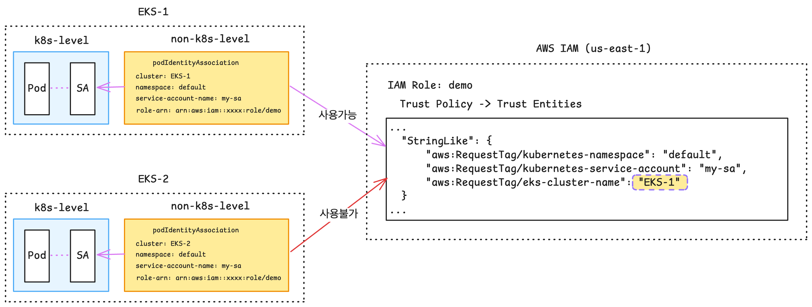

# EKS Pod Identity vs IRSA

## 1. 개요

### EKS Pod Identity 특징
- OIDC Provider 불필요
- IAM 역할 간 **권한 정책 재사용** 및 **여러 EKS 클러스터에서 IAM 역할을 재사용**한다.
  - 동일한 어플리케이션이 여러 클러스터에 있는 경우, 역할의 신뢰 정책을 수정하지 않고도 각 클러스터에서 동일한 연결을 설정할 수 있다.
  - ex: eks cluster blue/green으로 버전업 위해 신규 클러스터를 생성할 때, 기존 role 재활용 가능. (OIDC 기반 IRSA는 매번 별도 role로 나눠야 함.)
- eks addon으로 배포 가능, 해당 파드는 `hostNetwork` 필요함.
- 일치하는 태그를 기반으로, AWS 리소스에 대한 액세스를 허용할 수 있다.

### EKS Pod Identity 설치 및 사용 과정
1. Amazon EKS Pod Identity Agent 추가 기능을 설치
2. 필요한 권한을 가진 IAM 역할을 생성하고, `pods.eks.amazonaws.com` 신뢰 정책에서 서비스 주체로 지정.
3. 역할을 서비스 계정에 직접 매핑한다.


## 2. Pod Identity vs IRSA 상세 비교

역할 확장성
- Pod Identity:
  - 새로운 클러스터가 추가될 때마다, 역할의 신뢰 정책을 새로 업데이트할 필요 x.
  - 신뢰 정책에서 IAM 역할과 서비스 계정 간의 신뢰 관계를 정의할 필요 x.
- IRSA:
  - 새로운 EKS 클러스터 OIDC 공급자 엔드포인트를 사용하여, 역할의 신뢰 정책을 업데이트 필요.
  - 신뢰 정책에서 IAM 역할과 서비스 계정 간의 신뢰 관계를 정의해야 한다. 신뢰 정책 크기 제한으로 인해, 단일 신뢰 정책 내에는 최대 8개의 신뢰 관계만 정의할 수 있다.

클러스터 확장성
- Pod Identity: IAM OIDC 공급자를 설정할 필요 x.
- IRSA: IAM OIDC 공급자를 설정해야 한다. AWS 계정의 기본 전역 OIDC 공급자 제한(100개)가 적용된다.

역할 재사용성
- Pod Identity: Pod Identity에서 제공하는 AWS STS 임시 자격 증명에는 클러스터 이름/네임스페이스/서비스어카운트 이름 같은 역할 세션 태그가 포함됨.
- IRSA: AWS STS 세션 태그 지원 x. 클러스터 간에 역할 재사용은 가능하나, 모든 Pod는 해당 역할의 모든 권한을 부여받음.

지원 환경
- Pod Identity: Amazon EKS에서만 사용 가능.
- IRSA: EKS 외에도 일단은 가능하다...

### IAM 리소스 기준 비교

기준 예시
- 공통 권한 정책: S3 버킷 목록 조회 권한 `s3:ListAllMyBuckets`
- Pod Identity 서비스어카운트: `default/pod-identity-demo`
- IRSA 서비스어카운트: `default/irsa-demo`

요약
| 항목 | Pod Identity | IRSA |
| --- | --- | --- |
| 공통 권한 정책 | `aws_iam_policy` | `aws_iam_policy` |
| IAM Role | 생성 | 생성 |
| IAM Role trust principal | `Service: pods.eks.amazonaws.com` | `Federated: <OIDC provider ARN>` |
| STS Action | `sts:AssumeRole`, `sts:TagSession` | `sts:AssumeRoleWithWebIdentity` |
| trust policy에 서비스어카운트 직접 명시 | 없음 | 있음 (`sub`) |
| OIDC Provider 필요 여부 | 불필요 | 필요 |
| 서비스어카운트 연결 방식 | `aws_eks_pod_identity_association` | ServiceAccount annotation |
| 멀티 클러스터 role 재사용 | 상대적으로 쉬움 | trust policy 확장 필요 |

#### 공통으로 생성되는 IAM 리소스

두 방식 모두 실제 AWS 권한은 동일한 IAM Policy에 담을 수 있다.
- 권한 정책 자체는 Pod Identity와 IRSA가 동일하게 재사용 가능하다.
- 차이는 IAM Role의 trust policy와 Kubernetes 서비스어카운트 연결 방식에서 발생한다.

```json
{
  "Version": "2012-10-17",
  "Statement": [
    {
      "Sid": "ListBuckets",
      "Effect": "Allow",
      "Action": ["s3:ListAllMyBuckets"],
      "Resource": "*"
    }
  ]
}
```

#### Pod Identity에서 생성되는 IAM 리소스

Trust policy 특징
- OIDC provider를 신뢰하지 않는다.
- AWS 서비스 Principal `pods.eks.amazonaws.com` 를 신뢰한다.
- `sts:AssumeRole` 과 `sts:TagSession` 을 허용한다.

```json
{
  "Version": "2012-10-17",
  "Statement": [
    {
      "Effect": "Allow",
      "Principal": {
        "Service": "pods.eks.amazonaws.com"
      },
      "Action": [
        "sts:AssumeRole",
        "sts:TagSession"
      ]
    }
  ]
}
```

연결 방식
- IAM 리소스 외에 `aws_eks_pod_identity_association` 이 생성된다.
- 이 `association` 리소스가 `cluster + namespace + service account + role arn` 을 연결한다.
- 즉, 서비스어카운트 식별 정보가 IAM Role trust policy 안에 직접 들어가지 않는다.

정리
- IAM 관점에서 Pod Identity는 trust policy가 단순하다.
- 같은 IAM Role을 여러 EKS 클러스터에서 재사용하기 쉽다.
- 클러스터가 늘어나도 role trust policy를 다시 수정할 필요가 없다.

#### IRSA에서 생성되는 IAM 리소스

전제 조건
- [eks.tf](./4w/eks.tf:74)의 `enable_irsa = true` 로 인해, EKS 모듈이 클러스터용 IAM OIDC Provider를 생성한다.
- IRSA role은 이 OIDC Provider를 trust policy에서 참조한다.

Trust policy 특징
- `Federated` principal로 클러스터의 OIDC provider ARN을 신뢰한다.
- `sts:AssumeRoleWithWebIdentity` 를 허용한다.
- `aud = sts.amazonaws.com`
- `sub = system:serviceaccount:default:irsa-demo`

```json
{
  "Version": "2012-10-17",
  "Statement": [
    {
      "Effect": "Allow",
      "Principal": {
        "Federated": "<module.eks.oidc_provider_arn>"
      },
      "Action": "sts:AssumeRoleWithWebIdentity",
      "Condition": {
        "StringEquals": {
          "<module.eks.oidc_provider>:aud": "sts.amazonaws.com",
          "<module.eks.oidc_provider>:sub": "system:serviceaccount:default:irsa-demo"
        }
      }
    }
  ]
}
```

연결 방식
- Pod Identity처럼 별도 association 리소스를 만들지 않는다.
- Kubernetes ServiceAccount에 아래 annotation을 넣어 역할을 연결한다.

```yaml
metadata:
  annotations:
    eks.amazonaws.com/role-arn: <IRSA role ARN>
    # for example...
    # eks.amazonaws.com/role-arn: "arn:aws:iam::xxxx:role/myeks-irsa-demo"
```
정리
- IAM 관점에서 IRSA는 trust policy에 클러스터별 OIDC provider와 서비스어카운트 subject 조건이 들어간다.
- 서비스어카운트가 바뀌거나 클러스터가 바뀌면 trust policy를 함께 관리해야 한다.
- 여러 클러스터에서 재사용하려면 trust policy에 각 클러스터 OIDC 조건을 계속 추가해야 한다.


## 3. Pod Identity Agent 설치 확인

```bash
# 확인
❯ eksctl get addon --cluster myeks
2026-04-12 21:49:35 [ℹ]  Kubernetes version "1.35" in use by cluster "myeks"
2026-04-12 21:49:35 [ℹ]  getting all addons
2026-04-12 21:49:38 [ℹ]  to see issues for an addon run `eksctl get addon --name <addon-name> --cluster <cluster-name>`
NAME                    VERSION                 STATUS  ISSUES  IAMROLE UPDATE AVAILABLE        CONFIGURATION VALUES                    POD IDENTITY ASSOCIATION ROLES
cert-manager            v1.20.1-eksbuild.1      ACTIVE  0
coredns                 v1.13.2-eksbuild.4      ACTIVE  0
eks-pod-identity-agent  v1.3.10-eksbuild.3      ACTIVE  0
external-dns            v0.21.0-eksbuild.1      ACTIVE  0                                       {"policy":"sync","txtOwnerId":"myeks"}
kube-proxy              v1.35.3-eksbuild.2      ACTIVE  0
metrics-server          v0.8.1-eksbuild.5       ACTIVE  0
vpc-cni                 v1.21.1-eksbuild.7      ACTIVE  0

❯ k -n kube-system get daemonset eks-pod-identity-agent
NAME                     DESIRED   CURRENT   READY   UP-TO-DATE   AVAILABLE   NODE SELECTOR   AGE
eks-pod-identity-agent   2         2         2       2            2           <none>          10m

❯ k -n kube-system get pods -l app.kubernetes.io/name=eks-pod-identity-agent
NAME                           READY   STATUS    RESTARTS   AGE
eks-pod-identity-agent-ws5ng   1/1     Running   0          11m
eks-pod-identity-agent-xcbp7   1/1     Running   0          11m

❯ k get ds -n kube-system eks-pod-identity-agent -o yaml
apiVersion: apps/v1
kind: DaemonSet
metadata:
  annotations:
    deprecated.daemonset.template.generation: "1"
  creationTimestamp: "2026-04-12T12:39:03Z"
  generation: 1
  labels:
    app.kubernetes.io/instance: eks-pod-identity-agent
    app.kubernetes.io/managed-by: Helm
    app.kubernetes.io/name: eks-pod-identity-agent
    app.kubernetes.io/version: 0.1.37
    helm.sh/chart: eks-pod-identity-agent-1.3.10
  name: eks-pod-identity-agent
  namespace: kube-system
  resourceVersion: "1439"
  uid: 20be2e38-7d77-4267-9f7b-5be0dd47c1ef
spec:
  revisionHistoryLimit: 10
  selector:
    matchLabels:
      app.kubernetes.io/instance: eks-pod-identity-agent
      app.kubernetes.io/name: eks-pod-identity-agent
  template:
    metadata:
      annotations:
        eks.amazonaws.com/skip-containers: eks-pod-identity-agent,eks-pod-identity-agent-init
      labels:
        app.kubernetes.io/instance: eks-pod-identity-agent
        app.kubernetes.io/name: eks-pod-identity-agent
    spec:
      affinity:
        nodeAffinity:
          requiredDuringSchedulingIgnoredDuringExecution:
            nodeSelectorTerms:
            - matchExpressions:
              - key: kubernetes.io/os
                operator: In
                values:
                - linux
              - key: kubernetes.io/arch
                operator: In
                values:
                - amd64
                - arm64
              - key: eks.amazonaws.com/compute-type
                operator: NotIn
                values:
                - fargate
                - hybrid
                - auto
      automountServiceAccountToken: false
      containers:
      - args:
        - --port
        - "80"
        - --cluster-name
        - myeks
        - --probe-port
        - "2703"
        command:
        - /go-runner
        - /eks-pod-identity-agent
        - server
        env:
        - name: AWS_REGION
          value: ap-northeast-2
        image: xxxx.dkr.ecr.ap-northeast-2.amazonaws.com/eks/eks-pod-identity-agent:v0.1.37
        # 생략
      dnsPolicy: ClusterFirst
      hostNetwork: true # 👀
      initContainers:
      - command:
        - /go-runner
        - /eks-pod-identity-agent
        - initialize
        image: xxxx.dkr.ecr.ap-northeast-2.amazonaws.com/eks/eks-pod-identity-agent:v0.1.37
        imagePullPolicy: Always
        # 이하 생략
```

네트워크 정보를 확인해보자.

```bash
# 네트워크 정보 확인 : SSM 을 통해 노드 접속 후 아래 확인
## EKS Pod Identity Agent uses the hostNetwork of the node and it uses port 80 and port 2703 on a link-local address on the node. 
## This address is 169.254.170.23 for IPv4 and [fd00:ec2::23] for IPv6 clusters.

[root@ip-192-168-18-241 ~]# sudo ss -tnlp | grep eks-pod-identit
LISTEN 0      4096        127.0.0.1:2703       0.0.0.0:*    users:(("eks-pod-identit",pid=4305,fd=9))
LISTEN 0      4096   169.254.170.23:80         0.0.0.0:*    users:(("eks-pod-identit",pid=4305,fd=4))
LISTEN 0      4096   [fd00:ec2::23]:80            [::]:*    users:(("eks-pod-identit",pid=4305,fd=8))
LISTEN 0      4096                *:2705             *:*    users:(("eks-pod-identit",pid=4305,fd=7))

[root@ip-192-168-18-241 ~]# sudo ip -c route
default via 192.168.16.1 dev ens5 proto dhcp src 192.168.18.241 metric 512 
169.254.170.23 dev pod-id-link0 
192.168.0.2 via 192.168.16.1 dev ens5 proto dhcp src 192.168.18.241 metric 512 
192.168.16.0/22 dev ens5 proto kernel scope link src 192.168.18.241 metric 512 
192.168.16.1 dev ens5 proto dhcp scope link src 192.168.18.241 metric 512 
192.168.17.68 dev enibccdacd62e8 scope link 
192.168.17.91 dev eni7710dd65b00 scope link 
192.168.18.19 dev eni18df7547846 scope link 
192.168.19.87 dev eni4fb068b1425 scope link 
192.168.19.118 dev eni2a43a8ea84f scope link 

[root@ip-192-168-18-241 ~]# sudo ip -c -br -4 addr
lo               UNKNOWN        127.0.0.1/8 
ens5             UP             192.168.18.241/22 metric 512 
pod-id-link0     UNKNOWN        169.254.170.23/32 
ens6             UP             192.168.19.12/22 

[root@ip-192-168-18-241 ~]# sudo ip -c addr
1: lo: <LOOPBACK,UP,LOWER_UP> mtu 65536 qdisc noqueue state UNKNOWN group default qlen 1000
    link/loopback 00:00:00:00:00:00 brd 00:00:00:00:00:00
    inet 127.0.0.1/8 scope host lo
       valid_lft forever preferred_lft forever
    inet6 ::1/128 scope host noprefixroute 
       valid_lft forever preferred_lft forever
2: ens5: <BROADCAST,MULTICAST,UP,LOWER_UP> mtu 9001 qdisc mq state UP group default qlen 1000
    link/ether 06:0b:84:86:39:2d brd ff:ff:ff:ff:ff:ff
    altname enp0s5
    inet 192.168.18.241/22 metric 512 brd 192.168.19.255 scope global dynamic ens5
       valid_lft 2647sec preferred_lft 2647sec
    inet6 fe80::40b:84ff:fe86:392d/64 scope link proto kernel_ll 
       valid_lft forever preferred_lft forever
3: enibccdacd62e8@if3: <BROADCAST,MULTICAST,UP,LOWER_UP> mtu 9001 qdisc noqueue state UP group default 
    link/ether 92:db:ce:29:40:1c brd ff:ff:ff:ff:ff:ff link-netns cni-4aa594d7-d7d3-dd4a-8b5f-d0bc4d100eb8
    inet6 fe80::90db:ceff:fe29:401c/64 scope link proto kernel_ll 
       valid_lft forever preferred_lft forever
# 👀
4: pod-id-link0: <BROADCAST,NOARP,UP,LOWER_UP> mtu 1500 qdisc noqueue state UNKNOWN group default qlen 1000
    link/ether 82:b0:a9:28:24:c2 brd ff:ff:ff:ff:ff:ff
    inet 169.254.170.23/32 scope global pod-id-link0
       valid_lft forever preferred_lft forever
    inet6 fd00:ec2::23/128 scope global 
       valid_lft forever preferred_lft forever
    inet6 fe80::80b0:a9ff:fe28:24c2/64 scope link proto kernel_ll 
       valid_lft forever preferred_lft forever
... (이하 생략)
```

## 4. 데모 워크로드로 기능 비교

### Pod Identity의 경우

```bash
❯ k apply -f pod-identity-example-workload.yaml 
serviceaccount/pod-identity-demo created
deployment.apps/pod-identity-demo created

❯ k get po                                     
NAME                                 READY   STATUS    RESTARTS   AGE
pod-identity-demo-7cfd6f7f95-xh586   1/1     Running   0          14s

❯ k logs pod-identity-demo-7cfd6f7f95-xh586                          
Sun Apr 12 13:48:14 UTC 2026
=== Pod Identity check ===
AWS_REGION=ap-northeast-2
AWS_DEFAULT_REGION=ap-northeast-2
AWS_CONTAINER_CREDENTIALS_FULL_URI=http://169.254.170.23/v1/credentials
AWS_CONTAINER_AUTHORIZATION_TOKEN_FILE=/var/run/secrets/pods.eks.amazonaws.com/serviceaccount/eks-pod-identity-token
AWS_WEB_IDENTITY_TOKEN_FILE=unset
AWS_ROLE_ARN=unset
--- sts get-caller-identity ---
{
    "UserId": "????:eks-myeks-pod-identi-4a5e38d3-68b9-41c0-8c1b-3e846005ce0c",
    "Account": "xxxx",
    "Arn": "arn:aws:sts::xxxx:assumed-role/myeks-pod-identity-demo/eks-myeks-pod-identi-4a5e38d3-68b9-41c0-8c1b-3e846005ce0c"
}
--- s3api list-buckets ---
my-bucket-1       my-bucket-2      my-bucket-3

# 당시 해당 노드의 pod-identity-agent 로그
❯ k logs -n kube-system eks-pod-identity-agent-ws5ng
Defaulted container "eks-pod-identity-agent" out of: eks-pod-identity-agent, eks-pod-identity-agent-init (init)
2026/04/12 12:39:06 Running command:
Command env: (log-file=, also-stdout=false, redirect-stderr=true)
Run from directory: 
Executable path: /eks-pod-identity-agent
Args (comma-delimited): /eks-pod-identity-agent,server,--port,80,--cluster-name,myeks,--probe-port,2703
2026/04/12 12:39:06 Now listening for interrupts
2026/04/12 12:39:06 Setting logging verbosity level to: info (4)
{"bind-addr":"169.254.170.23:80","level":"info","msg":"Pod Identity Agent version 0.1.37","time":"2026-04-12T12:39:06Z"}
{"bind-addr":"169.254.170.23:80","level":"info","msg":"Starting server...","time":"2026-04-12T12:39:06Z"}
{"bind-addr":"0.0.0.0:2705","level":"info","msg":"Pod Identity Agent version 0.1.37","time":"2026-04-12T12:39:06Z"}
{"bind-addr":"0.0.0.0:2705","level":"info","msg":"Starting server...","time":"2026-04-12T12:39:06Z"}
{"bind-addr":"[fd00:ec2::23]:80","level":"info","msg":"Pod Identity Agent version 0.1.37","time":"2026-04-12T12:39:06Z"}
{"bind-addr":"[fd00:ec2::23]:80","level":"info","msg":"Starting server...","time":"2026-04-12T12:39:06Z"}
{"bind-addr":"localhost:2703","level":"info","msg":"Pod Identity Agent version 0.1.37","time":"2026-04-12T12:39:06Z"}
{"bind-addr":"localhost:2703","level":"info","msg":"Starting server...","time":"2026-04-12T12:39:06Z"}
{"client-addr":"192.168.17.240:43854","cluster-name":"myeks","level":"info","msg":"handling new request request from 192.168.17.240:43854","time":"2026-04-12T13:48:15Z"}
{"client-addr":"192.168.17.240:43854","cluster-name":"myeks","level":"info","msg":"Calling EKS Auth to fetch credentials","time":"2026-04-12T13:48:15Z"}
{"client-addr":"192.168.17.240:43854","cluster-name":"myeks","fetched_role_arn":"arn:aws:sts::xxxx:assumed-role/myeks-pod-identity-demo/eks-myeks-pod-identi-4a5e38d3-68b9-41c0-8c1b-3e846005ce0c","fetched_role_id":"????:eks-myeks-pod-identi-4a5e38d3-68b9-41c0-8c1b-3e846005ce0c","level":"info","msg":"Successfully fetched credentials from EKS Auth","request_time_ms":163,"time":"2026-04-12T13:48:15Z"}
{"client-addr":"192.168.17.240:43854","cluster-name":"myeks","level":"info","msg":"Storing creds in cache","refreshTtl":10800000000000,"time":"2026-04-12T13:48:15Z"}
{"client-addr":"192.168.17.240:43858","cluster-name":"myeks","level":"info","msg":"handling new request request from 192.168.17.240:43858","time":"2026-04-12T13:48:16Z"}
{"client-addr":"192.168.17.240:56284","cluster-name":"myeks","level":"info","msg":"handling new request request from 192.168.17.240:56284","time":"2026-04-12T13:48:46Z"}
{"client-addr":"192.168.17.240:56288","cluster-name":"myeks","level":"info","msg":"handling new request request from 192.168.17.240:56288","time":"2026-04-12T13:48:47Z"}
{"client-addr":"192.168.17.240:58744","cluster-name":"myeks","level":"info","msg":"handling new request request from 192.168.17.240:58744","time":"2026-04-12T13:49:18Z"}
{"client-addr":"192.168.17.240:58756","cluster-name":"myeks","level":"info","msg":"handling new request request from 192.168.17.240:58756","time":"2026-04-12T13:49:19Z"}
{"client-addr":"192.168.17.240:52450","cluster-name":"myeks","level":"info","msg":"handling new request request from 192.168.17.240:52450","time":"2026-04-12T13:49:49Z"}
{"client-addr":"192.168.17.240:52464","cluster-name":"myeks","level":"info","msg":"handling new request request from 192.168.17.240:52464","time":"2026-04-12T13:49:50Z"}
{"client-addr":"192.168.17.240:37134","cluster-name":"myeks","level":"info","msg":"handling new request request from 192.168.17.240:37134","time":"2026-04-12T13:50:21Z"}
{"client-addr":"192.168.17.240:37150","cluster-name":"myeks","level":"info","msg":"handling new request request from 192.168.17.240:37150","time":"2026-04-12T13:50:22Z"}
...

# 노드에서 이렇게 확인 가능하다.
[root@ip-192-168-18-241 ~]# curl http://169.254.170.23/v1/credentials
Service account token cannot be empty
```

그런데 association 내용은 aws-cli로만 확인 가능하다.
```bash
# list는 요약이라 실제 어떤 IAM Role과 매핑되어 있는지는 안나온다.
❯ aws eks list-pod-identity-associations \
  --cluster-name myeks

- associations:
  - associationArn: arn:aws:eks:ap-northeast-2:xxxx:podidentityassociation/myeks/a-ihms0xpcgaiivyevr
    associationId: a-ihms0xpcgaiivyevr
    clusterName: myeks
    namespace: default
    serviceAccount: pod-identity-demo

# association-id까지 포함하여 조회하면 어떤 IAM Role과 매핑되어 있는지 확인 가능.
❯ aws eks describe-pod-identity-association \
  --cluster-name myeks \
  --association-id a-ihms0xpcgaiivyevr

- association:
    associationArn: arn:aws:eks:ap-northeast-2:xxxx:podidentityassociation/myeks/a-ihms0xpcgaiivyevr
    associationId: a-ihms0xpcgaiivyevr
    clusterName: myeks
    createdAt: '2026-04-12T22:19:03.448000+09:00'
    modifiedAt: '2026-04-12T22:19:03.448000+09:00'
    namespace: default
    roleArn: arn:aws:iam::xxxx:role/myeks-pod-identity-demo # 👀
    serviceAccount: pod-identity-demo
    tags: {}


❯ aws eks list-pod-identity-associations \
  --cluster-name myeks
- associations:
  - associationArn: arn:aws:eks:ap-northeast-2:xxxx:podidentityassociation/myeks/a-ihms0xpcgaiivyevr
    associationId: a-ihms0xpcgaiivyevr
    clusterName: myeks
    namespace: default
    serviceAccount: pod-identity-demo
  - associationArn: arn:aws:eks:ap-northeast-2:xxxx:podidentityassociation/myeks/a-ioyglkwxhmcxiqryg
    associationId: a-ioyglkwxhmcxiqryg
    clusterName: myeks
    namespace: default
    serviceAccount: irsa-demo
```

### IRSA의 경우

IAM 리소스 및 k8s ServiceAccount 구성을 올바르게 했다면, 해당 SA에 명시한 Role 기준으로 권한을 받아와 사용한다.
- 실제로 해당 계정내 서울 리전에 생성된 버킷 리스트 조회에 모두 성공했음.

```bash
❯ k apply -f irsa-example-workload.yaml 
serviceaccount/irsa-demo created
deployment.apps/irsa-demo created

❯ k get sa,deploy,pod 
NAME                       AGE
serviceaccount/default     47m
serviceaccount/irsa-demo   95s # 👀

NAME                        READY   UP-TO-DATE   AVAILABLE   AGE
deployment.apps/irsa-demo   1/1     1            1           95s

NAME                             READY   STATUS    RESTARTS   AGE
pod/irsa-demo-58b4bcfb56-75bv7   1/1     Running   0          95s

❯ k logs irsa-demo-58b4bcfb56-75bv7
Sun Apr 12 13:19:58 UTC 2026
=== IRSA check ===
AWS_REGION=ap-northeast-2
AWS_DEFAULT_REGION=ap-northeast-2
AWS_CONTAINER_CREDENTIALS_FULL_URI=unset
AWS_CONTAINER_AUTHORIZATION_TOKEN_FILE=unset
AWS_WEB_IDENTITY_TOKEN_FILE=/var/run/secrets/eks.amazonaws.com/serviceaccount/token
AWS_ROLE_ARN=arn:aws:iam::xxxx:role/myeks-irsa-demo
--- sts get-caller-identity ---
{
    "UserId": "????:botocore-session-1775999999",
    "Account": "xxxx",
    "Arn": "arn:aws:sts::xxxx:assumed-role/myeks-irsa-demo/botocore-session-1775999999"
}
--- s3api list-buckets ---
my-bucket-1       my-bucket-2      my-bucket-3
```

ServiceAccount에 annotation을 명시 안한 경우는?

```bash
❯ k get sa irsa-demo -o yaml                                     
apiVersion: v1
kind: ServiceAccount
metadata:
  annotations:
    # eks.amazonaws.com/role-arn 내용을 지워보았다.
    k.kubernetes.io/last-applied-configuration: "생략"
  creationTimestamp: "2026-04-12T13:19:47Z"
  labels:
    app.kubernetes.io/name: irsa-demo
    app.kubernetes.io/part-of: eks-auth-lab
  name: irsa-demo
  namespace: default
  resourceVersion: "9667"
  uid: 3e7b820d-c60a-40bd-ab37-7a6d6af00c2b

# 권한 획득 실패 확인.
❯ k logs irsa-demo-79cff57649-snqr4
Sun Apr 12 13:25:22 UTC 2026
=== IRSA check ===
AWS_REGION=ap-northeast-2
AWS_DEFAULT_REGION=ap-northeast-2
AWS_CONTAINER_CREDENTIALS_FULL_URI=unset
AWS_CONTAINER_AUTHORIZATION_TOKEN_FILE=unset
AWS_WEB_IDENTITY_TOKEN_FILE=unset
AWS_ROLE_ARN=unset
--- sts get-caller-identity ---
{
    "UserId": "????:i-06b3b4d739dd2a824",
    "Account": "xxxx",
    "Arn": "arn:aws:sts::xxxx:assumed-role/myeks-ng-1/i-06b3b4d739dd2a824"
}
--- s3api list-buckets ---

An error occurred (AccessDenied) when calling the ListBuckets operation: User: arn:aws:sts::xxxx:assumed-role/myeks-ng-1/i-06b3b4d739dd2a824 is not authorized to perform: s3:ListAllMyBuckets because no identity-based policy allows the s3:ListAllMyBuckets action
```


IRSA가 연동된 IAM Role의 Trust Entities에 명시되지 않은 경우에는?
```bash
{
    "Version": "2012-10-17",
    "Statement": [
        {
            "Effect": "Allow",
            "Principal": {
                "Service": "eks.amazonaws.com"
            },
            "Action": "sts:AssumeRole"
        }
    ]
}
# ---
# Pod 로그 확인
❯ k logs irsa-demo-78677f4f49-82l7f                          
Sun Apr 12 13:37:36 UTC 2026
=== IRSA check ===
AWS_REGION=ap-northeast-2
AWS_DEFAULT_REGION=ap-northeast-2
AWS_CONTAINER_CREDENTIALS_FULL_URI=unset
AWS_CONTAINER_AUTHORIZATION_TOKEN_FILE=unset
AWS_WEB_IDENTITY_TOKEN_FILE=/var/run/secrets/eks.amazonaws.com/serviceaccount/token
AWS_ROLE_ARN=arn:aws:iam::xxxx:role/myeks-irsa-demo
--- sts get-caller-identity ---

An error occurred (AccessDenied) when calling the AssumeRoleWithWebIdentity operation: Not authorized to perform sts:AssumeRoleWithWebIdentity
--- s3api list-buckets ---

An error occurred (AccessDenied) when calling the AssumeRoleWithWebIdentity operation: Not authorized to perform sts:AssumeRoleWithWebIdentity
```

`sts:AssumeRoleWithWebIdentity` 안에 `sub` 조건은 없어도 연동은 됩니다.
- trust policy가 `sub`를 검사하지 않을 뿐, `aud` 조건과 OIDC provider 조건은 여전히 만족하기 때문.
- 즉, 허용범위가 더 넓어진다고 보면 됨.

```bash
{
    "Version": "2012-10-17",
    "Statement": [
        {
            "Effect": "Allow",
            "Principal": {
                "Federated": "arn:aws:iam::xxxx:oidc-provider/oidc.eks.ap-northeast-2.amazonaws.com/id/<OIDC_SAMPLE_NUMBER>"
            },
            "Action": "sts:AssumeRoleWithWebIdentity",
            "Condition": {
                "StringEquals": {
                    "oidc.eks.ap-northeast-2.amazonaws.com/id/<OIDC_SAMPLE_NUMBER>:aud": "sts.amazonaws.com"
                }
            }
        }
    ]
}
# ---
❯ k logs irsa-demo-78677f4f49-jw6bk                          
Sun Apr 12 13:39:34 UTC 2026
=== IRSA check ===
AWS_REGION=ap-northeast-2
AWS_DEFAULT_REGION=ap-northeast-2
AWS_CONTAINER_CREDENTIALS_FULL_URI=unset
AWS_CONTAINER_AUTHORIZATION_TOKEN_FILE=unset
AWS_WEB_IDENTITY_TOKEN_FILE=/var/run/secrets/eks.amazonaws.com/serviceaccount/token
AWS_ROLE_ARN=arn:aws:iam::xxxx:role/myeks-irsa-demo
--- sts get-caller-identity ---
{
    "UserId": "????:botocore-session-1776001174",
    "Account": "xxxx",
    "Arn": "arn:aws:sts::xxxx:assumed-role/myeks-irsa-demo/botocore-session-1776001174"
}
--- s3api list-buckets ---
my-bucket-1       my-bucket-2      my-bucket-3
```


## 5. IRSA로 쓰던 Role을 Pod Identity로도 사용하고 싶다면...

기존에 IRSA 용도로 구성한 Role의 Trust Entities를 아래처럼, IRSA와 Pod Identity 용도를 별도 Sid로 추가해주면 된다.
```json
{
	"Version": "2012-10-17",
	"Statement": [
		{
			"Sid": "IRSA",
			"Effect": "Allow",
			"Principal": {
				"Federated": "arn:aws:iam::xxxx:oidc-provider/oidc.eks.ap-northeast-2.amazonaws.com/id/<OIDC_SAMPLE_NUMBER>"
			},
			"Action": "sts:AssumeRoleWithWebIdentity",
			"Condition": {
				"StringEquals": {
					"oidc.eks.ap-northeast-2.amazonaws.com/id/<OIDC_SAMPLE_NUMBER>:sub": "system:serviceaccount:default:irsa-demo",
					"oidc.eks.ap-northeast-2.amazonaws.com/id/<OIDC_SAMPLE_NUMBER>:aud": "sts.amazonaws.com"
				}
			}
		},
		{
			"Sid": "PodIdentity",
			"Effect": "Allow",
			"Principal": {
				"Service": "pods.eks.amazonaws.com"
			},
			"Action": [
				"sts:TagSession",
				"sts:AssumeRole"
			],
			"Condition": { // pod-identity의 경우는 이런 식으로 IAM Role 레벨에서 cluster/namespace/sa명 범위 제어 가능.
				"StringLike": {
					"aws:RequestTag/kubernetes-namespace": "default",
					"aws:RequestTag/kubernetes-service-account": "*-demo",
					"aws:RequestTag/eks-cluster-name": "myeks"
				}
			}
		}
	]
}
```

그렇지만 podidentityassociation를 구성할 때, 어차피 풀네임 그대로 써줘야 한다. (wildcard 패턴 사용 불가능)
```bash
❯ eksctl create podidentityassociation \
  --cluster myeks \
  --namespace default \
  --service-account-name irsa-demo \
  --role-arn arn:aws:iam::xxxx:role/myeks-irsa-demo
```

이어서, 수정된 IRSA Role 기반으로 Pod Identity가 동작하는지 확인.

```bash
# 다시 irsa 샘플 워크로드를 배포한다.
❯ k apply -f irsa-example-workload.yaml 
serviceaccount/irsa-demo created
deployment.apps/irsa-demo created

# 이번엔 SA안에 IRSA Annotation 없음!!
❯ k get sa irsa-demo -o yaml           
apiVersion: v1
kind: ServiceAccount
metadata:
  annotations:
    # IRSA Annotation 없음.
    kubectl.kubernetes.io/last-applied-configuration: "생략"
  creationTimestamp: "2026-04-12T14:48:11Z"
  labels:
    app.kubernetes.io/name: irsa-demo
    app.kubernetes.io/part-of: eks-auth-lab
  name: irsa-demo
  namespace: default
  resourceVersion: "24261"
  uid: 443fc11b-caf1-46ab-bd17-93a74cb2e34

# Pod Identity를 통해 가져오고 있다.
❯ k logs irsa-demo-58b4bcfb56-l9frp                                           
Sun Apr 12 14:48:12 UTC 2026
=== IRSA check ===
AWS_REGION=ap-northeast-2
AWS_DEFAULT_REGION=ap-northeast-2
AWS_CONTAINER_CREDENTIALS_FULL_URI=http://169.254.170.23/v1/credentials
AWS_CONTAINER_AUTHORIZATION_TOKEN_FILE=/var/run/secrets/pods.eks.amazonaws.com/serviceaccount/eks-pod-identity-token
AWS_WEB_IDENTITY_TOKEN_FILE=unset
AWS_ROLE_ARN=unset
--- sts get-caller-identity ---
{
    "UserId": "????:eks-myeks-irsa-demo--948823ca-d94c-4c4d-90dd-b4940ed81fb2",
    "Account": "xxxx",
    "Arn": "arn:aws:sts::xxxx:assumed-role/myeks-irsa-demo/eks-myeks-irsa-demo--948823ca-d94c-4c4d-90dd-b4940ed81fb2"
}
--- s3api list-buckets ---
my-bucket-1       my-bucket-2      my-bucket-3

# 만약 SA에 다시 IRSA Annotation을 붙여주면?
❯ k get sa irsa-demo -o yaml           
apiVersion: v1
kind: ServiceAccount
metadata:
  annotations:
    eks.amazonaws.com/role-arn: arn:aws:iam::xxxx:role/myeks-irsa-demo
    kubectl.kubernetes.io/last-applied-configuration: "생략"
  creationTimestamp: "2026-04-12T14:48:11Z"
  labels:
    app.kubernetes.io/name: irsa-demo
    app.kubernetes.io/part-of: eks-auth-lab
  name: irsa-demo
  namespace: default
  resourceVersion: "24608"
  uid: 443fc11b-caf1-46ab-bd17-93a74cb2e348

# 여전히 Pod Identity를 사용하고 있다.
❯ k logs irsa-demo-58b4bcfb56-l9frp
...
Sun Apr 12 14:50:50 UTC 2026
=== IRSA check ===
AWS_REGION=ap-northeast-2
AWS_DEFAULT_REGION=ap-northeast-2
AWS_CONTAINER_CREDENTIALS_FULL_URI=http://169.254.170.23/v1/credentials
AWS_CONTAINER_AUTHORIZATION_TOKEN_FILE=/var/run/secrets/pods.eks.amazonaws.com/serviceaccount/eks-pod-identity-token
AWS_WEB_IDENTITY_TOKEN_FILE=unset
AWS_ROLE_ARN=unset
--- sts get-caller-identity ---
{
    "UserId": "????:eks-myeks-irsa-demo--948823ca-d94c-4c4d-90dd-b4940ed81fb2",
    "Account": "xxxx",
    "Arn": "arn:aws:sts::xxxx:assumed-role/myeks-irsa-demo/eks-myeks-irsa-demo--948823ca-d94c-4c4d-90dd-b4940ed81fb2"
}
--- s3api list-buckets ---
my-bucket-1       my-bucket-2      my-bucket-3

# pod 재기동 후에도 Pod Identity 사용
❯ k logs irsa-demo-6bd7c9797d-zvdv6                          
Sun Apr 12 14:51:39 UTC 2026
=== IRSA check ===
AWS_REGION=ap-northeast-2
AWS_DEFAULT_REGION=ap-northeast-2
AWS_CONTAINER_CREDENTIALS_FULL_URI=http://169.254.170.23/v1/credentials
AWS_CONTAINER_AUTHORIZATION_TOKEN_FILE=/var/run/secrets/pods.eks.amazonaws.com/serviceaccount/eks-pod-identity-token
AWS_WEB_IDENTITY_TOKEN_FILE=unset
AWS_ROLE_ARN=unset
--- sts get-caller-identity ---
{
    "UserId": "????:eks-myeks-irsa-demo--d2340121-e1c9-42be-aa1e-d80b21182fd9",
    "Account": "xxxx",
    "Arn": "arn:aws:sts::xxxx:assumed-role/myeks-irsa-demo/eks-myeks-irsa-demo--d2340121-e1c9-42be-aa1e-d80b21182fd9"
}
--- s3api list-buckets ---
my-bucket-1       my-bucket-2      my-bucket-3
```

이를 통해, IRSA 구성과 Pod Identity 구성이 모두 세팅된 경우에는 Pod Identity가 우선적으로 사용되고 있음을 알 수 있다.

이어서, podidentityassociation를 지운 뒤에 다시 IRSA 형식으로 권한을 받아오는지 확인한다.

```bash
❯ eksctl delete podidentityassociation \
  --cluster myeks \
  --namespace default \
  --service-account-name irsa-demo
2026-04-12 23:52:52 [ℹ]  1 task: { 
    2 sequential sub-tasks: { 
        delete pod identity association "default/irsa-demo",
        delete service account "default/irsa-demo", if it exists and is managed by eksctl,
    } }2026-04-12 23:52:52 [ℹ]  serviceaccount "default/irsa-demo" was not created by eksctl; will not be deleted
2026-04-12 23:52:52 [ℹ]  all tasks were completed successfully

# 로그를 보면 이미 구동중인 Pod는 여전히 Pod Identity 사용중.
Sun Apr 12 14:53:45 UTC 2026
=== IRSA check ===
AWS_REGION=ap-northeast-2
AWS_DEFAULT_REGION=ap-northeast-2
AWS_CONTAINER_CREDENTIALS_FULL_URI=http://169.254.170.23/v1/credentials
AWS_CONTAINER_AUTHORIZATION_TOKEN_FILE=/var/run/secrets/pods.eks.amazonaws.com/serviceaccount/eks-pod-identity-token
AWS_WEB_IDENTITY_TOKEN_FILE=unset
AWS_ROLE_ARN=unset
--- sts get-caller-identity ---
{
    "UserId": "????:eks-myeks-irsa-demo--d2340121-e1c9-42be-aa1e-d80b21182fd9",
    "Account": "xxxx",
    "Arn": "arn:aws:sts::xxxx:assumed-role/myeks-irsa-demo/eks-myeks-irsa-demo--d2340121-e1c9-42be-aa1e-d80b21182fd9"
}
--- s3api list-buckets ---
my-bucket-1       my-bucket-2      my-bucket-3
```

Pod Identity와 IRSA 모두, 기본적으로 약 1일정도 사용한 토큰을 받게 된다.

그리고 두 방식 모드 projected service account token 기반이므로, 토큰의 ttl이 80% 기간 정도 지나게 되면 kubelet에 의해 교체된다.

- https://docs.aws.amazon.com/ko_kr/eks/latest/best-practices/identity-and-access-management.html#_identities_and_credentials_for_eks_pods

Pod Identity 기반으로 토큰 관련 정보를 확인해보자.

```bash
bash-4.2# cat eks-pod-identity-token 
<JWT_HEADER>.<JWT_PAYLOAD>.<JWT_SIGNATURE>

bash-4.2# echo "<JWT_HEADER>" | base64 -d
{"alg":"RS256","kid":"31xxxx290","typ":"JWT"%

bash-4.2# echo "<JWT_PAYLOAD>" | base64 -d                                 
{"aud":["pods.eks.amazonaws.com"],"exp":1776088374,"iat":1776005498,"iss":"https://oidc.eks.ap-northeast-2.amazonaws.com/id/<OIDC_SAMPLE_NUMBER>","jti":"7797c5db-3027-4ea6-808d-608e3c88403f","kubernetes.io":{"namespace":"default","node":{"name":"ip-192-168-12-71.ap-northeast-2.compute.internal","uid":"256e954c-bfc0-470e-9d8d-7f8e1bd62f6b"},"pod":{"name":"irsa-demo-6bd7c9797d-zvdv6","uid":"943727b9-5242-440d-a3d1-51eba6638518"},"serviceaccount":{"name":"irsa-demo","uid":"443fc11b-caf1-46ab-bd17-93a74cb2e348"}},"nbf":1776005498,"sub":"system:serviceaccount:default:irsa-demo"%                 

bash-4.2# date
Sun Apr 12 15:04:27 UTC 2026

bash-4.2# curl -s \
>   -H "Authorization: $TOKEN" \
>   http://169.254.170.23/v1/credentials
{"AccessKeyId":"생략","SecretAccessKey":"생략","Token":"생략","AccountId":"생략","Expiration":"2026-04-12T20:51:39Z"}
```

`iat`, `exp`는 Unix epoch 초 단위이다.
- 이 경우, 약 23시간 1분 16초 동안 유효

```bash
# iat
bash-4.2# date -d @1776005498 -u
Sun Apr 12 14:51:38 UTC 2026

# exp
bash-4.2# date -d @1776088374 -u
Mon Apr 13 13:52:54 UTC 2026
```

Pod를 재시작한 후에는 IRSA 사용하는 것을 확인할 수 있다.
```bash
❯ k logs irsa-demo-6bd7c9797d-4wjd8                          
Sun Apr 12 15:07:02 UTC 2026
=== IRSA check ===
AWS_REGION=ap-northeast-2
AWS_DEFAULT_REGION=ap-northeast-2
AWS_CONTAINER_CREDENTIALS_FULL_URI=unset
AWS_CONTAINER_AUTHORIZATION_TOKEN_FILE=unset
AWS_WEB_IDENTITY_TOKEN_FILE=/var/run/secrets/eks.amazonaws.com/serviceaccount/token
AWS_ROLE_ARN=arn:aws:iam::xxxx:role/myeks-irsa-demo
--- sts get-caller-identity ---
{
    "UserId": "????:botocore-session-1776006423",
    "Account": "xxxx",
    "Arn": "arn:aws:sts::xxxx:assumed-role/myeks-irsa-demo/botocore-session-1776006423"
}
--- s3api list-buckets ---
my-bucket-1       my-bucket-2      my-bucket-3
```

## 6. Pod Identity ABAC (Attribute Based Access Control)



Pod Identity는 IAM Role 레벨에서 아래 세션 태그를 통해 ABAC 구현이 가능하다.

- https://docs.aws.amazon.com/ko_kr/eks/latest/best-practices/identity-and-access-management.html#_identities_and_credentials_for_eks_pods

| 세션 태그 | 값 설명 |
|---|---|
| `kubernetes-namespace` | EKS Pod Identity와 연결된 Pod가 실행되는 네임스페이스 |
| `kubernetes-service-account` | EKS Pod Identity와 연결된 Kubernetes 서비스 계정 이름 |
| `eks-cluster-arn` | EKS 클러스터의 ARN. 예: `arn:${Partition}:eks:${Region}:${Account}:cluster/${ClusterName}` |
| `eks-cluster-name` | EKS 클러스터 이름 |
| `kubernetes-pod-name` | EKS의 Pod 이름 |
| `kubernetes-pod-uid` | EKS의 Pod UID |

```bash
# IAM Role의 ABAC 조건을 아래처럼 지정해보자.

            "Condition": {
                "StringLike": {
                    "aws:RequestTag/kubernetes-namespace": "default",
                    "aws:RequestTag/kubernetes-service-account": "not-*",
                    "aws:RequestTag/eks-cluster-name": "myeks"
                }
            }

# 매핑된 sa name: irsa-demo <- 즉, 적용되면 안됨.
# 밑의 로그 내용을 보아, 의도대로 적용 불가능한 것을 확인 가능.
❯ k logs irsa-demo-86c69675fd-5g6vm                          
Sun Apr 12 15:09:38 UTC 2026
=== IRSA check ===
AWS_REGION=ap-northeast-2
AWS_DEFAULT_REGION=ap-northeast-2
AWS_CONTAINER_CREDENTIALS_FULL_URI=http://169.254.170.23/v1/credentials
AWS_CONTAINER_AUTHORIZATION_TOKEN_FILE=/var/run/secrets/pods.eks.amazonaws.com/serviceaccount/eks-pod-identity-token
AWS_WEB_IDENTITY_TOKEN_FILE=unset
AWS_ROLE_ARN=unset
--- sts get-caller-identity ---

Error when retrieving credentials from container-role: Error retrieving metadata: Received non 200 response 400 from container metadata: [042d8e16-eb43-43e3-a069-08c51a744ef6]: (AccessDeniedException): Unauthorized Exception! EKS does not have permissions to assume the associated role., fault: client

--- s3api list-buckets ---

Error when retrieving credentials from container-role: Error retrieving metadata: Received non 200 response 400 from container metadata: [666daaef-0708-4e7b-9522-4bd05b05cf84]: (AccessDeniedException): Unauthorized Exception! EKS does not have permissions to assume the associated role., fault: client            

# # IAM Role의 ABAC 조건을 다시 변경.
                "StringLike": {
                    "aws:RequestTag/kubernetes-namespace": "default",
                    "aws:RequestTag/kubernetes-service-account": "*-demo",
                    "aws:RequestTag/eks-cluster-name": "myeks"
                }

# ServiceAccount 네이밍 패턴과 일치하므로, 조금 시간이 지나면 다시 잘 받아오는 것을 확인 가능.
❯ k logs irsa-demo-86c69675fd-5g6vm
...
Sun Apr 12 15:11:28 UTC 2026
=== IRSA check ===
AWS_REGION=ap-northeast-2
AWS_DEFAULT_REGION=ap-northeast-2
AWS_CONTAINER_CREDENTIALS_FULL_URI=http://169.254.170.23/v1/credentials
AWS_CONTAINER_AUTHORIZATION_TOKEN_FILE=/var/run/secrets/pods.eks.amazonaws.com/serviceaccount/eks-pod-identity-token
AWS_WEB_IDENTITY_TOKEN_FILE=unset
AWS_ROLE_ARN=unset
--- sts get-caller-identity ---
{
    "UserId": "????:eks-myeks-irsa-demo--68cf560b-f292-4b80-ae20-b391940a3064",
    "Account": "xxxx",
    "Arn": "arn:aws:sts::xxxx:assumed-role/myeks-irsa-demo/eks-myeks-irsa-demo--68cf560b-f292-4b80-ae20-b391940a3064"
}
--- s3api list-buckets ---
my-bucket-1       my-bucket-2      my-bucket-3              
```