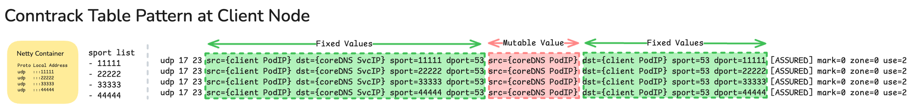
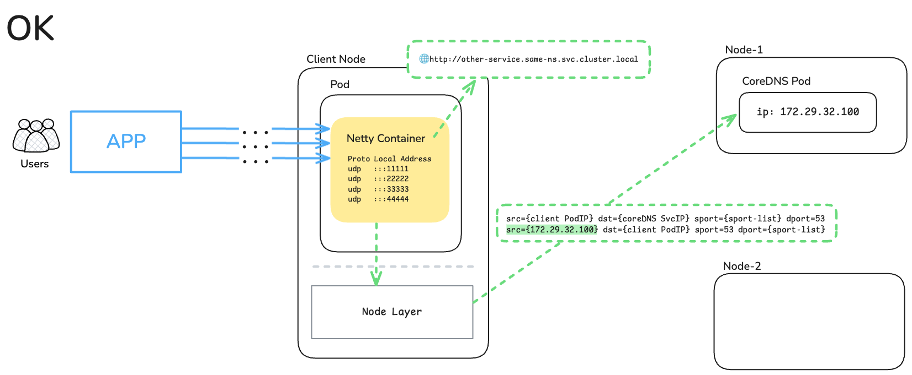
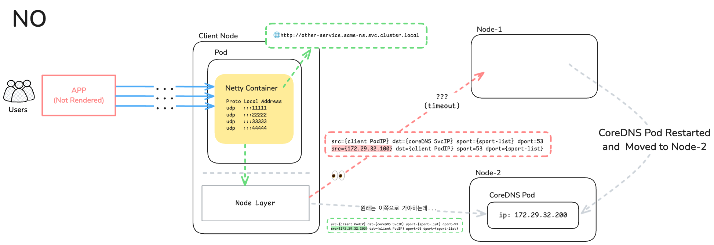

# EKS Worker Node가 NotReady 상태로 바뀌며 일부 Pod내 DNS Resolving 실패 현상

- EKS라기보단 k8s 자체에 관련된 내용이나, 여러 요소가 복합적으로 겹쳐서 발생한 이슈라 기록해 둠.

## 목차

- [1. 배경 및 문제 상황](#1-배경-및-문제-상황)
  - [1.1. C노드의 Pod에 문제가 생기기까지 현상 파악](#11-c노드의-pod에-문제가-생기기까지-현상-파악)
  - [1.2. Conntrack 테이블 엔트리의 형식](#12-conntrack-테이블-엔트리의-형식)
  - [1.3. Conntrack 테이블 구조를 k8s 환경에서 대입해보자](#13-conntrack-테이블-구조를-k8s-환경에서-대입해보자)
- [2. k3d 기반 로컬 환경에서 문제 상황 재현](#2-k3d-기반-로컬-환경에서-문제-상황-재현)
- [3. node-local-dns를 추가하면 개선이 될까?](#3-node-local-dns를-추가하면-개선이-될까)
  - [3.1. 왜 개선되는 것으로 보이는가?](#31-왜-개선되는-것으로-보이는가)
- [4. 정리](#4-정리)
- [5. 실습 내용 삭제](#5-실습-내용-삭제)

## 1. 배경 및 문제 상황

EKS의 워커노드 중 1대(이하 A노드)의 상태가 NotReady로 변경되어, 해당 노드에 있던 Pod들이 다른 노드(이하 B노드)로 재배치됨. (이후, A노드는 삭제됨.)
- 이때, 기존 정상 상태의 다른 노드(이하 C노드)에 있던 일부 Pod에서 K8s Service DNS 리졸빙이 안되는 이슈 발생.
- 문제가 되는 Pod는 Rollout Restart 시켜서 해소했으나, 일부 Pod에서 문제가 된 원인 분석이 필요했음.

<br>

A노드가 NotReady 상태가 된 이유는 세부 확인 및 Case Open 결과 AWS 내부 이슈였다는 답변을 받았음.
- 동적으로 리소스가 자주 변경되는 클라우드 환경에서는, 내가 사용중인 리소스는 언제나 장애가 발생할 가능성이 있음.
- 하지만 특정 리소스에 장애가 발생하더라도, 그로 인한 영향도를 최소화하는 구성을 하는 것또한 엔지니어링 영역임.
- 즉, k8s에서 갑자기 특정 노드에 문제가 생겨 사용 불가능한 상황이라도, 다른 정상 노드에 영향을 최소화하는 구성이 필요함.


### 1.1. C노드의 Pod에 문제가 생기기까지 현상 파악

- A노드에는 CoreDNS Pod 1대가 존재했음.
- A노드 자체가 NotReady로 빠지고 좀 시간이 지난 뒤, 아예 네트워크 자체가 끊기는 메트릭 패턴이 파악됨.
- 이때, A노드에 있던 CoreDNS Pod가 삭제되고 B노드에 스케줄링되면서부터, C노드의 일부 Pod들이 DNS 리졸빙 실패하는 현상 발생.
- 문제가 되는 Pod들은 모두 Spring WebFlux로 개발된 서비스였고, Spring WebFlux의 네트워크 처리는 기본적으로 Reactor Netty를 사용함.

<br>

관련되어, 의심되는 포인트 위주로 이슈가 올라온 것이 있는지 확인함.

1. Reactor Netty에서 유사한 사례의 이슈가 보고된 것을 확인.
  - [Netty issue with DNS resolution in Kubernetes environment #14364](https://github.com/netty/netty/issues/14364)
  - 확인해보니, 문제가 되는 Pod들은 위 이슈에 올라온 Netty 버전에 포함되었음.
  - 이슈 본문을 통해, Netty는 DNS 질의를 할 때 source port를 고정하여 사용한다는 것을 알아냄.

<br>

2. 당시 k8s v1.29에 UDP Conntrack 처리 관련 kube-proxy 이슈가 보고된 것을 확인.
  - [Conntrack tables having stale entries for UDP connection #125467](https://github.com/kubernetes/kubernetes/issues/125467)
  - 이슈에 보고된 k8s 버전(`v1.29.4`)이 당시 사용중이던 버전(`v1.29.9`)과 유사했고, 재현 과정이 당시 겪은 문제 상황과 상당히 유사했음.

<br>

즉, 문제가 발생한 원인은 아래와 같을 것이라 유추함.
- k8s 이전 버전부터 kube-proxy의 고질적인 문제(오래된 UDP Conntrack 엔트리 관리)를 개선한 내용이 v1.29 초기 버전에 들어감.
- 그러나 이 v1.29 초기 버전에 반영된 내용에 오류가 있어, 특정 상황에서 오래된 UDP 연결에 대해 Conntrack 엔트리 정리가 안되는 경우 발생. (즉, 노드 내에 더는 사용 불가능한 내용이 남아있음.)
- 만약에 DNS 쿼리를 시도하는 Pod의 클라이언트가, 주기적으로 sport(소스 포트)를 변경하는 경우엔, sport가 바뀌어 새로운 Conntrack 엔트리가 생성되기에 문제 없었을 것.
- 하지만 위의 Reactor Netty 처럼 클라이언트가 고정된 범위의 sport를 사용하고, 지속적으로 DNS 쿼리가 이뤄진다면?
- sport가 바뀔 일이 없어 클라이언트로 인해 Conntrack 엔트리가 새로 생성될 일 없음. 그렇다면 kube-proxy쪽에서 정리를 해줘야 하는데 v1.29 초기 버전에서는 오류가 있다.

### 1.2. Conntrack 테이블 엔트리의 형식

Conntrack 테이블 엔트리의 형식은 아래와 같다.

```bash
# tail -f /proc/net/nf_conntrack -n 100 | grep dport=53
ipv4	2 udp 	17 23 src={pod IP} dst={coreDNS svc IP} sport=11111 dport=53 src={coreDNS pod IP} dst={pod IP} sport=53 dport=11111 mark=0 zone=0 use=2
---
# -> 이 내용을 살펴보자.
udp 	17 23 src={pod IP} dst={coreDNS svc IP} sport=11111 dport=53 src={coreDNS pod IP} dst={pod IP} sport=53 dport=11111 mark=0 zone=0 use=2
```

위 엔트리 요소를 하나씩 살펴보면 아래와 같다. (좌 -> 우 방향)
- `udp`: L4 프로토콜 이름
- `17`: 그 프로토콜의 IP protocol number. UDP의 프로토콜 번호가 17이라서 저렇게 찍힘.
- `23`: 이 conntrack 엔트리의 남은 timeout(초).
  - 기본값은 리눅스 sysctl 설정값의 `nf_conntrack_udp_timeout_stream`와 같다. [(참고)](https://www.kernel.org/doc/Documentation/networking/nf_conntrack-sysctl.txt)
  - `Linux Kernel default`: 120s
- `src={pod IP} dst={coreDNS svc IP} sport=11111 dport=53`: 출발지 입장의 출발지 -> 도착지 정보다. (original direction 5-tuple)
  - 여기서 출발지는 C노드의 Pod, 도착지는 CoreDNS의 Service IP가 된다.
- `src={coreDNS svc IP} dst={pod IP} sport=53 dport=11111`: 도착지 입장의 출발지 -> 도착지 정보다. (reply direction 5-tuple)
  - 여기서 출발지는 CoreDNS Service IP, 도착지는 C노드의 Pod가 된다.
- `[ASSURED]`: status bit 중 하나. 이 플래그가 보인다는 것은 보통 reply 방향 패킷까지 확인된 뒤, 쉽게 제거되지 않는 쪽으로 간주됨.
- `mark=0`: 이 엔트리에 붙은 conntrack mark 값. 현재는 0, 즉 별도 mark가 안 붙은 상태임.
  - conntrack 도구는 엔트리의 mark 값을 조회/설정할 수 있음.
- `use=2`는 이 엔트리의 reference count(참조 수) 다.

<br>

그림으로 정리해보면 아래와 같다.



### 1.3. Conntrack 테이블 구조를 k8s 환경에서 대입해보자.

k8s 환경에서 Pod가 CoreDNS를 통해 DNS 질의하는 경우를 대입해보면, reply direction 5-tuple의 `src` 값은 변동이 될 수 있다.

- coreDNS Pod가 rollout 되는 경우가 있기 때문.
- 나머지 IP 관련 값들은 웬만해선 변경 여지가 없는 것으로 간주한다.
  - CoreDNS의 Service 객체를 지웠다가 새로 만들거나
  - DNS 질의하는 Pod가 삭제되는 경우. (그렇다면 새 Pod가 새로운 IP로 뜨니, 엔트리에서 출발지 Pod의 정보가 대부분 바뀌게 될 것임.)

<br>

이제 k8s 환경에서, 특정 Pod가 Netty를 통해 CoreDNS로 DNS 질의를 하는 경우를 정리해보자.

정상의 경우는 아래와 같을 것이다.
<br>


겪었던 문제 상황 기준으로, 기존에 conntrack 테이블 엔트리에 등록된 상태의 CoreDNS Pod가 삭제되면? 간혹 이런 일이 발생할 수 있겠다.
<br>


## 2. k3d 기반 로컬 환경에서 문제 상황 재현

이 문제를 해소하기 위해선, 단기적으론 워커노드마다 node-local-dns를 세팅해서 해결할 수 있겠다고 생각함. 다만, 위에서 추정한 내용이 정말로 원인이 맞는지 문제 상황을 재현해볼 필요가 있었다.

가장 간단하게 로컬에서 재현해볼 방법을 찾다가, k3d를 사용해 환경을 구성하기로 했다.

- k3d를 통해 로컬 환경에 멀티 노드 클러스터를 구성함.
- 이후 이 클러스터에 문제 상황을 세팅해둔다.
  - A노드: CoreDNS가 떠있다 문제가 생겨 삭제된 노드
  - B노드: A노드가 문제가 생긴 뒤, 새로 배포되어 신규 CoreDNS Pod가 띄워진 노드
  - C노드: CoreDNS를 통해 DNS 리졸빙 테스트 Pod가 있는 노드 (즉, 실제 서비스가 올라간 노드)

<br>

그리고 C노드에 띄울 테스트 워크로드는 Reactor Netty처럼 DNS 쿼리시 고정 포트를 사용해야 한다. 이를 위해 python 스크립트를 직접 짜서 테스트함. ([python-dns-query.yaml](./python-dns-query.yaml) 참고)


우선, k3d 설치부터 시작해서 기본 환경을 세팅해둔다.
```bash
# k3d install
❯ wget -q -O - https://raw.githubusercontent.com/k3d-io/k3d/main/install.sh | bash

# k3d 설치 확인
❯ which k3d          
/usr/local/bin/k3d

# k3d로 신규 클러스터 생성
❯ k3d cluster create multi-node \ 
  --image rancher/k3s:v1.29.9-k3s1 \
  --servers 1 \
  --agents 3
INFO[0000] Prep: Network                                
INFO[0000] Re-using existing network 'k3d-multi-node' (c1218e319c50f336bbb0016c03ae9e1f799c60b25abad67dafe0f5a017e59318) 
INFO[0000] Created image volume k3d-multi-node-images   
INFO[0000] Starting new tools node...                   
INFO[0000] Starting node 'k3d-multi-node-tools'         
INFO[0001] Creating node 'k3d-multi-node-server-0'      
INFO[0001] Creating node 'k3d-multi-node-agent-0'       
INFO[0001] Creating node 'k3d-multi-node-agent-1'       
INFO[0001] Creating node 'k3d-multi-node-agent-2'       
INFO[0001] Creating LoadBalancer 'k3d-multi-node-serverlb' 
INFO[0001] Using the k3d-tools node to gather environment information 
INFO[0001] HostIP: using network gateway 192.168.97.1 address 
INFO[0001] Starting cluster 'multi-node'                
INFO[0001] Starting servers...                          
INFO[0001] Starting node 'k3d-multi-node-server-0'      
INFO[0004] Starting agents...                           
INFO[0004] Starting node 'k3d-multi-node-agent-0'       
INFO[0004] Starting node 'k3d-multi-node-agent-2'       
INFO[0004] Starting node 'k3d-multi-node-agent-1'       
INFO[0007] Starting helpers...                          
INFO[0007] Starting node 'k3d-multi-node-serverlb'      
INFO[0013] Injecting records for hostAliases (incl. host.k3d.internal) and for 5 network members into CoreDNS configmap... 
INFO[0016] Cluster 'multi-node' created successfully!   
INFO[0016] You can now use it like this:                
kubectl cluster-info

# multi-node 클러스터 초기 상태
❯ k get no
NAME                      STATUS   ROLES                  AGE   VERSION
k3d-multi-node-agent-0    Ready    <none>                 26s   v1.29.9+k3s1
k3d-multi-node-agent-1    Ready    <none>                 27s   v1.29.9+k3s1
k3d-multi-node-agent-2    Ready    <none>                 27s   v1.29.9+k3s1
k3d-multi-node-server-0   Ready    control-plane,master   30s   v1.29.9+k3s1

# coreDNS Pod 개수 1 -> 2로 변경
❯ k -n kube-system scale deployment coredns --replicas=2
deployment.apps/coredns scaled

---

# coreDNS는 0번, 1번 노드에 띄워짐.
❯ k get po -n kube-system -o wide | grep dns
coredns-559656f558-c8pgw                  1/1     Running     0          66s    10.42.1.4   k3d-multi-node-agent-1    <none>           <none>
coredns-559656f558-h4gxb                  1/1     Running     0          107s   10.42.0.2   k3d-multi-node-agent-0    <none>           <none>

# 10.42.0.2: 0번 노드 coreDNS
# 10.42.1.4: 1번 노드 coreDNS
❯ k describe endpoints/kube-dns -n kube-system
Name:         kube-dns
Namespace:    kube-system
Labels:       k8s-app=kube-dns
              kubernetes.io/cluster-service=true
              kubernetes.io/name=CoreDNS
              objectset.rio.cattle.io/hash=bce283298811743a0386ab510f2f67ef74240c57
Annotations:  endpoints.kubernetes.io/last-change-trigger-time: 2026-04-19T13:15:17Z
Subsets:
  Addresses:          10.42.0.2,10.42.1.4
  NotReadyAddresses:  <none>
  Ports:
    Name     Port  Protocol
    ----     ----  --------
    dns-tcp  53    TCP
    dns      53    UDP
    metrics  9153  TCP

Events:  <none>

---

# 2번 노드에 테스트 워크로드를 배포해두었다.
❯ k apply -f python-dns-query.yaml
configmap/python-dns-query-config unchanged
deployment.apps/python-dns-query created

# 테스트 워크로드 Pod 전체 정보
❯ k get po -o wide           
NAME                                READY   STATUS    RESTARTS   AGE    IP           NODE                     NOMINATED NODE   READINESS GATES
python-dns-query-576b59557d-4pl7t   1/1     Running   0          108s   10.42.2.13   k3d-multi-node-agent-2   <none>           <none>
python-dns-query-576b59557d-9gk5q   1/1     Running   0          108s   10.42.2.14   k3d-multi-node-agent-2   <none>           <none>
python-dns-query-576b59557d-b7b2v   1/1     Running   0          108s   10.42.2.8    k3d-multi-node-agent-2   <none>           <none>
python-dns-query-576b59557d-dxfs9   1/1     Running   0          108s   10.42.2.9    k3d-multi-node-agent-2   <none>           <none>
python-dns-query-576b59557d-hxml6   1/1     Running   0          108s   10.42.2.7    k3d-multi-node-agent-2   <none>           <none>
python-dns-query-576b59557d-jpcjn   1/1     Running   0          108s   10.42.2.15   k3d-multi-node-agent-2   <none>           <none>
python-dns-query-576b59557d-mjmsd   1/1     Running   0          108s   10.42.2.16   k3d-multi-node-agent-2   <none>           <none>
python-dns-query-576b59557d-nmnq2   1/1     Running   0          108s   10.42.2.10   k3d-multi-node-agent-2   <none>           <none>
python-dns-query-576b59557d-w7z7p   1/1     Running   0          108s   10.42.2.12   k3d-multi-node-agent-2   <none>           <none>
python-dns-query-576b59557d-zhct7   1/1     Running   0          108s   10.42.2.11   k3d-multi-node-agent-2   <none>           <none>

# 로그 확인
❯ k logs deploy/python-dns-query --prefix=true -f
Found 10 pods, using pod/python-dns-query-576b59557d-4pl7t
[pod/python-dns-query-576b59557d-4pl7t/python-dns-query] Success: query=kubernetes.default.svc.cluster.local server=10.43.0.10:53 rcode=NOERROR answers=1 latency_ms=1.5 resolved_ips=10.43.0.1 records="kubernetes.default.svc.cluster.local A 10.43.0.1 ttl=4"
[pod/python-dns-query-576b59557d-4pl7t/python-dns-query] Success: query=kubernetes.default.svc.cluster.local server=10.43.0.10:53 rcode=NOERROR answers=1 latency_ms=0.3 resolved_ips=10.43.0.1 records="kubernetes.default.svc.cluster.local A 10.43.0.1 ttl=4"
[pod/python-dns-query-576b59557d-4pl7t/python-dns-query] Success: query=kubernetes.default.svc.cluster.local server=10.43.0.10:53 rcode=NOERROR answers=1 latency_ms=0.7 resolved_ips=10.43.0.1 records="kubernetes.default.svc.cluster.local A 10.43.0.1 ttl=4"
[pod/python-dns-query-576b59557d-4pl7t/python-dns-query] Success: query=kubernetes.default.svc.cluster.local server=10.43.0.10:53 rcode=NOERROR answers=1 latency_ms=0.3 resolved_ips=10.43.0.1 records="kubernetes.default.svc.cluster.local A 10.43.0.1 ttl=4"
[pod/python-dns-query-576b59557d-4pl7t/python-dns-query] Success: query=kubernetes.default.svc.cluster.local server=10.43.0.10:53 rcode=NOERROR answers=1 latency_ms=0.5 resolved_ips=10.43.0.1 records="kubernetes.default.svc.cluster.local A 10.43.0.1 ttl=5"
[pod/python-dns-query-576b59557d-4pl7t/python-dns-query] Success: query=kubernetes.default.svc.cluster.local server=10.43.0.10:53 rcode=NOERROR answers=1 latency_ms=0.8 resolved_ips=10.43.0.1 records="kubernetes.default.svc.cluster.local A 10.43.0.1 ttl=5"
...
```

2번 노드에서 conntrack 내용 상세를 확인해보자.

```bash
❯ docker ps | grep k3d     
6472a38c798c   ghcr.io/k3d-io/k3d-proxy:5.8.3   "/bin/sh -c nginx-pr…"   6 minutes ago   Up 6 minutes   80/tcp, 0.0.0.0:51426->6443/tcp   k3d-multi-node-serverlb
4f6206b59cdd   rancher/k3s:v1.29.9-k3s1         "/bin/k3d-entrypoint…"   6 minutes ago   Up 6 minutes                                     k3d-multi-node-agent-2
8950cf91d071   rancher/k3s:v1.29.9-k3s1         "/bin/k3d-entrypoint…"   6 minutes ago   Up 6 minutes                                     k3d-multi-node-agent-1
6726047d35dc   rancher/k3s:v1.29.9-k3s1         "/bin/k3d-entrypoint…"   6 minutes ago   Up 6 minutes                                     k3d-multi-node-agent-0
924bdd1d8497   rancher/k3s:v1.29.9-k3s1         "/bin/k3d-entrypoint…"   6 minutes ago   Up 6 minutes                                     k3d-multi-node-server-0

# 4f6206b59cdd가 2번 노드
❯ docker exec -ti 4f6206b59cdd sh
~ # 

~ # conntrack -L -p udp --dport 53
udp      17 118 src=10.42.2.16 dst=10.43.0.10 sport=5353 dport=53 src=10.42.0.2 dst=10.42.2.16 sport=53 dport=5353 [ASSURED] mark=0 use=1
udp      17 118 src=10.42.2.9 dst=10.43.0.10 sport=5353 dport=53 src=10.42.0.2 dst=10.42.2.9 sport=53 dport=5353 [ASSURED] mark=0 use=1
udp      17 118 src=10.42.2.7 dst=10.43.0.10 sport=5353 dport=53 src=10.42.0.2 dst=10.42.2.7 sport=53 dport=5353 [ASSURED] mark=0 use=1
udp      17 118 src=10.42.2.14 dst=10.43.0.10 sport=5353 dport=53 src=10.42.1.4 dst=10.42.2.14 sport=53 dport=5353 [ASSURED] mark=0 use=1
udp      17 118 src=10.42.2.13 dst=10.43.0.10 sport=5353 dport=53 src=10.42.0.2 dst=10.42.2.13 sport=53 dport=5353 [ASSURED] mark=0 use=1
udp      17 118 src=10.42.2.15 dst=10.43.0.10 sport=5353 dport=53 src=10.42.1.4 dst=10.42.2.15 sport=53 dport=5353 [ASSURED] mark=0 use=1
udp      17 118 src=10.42.2.12 dst=10.43.0.10 sport=5353 dport=53 src=10.42.1.4 dst=10.42.2.12 sport=53 dport=5353 [ASSURED] mark=0 use=1
udp      17 118 src=10.42.2.10 dst=10.43.0.10 sport=5353 dport=53 src=10.42.0.2 dst=10.42.2.10 sport=53 dport=5353 [ASSURED] mark=0 use=1
udp      17 118 src=10.42.2.8 dst=10.43.0.10 sport=5353 dport=53 src=10.42.0.2 dst=10.42.2.8 sport=53 dport=5353 [ASSURED] mark=0 use=1
udp      17 118 src=10.42.2.11 dst=10.43.0.10 sport=5353 dport=53 src=10.42.0.2 dst=10.42.2.11 sport=53 dport=5353 [ASSURED] mark=0 use=1
conntrack v1.4.7 (conntrack-tools): 10 flow entries have been shown.
```

여기서 맨 위 로그를 한번 분석해보자.
```bash
udp      17 118 src=10.42.2.16 dst=10.43.0.10 sport=5353 dport=53 src=10.42.0.2 dst=10.42.2.16 sport=53 dport=5353 [ASSURED] mark=0 use=1
```

`src=10.42.2.16 dst=10.43.0.10 sport=5353 dport=53`
- `src=10.42.2.16`: 2번 노드에 있는 Pod python-dns-query-576b59557d-mjmsd
- `dst=10.43.0.10`: `kube-dns.kube-system.svc.cluster.local` Cluster IP
- `sport=5353`: 테스트 워크로드에서 사용하는 소스 포트. (문제 상황 재현을 위해 고정 포트 사용함.)
- `dport=53`: DNS 쿼리를 위한 목적지 포트. (CoreDNS로 향함)

`src=10.42.0.2 dst=10.42.2.16 sport=53 dport=5353`
- `src=10.42.0.2`: 0번 노드에 있는 CoreDNS Pod
- `dst=10.42.2.16`: 2번 노드에 있는 Pod python-dns-query-576b59557d-mjmsd
- `sport=53`: DNS 쿼리를 위한 소스 포트. (CoreDNS)
- `dport=5353`: DNS 쿼리 요청 목적지 포트. (테스트 워크로드)

<br>

문제 상황은 아래처럼 재현하려고 한다.
1. `docker pause`로 0번 노드를 강제로 비정상 상태로 전환.
2. 이후, CoreDNS Pod는 1번 노드로 스케줄링될 것임. (이를 위해 1번 노드외엔 모두 cordon 걸린 상태)
3. 그동안 2번 노드에서 conntrack 테이블 변화를 확인한다. (`watch -d -n 1 "conntrack -L -p udp --dport 53"`)
4. 테스트 워크로드의 로그 변화를 확인한다.

<br>

```bash
# 전제 사항: 1번 노드 외에는 전부 Cordon 걸린 상태.
❯ k get no        
NAME                      STATUS                     ROLES                  AGE     VERSION
k3d-multi-node-agent-0    Ready,SchedulingDisabled   <none>                 9m43s   v1.29.9+k3s1
k3d-multi-node-agent-1    Ready                      <none>                 9m44s   v1.29.9+k3s1
k3d-multi-node-agent-2    Ready,SchedulingDisabled   <none>                 9m44s   v1.29.9+k3s1
k3d-multi-node-server-0   Ready,SchedulingDisabled   control-plane,master   9m47s   v1.29.9+k3s1

# docker pause로 0번 노드를 강제로 비정상 상태로 전환.
❯ docker ps | grep k3d
6472a38c798c   ghcr.io/k3d-io/k3d-proxy:5.8.3   "/bin/sh -c nginx-pr…"   10 minutes ago   Up 10 minutes   80/tcp, 0.0.0.0:51426->6443/tcp   k3d-multi-node-serverlb
4f6206b59cdd   rancher/k3s:v1.29.9-k3s1         "/bin/k3d-entrypoint…"   10 minutes ago   Up 10 minutes                                     k3d-multi-node-agent-2
8950cf91d071   rancher/k3s:v1.29.9-k3s1         "/bin/k3d-entrypoint…"   10 minutes ago   Up 10 minutes                                     k3d-multi-node-agent-1
6726047d35dc   rancher/k3s:v1.29.9-k3s1         "/bin/k3d-entrypoint…"   10 minutes ago   Up 10 minutes                                     k3d-multi-node-agent-0
924bdd1d8497   rancher/k3s:v1.29.9-k3s1         "/bin/k3d-entrypoint…"   10 minutes ago   Up 10 minutes                                     k3d-multi-node-server-0

# ✋ 0번 노드 비정상으로 만들기 전: 2번 노드 conntrack은 아래와 같음.
Every 1.0s: conntrack -L -p udp --dport 53                                                  2026-04-19 13:24:57

udp      17 114 src=10.42.2.16 dst=10.43.0.10 sport=5353 dport=53 src=10.42.0.2 dst=10.42.2.16 sport=53 dport=5353 [ASSURED] mark=0 use=1
udp      17 114 src=10.42.2.9 dst=10.43.0.10 sport=5353 dport=53 src=10.42.0.2 dst=10.42.2.9 sport=53 dport=5353 [ASSURED] mark=0 use=1
udp      17 114 src=10.42.2.7 dst=10.43.0.10 sport=5353 dport=53 src=10.42.0.2 dst=10.42.2.7 sport=53 dport=5353 [ASSURED] mark=0 use=1
udp      17 114 src=10.42.2.14 dst=10.43.0.10 sport=5353 dport=53 src=10.42.1.4 dst=10.42.2.14 sport=53 dport=5353 [ASSURED] mark=0 use=1
udp      17 114 src=10.42.2.13 dst=10.43.0.10 sport=5353 dport=53 src=10.42.0.2 dst=10.42.2.13 sport=53 dport=5353 [ASSURED] mark=0 use=1
udp      17 114 src=10.42.2.15 dst=10.43.0.10 sport=5353 dport=53 src=10.42.1.4 dst=10.42.2.15 sport=53 dport=5353 [ASSURED] mark=0 use=1
udp      17 114 src=10.42.2.12 dst=10.43.0.10 sport=5353 dport=53 src=10.42.1.4 dst=10.42.2.12 sport=53 dport=5353 [ASSURED] mark=0 use=1
udp      17 114 src=10.42.2.10 dst=10.43.0.10 sport=5353 dport=53 src=10.42.0.2 dst=10.42.2.10 sport=53 dport=5353 [ASSURED] mark=0 use=1
udp      17 114 src=10.42.2.8 dst=10.43.0.10 sport=5353 dport=53 src=10.42.0.2 dst=10.42.2.8 sport=53 dport=5353 [ASSURED] mark=0 use=1
udp      17 114 src=10.42.2.11 dst=10.43.0.10 sport=5353 dport=53 src=10.42.0.2 dst=10.42.2.11 sport=53 dport=5353 [ASSURED] mark=0 use=1
conntrack v1.4.7 (conntrack-tools): 10 flow entries have been shown.

# ✋ 0번 노드 비정상으로 만들기 전: kube-dns에 대한 endpoints들은 아래와 같음.
❯ k describe endpoints/kube-dns -n kube-system
Name:         kube-dns
Namespace:    kube-system
Labels:       k8s-app=kube-dns
              kubernetes.io/cluster-service=true
              kubernetes.io/name=CoreDNS
              objectset.rio.cattle.io/hash=bce283298811743a0386ab510f2f67ef74240c57
Annotations:  endpoints.kubernetes.io/last-change-trigger-time: 2026-04-19T13:15:17Z
Subsets:
  Addresses:          10.42.0.2,10.42.1.4
  NotReadyAddresses:  <none>
  Ports:
    Name     Port  Protocol
    ----     ----  --------
    dns-tcp  53    TCP
    dns      53    UDP
    metrics  9153  TCP

Events:  <none>

# 0번 노드 셧다운!
❯ docker pause 6726047d35dc 
6726047d35dc

# 조금 시간이 지난 뒤, 0번 노드 NotReady
❯ k get no
NAME                      STATUS                        ROLES                  AGE   VERSION
k3d-multi-node-agent-0    NotReady,SchedulingDisabled   <none>                 13m   v1.29.9+k3s1
k3d-multi-node-agent-1    Ready                         <none>                 13m   v1.29.9+k3s1
k3d-multi-node-agent-2    Ready,SchedulingDisabled      <none>                 13m   v1.29.9+k3s1
k3d-multi-node-server-0   Ready,SchedulingDisabled      control-plane,master   13m   v1.29.9+k3s1

❯ k describe endpoints/kube-dns -n kube-system
Name:         kube-dns
Namespace:    kube-system
Labels:       k8s-app=kube-dns
              kubernetes.io/cluster-service=true
              kubernetes.io/name=CoreDNS
              objectset.rio.cattle.io/hash=bce283298811743a0386ab510f2f67ef74240c57
Annotations:  endpoints.kubernetes.io/last-change-trigger-time: 2026-04-19T13:27:54Z
Subsets:
  Addresses:          10.42.1.4
  NotReadyAddresses:  10.42.0.2
  Ports:
    Name     Port  Protocol
    ----     ----  --------
    dns-tcp  53    TCP
    dns      53    UDP
    metrics  9153  TCP

Events:  <none>


# 👀 그런데 2번 노드의 conntrack 테이블은 그대로. (원래대로라면 endpoints에서 빠져서 conntrack에서도 빠져야하는게 정상.)
Every 1.0s: conntrack -L -p udp --dport 53                                                  2026-04-19 13:28:14

udp      17 112 src=10.42.2.16 dst=10.43.0.10 sport=5353 dport=53 src=10.42.0.2 dst=10.42.2.16 sport=53 dport=5353 [ASSURED] mark=0 use=1
udp      17 112 src=10.42.2.9 dst=10.43.0.10 sport=5353 dport=53 src=10.42.0.2 dst=10.42.2.9 sport=53 dport=5353 [ASSURED] mark=0 use=1
udp      17 112 src=10.42.2.7 dst=10.43.0.10 sport=5353 dport=53 src=10.42.0.2 dst=10.42.2.7 sport=53 dport=5353 [ASSURED] mark=0 use=1
udp      17 117 src=10.42.2.14 dst=10.43.0.10 sport=5353 dport=53 src=10.42.1.4 dst=10.42.2.14 sport=53 dport=5353 [ASSURED] mark=0 use=1
udp      17 112 src=10.42.2.13 dst=10.43.0.10 sport=5353 dport=53 src=10.42.0.2 dst=10.42.2.13 sport=53 dport=5353 [ASSURED] mark=0 use=1
udp      17 117 src=10.42.2.15 dst=10.43.0.10 sport=5353 dport=53 src=10.42.1.4 dst=10.42.2.15 sport=53 dport=5353 [ASSURED] mark=0 use=1
udp      17 117 src=10.42.2.12 dst=10.43.0.10 sport=5353 dport=53 src=10.42.1.4 dst=10.42.2.12 sport=53 dport=5353 [ASSURED] mark=0 use=1
udp      17 112 src=10.42.2.10 dst=10.43.0.10 sport=5353 dport=53 src=10.42.0.2 dst=10.42.2.10 sport=53 dport=5353 [ASSURED] mark=0 use=1
udp      17 112 src=10.42.2.8 dst=10.43.0.10 sport=5353 dport=53 src=10.42.0.2 dst=10.42.2.8 sport=53 dport=5353 [ASSURED] mark=0 use=1
udp      17 112 src=10.42.2.11 dst=10.43.0.10 sport=5353 dport=53 src=10.42.0.2 dst=10.42.2.11 sport=53 dport=5353 [ASSURED] mark=0 use=1
conntrack v1.4.7 (conntrack-tools): 10 flow entries have been shown.


# 이후, 2번 노드에 CoreDNS 파드가 추가로 뜬 것을 확인한다.
❯ k get po -n kube-system -o wide | grep dns
coredns-559656f558-c8pgw                  1/1     Running     0          18m     10.42.1.4    k3d-multi-node-agent-1    <none>           <none>
coredns-559656f558-gwz9z                  1/1     Running     0          2m21s   10.42.2.17   k3d-multi-node-agent-2    <none>           <none>

# kube-dns endpoints에 10.42.0.2는 완전히 사라짐.
❯ k describe endpoints/kube-dns -n kube-system
Name:         kube-dns
Namespace:    kube-system
Labels:       k8s-app=kube-dns
              kubernetes.io/cluster-service=true
              kubernetes.io/name=CoreDNS
              objectset.rio.cattle.io/hash=bce283298811743a0386ab510f2f67ef74240c57
Annotations:  endpoints.kubernetes.io/last-change-trigger-time: 2026-04-19T13:33:09Z
Subsets:
  Addresses:          10.42.1.4,10.42.2.17
  NotReadyAddresses:  <none>
  Ports:
    Name     Port  Protocol
    ----     ----  --------
    dns-tcp  53    TCP
    dns      53    UDP
    metrics  9153  TCP

Events:  <none>

# ❓ 그럼에도 2번 노드의 conntrack 테이블에서는 여전히 사라진 10.42.0.2를 그대로 갖고 있음.
Every 1.0s: conntrack -L -p udp --dport 53                                                  2026-04-19 13:34:41

udp      17 115 src=10.42.2.16 dst=10.43.0.10 sport=5353 dport=53 src=10.42.0.2 dst=10.42.2.16 sport=53 dport=5353 [ASSURED] mark=0 use=1
udp      17 115 src=10.42.2.9 dst=10.43.0.10 sport=5353 dport=53 src=10.42.0.2 dst=10.42.2.9 sport=53 dport=5353 [ASSURED] mark=0 use=1
udp      17 115 src=10.42.2.7 dst=10.43.0.10 sport=5353 dport=53 src=10.42.0.2 dst=10.42.2.7 sport=53 dport=5353 [ASSURED] mark=0 use=1
udp      17 110 src=10.42.2.14 dst=10.43.0.10 sport=5353 dport=53 src=10.42.1.4 dst=10.42.2.14 sport=53 dport=5353 [ASSURED] mark=0 use=1
udp      17 115 src=10.42.2.13 dst=10.43.0.10 sport=5353 dport=53 src=10.42.0.2 dst=10.42.2.13 sport=53 dport=5353 [ASSURED] mark=0 use=1
udp      17 110 src=10.42.2.15 dst=10.43.0.10 sport=5353 dport=53 src=10.42.1.4 dst=10.42.2.15 sport=53 dport=5353 [ASSURED] mark=0 use=1
udp      17 110 src=10.42.2.12 dst=10.43.0.10 sport=5353 dport=53 src=10.42.1.4 dst=10.42.2.12 sport=53 dport=5353 [ASSURED] mark=0 use=1
udp      17 115 src=10.42.2.10 dst=10.43.0.10 sport=5353 dport=53 src=10.42.0.2 dst=10.42.2.10 sport=53 dport=5353 [ASSURED] mark=0 use=1
udp      17 115 src=10.42.2.8 dst=10.43.0.10 sport=5353 dport=53 src=10.42.0.2 dst=10.42.2.8 sport=53 dport=5353 [ASSURED] mark=0 use=1
udp      17 115 src=10.42.2.11 dst=10.43.0.10 sport=5353 dport=53 src=10.42.0.2 dst=10.42.2.11 sport=53 dport=5353 [ASSURED] mark=0 use=1
conntrack v1.4.7 (conntrack-tools): 10 flow entries have been shown.
```

<br>

그리고, conntrack 상에서 `src=10.42.0.2`를 바라보는 pod에서만 계속 Fail이 나는걸 확인할 수 있다.
- `python-dns-query-576b59557d-zhct7`: `10.42.2.11`
  - conntrack상 로그: `udp      17 115 src=10.42.2.11 dst=10.43.0.10 sport=5353 dport=53 src=10.42.0.2 dst=10.42.2.11 sport=53 dport=5353 [ASSURED] mark=0 use=1`
- `python-dns-query-576b59557d-hxml6`: `10.42.2.7`
  - conntrack상 로그: `udp      17 115 src=10.42.2.7 dst=10.43.0.10 sport=5353 dport=53 src=10.42.0.2 dst=10.42.2.7 sport=53 dport=5353 [ASSURED] mark=0 use=1`
- `python-dns-query-576b59557d-b7b2v`: `10.42.2.8`
  - conntrack상 로그: `udp      17 115 src=10.42.2.8 dst=10.43.0.10 sport=5353 dport=53 src=10.42.0.2 dst=10.42.2.8 sport=53 dport=5353 [ASSURED] mark=0 use=1`

(참고) 테스트 워크로드 Pod별 로그는 아래와 같음. (분량상 일부만 첨부)
```bash
python-dns-query-576b59557d-zhct7 Failed: Timeout after 5 seconds
...
python-dns-query-576b59557d-zhct7 Failed: Timeout after 5 seconds
---
python-dns-query-576b59557d-jpcjn Success: query=kubernetes.default.svc.cluster.local server=10.43.0.10:53 rcode=NOERROR answers=1 latency_ms=1.2 resolved_ips=10.43.0.1 records="kubernetes.default.svc.cluster.local A 10.43.0.1 ttl=5"
...
python-dns-query-576b59557d-jpcjn Success: query=kubernetes.default.svc.cluster.local server=10.43.0.10:53 rcode=NOERROR answers=1 latency_ms=2.1 resolved_ips=10.43.0.1 records="kubernetes.default.svc.cluster.local A 10.43.0.1 ttl=5"
---
python-dns-query-576b59557d-hxml6 Failed: Timeout after 5 seconds
...
python-dns-query-576b59557d-hxml6 Failed: Timeout after 5 seconds
---
python-dns-query-576b59557d-jpcjn Success: query=kubernetes.default.svc.cluster.local server=10.43.0.10:53 rcode=NOERROR answers=1 latency_ms=2.5 resolved_ips=10.43.0.1 records="kubernetes.default.svc.cluster.local A 10.43.0.1 ttl=5"
...
python-dns-query-576b59557d-jpcjn Success: query=kubernetes.default.svc.cluster.local server=10.43.0.10:53 rcode=NOERROR answers=1 latency_ms=2.0 resolved_ips=10.43.0.1 records="kubernetes.default.svc.cluster.local A 10.43.0.1 ttl=5"
---
python-dns-query-576b59557d-b7b2v Failed: Timeout after 5 seconds
...
python-dns-query-576b59557d-b7b2v Failed: Timeout after 5 seconds
---
(이하 생략)
```

## 3. node-local-dns를 추가하면 개선이 될까?

`./node-local-dns` 내용을 설치한 뒤 k3d 클러스터 구성은 아래와 같아진다.

```bash
# 아까 0번 노드를 지웠기에 새로 하나 추가
❯ k3d node create new-node -c multi-node
❯ k get po -A --field-selector spec.nodeName=k3d-new-node-0
NAMESPACE     NAME                           READY   STATUS    RESTARTS   AGE
kube-system   node-local-dns-6542d           1/1     Running   0          75s
kube-system   svclb-traefik-93189e32-6m6ff   2/2     Running   0          75s

❯ k get po -A --field-selector spec.nodeName=k3d-multi-node-server-0
NAMESPACE     NAME                              READY   STATUS    RESTARTS   AGE
kube-system   coredns-559656f558-74d66          1/1     Running   0          4m59s
kube-system   metrics-server-7cbbc464f4-56t8g   1/1     Running   0          38m
kube-system   node-local-dns-w9chw              1/1     Running   0          2m1s
kube-system   svclb-traefik-93189e32-92rwj      2/2     Running   0          38m
kube-system   traefik-87688f8b7-l958m           1/1     Running   0          38m

❯ k get po -A --field-selector spec.nodeName=k3d-multi-node-agent-1
NAMESPACE     NAME                           READY   STATUS      RESTARTS   AGE
kube-system   coredns-559656f558-c8pgw       1/1     Running     0          37m
kube-system   helm-install-traefik-x4xbt     0/1     Completed   1          38m
kube-system   node-local-dns-b5h69           1/1     Running     0          94s
kube-system   svclb-traefik-93189e32-sb5fz   2/2     Running     0          38m

❯ k get po -A --field-selector spec.nodeName=k3d-multi-node-agent-2
NAMESPACE     NAME                                      READY   STATUS    RESTARTS   AGE
default       python-dns-query-8478bdbbc-6gzh2          1/1     Running   0          3m18s
default       python-dns-query-8478bdbbc-8h6zq          1/1     Running   0          3m13s
default       python-dns-query-8478bdbbc-8l5cf          1/1     Running   0          3m13s
default       python-dns-query-8478bdbbc-8x96w          1/1     Running   0          3m18s
default       python-dns-query-8478bdbbc-dpmcl          1/1     Running   0          3m18s
default       python-dns-query-8478bdbbc-g6898          1/1     Running   0          3m13s
default       python-dns-query-8478bdbbc-gkn7v          1/1     Running   0          3m18s
default       python-dns-query-8478bdbbc-mnp6p          1/1     Running   0          3m14s
default       python-dns-query-8478bdbbc-vzw6v          1/1     Running   0          3m18s
default       python-dns-query-8478bdbbc-zlrn7          1/1     Running   0          3m13s
kube-system   local-path-provisioner-5ccc7458d5-6w9sv   1/1     Running   0          41m
kube-system   node-local-dns-q6rg6                      1/1     Running   0          4m40s
kube-system   svclb-traefik-93189e32-kggb5              2/2     Running   0          41m

# coreDNS endpoints 상태
❯ k describe endpoints/kube-dns -n kube-system
Name:         kube-dns
Namespace:    kube-system
Labels:       k8s-app=kube-dns
              kubernetes.io/cluster-service=true
              kubernetes.io/name=CoreDNS
              objectset.rio.cattle.io/hash=bce283298811743a0386ab510f2f67ef74240c57
Annotations:  endpoints.kubernetes.io/last-change-trigger-time: 2026-04-19T13:48:24Z
Subsets:
  Addresses:          10.42.1.4,10.42.3.7
  NotReadyAddresses:  <none>
  Ports:
    Name     Port  Protocol
    ----     ----  --------
    dns-tcp  53    TCP
    dns      53    UDP
    metrics  9153  TCP

Events:  <none>
```

<br>

2번 노드에서 conntrack 테이블을 확인하면, 형식이 기존과 달라진 것을 볼 수 있다.

- `192.168.97.4`: 2번 노드 서버 Host IP
- `10.43.213.166`: `node-local-dns-upstream` 서비스 객체. (즉, coreDNS를 향함)
- `10.42.3.7`, `10.42.1.4`: 현재 coreDNS의 Pod IP
- `10.42.2.0`: 2번 노드 flannel 인터페이스 (k3d 기본 CNI가 flannel)

<br>

```bash
Every 1.0s: conntrack -L -p udp --dport 53                 2026-04-19 13:58:28

udp      17 65 src=192.168.97.4 dst=10.43.213.166 sport=51072 dport=53 src=10.42.3.7 dst=10.42.2.0 sport=53 dport=14033 [ASSURED] mark=0 use=1
udp      17 115 src=192.168.97.4 dst=10.43.213.166 sport=44722 dport=53 src=10.42.1.4 dst=10.42.2.0 sport=53 dport=55824 [ASSURED] mark=0 use=1
udp      17 80 src=192.168.97.4 dst=10.43.213.166 sport=52355 dport=53 src=10.42.3.7 dst=10.42.2.0 sport=53 dport=7135 [ASSURED] mark=0 use=1
udp      17 105 src=192.168.97.4 dst=10.43.213.166 sport=55710 dport=53 src=10.42.1.4 dst=10.42.2.0 sport=53 dport=15517 [ASSURED] mark=0 use=1
conntrack v1.4.7 (conntrack-tools): 4 flow entries have been shown.


~ # ifconfig
(생략)
flannel.1 Link encap:Ethernet  HWaddr 9A:04:93:28:28:E8  
          inet addr:10.42.2.0  Bcast:0.0.0.0  Mask:255.255.255.255
          inet6 addr: fe80::9804:93ff:fe28:28e8/64 Scope:Link
          UP BROADCAST RUNNING MULTICAST  MTU:1450  Metric:1
          RX packets:1889 errors:0 dropped:0 overruns:0 frame:0
          TX packets:1889 errors:0 dropped:5 overruns:0 carrier:0
          collisions:0 txqueuelen:0 
          RX bytes:285245 (278.5 KiB)  TX bytes:152424 (148.8 KiB)
(생략)
---


# node-local-dns-upstream는 coreDNS를 바라보는 서비스 객체이다.
❯ k describe service/node-local-dns-upstream -n kube-system
Name:              node-local-dns-upstream
Namespace:         kube-system
Labels:            app.kubernetes.io/component=node-local-dns
                   app.kubernetes.io/created-by=node-local-dns
                   app.kubernetes.io/instance=node-local-dns
                   app.kubernetes.io/managed-by=Helm
                   app.kubernetes.io/name=node-local-dns
                   app.kubernetes.io/part-of=node-local-dns
                   app.kubernetes.io/version=1.22.23
                   helm.sh/chart=node-local-dns-2.0.6
                   k8s-app=node-local-dns
Annotations:       meta.helm.sh/release-name: node-local-dns
                   meta.helm.sh/release-namespace: kube-system
Selector:          k8s-app=kube-dns
Type:              ClusterIP
IP Family Policy:  SingleStack
IP Families:       IPv4
IP:                10.43.213.166
IPs:               10.43.213.166
Port:              dns  53/UDP
TargetPort:        53/UDP
Endpoints:         10.42.1.4:53,10.42.3.7:53
Port:              dns-tcp  53/TCP
TargetPort:        53/TCP
Endpoints:         10.42.1.4:53,10.42.3.7:53
Session Affinity:  None
Events:            <none>

# 10.42.2.0은 해당 노드의 flannel 인터페이스
❯ k describe node k3d-multi-node-agent-2 | grep CIDR
PodCIDR:                      10.42.2.0/24
PodCIDRs:                     10.42.2.0/24
```

<br>

아래 로그 기준으로 해석해보자.
- `192.168.97.4`: 2번 노드 서버 Host IP
- `10.43.213.166`: `node-local-dns-upstream` 서비스 객체. (즉, coreDNS를 향함)
- `10.42.3.7`, `10.42.1.4`: 현재 coreDNS의 Pod IP
- `10.42.2.0`: 2번 노드 flannel 인터페이스 (k3d 기본 CNI가 flannel)

<br>

```bash
udp      17 65 src=192.168.97.4 dst=10.43.213.166 sport=51072 dport=53 src=10.42.3.7 dst=10.42.2.0 sport=53 dport=14033 [ASSURED] mark=0 use=1
```

<br>

`src=192.168.97.4 dst=10.43.213.166 sport=51072 dport=53`
- `src=192.168.97.4`: 2번 노드의 Host IP.
- `dst=10.43.213.166`: `node-local-dns-upstream` Service IP.
  - 이 Service는 `k8s-app=kube-dns` selector로 실제 CoreDNS Pod들을 바라보고 있음.
- `sport=51072`: node-local-dns가 upstream CoreDNS로 질의할 때 사용한 source port.
  - 기존 테스트 워크로드의 고정 source port인 `5353`이 아니라는 점!
- `dport=53`: DNS 질의 목적지 포트.

`src=10.42.3.7 dst=10.42.2.0 sport=53 dport=14033`
- `src=10.42.3.7`: 실제 응답을 보낸 CoreDNS Pod IP.
- `dst=10.42.2.0`: 2번 노드의 flannel 인터페이스 주소.
- `sport=53`: CoreDNS 응답 source port.
- `dport=14033`: 응답 방향에서 사용된 포트.

즉, node-local-dns 적용 후에는 테스트 Pod가 CoreDNS로 직접 질의하는 형태가 아니라,
각 노드의 node-local-dns가 `node-local-dns-upstream` Service를 통해 CoreDNS로 질의하는 형태가 됨.

그래서 기존처럼 `Pod IP -> kube-dns Service IP` 형태의 conntrack 엔트리가 아니라,
`Node Host IP -> node-local-dns-upstream Service IP` 형태의 conntrack 엔트리가 잡힌다.
이 덕분에 테스트 워크로드가 고정 source port `5353`을 계속 사용하더라도,
CoreDNS upstream 질의에서는 node-local-dns가 별도의 source port를 사용하게 됨.

<br>

이제 똑같이 문제 상황을 발생시켜보자.

```bash
# 전제 사항: new-node 외에는 전부 Cordon 걸린 상태.
❯ k get no
NAME                      STATUS                     ROLES                  AGE   VERSION
k3d-multi-node-agent-1    Ready,SchedulingDisabled   <none>                 70m   v1.29.9+k3s1
k3d-multi-node-agent-2    Ready,SchedulingDisabled   <none>                 70m   v1.29.9+k3s1
k3d-multi-node-server-0   Ready,SchedulingDisabled   control-plane,master   70m   v1.29.9+k3s1
k3d-new-node-0            Ready                      <none>                 30m   v1.29.9+k3s1

# docker pause로 1번 노드를 강제로 비정상 상태로 전환. (여기에 coreDNS Pod 하나가 있기 때문)
❯ docker ps | grep k3d
28fa3d0cf5a8   a6c3022d895a                     "/bin/k3d-entrypoint…"   31 minutes ago      Up 31 minutes                                        k3d-new-node-0
6472a38c798c   ghcr.io/k3d-io/k3d-proxy:5.8.3   "/bin/sh -c nginx-pr…"   About an hour ago   Up About an hour   80/tcp, 0.0.0.0:51426->6443/tcp   k3d-multi-node-serverlb
4f6206b59cdd   rancher/k3s:v1.29.9-k3s1         "/bin/k3d-entrypoint…"   About an hour ago   Up About an hour                                     k3d-multi-node-agent-2
8950cf91d071   rancher/k3s:v1.29.9-k3s1         "/bin/k3d-entrypoint…"   About an hour ago   Up About an hour                                     k3d-multi-node-agent-1
924bdd1d8497   rancher/k3s:v1.29.9-k3s1         "/bin/k3d-entrypoint…"   About an hour ago   Up About an hour                                     k3d-multi-node-server-0

# ✋ 1번 노드 비정상으로 만들기 전: 2번 노드 conntrack은 아래와 같음.
Every 1.0s: conntrack -L -p udp --dport 53                   2026-04-19 14:26:08

udp      17 2 src=192.168.97.4 dst=10.43.213.166 sport=60197 dport=53 src=10.42.1.4 dst=10.42.2.0 sport=53 dport=2972 [ASSURED] mark=0 use=1
udp      17 82 src=192.168.97.4 dst=10.43.213.166 sport=45780 dport=53 src=10.42.3.7 dst=10.42.2.0 sport=53 dport=63352 [ASSURED] mark=0 use=1
udp      17 62 src=192.168.97.4 dst=10.43.213.166 sport=37674 dport=53 src=10.42.3.7 dst=10.42.2.0 sport=53 dport=26907 [ASSURED] mark=0 use=1
udp      17 102 src=192.168.97.4 dst=10.43.213.166 sport=35924 dport=53 src=10.42.3.7 dst=10.42.2.0 sport=53 dport=19277 [ASSURED] mark=0 use=1
udp      17 42 src=192.168.97.4 dst=10.43.213.166 sport=58799 dport=53 src=10.42.1.4 dst=10.42.2.0 sport=53 dport=62433 [ASSURED] mark=0 use=1
udp      17 22 src=192.168.97.4 dst=10.43.213.166 sport=56958 dport=53 src=10.42.1.4 dst=10.42.2.0 sport=53 dport=59777 [ASSURED] mark=0 use=1
udp      17 102 src=192.168.97.4 dst=10.43.213.166 sport=40595 dport=53 src=10.42.3.7 dst=10.42.2.0 sport=53 dport=11269 [ASSURED] mark=0 use=2
udp      17 117 src=192.168.97.4 dst=10.43.213.166 sport=40599 dport=53 src=10.42.1.4 dst=10.42.2.0 sport=53 dport=30556 [ASSURED] mark=0 use=1
udp      17 2 src=192.168.97.4 dst=10.43.213.166 sport=55293 dport=53 src=10.42.1.4 dst=10.42.2.0 sport=53 dport=57458 [ASSURED] mark=0 use=1
conntrack v1.4.7 (conntrack-tools): 9 flow entries have been shown.

# ✋ 1번 노드 비정상으로 만들기 전: kube-dns에 대한 endpoints들은 아래와 같음.
❯ k get po -n kube-system -o wide | grep coredns
coredns-559656f558-74d66                  1/1     Running     0          38m   10.42.3.7      k3d-multi-node-server-0   <none>           <none>
coredns-559656f558-c8pgw                  1/1     Running     0          71m   10.42.1.4      k3d-multi-node-agent-1    <none>           <none>
❯ k describe endpoints/kube-dns -n kube-system
Name:         kube-dns
Namespace:    kube-system
Labels:       k8s-app=kube-dns
              kubernetes.io/cluster-service=true
              kubernetes.io/name=CoreDNS
              objectset.rio.cattle.io/hash=bce283298811743a0386ab510f2f67ef74240c57
Annotations:  endpoints.kubernetes.io/last-change-trigger-time: 2026-04-19T13:48:24Z
Subsets:
  Addresses:          10.42.1.4,10.42.3.7
  NotReadyAddresses:  <none>
  Ports:
    Name     Port  Protocol
    ----     ----  --------
    dns-tcp  53    TCP
    dns      53    UDP
    metrics  9153  TCP

Events:  <none>

# 1번 노드 셧다운!
❯ docker pause 8950cf91d071
8950cf91d071


# 조금 시간이 지난 뒤, 1번 노드 NotReady
❯ k get no
NAME                      STATUS                        ROLES                  AGE   VERSION
k3d-multi-node-agent-1    NotReady,SchedulingDisabled   <none>                 74m   v1.29.9+k3s1
k3d-multi-node-agent-2    Ready,SchedulingDisabled      <none>                 74m   v1.29.9+k3s1
k3d-multi-node-server-0   Ready,SchedulingDisabled      control-plane,master   74m   v1.29.9+k3s1
k3d-new-node-0            Ready                         <none>                 34m   v1.29.9+k3s1

❯ k describe endpoints/kube-dns -n kube-system
Name:         kube-dns
Namespace:    kube-system
Labels:       k8s-app=kube-dns
              kubernetes.io/cluster-service=true
              kubernetes.io/name=CoreDNS
              objectset.rio.cattle.io/hash=bce283298811743a0386ab510f2f67ef74240c57
Annotations:  endpoints.kubernetes.io/last-change-trigger-time: 2026-04-19T14:28:30Z
Subsets:
  Addresses:          10.42.3.7
  NotReadyAddresses:  10.42.1.4
  Ports:
    Name     Port  Protocol
    ----     ----  --------
    dns-tcp  53    TCP
    dns      53    UDP
    metrics  9153  TCP

Events:  <none>


# 2번 노드의 conntrack 테이블
Every 1.0s: conntrack -L -p udp --dport 53                   2026-04-19 14:29:10

udp      17 95 src=192.168.97.4 dst=10.43.213.166 sport=42689 dport=53 src=10.42.3.7 dst=10.42.2.0 sport=53 dport=3318 [ASSURED] mark=0 use=1
udp      17 40 src=192.168.97.4 dst=10.43.213.166 sport=37086 dport=53 src=10.42.1.4 dst=10.42.2.0 sport=53 dport=12745 [ASSURED] mark=0 use=1
udp      17 112 src=192.168.97.4 dst=10.43.213.166 sport=38792 dport=53 src=10.42.3.7 dst=10.42.2.0 sport=53 dport=1521 [ASSURED] mark=0 use=1
udp      17 20 src=192.168.97.4 dst=10.43.213.166 sport=41163 dport=53 src=10.42.3.7 dst=10.42.2.0 sport=53 dport=62583 [ASSURED] mark=0 use=1
udp      17 0 src=192.168.97.4 dst=10.43.213.166 sport=35427 dport=53 src=10.42.1.4 dst=10.42.2.0 sport=53 dport=38251 [ASSURED] mark=0 use=1
udp      17 100 src=192.168.97.4 dst=10.43.213.166 sport=50910 dport=53 src=10.42.3.7 dst=10.42.2.0 sport=53 dport=24009 [ASSURED] mark=0 use=1
conntrack v1.4.7 (conntrack-tools): 6 flow entries have been shown.


# 이후, new-node에 CoreDNS 파드가 추가로 뜬 것을 확인한다.
❯ k get po -n kube-system -o wide | grep dns
coredns-559656f558-c8pgw                  1/1     Running     0          18m     10.42.1.4    k3d-multi-node-agent-1    <none>           <none>
coredns-559656f558-gwz9z                  1/1     Running     0          2m21s   10.42.2.17   k3d-multi-node-agent-2    <none>           <none>

❯ k describe endpoints/kube-dns -n kube-system
Name:         kube-dns
Namespace:    kube-system
Labels:       k8s-app=kube-dns
              kubernetes.io/cluster-service=true
              kubernetes.io/name=CoreDNS
              objectset.rio.cattle.io/hash=bce283298811743a0386ab510f2f67ef74240c57
Annotations:  endpoints.kubernetes.io/last-change-trigger-time: 2026-04-19T14:30:44Z
Subsets:
  Addresses:          10.42.3.7,10.42.4.3
  NotReadyAddresses:  <none>
  Ports:
    Name     Port  Protocol
    ----     ----  --------
    dns-tcp  53    TCP
    dns      53    UDP
    metrics  9153  TCP

Events:  <none>

# 2번 노드의 conntrack 테이블 확인.
Every 1.0s: conntrack -L -p udp --dport 53                   2026-04-19 14:30:53

udp      17 27 src=192.168.97.4 dst=10.43.213.166 sport=38792 dport=53 src=10.42.3.7 dst=10.42.2.0 sport=53 dport=1521 [ASSURED] mark=0 use=1
udp      17 119 src=192.168.97.4 dst=10.43.213.166 sport=47842 dport=53 src=10.42.3.7 dst=10.42.2.0 sport=53 dport=21181 [ASSURED] mark=0 use=1
udp      17 47 src=192.168.97.4 dst=10.43.213.166 sport=56772 dport=53 src=10.42.3.7 dst=10.42.2.0 sport=53 dport=3837 [ASSURED] mark=0 use=1
conntrack v1.4.7 (conntrack-tools): 3 flow entries have been shown.

-> ...

Every 1.0s: conntrack -L -p udp --dport 53                   2026-04-19 14:31:34

udp      17 118 src=192.168.97.4 dst=10.43.213.166 sport=47842 dport=53 src=10.42.3.7 dst=10.42.2.0 sport=53 dport=21181 [ASSURED] mark=0 use=1
udp      17 16 src=192.168.97.4 dst=10.43.213.166 sport=39758 dport=53 src=10.42.3.7 dst=10.42.2.0 sport=53 dport=8881 mark=0 use=1
udp      17 6 src=192.168.97.4 dst=10.43.213.166 sport=56772 dport=53 src=10.42.3.7 dst=10.42.2.0 sport=53 dport=3837 [ASSURED] mark=0 use=1
conntrack v1.4.7 (conntrack-tools): 3 flow entries have been shown.
```

그리고 이 과정동안 테스트 워크로드에서 Fail 로그는 단 하나도 존재하지 않았다.
```bash
python-dns-query-8478bdbbc-gkn7v Success: query=kubernetes.default.svc.cluster.local server=10.43.0.10:53 rcode=NOERROR answers=1 latency_ms=0.8 resolved_ips=10.43.0.1 records="kubernetes.default.svc.cluster.local A 10.43.0.1 ttl=1"
python-dns-query-8478bdbbc-gkn7v Success: query=kubernetes.default.svc.cluster.local server=10.43.0.10:53 rcode=NOERROR answers=1 latency_ms=1.6 resolved_ips=10.43.0.1 records="kubernetes.default.svc.cluster.local A 10.43.0.1 ttl=1"
python-dns-query-8478bdbbc-gkn7v Success: query=kubernetes.default.svc.cluster.local server=10.43.0.10:53 rcode=NOERROR answers=1 latency_ms=0.4 resolved_ips=10.43.0.1 records="kubernetes.default.svc.cluster.local A 10.43.0.1 ttl=1"
python-dns-query-8478bdbbc-gkn7v Success: query=kubernetes.default.svc.cluster.local server=10.43.0.10:53 rcode=NOERROR answers=1 latency_ms=1.2 resolved_ips=10.43.0.1 records="kubernetes.default.svc.cluster.local A 10.43.0.1 ttl=1"
...
python-dns-query-8478bdbbc-zlrn7 Success: query=kubernetes.default.svc.cluster.local server=10.43.0.10:53 rcode=NOERROR answers=1 latency_ms=0.2 resolved_ips=10.43.0.1 records="kubernetes.default.svc.cluster.local A 10.43.0.1 ttl=1"
python-dns-query-8478bdbbc-mnp6p Success: query=kubernetes.default.svc.cluster.local server=10.43.0.10:53 rcode=NOERROR answers=1 latency_ms=0.5 resolved_ips=10.43.0.1 records="kubernetes.default.svc.cluster.local A 10.43.0.1 ttl=1"
python-dns-query-8478bdbbc-8l5cf Success: query=kubernetes.default.svc.cluster.local server=10.43.0.10:53 rcode=NOERROR answers=1 latency_ms=11.7 resolved_ips=10.43.0.1 records="kubernetes.default.svc.cluster.local A 10.43.0.1 ttl=5"
python-dns-query-8478bdbbc-8h6zq Success: query=kubernetes.default.svc.cluster.local server=10.43.0.10:53 rcode=NOERROR answers=1 latency_ms=1.0 resolved_ips=10.43.0.1 records="kubernetes.default.svc.cluster.local A 10.43.0.1 ttl=5"
```

### 3.1. 왜 개선되는 것으로 보이는가?

위 재현에서 node-local-dns 적용 전/후의 가장 큰 차이는, CoreDNS로 향하는 conntrack 엔트리의 주체가 바뀐다는 것임.

node-local-dns 적용 전에는 테스트 워크로드 Pod의 DNS 질의가 아래 형태로 conntrack에 잡혔다.

```text
Pod IP -> kube-dns Service IP -> CoreDNS Pod IP
```

이때 테스트 워크로드는 source port를 `5353`으로 고정해서 사용하고 있었음.
따라서 특정 Pod의 conntrack 엔트리 내용에 사라진 CoreDNS Pod IP가 남아있다면, 해당 Pod는 같은 source port로 계속 질의하면서 기존 conntrack 엔트리를 재사용하게 된다.

하지만, node-local-dns 적용 후에는 Pod DNS 질의가 아래 형태로 바뀐다.

```text
Node Host IP -> node-local-dns-upstream Service IP -> CoreDNS Pod IP
```

즉, 애플리케이션 Pod가 CoreDNS로 직접 질의하는 것이 아니라, 각 노드에 떠있는 node-local-dns가 대신 upstream CoreDNS로 질의한다.

이때 upstream 질의의 source port는 테스트 워크로드의 고정 포트인 `5353`이 아니라, node-local-dns가 사용하는 별도 포트가 된다.

예를 들어 앞에서 확인한 conntrack도 아래처럼 잡혔다.

```bash
src=192.168.97.4 dst=10.43.213.166 sport=51072 dport=53
```

여기서 `sport=51072`는 테스트 워크로드의 `5353`이 아니다.
즉, Pod의 고정 source port와 CoreDNS upstream conntrack 엔트리가 분리됨.

이 때문에 CoreDNS Pod가 교체되더라도, 기존처럼 특정 Pod의 고정 source port가 사라진 CoreDNS Pod IP를 계속 물고 있는 상황이 완화되는 것으로 보임.

추가로 node-local-dns는 노드별 DNS cache 역할도 하므로, 모든 DNS 질의가 매번 CoreDNS Pod까지 직접 가지 않아도 된다.
결과적으로 CoreDNS endpoint 변경이나, 오래된 UDP conntrack 내용이 남아있는 영향을 Pod 단위로 직접 받는 범위가 줄어들게 됨.

## 4. 정리

이번 재현을 통해 확인한 내용은 아래와 같다.

- DNS 질의는 UDP 기반이므로 conntrack 엔트리의 영향을 받는다.
- kube-dns Service IP로 질의하더라도, conntrack reply direction에는 실제 CoreDNS Pod IP가 남는다.
- CoreDNS Pod가 삭제되었는데도 삭제된 Pod IP 내용의 conntrack 엔트리가 남으면, 일부 Pod가 사라진 CoreDNS Pod IP를 계속 바라볼 수 있다.
- 이때 DNS 클라이언트가 source port를 고정해서 사용하면 기존 conntrack 엔트리를 계속 재사용하게 되어 timeout이 지속될 수 있다.
- node-local-dns를 적용하면 Pod의 DNS 질의와 CoreDNS upstream 질의가 분리된다.
- 이번 재현에서는 node-local-dns 적용 후 같은 상황에서도 테스트 워크로드의 DNS timeout이 발생하지 않았다.

따라서 단기적인 완화책으로는 worker node마다 node-local-dns를 구성하는 것이 유효하다고 판단함.

다만 node-local-dns가 kube-proxy 또는 kernel conntrack 이슈 자체를 해결하는 것은 아니다.
- k8s v1.31 이후부터는 관련된 로직이 많이 개선된 것으로 보임.
- 그리고 만약 노드/파드가 더 대규모 단위로 있는 경우라면? 또 다른 문제가 있을 수 있음. 네트워크 구조에 대해 다시 설계해보는 것도 필요.

## 5. 실습 내용 삭제
```bash
❯ k3d cluster delete multi-node         
INFO[0000] Deleting cluster 'multi-node'                
INFO[0005] Deleting 1 attached volumes...               
INFO[0005] Removing cluster details from default kubeconfig... 
INFO[0005] Removing standalone kubeconfig file (if there is one)... 
INFO[0005] Successfully deleted cluster multi-node!     
```
