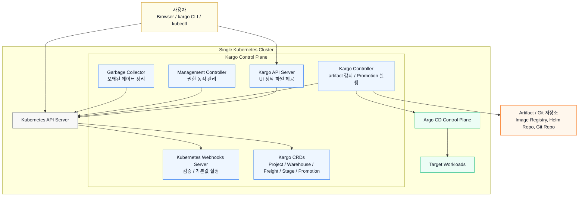
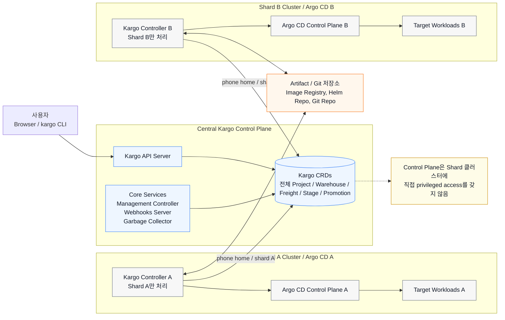
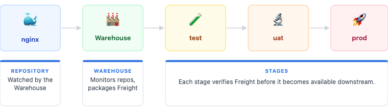
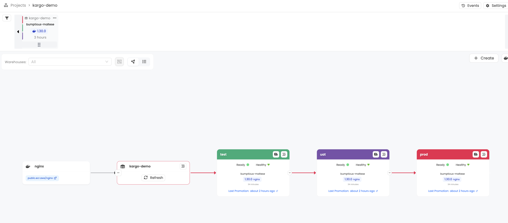

# Kargo 기본 정리 및 QuickStart 실습

## 목차

- [Kargo 기본 정리 및 QuickStart 실습](#kargo-기본-정리-및-quickstart-실습)
  - [목차](#목차)
  - [1. Kargo 란?](#1-kargo-란)
    - [만들어진 배경](#만들어진-배경)
  - [2. Kargo Core Concepts (CRDs)](#2-kargo-core-concepts-crds)
    - [Promotion](#promotion)
      - [PromotionTask](#promotiontask)
    - [Stage](#stage)
    - [Freight](#freight)
    - [Warehouse](#warehouse)
    - [Project](#project)
  - [3. Kargo Architecture](#3-kargo-architecture)
    - [API Server / UI](#api-server--ui)
    - [Controller](#controller)
    - [Garbage Collector](#garbage-collector)
    - [Kubernetes Webhooks Server](#kubernetes-webhooks-server)
    - [External Webhooks Server](#external-webhooks-server)
    - [Management Controller](#management-controller)
    - [Dex](#dex)
  - [4. kargo Standalone / Distributed 구성](#4-kargo-standalone--distributed-구성)
    - [Standalone 구성](#standalone-구성)
    - [Distributed 구성](#distributed-구성)
      - [이런 구조를 갖게 된 이유](#이런-구조를-갖게-된-이유)
  - [5. Kargo QuickStart Hands-On](#5-kargo-quickstart-hands-on)
    - [초기 환경 세팅](#초기-환경-세팅)
    - [Kargo Project, Pipeline을 만들어보자.](#kargo-project-pipeline을-만들어보자)
    - [Freight Promotion](#freight-promotion)
    - [실습 환경 삭제](#실습-환경-삭제)

## 1. Kargo 란?

Kubernetes 환경에서 GitOps 방식으로 **환경 간 Promotion**을 관리하는 오픈소스 도구. 
<br>
여기서 Promotion은 애플리케이션 변경 사항을 `dev -> test -> uat -> prod` 같은 여러 단계로 전파하는 과정이다.

- 예를 들어, 새로운 컨테이너 이미지 태그나 Git commit을 test 환경에서 검증한 뒤,
- 같은 버전 조합을 uat와 prod로 순차적으로 올리는 작업이 Promotion이다.


Kargo는 ArgoCD를 대체하는 것이 아니라 보완하는 방향의 툴로 만들어져 있다.
- ArgoCD: Git에 선언된 desired state를 Kubernetes 클러스터의 actual state로 동기화.
- Kargo: 어떤 artifact revision을 어떤 Stage로 승격할지, 그 과정에서 GitOps repo를 어떻게 바꾸고 검증/승인할지 관리.


### 만들어진 배경

GitOps를 도입하면 Kubernetes 배포 상태를 Git으로 선언적으로 관리할 수 있으나,
<br>
GitOps 자체는 여러 환경 사이의 변경 전파 방식까지 표준화해주지는 않는다. 보통 다음과 같은 문제가 생길 수 있다.

- test에서 검증한 이미지 태그를 uat/prod에 어떻게 안전하게 반영할지? 별도 자동화 필요.
- 환경별 Git branch나 manifest를 CI 스크립트가 직접 수정하는 방식 늘어남.
- 수동 cherry-pick, 수동 PR, 수동 image tag 변경이 섞이면 어떤 버전이 어디까지 갔는지 추적 어려움.
- Stage별 승인, 검증, 이력을 일관된 모델로 관리하기 어려움.

Kargo는 이 문제를 해결하기 위해 `Project`, `Warehouse`, `Stage`, `Promotion` 같은 Kubernetes CRD로 Promotion Pipeline을 모델링한다.
<br>
그리고 Git commit, image tag, Helm chart 같은 artifact revision을 `Freight`라는 개념으로 묶어 Stage 간에 이동시킨다.

(참고) Akuity
- Kargo의 관리 주체인 Akuity는 Argo 프로젝트 공동 창시자들이 만든 회사임.

## 2. Kargo Core Concepts (CRDs)

- 원문: https://docs.kargo.io/user-guide/core-concepts/


### Promotion
- `Promotion`은 특정 변경 사항을 애플리케이션 수명 주기의 한 단계에서 다음 단계로 전파하는 과정. (Kargo에서 가장 중요한 개념)

(참고) Promotion과 Deployment는 다른 의미이다.

- `Promotion`: Stage의 원하는 상태를 바꾸는 작업. 예를 들어 GitOps repo의 branch, manifest, image tag를 업데이트한다.
- `Deployment`: 바뀐 원하는 상태를 실제 Kubernetes 클러스터에 반영하는 작업. 이 역할은 보통 Argo CD가 수행한다.

Kargo는 Promotion을 관리하고, Argo CD는 Deployment를 수행한다고 이해하면 쉬움.

#### PromotionTask

- `PromotionTask`는 재사용 가능한 Promotion step 묶음.
- Stage마다 동일한 Promotion Template을 반복해서 작성하지 않고, 공통 Promotion 절차를 `PromotionTask`로 정의한 뒤 각 Stage에서 참조할 수 있음.

이번 hands-on의 예시는 다음 흐름을 수행한다.

1. GitOps repo clone
2. target branch 작업 tree 비우기
3. Kustomize image tag를 Freight의 image tag로 변경
4. manifest를 render
5. 변경 사항 commit/push
6. Argo CD Application의 desired revision 갱신

```yaml
apiVersion: kargo.akuity.io/v1alpha1
kind: PromotionTask
metadata:
  name: demo-promo-process
  namespace: kargo-demo
spec:
  steps:
  - uses: git-clone
  - uses: kustomize-set-image
  - uses: git-commit
  - uses: git-push
  - uses: argocd-update
```

### Stage

- `Stage`는 Promotion의 대상이 된다.
- 대부분의 경우 dev, test, uat, prod 같은 배포 환경으로 이해해도 된지만, Kargo 관점에서 Stage는 반드시 전체 환경일 필요는 없다고 함.
- 특정 애플리케이션 인스턴스, 몇 개의 마이크로서비스, 또는 하나의 Kubernetes 클러스터를 나타낼 수도 있다. (이건 사용하는 환경에 맞게 조정)

Stage들은 서로 연결되어 Promotion Pipeline을 만든다.
- 밑에 컬러 표시된 박스들이 모두 `Stage`


### Freight

- `Freight`는 Stage 사이를 이동하는 배포 가능한 artifact 묶음.
- 컨테이너 이미지, Helm chart, Git commit, Kubernetes manifest 같은 artifact의 특정 revision들을 하나의 단위로 묶은 meta-artifact라고 볼 수 있음.

### Warehouse

- `Warehouse`는 Freight가 만들어지는 출처.
- Warehouse는 container image repository, Git repository, Helm chart repository 같은 artifact source를 감시함.
- 새로운 revision을 발견하면, 해당 revision들을 묶어 새로운 Freight를 생성.

```yaml
# 예시
apiVersion: kargo.akuity.io/v1alpha1
kind: Warehouse
metadata:
  name: kargo-demo
  namespace: kargo-demo
spec:
  subscriptions:
  - image:
      repoURL: public.ecr.aws/nginx/nginx
      constraint: ^1.29.0
      discoveryLimit: 5
```

주요 필드는 아래와 같음.
- `spec.subscriptions`: 감시할 artifact source 목록
- `repoURL`: image, Git, Helm repository 주소
- `constraint` or `semverConstraint`: 선택할 버전 범위
- `discoveryLimit`: 한 번에 탐색할 revision 수
- `freightCreationPolicy`: Freight 자동 생성 여부

Warehouse가 새 artifact revision을 발견하면, 해당 revision을 참조하는 `Freight`를 만든다.

### Project

- `Project`는 Kargo 리소스를 묶는 tenancy 단위. (cluster-scoped 단위)
- Project 하나는 Kubernetes namespace 하나와 연결된다.
- 같은 Project에 속한 `Warehouse`, `Stage`, `Freight`, `PromotionTask` 같은 리소스는 해당 namespace 안에 모임.

```yaml
# 예시
apiVersion: kargo.akuity.io/v1alpha1
kind: Project
metadata:
  name: kargo-demo
```

## 3. Kargo Architecture

- 원문: https://docs.kargo.io/operator-guide/architecture/

### API Server / UI
- API Server: Kargo UI와 CLI가 사용하는 백엔드 API 제공. UI 정적 파일도 API Server를 통해 제공.
- UI: 브라우저에서 접근하는 Kargo의 기본 사용자 인터페이스. API Server의 base address로 접근함.
  - Promotion 상태, Stage 흐름, Freight 정보 등을 시각적으로 확인하고 조작할 수 있다.

### Controller
- Kargo의 핵심 컴포넌트. Controller는 artifact 저장소를 감시해 새로운 Freight를 발견하고, 사용자가 정의한 Promotion 프로세스를 실행함.
- 단순 구성에서는 Control Plane 안에 Controller 하나가 같이 실행된다.
- 대규모 환경에서는 Controller를 여러 클러스터에 분산 배치할 수 있다.
  - 각 Controller는 Control Plane에 있는 데이터 중 자신이 담당하는 subset, 즉 shard만 처리함.

Controller를 분산하는 이유
- 특정 artifact 저장소가 특정 네트워크나 방화벽 내부에서만 접근 가능한 경우가 있음.
- Controller 작업량을 분산해 확장성을 확보해야 하는 경우가 있음.
- 여러 ArgoCD Control Plane을 운영하는 기업 환경에서, Kargo Controller를 ArgoCD Control Plane과 1:1에 준하도록 배치해야 하는 경우.

### Garbage Collector

- Kargo 데이터는 Kubernetes 리소스로 저장되므로 오래된 데이터가 계속 쌓이면 클러스터 성능에 영향을 줄 수 있음.
- Garbage Collector는 오래된 Kargo 데이터를 정리한다.

### Kubernetes Webhooks Server

- Kubernetes admission webhook 서버로, Kargo 리소스가 생성, 수정, 삭제될 때 validating webhook과 mutating webhook을 통해 Kargo 전용 검증 및 기본값 설정 로직을 수행함.


### External Webhooks Server

- 외부 시스템에서 들어오는 HTTP/S 요청을 받는 선택 컴포넌트.
- 예를 들어, GitHub repository에 새 commit이 push 되었을 때 Kargo로 webhook을 보내도록 구성하면, 이 서버가 요청을 받고 적절한 동작을 시작함.
- API Server와 함께 Kargo에서 인터넷에 노출될 수 있는 두 번째 컴포넌트이다.

### Management Controller

- 권한 관리와 같은 관리성 작업을 담당하는 보조 Controller.
- 다른 컴포넌트와 Kargo 사용자에게 필요한 권한을 동적으로 관리한다.
  - API Server와 External Webhooks Server는 외부에 노출될 수 있고, Controller는 다른 클러스터로 분산될 수 있음.
  - 이들에게 Control Plane의 Secret 같은 민감한 리소스에 대한 넓은 권한을 주는 것은 부담스럽기 때문.
  - 이를 완화하기 위해 Management Controller는 넓은 권한을 가진 내부 컴포넌트로 동작.

`Project`가 생성되거나 삭제될 때, 다른 컴포넌트와 사용자에게 필요한 좁은 권한을 동적으로 부여하거나 회수함.


### Dex

- OpenID Connect IdP 역할.

## 4. kargo Standalone / Distributed 구성

### Standalone 구성

가장 단순한 구성으로, 하나의 Kubernetes 클러스터 안에 Kargo Control Plane, ArgoCD Control Plane, Target Workloads가 함께 실행된다.



이 구성은 테스트, 실습, 소규모 환경에 적합하다. (hands-on에서 설치한 형태도 이 방식)


### Distributed 구성

대규모 환경에서 Kargo는 agent 기반 아키텍처를 채택함.
- 중앙 Kargo Control Plane은 모든 데이터와 핵심 서비스를 보유.
- Controller는 여러 클러스터에 분산 배치되고, 각 Controller가 중앙 Control Plane으로 연결.
- 이때 각 Controller는 자신에게 할당된 shard만 처리한다.



이 구성의 특징
- Kargo Control Plane은 전체 데이터와 중앙 API를 제공.
- Controller는 개별 클러스터 또는 ArgoCD Control Plane 단위로 분산될 수 있음.
- 모든 Controller는 중앙 Kargo Control Plane으로 연결됨.
- 중앙 Control Plane은 Controller가 배포된 클러스터들에 대한 privileged access를 직접 갖지 않는다!

#### 이런 구조를 갖게 된 이유

Argo CD를 대규모로 운영할 때 흔히 두 가지 패턴이 있다.

1. hub-and-spoke 구조
   - 중앙 Control Plane에서 여러 클러스터를 관리하므로 관찰성이 좋고 단일 화면에서 전체 상태를 보기 쉬움.
   - 하지만 중앙 Controller가 여러 클러스터에 대한 강한 권한을 갖게 되어 보안적으로 공격 대상이 된다.
   - 또한 관리 대상 클러스터가 늘수록 중앙 Controller의 확장성 문제가 커짐.

2. cluster별 Control Plane 구조
   -  각 클러스터가 자체 Control Plane을 가지므로 보안과 확장성은 좋아짐.
   -  하지만 전체 상태를 한 곳에서 보기 어렵고 운영 관찰성이 떨어진다.

Kargo의 agent 기반 구조는 이 둘의 절충안이다.
- 중앙 Control Plane을 통해 전체 Promotion 상태를 한 곳에서 볼 수 있음.
- 분산 Controller가 각자 담당 shard만 처리하므로, 확장성이 좋다.
- 중앙 Control Plane이 다른 클러스터에 대한 privileged access를 직접 갖지 않아 보안 리스크를 줄인다.


## 5. Kargo QuickStart Hands-On

- https://docs.kargo.io/quickstart

핸즈온에서는 아래와 같은 파이프라인을 구성하게 된다.


### 초기 환경 세팅

Kargo QuickStart Docs를 보면 자주 사용하는 로컬 환경 k8s 툴에서 바로 실습 환경 세팅하는 스크립트를 제공하고 있다.
- 여기서는 k3d를 사용한다. (전체 삭제 / 다시 생성이 용이하기 때문)

```bash
# Kargo Docs에서 제공하는 설치 스크립트 다운로드
❯ wget https://raw.githubusercontent.com/akuity/kargo/main/hack/quickstart/k3d.sh

# 파일 이름 변경 (내용 한번 확인하기 위함)
❯ mv k3d.sh k3d-install.sh && chmod +x k3d-install.sh

# 실행해서 실습 환경 설치
❯ ./k3d-install.sh 
+ argo_cd_chart_version=9.4.3
+ argo_rollouts_chart_version=2.40.6
+ cert_manager_chart_version=1.19.3
+ k3d cluster create kargo-quickstart --no-lb --k3s-arg --disable=traefik@server:0 -p 31080-31082:31080-31082@servers:0:direct -p 32080-32082:32080-32082@servers:0:direct --wait
INFO[0000] Prep: Network                                
INFO[0000] Created network 'k3d-kargo-quickstart'       
INFO[0000] Created image volume k3d-kargo-quickstart-images 
INFO[0000] Starting new tools node...                   
INFO[0001] Creating node 'k3d-kargo-quickstart-server-0' 
INFO[0003] Pulling image 'ghcr.io/k3d-io/k3d-tools:5.8.3' 
INFO[0003] Pulling image 'docker.io/rancher/k3s:v1.31.5-k3s1' 
INFO[0005] Starting node 'k3d-kargo-quickstart-tools'   
INFO[0017] Using the k3d-tools node to gather environment information 
INFO[0017] HostIP: using network gateway 192.168.107.1 address 
INFO[0017] Starting cluster 'kargo-quickstart'          
INFO[0017] Starting servers...                          
INFO[0017] Starting node 'k3d-kargo-quickstart-server-0' 
INFO[0020] All agents already running.                  
INFO[0020] All helpers already running.                 
INFO[0020] Injecting records for hostAliases (incl. host.k3d.internal) and for 1 network members into CoreDNS configmap... 
INFO[0022] Cluster 'kargo-quickstart' created successfully! 
INFO[0022] You can now use it like this:                
kubectl cluster-info
+ helm install cert-manager cert-manager --repo https://charts.jetstack.io --version 1.19.3 --namespace cert-manager --create-namespace --set crds.enabled=true --wait
NAME: cert-manager
LAST DEPLOYED: Sun Apr 26 16:00:45 2026
NAMESPACE: cert-manager
STATUS: deployed
REVISION: 1
TEST SUITE: None
NOTES:
⚠️  WARNING: New default private key rotation policy for Certificate resources.
The default private key rotation policy for Certificate resources was
changed to `Always` in cert-manager >= v1.18.0.
Learn more in the [1.18 release notes](https://cert-manager.io/docs/releases/release-notes/release-notes-1.18).

cert-manager v1.19.3 has been deployed successfully!

In order to begin issuing certificates, you will need to set up a ClusterIssuer
or Issuer resource (for example, by creating a 'letsencrypt-staging' issuer).

More information on the different types of issuers and how to configure them
can be found in our documentation:

https://cert-manager.io/docs/configuration/

For information on how to configure cert-manager to automatically provision
Certificates for Ingress resources, take a look at the `ingress-shim`
documentation:

https://cert-manager.io/docs/usage/ingress/
+ helm install argocd argo-cd --repo https://argoproj.github.io/argo-helm --version 9.4.3 --namespace argocd --create-namespace --set 'configs.secret.argocdServerAdminPassword=$2a$10$5vm8wXaSdbuff0m9l21JdevzXBzJFPCi8sy6OOnpZMAG.fOXL7jvO' --set dex.enabled=false --set notifications.enabled=false --set server.service.type=NodePort --set server.service.nodePortHttp=31080 --set 'server.extraArgs={--insecure}' --set server.extensions.enabled=true --set 'server.extensions.extensionList[0].name=argo-rollouts' --set 'server.extensions.extensionList[0].env[0].name=EXTENSION_URL' --set 'server.extensions.extensionList[0].env[0].value=https://github.com/argoproj-labs/rollout-extension/releases/download/v0.3.7/extension.tar' --wait
NAME: argocd
LAST DEPLOYED: Sun Apr 26 16:01:21 2026
NAMESPACE: argocd
STATUS: deployed
REVISION: 1
TEST SUITE: None
NOTES:
In order to access the server UI you have the following options:

1. kubectl port-forward service/argocd-server -n argocd 8080:443

    and then open the browser on http://localhost:8080 and accept the certificate

2. enable ingress in the values file `server.ingress.enabled` and either
      - Add the annotation for ssl passthrough: https://argo-cd.readthedocs.io/en/stable/operator-manual/ingress/#option-1-ssl-passthrough
      - Set the `configs.params."server.insecure"` in the values file and terminate SSL at your ingress: https://argo-cd.readthedocs.io/en/stable/operator-manual/ingress/#option-2-multiple-ingress-objects-and-hosts


After reaching the UI the first time you can login with username: admin and the random password generated during the installation. You can find the password by running:

kubectl -n argocd get secret argocd-initial-admin-secret -o jsonpath="{.data.password}" | base64 -d

(You should delete the initial secret afterwards as suggested by the Getting Started Guide: https://argo-cd.readthedocs.io/en/stable/getting_started/#4-login-using-the-cli)
+ helm install argo-rollouts argo-rollouts --repo https://argoproj.github.io/argo-helm --version 2.40.6 --create-namespace --namespace argo-rollouts --wait
NAME: argo-rollouts
LAST DEPLOYED: Sun Apr 26 16:02:01 2026
NAMESPACE: argo-rollouts
STATUS: deployed
REVISION: 1
TEST SUITE: None
+ helm install kargo oci://ghcr.io/akuity/kargo-charts/kargo --namespace kargo --create-namespace --set api.service.type=NodePort --set api.service.nodePort=31081 --set api.tls.enabled=false --set 'api.adminAccount.passwordHash=$2a$10$Zrhhie4vLz5ygtVSaif6o.qN36jgs6vjtMBdM6yrU1FOeiAAMMxOm' --set api.adminAccount.tokenSigningKey=iwishtowashmyirishwristwatch --set externalWebhooksServer.service.type=NodePort --set externalWebhooksServer.service.nodePort=31082 --set externalWebhooksServer.tls.enabled=false --wait
Pulled: ghcr.io/akuity/kargo-charts/kargo:1.10.2
Digest: sha256:392e25bc85c51287c7cd37a4a26b15552dc7d07b3bbb6509a53875c77ab5ab8c
W0426 16:02:33.716874   33929 warnings.go:70] spec.privateKey.rotationPolicy: In cert-manager >= v1.18.0, the default value changed from `Never` to `Always`.
NAME: kargo
LAST DEPLOYED: Sun Apr 26 16:02:31 2026
NAMESPACE: kargo
STATUS: deployed
REVISION: 1
TEST SUITE: None
NOTES:
.----------------------------------------------------------------------------------.
|     _                            _                    _          _ _             |
|    | | ____ _ _ __ __ _  ___    | |__  _   _     __ _| | ___   _(_) |_ _   _     |
|    | |/ / _` | '__/ _` |/ _ \   | '_ \| | | |   / _` | |/ / | | | | __| | | |    |
|    |   < (_| | | | (_| | (_) |  | |_) | |_| |  | (_| |   <| |_| | | |_| |_| |    |
|    |_|\_\__,_|_|  \__, |\___/   |_.__/ \__, |   \__,_|_|\_\\__,_|_|\__|\__, |    |
|                   |___/                |___/                           |___/     |
'----------------------------------------------------------------------------------'

Ready to get started?

⚙️  You've configured Kargo's API server with a Service of type NodePort.

   The Kargo API server is reachable on port 31081 of any reachable node in
   your Kubernetes cluster.

   If a node in a local cluster were addressable as localhost, the Kargo API
   server would be reachable at:

      http://localhost:31081

🖥️  To access Kargo's web-based UI, navigate to the address above.

⬇️  The latest version of the Kargo CLI can be downloaded from:

      https://github.com/akuity/kargo/releases/latest

🛠️  To log in using the Kargo CLI:

      kargo login http://localhost:31081 --admin

⚙️  You've configured Kargo's external webhooks server with a Service of type
   NodePort.

   The Kargo external webhooks server is reachable on port 31082 of
   any reachable node in your Kubernetes cluster.

   If a node in a local cluster were addressable as localhost, the Kargo
   external webhooks server would be reachable at:

      http://localhost:31082

📚  Kargo documentation can be found at:

      https://docs.kargo.io

🙂  Happy promoting!
```

설치하면 ArgoCD / Kargo는 각각 아래로 들어갈 수 있다.

- ArgoCD
  - URL: http://localhost:31080
  - Username: admin
  - Password: admin
- Kargo
  - URL: http://localhost:31081
  - Password: admin

설치된 뒤의 Kargo 관련 리소스는 아래와 같다.

```bash
❯ k get crds | grep kargo           
clusterconfigs.kargo.akuity.io          2026-04-26T07:02:33Z
clusterpromotiontasks.kargo.akuity.io   2026-04-26T07:02:33Z
freights.kargo.akuity.io                2026-04-26T07:02:33Z
projectconfigs.kargo.akuity.io          2026-04-26T07:02:33Z
projects.kargo.akuity.io                2026-04-26T07:02:33Z
promotions.kargo.akuity.io              2026-04-26T07:02:33Z
promotiontasks.kargo.akuity.io          2026-04-26T07:02:33Z
stages.kargo.akuity.io                  2026-04-26T07:02:33Z
warehouses.kargo.akuity.io              2026-04-26T07:02:33Z

❯ k get ns  
NAME                     STATUS   AGE
argo-rollouts            Active   34m
argocd                   Active   34m
cert-manager             Active   35m
default                  Active   35m
kargo                    Active   33m
kargo-cluster-secrets    Active   33m
kargo-shared-resources   Active   33m
kargo-system-resources   Active   33m
kube-node-lease          Active   35m
kube-public              Active   35m
kube-system              Active   35m

❯ k get po -n kargo 
NAME                                              READY   STATUS      RESTARTS   AGE
kargo-api-759b7cf4fd-p7nvc                        1/1     Running     0          33m
kargo-controller-fd4cbbffd-9k949                  1/1     Running     0          33m
kargo-external-webhooks-server-68d66d55ff-45bm9   1/1     Running     0          33m
kargo-garbage-collector-29619840-crsd7            0/1     Completed   0          6m
kargo-management-controller-cfb58b669-9vdms       1/1     Running     0          33m
kargo-webhooks-server-6f7f87c878-mxr4b            1/1     Running     0          33m

❯ k get po -n kargo-shared-resources 
No resources found in kargo-shared-resources namespace.

❯ k get po -n kargo-system-resources 
No resources found in kargo-system-resources namespace.
```

이어서 데모 실습을 위해 미리 제공되는 배포 Manifest 예제가 구성된 [Repo](https://github.com/akuity/kargo-demo)를 Fork하여 사용하라고 한다.
<br>
하지만 여기서는 위 Repo 내용을 그대로 가져와 [./kargo-demo](./kargo-demo/) 안에 넣어두었음.

또한, 해당 Repo에 대한 Personal Access Token이 필요하다.
- Kargo가 환경별 변경 사항을 Manifest Repo에 Push하기 때문. 원하는 Repo에 대한 Write 권한이 필요하다.
- Personal Access Token 발급 과정/내용은 생략함.

사용 방식에 따라, 필요하다면 환경변수로 설정해두자.
```bash
export GITOPS_REPO_URL=https://github.com/<your-github-username>/<your-target-repository>
export GITHUB_USERNAME=<your-github-username>
export GITHUB_PAT=<your-personal-access-token>
```

여기서 ArgoCD는 Kargo의 뒷단에서 Deployment를 수행하는 역할이 된다. 이를 위해 Application이 필요하니, AppSet을 배포해둔다.

```bash
cat <<EOF | kubectl apply -f -
apiVersion: argoproj.io/v1alpha1
kind: ApplicationSet
metadata:
  name: kargo-demo
  namespace: argocd
spec:
  generators:
  - list:
      elements:
      - stage: test
      - stage: uat
      - stage: prod
  template:
    metadata:
      name: kargo-demo-{{stage}}
      annotations:
        kargo.akuity.io/authorized-stage: kargo-demo:{{stage}}
    spec:
      project: default
      source:
        repoURL: ${GITOPS_REPO_URL}
        targetRevision: stage/{{stage}}
        path: .
      destination:
        server: https://kubernetes.default.svc
        namespace: kargo-demo-{{stage}}
      syncPolicy:
        syncOptions:
        - CreateNamespace=true
EOF
---
# 내 경우는 파일로 수정 후 배포함.
❯ k apply -f argo-appset.yaml                 
applicationset.argoproj.io/kargo-demo created
```

이 단계에서는 생성된 ArgoCD App들이 `Unknown` 상태인게 정상임.
- 이후, Kargo를 통해 첫 번째로 프로모션 진행 시, 해당 네이밍의 브랜치를 생성한다. (이게 Kargo쪽 Best Practice라고.. 자세한건 나중에 더 파보기)

### Kargo Project, Pipeline을 만들어보자.

- 필요한 리소스는 [`kargo-resources.yaml`](./kargo-resources.yaml) 참고.

`Warehouse`: 컨테이너 이미지 레지스트리에서 특정 이미지에 대한 새 버전/태그가 있는지 확인
```yaml
apiVersion: kargo.akuity.io/v1alpha1
kind: Warehouse # 👀
metadata:
  name: kargo-demo
  namespace: kargo-demo
spec:
  subscriptions:
  - image:
      repoURL: public.ecr.aws/nginx/nginx # 👀
      constraint: ^1.29.0
      discoveryLimit: 5
```

`PromotionTask`: 재활용 가능한 프로모션 프로세스 선언
```yaml
apiVersion: kargo.akuity.io/v1alpha1
kind: PromotionTask # 👀
metadata:
  name: demo-promo-process
  namespace: kargo-demo
spec:
  vars:
  - name: gitopsRepo
    value: ${GITOPS_REPO_URL}
  - name: imageRepo
    value: public.ecr.aws/nginx/nginx
  steps:
  - uses: git-clone # 👀
    config:
      repoURL: ${{ vars.gitopsRepo }}
      checkout:
      - branch: main
        path: ./src
      - branch: stage/${{ ctx.stage }}
        create: true
        path: ./out
  - uses: git-clear # 👀
    config:
      path: ./out
  - uses: kustomize-set-image # 👀
    as: update
    config:
      path: ./src/6-eks-cicd/kargo-demo/base
      images:
      - image: ${{ vars.imageRepo }}
        tag: ${{ imageFrom(vars.imageRepo).Tag }}
  - uses: kustomize-build # 👀
    config:
      path: ./src/6-eks-cicd/kargo-demo/stages/${{ ctx.stage }}
      outPath: ./out
  - uses: git-commit # 👀
    as: commit
    config:
      path: ./out
      message: ${{ task.outputs.update.commitMessage }}
  - uses: git-push # 👀
    config:
      path: ./out
  - uses: argocd-update # 👀
    config:
      apps:
      - name: kargo-demo-${{ ctx.stage }}
        sources:
        - repoURL: ${{ vars.gitopsRepo }}
          desiredRevision: ${{ task.outputs.commit.commit }}
```

`Stage`: Promotion에 대한 타겟(이자 환경) 정의. 총 3벌을 정의했음. (test, uat, prod)
```yaml
apiVersion: kargo.akuity.io/v1alpha1
kind: Stage # 👀
metadata:
  name: test # 👀
  namespace: kargo-demo
spec:
  requestedFreight: # 👀
  - origin:
      kind: Warehouse
      name: kargo-demo
    sources:
      direct: true
  promotionTemplate:
    spec:
      steps:
      - task:
          name: demo-promo-process
        as: promo-process
---
apiVersion: kargo.akuity.io/v1alpha1
kind: Stage # 👀
metadata:
  name: uat # 👀
  namespace: kargo-demo
spec:
  requestedFreight:
  - origin:
      kind: Warehouse
      name: kargo-demo
    sources:
      stages:
      - test
  promotionTemplate:
    spec:
      steps:
      - task:
          name: demo-promo-process
        as: promo-process
---
apiVersion: kargo.akuity.io/v1alpha1
kind: Stage # 👀
metadata:
  name: prod # 👀
  namespace: kargo-demo
spec:
  requestedFreight:
  - origin:
      kind: Warehouse
      name: kargo-demo
    sources:
      stages:
      - uat
  promotionTemplate:
    spec:
      steps:
      - task:
          name: demo-promo-process
        as: promo-process
```

위 리소스를 올바른 값(환경변수 내용 반영)으로 배포한 뒤 Kargo UI를 보면, Project가 확인된다.


<br>

상세 확인은 아래와 같음. 이제 Freight의 Promotion을 진행할 수 있다...


### Freight Promotion

이미지 상, 상단에 있는게 `Freight` 이고, 이걸 Web UI 상에선 드래그/드롭으로 배포 대상 환경으로 옮기면 된다고 한다.


<br>

드래그/드롭이 아니라 메뉴 바를 통한 옮기기도 된다고 함.
- 배포 대상 환경 우측 상단의 트럭 아이콘 -> "Promote" 클릭


그럼 상단에서 `Freight`를 옮길 수 있다고 함.


<br>

이후 진행 내용에 대한 요약이 나온다. (위의 드래그/드롭 형식도 똑같음)


yaml 내용은 아래와 같음.

```yaml
metadata:
  name: fd46ed19ff245820c7487e2ae7b727c92e470ebc
  namespace: kargo-demo
  uid: a89fba80-1196-4569-8a33-713d946603b0
  resourceVersion: "3305"
  generation: "1"
  creationTimestamp:
    seconds: "1777188977"
  labels:
    kargo.akuity.io/alias: solitary-molly
images:
  - repoURL: public.ecr.aws/nginx/nginx
    tag: 1.30.0
    digest: sha256:4193e7cf6311a0fc24342ab16bb3cd0eead145d01292fecac2b0d61a4d14d988
status: {}
alias: solitary-molly
origin:
  kind: Warehouse
  name: kargo-demo
```

<br>

잘 진행되면 아래처럼 결과를 확인할 수 있다. 중간에 실패하는 경우에는, 어느 지점에서 실패했는지 표시됨.


참고로, 저 파이프라인 Task들은 실제로는 kargo-controller 안에서 수행된다.
```bash
/tmp $ ls -al
total 0
drwxrwxrwx    1 root     root            92 Apr 26 08:34 .
drwxr-xr-x    1 root     root            20 Apr 26 07:02 ..
drwx------    1 nonroot  nonroot         30 Apr 26 08:34 promotion-17e666af-8615-42c9-a117-b8160ae7055e
/tmp $ ls -al
total 0
drwxrwxrwx    1 root     root            92 Apr 26 08:34 .
drwxr-xr-x    1 root     root            20 Apr 26 07:02 ..
drwx------    1 nonroot  nonroot         36 Apr 26 08:34 promotion-17e666af-8615-42c9-a117-b8160ae7055e
/tmp $ ls -al
total 0
drwxrwxrwx    1 root     root            92 Apr 26 08:34 .
drwxr-xr-x    1 root     root            20 Apr 26 07:02 ..
drwx------    1 nonroot  nonroot         42 Apr 26 08:34 promotion-17e666af-8615-42c9-a117-b8160ae7055e
/tmp $ ls -al
total 0
drwxrwxrwx    1 root     root             0 Apr 26 08:34 .
drwxr-xr-x    1 root     root            20 Apr 26 07:02 ..
```

<br>

ArgoCD에서도 Test 환경 App이 정상 Sync 되었고, App 구성 요약은 아래처럼 됨.
- 해당 타겟에 배포 리소스 Manifest들이 렌더링 다 끝난 형태로 들어있음.
```yaml
project: default
source:
  repoURL: https://github.com/solidcellamoon/aews-hands-on-2026
  path: .
  targetRevision: stage/test
destination:
  server: https://kubernetes.default.svc
  namespace: kargo-demo-test
syncPolicy:
  syncOptions:
    - CreateNamespace=true
```

<br>

배포된 후 kargo UI
- Freight는 현재 배포된 환경의 컬러를 따라감. (상단에 Test 환경이랑 똑같이 초록색 선으로 표시된거 참고)


<br>

이후의 uat, prod 환경 배포도 동일하게 진행할 수 있다.
- Freight에 표시된 색상을 보면, 모든 Stage에 다 Promote 완료된 것을 알 수 있음.
- ArgoCD에 연동된 타겟 브랜치 (한번 확인해보세요)
  - test: https://github.com/solidcellaMoon/aews-hands-on-2026/tree/stage/test
  - uat: https://github.com/solidcellaMoon/aews-hands-on-2026/tree/stage/uat
  - prod: https://github.com/solidcellaMoon/aews-hands-on-2026/tree/stage/prod




### 실습 환경 삭제

```bash
❯ k3d cluster delete kargo-quickstart
```
