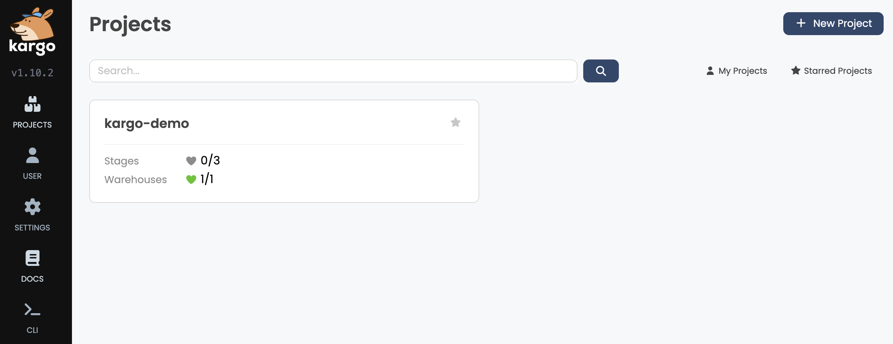
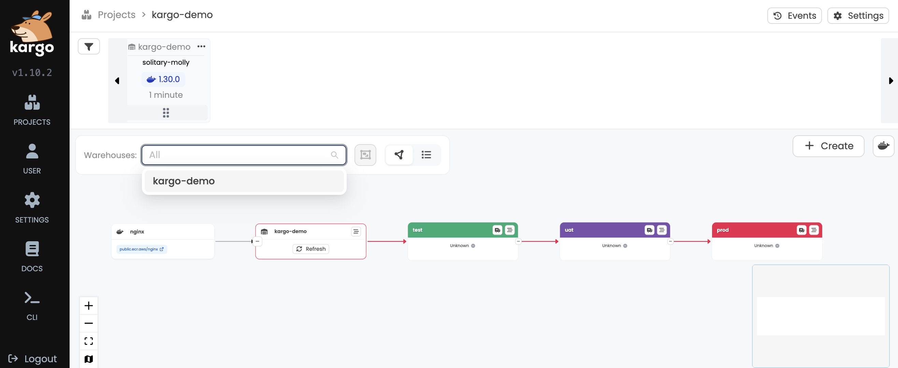
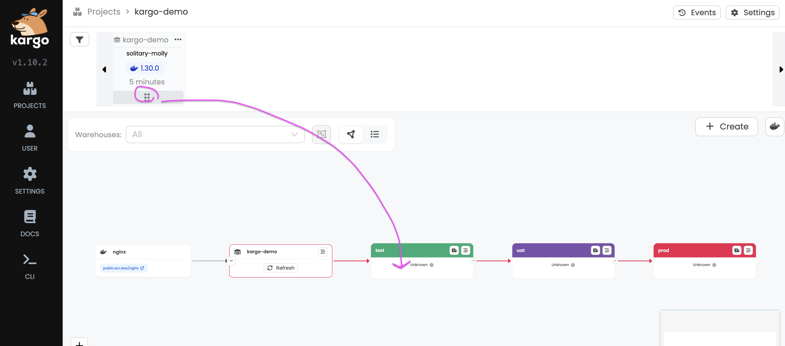
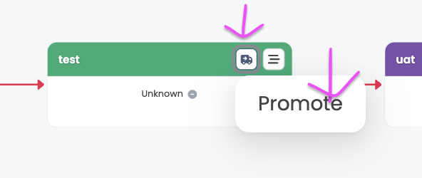
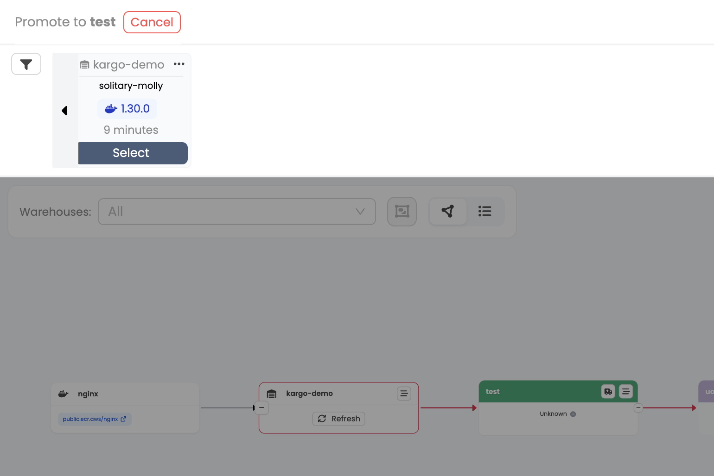
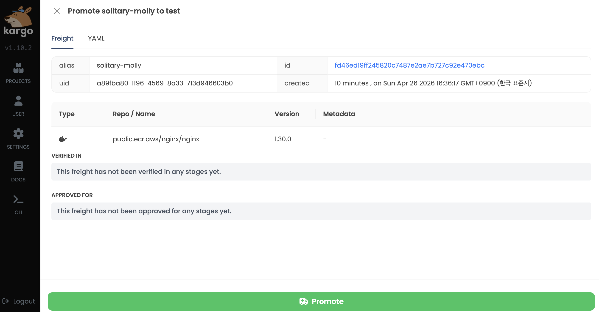
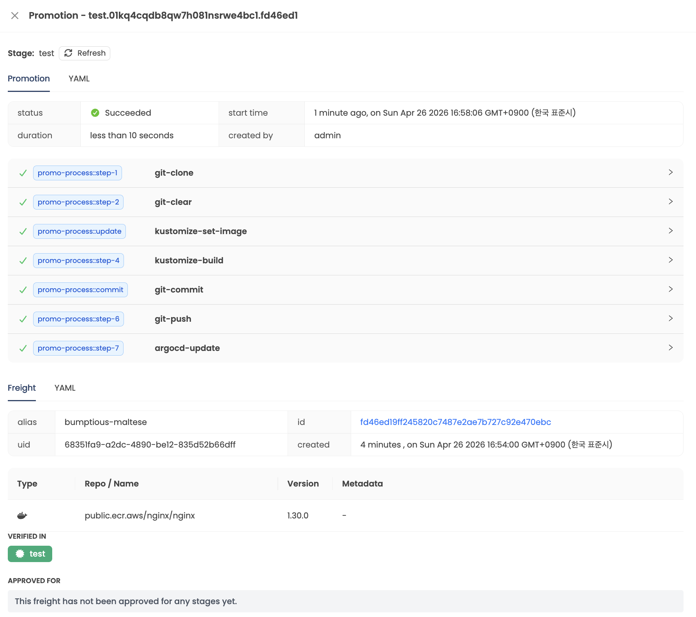
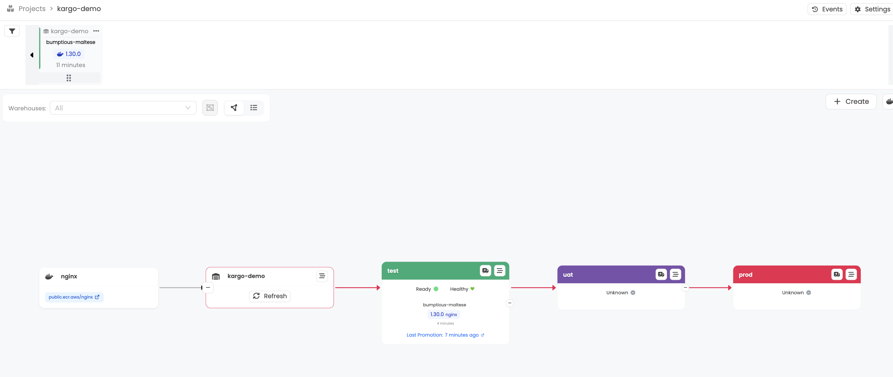

# kargo hands-on

- https://docs.kargo.io/quickstart

## 초기 환경 세팅

자주 사용하는 로컬 환경 k8s 툴에서 바로 실습 환경 세팅하는 스크립트를 제공하고 있다.
- 여기서는 k3d를 사용한다. (전체 삭제 / 다시 생성이 용이하기 때문)

```bash
# Kargo Docs에서 제공하는 설치 스크립트 다운로드
❯ wget https://raw.githubusercontent.com/akuity/kargo/main/hack/quickstart/k3d.sh

# 파일 이름 변경 (내용 한번 확인하기 위함)
❯ mv k3d.sh k3d-install.sh && chmod +x k3d-install.sh

# 실행해서 실습 환경 설치
❯ ./k3d-install.sh 
+ argo_cd_chart_version=9.4.3
+ argo_rollouts_chart_version=2.40.6
+ cert_manager_chart_version=1.19.3
+ k3d cluster create kargo-quickstart --no-lb --k3s-arg --disable=traefik@server:0 -p 31080-31082:31080-31082@servers:0:direct -p 32080-32082:32080-32082@servers:0:direct --wait
INFO[0000] Prep: Network                                
INFO[0000] Created network 'k3d-kargo-quickstart'       
INFO[0000] Created image volume k3d-kargo-quickstart-images 
INFO[0000] Starting new tools node...                   
INFO[0001] Creating node 'k3d-kargo-quickstart-server-0' 
INFO[0003] Pulling image 'ghcr.io/k3d-io/k3d-tools:5.8.3' 
INFO[0003] Pulling image 'docker.io/rancher/k3s:v1.31.5-k3s1' 
INFO[0005] Starting node 'k3d-kargo-quickstart-tools'   
INFO[0017] Using the k3d-tools node to gather environment information 
INFO[0017] HostIP: using network gateway 192.168.107.1 address 
INFO[0017] Starting cluster 'kargo-quickstart'          
INFO[0017] Starting servers...                          
INFO[0017] Starting node 'k3d-kargo-quickstart-server-0' 
INFO[0020] All agents already running.                  
INFO[0020] All helpers already running.                 
INFO[0020] Injecting records for hostAliases (incl. host.k3d.internal) and for 1 network members into CoreDNS configmap... 
INFO[0022] Cluster 'kargo-quickstart' created successfully! 
INFO[0022] You can now use it like this:                
kubectl cluster-info
+ helm install cert-manager cert-manager --repo https://charts.jetstack.io --version 1.19.3 --namespace cert-manager --create-namespace --set crds.enabled=true --wait
NAME: cert-manager
LAST DEPLOYED: Sun Apr 26 16:00:45 2026
NAMESPACE: cert-manager
STATUS: deployed
REVISION: 1
TEST SUITE: None
NOTES:
⚠️  WARNING: New default private key rotation policy for Certificate resources.
The default private key rotation policy for Certificate resources was
changed to `Always` in cert-manager >= v1.18.0.
Learn more in the [1.18 release notes](https://cert-manager.io/docs/releases/release-notes/release-notes-1.18).

cert-manager v1.19.3 has been deployed successfully!

In order to begin issuing certificates, you will need to set up a ClusterIssuer
or Issuer resource (for example, by creating a 'letsencrypt-staging' issuer).

More information on the different types of issuers and how to configure them
can be found in our documentation:

https://cert-manager.io/docs/configuration/

For information on how to configure cert-manager to automatically provision
Certificates for Ingress resources, take a look at the `ingress-shim`
documentation:

https://cert-manager.io/docs/usage/ingress/
+ helm install argocd argo-cd --repo https://argoproj.github.io/argo-helm --version 9.4.3 --namespace argocd --create-namespace --set 'configs.secret.argocdServerAdminPassword=$2a$10$5vm8wXaSdbuff0m9l21JdevzXBzJFPCi8sy6OOnpZMAG.fOXL7jvO' --set dex.enabled=false --set notifications.enabled=false --set server.service.type=NodePort --set server.service.nodePortHttp=31080 --set 'server.extraArgs={--insecure}' --set server.extensions.enabled=true --set 'server.extensions.extensionList[0].name=argo-rollouts' --set 'server.extensions.extensionList[0].env[0].name=EXTENSION_URL' --set 'server.extensions.extensionList[0].env[0].value=https://github.com/argoproj-labs/rollout-extension/releases/download/v0.3.7/extension.tar' --wait
NAME: argocd
LAST DEPLOYED: Sun Apr 26 16:01:21 2026
NAMESPACE: argocd
STATUS: deployed
REVISION: 1
TEST SUITE: None
NOTES:
In order to access the server UI you have the following options:

1. kubectl port-forward service/argocd-server -n argocd 8080:443

    and then open the browser on http://localhost:8080 and accept the certificate

2. enable ingress in the values file `server.ingress.enabled` and either
      - Add the annotation for ssl passthrough: https://argo-cd.readthedocs.io/en/stable/operator-manual/ingress/#option-1-ssl-passthrough
      - Set the `configs.params."server.insecure"` in the values file and terminate SSL at your ingress: https://argo-cd.readthedocs.io/en/stable/operator-manual/ingress/#option-2-multiple-ingress-objects-and-hosts


After reaching the UI the first time you can login with username: admin and the random password generated during the installation. You can find the password by running:

kubectl -n argocd get secret argocd-initial-admin-secret -o jsonpath="{.data.password}" | base64 -d

(You should delete the initial secret afterwards as suggested by the Getting Started Guide: https://argo-cd.readthedocs.io/en/stable/getting_started/#4-login-using-the-cli)
+ helm install argo-rollouts argo-rollouts --repo https://argoproj.github.io/argo-helm --version 2.40.6 --create-namespace --namespace argo-rollouts --wait
NAME: argo-rollouts
LAST DEPLOYED: Sun Apr 26 16:02:01 2026
NAMESPACE: argo-rollouts
STATUS: deployed
REVISION: 1
TEST SUITE: None
+ helm install kargo oci://ghcr.io/akuity/kargo-charts/kargo --namespace kargo --create-namespace --set api.service.type=NodePort --set api.service.nodePort=31081 --set api.tls.enabled=false --set 'api.adminAccount.passwordHash=$2a$10$Zrhhie4vLz5ygtVSaif6o.qN36jgs6vjtMBdM6yrU1FOeiAAMMxOm' --set api.adminAccount.tokenSigningKey=iwishtowashmyirishwristwatch --set externalWebhooksServer.service.type=NodePort --set externalWebhooksServer.service.nodePort=31082 --set externalWebhooksServer.tls.enabled=false --wait
Pulled: ghcr.io/akuity/kargo-charts/kargo:1.10.2
Digest: sha256:392e25bc85c51287c7cd37a4a26b15552dc7d07b3bbb6509a53875c77ab5ab8c
W0426 16:02:33.716874   33929 warnings.go:70] spec.privateKey.rotationPolicy: In cert-manager >= v1.18.0, the default value changed from `Never` to `Always`.
NAME: kargo
LAST DEPLOYED: Sun Apr 26 16:02:31 2026
NAMESPACE: kargo
STATUS: deployed
REVISION: 1
TEST SUITE: None
NOTES:
.----------------------------------------------------------------------------------.
|     _                            _                    _          _ _             |
|    | | ____ _ _ __ __ _  ___    | |__  _   _     __ _| | ___   _(_) |_ _   _     |
|    | |/ / _` | '__/ _` |/ _ \   | '_ \| | | |   / _` | |/ / | | | | __| | | |    |
|    |   < (_| | | | (_| | (_) |  | |_) | |_| |  | (_| |   <| |_| | | |_| |_| |    |
|    |_|\_\__,_|_|  \__, |\___/   |_.__/ \__, |   \__,_|_|\_\\__,_|_|\__|\__, |    |
|                   |___/                |___/                           |___/     |
'----------------------------------------------------------------------------------'

Ready to get started?

⚙️  You've configured Kargo's API server with a Service of type NodePort.

   The Kargo API server is reachable on port 31081 of any reachable node in
   your Kubernetes cluster.

   If a node in a local cluster were addressable as localhost, the Kargo API
   server would be reachable at:

      http://localhost:31081

🖥️  To access Kargo's web-based UI, navigate to the address above.

⬇️  The latest version of the Kargo CLI can be downloaded from:

      https://github.com/akuity/kargo/releases/latest

🛠️  To log in using the Kargo CLI:

      kargo login http://localhost:31081 --admin

⚙️  You've configured Kargo's external webhooks server with a Service of type
   NodePort.

   The Kargo external webhooks server is reachable on port 31082 of
   any reachable node in your Kubernetes cluster.

   If a node in a local cluster were addressable as localhost, the Kargo
   external webhooks server would be reachable at:

      http://localhost:31082

📚  Kargo documentation can be found at:

      https://docs.kargo.io

🙂  Happy promoting!
```

설치하면 ArgoCD / Kargo는 각각 아래로 들어갈 수 있다.
- ArgoCD
  - URL: http://localhost:31080
  - Username: admin
  - Password: admin

Kargo
- URL: http://localhost:31081
- Password: admin

이어서 데모 실습을 위해 미리 제공되는 배포 Manifest 예제가 구성된 [Repo](https://github.com/akuity/kargo-demo)를 Fork하여 사용하라고 한다.
하지만 여기서는 위 Repo 내용을 그대로 가져와 [./kargo-demo](./kargo-demo/) 안에 넣어두었음.

또한, 해당 Repo에 대한 Personal Access Token이 필요하다.
- Kargo가 환경별 변경 사항을 Manifest Repo에 Push하기 때문. 원하는 Repo에 대한 Write 권한이 필요하다.
- Personal Access Token 발급 과정/내용은 생략함.

이어서 환경변수로 설정하자.
```bash
export GITOPS_REPO_URL=https://github.com/<your-github-username>/<your-target-repository>
export GITHUB_USERNAME=<your-github-username>
export GITHUB_PAT=<your-personal-access-token>
```

ArgoCD AppSet을 배포하자.
```bash
cat <<EOF | kubectl apply -f -
apiVersion: argoproj.io/v1alpha1
kind: ApplicationSet
metadata:
  name: kargo-demo
  namespace: argocd
spec:
  generators:
  - list:
      elements:
      - stage: test
      - stage: uat
      - stage: prod
  template:
    metadata:
      name: kargo-demo-{{stage}}
      annotations:
        kargo.akuity.io/authorized-stage: kargo-demo:{{stage}}
    spec:
      project: default
      source:
        repoURL: ${GITOPS_REPO_URL}
        targetRevision: stage/{{stage}}
        path: .
      destination:
        server: https://kubernetes.default.svc
        namespace: kargo-demo-{{stage}}
      syncPolicy:
        syncOptions:
        - CreateNamespace=true
EOF
---
# 나의 경우는 파일로 수정 후 배포함.
❯ k apply -f argo-appset.yaml                 
applicationset.argoproj.io/kargo-demo created
```

이 단계에서는 생성된 ArgoCD App들이 `Unknown` 상태인게 정상이라고 함.
- 이후, Kargo를 통해 첫 번째로 프로모션 진행 시, 해당 네이밍의 브랜치를 생성한다고 함.

## Kargo Project, Pipeline을 만들어보자.

필요한 리소스는 [`kargo-resources.yaml`](./kargo-resources.yaml) 참고

`Warehouse`: 컨테이너 이미지 레지스트리에서 특정 이미지에 대한 새 버전/태그가 있는지 확인
```yaml
apiVersion: kargo.akuity.io/v1alpha1
kind: Warehouse # 👀
metadata:
  name: kargo-demo
  namespace: kargo-demo
spec:
  subscriptions:
  - image:
      repoURL: public.ecr.aws/nginx/nginx # 👀
      constraint: ^1.29.0
      discoveryLimit: 5
```

`PromotionTask`: 재활용 가능한 프로모션 프로세스 선언
```yaml
apiVersion: kargo.akuity.io/v1alpha1
kind: PromotionTask # 👀
metadata:
  name: demo-promo-process
  namespace: kargo-demo
spec:
  vars:
  - name: gitopsRepo
    value: ${GITOPS_REPO_URL}
  - name: imageRepo
    value: public.ecr.aws/nginx/nginx
  steps:
  - uses: git-clone # 👀
    config:
      repoURL: \${{ vars.gitopsRepo }}
      checkout:
      - branch: main
        path: ./src
      - branch: stage/\${{ ctx.stage }}
        create: true
        path: ./out
  - uses: git-clear # 👀
    config:
      path: ./out
  - uses: kustomize-set-image # 👀
    as: update
    config:
      path: ./src/6-eks-cicd/kargo-demo/base
      images:
      - image: \${{ vars.imageRepo }}
        tag: \${{ imageFrom(vars.imageRepo).Tag }}
  - uses: kustomize-build # 👀
    config:
      path: ./src/6-eks-cicd/kargo-demo/stages/\${{ ctx.stage }}
      outPath: ./out
  - uses: git-commit # 👀
    as: commit
    config:
      path: ./out
      message: \${{ task.outputs.update.commitMessage }}
  - uses: git-push # 👀
    config:
      path: ./out
  - uses: argocd-update # 👀
    config:
      apps:
      - name: kargo-demo-\${{ ctx.stage }}
        sources:
        - repoURL: \${{ vars.gitopsRepo }}
          desiredRevision: \${{ task.outputs.commit.commit }}
```


`Stage`: 파이프라인 환경?
```yaml
apiVersion: kargo.akuity.io/v1alpha1
kind: Stage # 👀
metadata:
  name: test # 👀
  namespace: kargo-demo
spec:
  requestedFreight: # 👀
  - origin:
      kind: Warehouse
      name: kargo-demo
    sources:
      direct: true
  promotionTemplate:
    spec:
      steps:
      - task:
          name: demo-promo-process
        as: promo-process
---
apiVersion: kargo.akuity.io/v1alpha1
kind: Stage # 👀
metadata:
  name: uat # 👀
  namespace: kargo-demo
spec:
  requestedFreight:
  - origin:
      kind: Warehouse
      name: kargo-demo
    sources:
      stages:
      - test
  promotionTemplate:
    spec:
      steps:
      - task:
          name: demo-promo-process
        as: promo-process
---
apiVersion: kargo.akuity.io/v1alpha1
kind: Stage # 👀
metadata:
  name: prod # 👀
  namespace: kargo-demo
spec:
  requestedFreight:
  - origin:
      kind: Warehouse
      name: kargo-demo
    sources:
      stages:
      - uat
  promotionTemplate:
    spec:
      steps:
      - task:
          name: demo-promo-process
        as: promo-process
```

이미 ns가 있으면 뭔가 다르게 해야하는 듯
```bash
❯ k apply -f kargo-resources.yaml 
Error from server (Conflict): error when creating "kargo-resources.yaml": admission webhook "project.kargo.akuity.io" denied the request: Operation cannot be fulfilled on projects.kargo.akuity.io "kargo-demo": failed to initialize Project "kargo-demo" because namespace "kargo-demo" already exists and is not labeled as a Project namespace
Error from server (Invalid): error when creating "kargo-resources.yaml": admission webhook "warehouse.kargo.akuity.io" denied the request: Warehouse.kargo.akuity.io "kargo-demo" is invalid: metadata.namespace: Invalid value: "kargo-demo": namespace "kargo-demo" is not a project
Error from server (Invalid): error when creating "kargo-resources.yaml": admission webhook "promotiontask.kargo.akuity.io" denied the request: PromotionTask.kargo.akuity.io "demo-promo-process" is invalid: metadata.namespace: Invalid value: "kargo-demo": namespace "kargo-demo" is not a project
Error from server (Invalid): error when creating "kargo-resources.yaml": admission webhook "stage.kargo.akuity.io" denied the request: Stage.kargo.akuity.io "test" is invalid: metadata.namespace: Invalid value: "kargo-demo": namespace "kargo-demo" is not a project
Error from server (Invalid): error when creating "kargo-resources.yaml": admission webhook "stage.kargo.akuity.io" denied the request: Stage.kargo.akuity.io "uat" is invalid: metadata.namespace: Invalid value: "kargo-demo": namespace "kargo-demo" is not a project
Error from server (Invalid): error when creating "kargo-resources.yaml": admission webhook "stage.kargo.akuity.io" denied the request: Stage.kargo.akuity.io "prod" is invalid: metadata.namespace: Invalid value: "kargo-demo": namespace "kargo-demo" is not a project
```

성공
```bash
❯ k apply -f kargo-resources.yaml
project.kargo.akuity.io/kargo-demo created
secret/kargo-demo-repo created
warehouse.kargo.akuity.io/kargo-demo created
promotiontask.kargo.akuity.io/demo-promo-process created
stage.kargo.akuity.io/test created
stage.kargo.akuity.io/uat created
stage.kargo.akuity.io/prod created
```

### Kargo UI에서 확인

프로젝트가 확인됨.



상세 확인



파이프라인이 잘 만들어졌으니 `Freight`(화물)을 Promote 할 수 있다고..

## Freight를 Test Stage로 배포?

상단에 있는게 `Freight` 이고, 이걸 Web UI 상에선 드래그/드롭으로 배포 대상 환경으로 옮기면 된다고 한다. (사진 참고)



드래그/드롭이 아니라 메뉴 바를 통한 옮기기도 된다고 함.
  
배포 대상 환경 우측 상단의 트럭 아이콘 -> "Promote" 클릭



그럼 상단에서 `Freight`를 옮길 수 있다고 함.



이후 진행 내용에 대한 요약이 나온다. (위의 드래그/드롭 형식도 똑같음)



yaml 내용은 아래와 같음.

```yaml
metadata:
  name: fd46ed19ff245820c7487e2ae7b727c92e470ebc
  namespace: kargo-demo
  uid: a89fba80-1196-4569-8a33-713d946603b0
  resourceVersion: "3305"
  generation: "1"
  creationTimestamp:
    seconds: "1777188977"
  labels:
    kargo.akuity.io/alias: solitary-molly
images:
  - repoURL: public.ecr.aws/nginx/nginx
    tag: 1.30.0
    digest: sha256:4193e7cf6311a0fc24342ab16bb3cd0eead145d01292fecac2b0d61a4d14d988
status: {}
alias: solitary-molly
origin:
  kind: Warehouse
  name: kargo-demo
```


잘 진행되면 아래처럼 뜬다...



ArgoCD에서도 Test 환경 App이 정상 Sync 되었고, App 구성 요약은 아래처럼 됨.
- 해당 타겟에 배포 리소스 Manifest들이 렌더링 다 끝난 형태로 들어있음.
```yaml
project: default
source:
  repoURL: https://github.com/solidcellamoon/aews-hands-on-2026
  path: .
  targetRevision: stage/test
destination:
  server: https://kubernetes.default.svc
  namespace: kargo-demo-test
syncPolicy:
  syncOptions:
    - CreateNamespace=true
```

배포된 후 kargo
- Freight는 현재 배포된 환경의 컬러를 따라감. (상단에 Test 환경이랑 똑같이 초록색 선으로 표시된거 참고)




이후의 uat, prod 환경 배포도 동일하게 진행.
```bash
❯ k get ns
NAME                     STATUS   AGE
argo-rollouts            Active   76m
argocd                   Active   77m
cert-manager             Active   77m
default                  Active   77m
kargo                    Active   76m
kargo-cluster-secrets    Active   76m
kargo-demo               Active   24m
kargo-demo-prod          Active   8m32s
kargo-demo-test          Active   20m
kargo-demo-uat           Active   9m4s
kargo-shared-resources   Active   76m
kargo-system-resources   Active   76m
kube-node-lease          Active   77m
kube-public              Active   77m
kube-system              Active   77m

```

